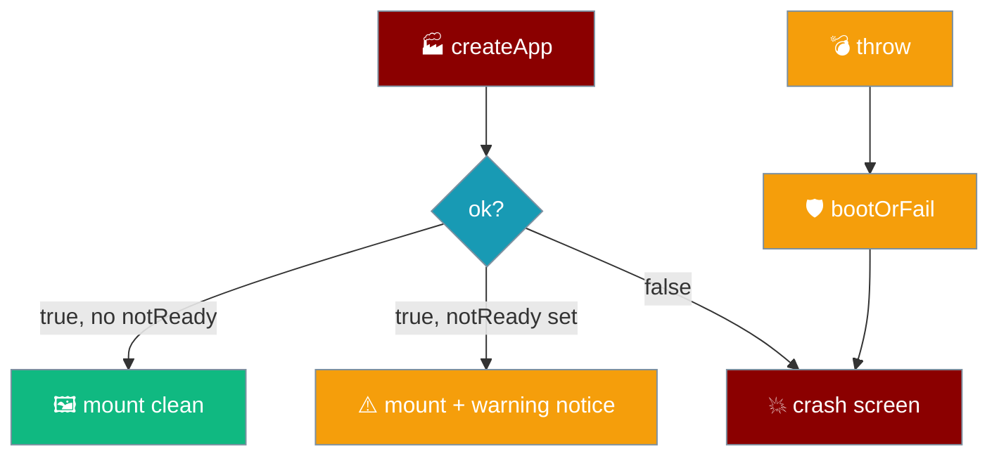
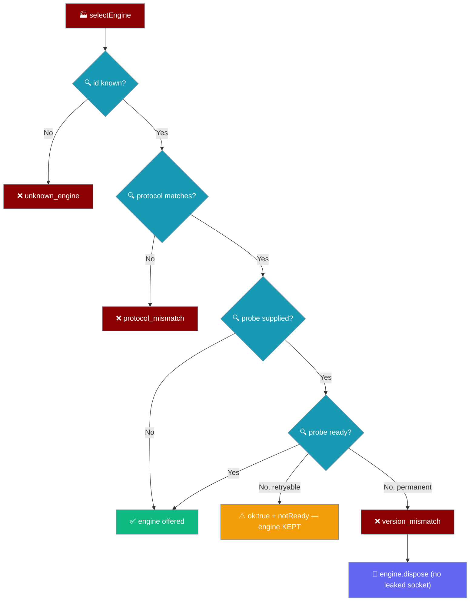
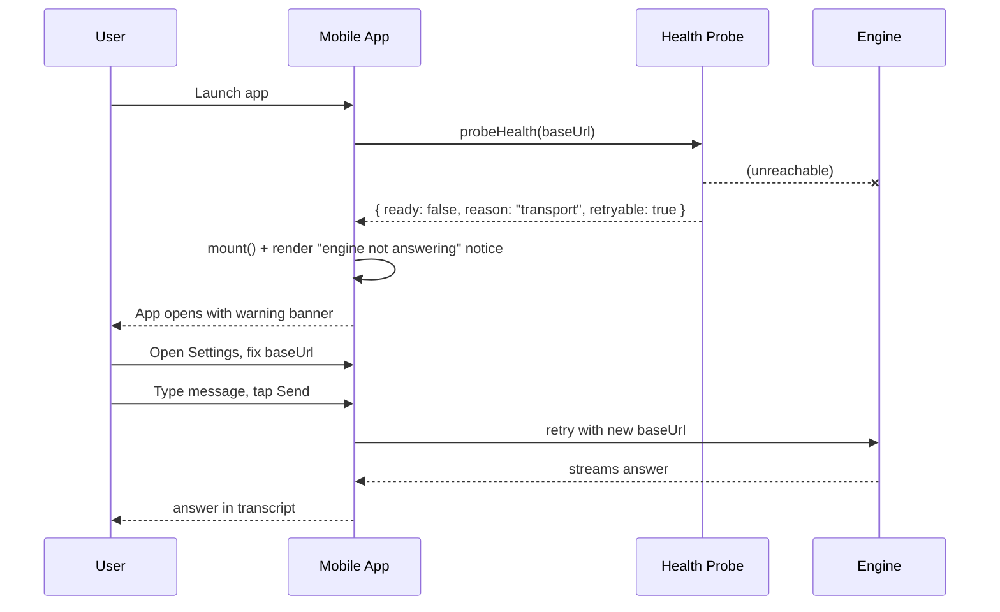

<Note>
This page is about failures reported by `createApp`, i.e. after `app.js` has parsed and run. For the one failure mode where the bundle itself cannot load — and for what a user sees on a slow cold start — see [Boot Indicator](/features/mobile/boot-indicator).
</Note>

`createApp` returns a typed `BootResult`. A **permanent** failure is a named `{ ok: false, reason, detail }`, and `mount()` renders it on the crash screen. A **retryable** unreadiness no longer stops boot: the app starts, and the success branch carries a `notReady` field so the caller can say the engine is not answering yet. A *thrown* failure is still caught and named too.

```ts
import { createApp, type BootResult } from "praisonai-mobile/app/boot";

const booted: BootResult = await createApp(deps);
if (!booted.ok) {
  renderFatal(root, strings.bootFailed(booted.detail)); // permanent failure
} else if (booted.notReady) {
  render(strings.engineNotReady(booted.notReady.detail)); // booted, but warn
}
```

Only a permanent unreadiness (`version_mismatch`) reaches the failure branch. A retryable unreadiness — a still-starting engine, an unreachable phone-to-desktop socket — is delivered as a *usable app plus an attached warning*, not a refusal.

```ts
export type BootResult =
  | {
      readonly ok: true;
      readonly app: App;
      /** The app started, but the engine is not answering yet. A caller must
       *  SAY so -- silently booting into an engine that cannot reply is how a
       *  first message fails with no explanation. */
      readonly notReady?: { readonly reason: string; readonly detail: string };
    }
  | {
      readonly ok: false;
      readonly reason: string;
      readonly detail: string;
      /** Set when the failure is a health probe that might succeed on a retry.
       *  In normal flow this is effectively always unset now -- retryable
       *  outcomes take the SUCCESS branch with `notReady` instead. */
      readonly retryable?: boolean;
    };
```



## Quick Start

<Steps>
<Step title="Handle a failed boot">
`mount()` checks `booted.ok` and renders the crash screen with the detail. There is nothing to configure — a named failure always reaches the screen.

```ts
if (!booted.ok) {
  renderFatal(root, strings.bootFailed(booted.detail));
  return null;
}
```
</Step>

<Step title="Handle an engine that isn't answering yet">
A retryable unreadiness — a still-starting engine, an unreachable remote — no longer reaches the `!booted.ok` branch. The app booted; `booted.notReady` carries the reason so you can say so. Sending later retries it.

```ts
if (booted.ok && booted.notReady) {
  // The app is up. Say the engine is not ready; sending will retry.
  render(strings.engineNotReady(booted.notReady.detail));
}
```
</Step>

<Step title="A permanent failure still stops boot">
A `version_mismatch` — a build that cannot speak the server's protocol — never fixes itself on a retry, so it stays on the failure branch and reaches the crash screen.

```ts
if (!booted.ok && booted.reason === "version_mismatch") {
  renderFatal(root, strings.bootFailed(booted.detail)); // waiting cannot help
}
```
</Step>

<Step title="Turn a throw into a reason">
`bootOrFail` wraps `createApp` so an unanticipated throw — a `StoragePort` failure at `settingsStore.load()` — becomes the same typed shape rather than an uncaught rejection.

```ts
try {
  return await createApp(options);
} catch (error) {
  return { ok: false, reason: "storage_unavailable", detail: String(error) };
}
```
</Step>
</Steps>

---

## What the crash screen guarantees

The fatal screen carries three properties, each pinned by a test.

- **It announces.** The fatal element is `role="alert"`, not `role="status"`, so a screen reader speaks it the moment it mounts.
- **It names the real failure.** The message is `booted.detail`, the actual failure detail — never a generic "something went wrong".
- **It replaces the chrome.** `root.textContent = ""` runs first, so the dead app UI is gone; the fatal element is not appended under the corpse of the send button.

---

## Where each reason surfaces

Probe reasons split by whether a retry can help. Permanent ones refuse boot; retryable ones boot the app and attach `notReady`.

### Permanent boot failures — surface via `!booted.ok`

| `reason` | Source | When it fires |
|----------|--------|---------------|
| `unknown_engine` | `selectEngine` — no engine with that id, or an engine reporting a different id than it registered under | A settings `engineId` naming an engine that is not built |
| `protocol_mismatch` | `selectEngine` — the engine speaks a different `PROTOCOL_VERSION` than this build | An engine adapter upgraded out of step with the app |
| `storage_unavailable` | `bootOrFail` — a throw from `createApp`, caught and named | `SecurityError` (site data blocked) or `QuotaExceededError` at `settingsStore.load()` |
| `version_mismatch` | `selectEngine` — probe response reported a `version` this build cannot speak | Server upgraded incompatibly — waiting cannot fix it |

### Retryable unreadiness — surface via `booted.ok === true` with `booted.notReady`

| `booted.notReady.reason` | Source | When it fires |
|--------------------------|--------|---------------|
| `unhealthy` | `selectEngine` — probe classified a `200 {"ok": false}` response | Remote engine is up but reporting itself not ready (still binding, dependency down) |
| `http_status` | `selectEngine` — probe got a non-200 (including 404, 5xx, and any sub-200) | Wrong `baseUrl`, endpoint not routed, proxy misconfigured |
| `malformed` | `selectEngine` — probe reached something whose body is not our engine's shape | A captive portal, a proxy error page, a different service on the port |
| `transport` | `selectEngine` — probe request or body read threw, aborted, or timed out after `PROBE_TIMEOUT_MS` (5s) | Engine unreachable, still binding its socket, or a hanging endpoint / black-hole proxy |

<Note>
`retryable` on the failure branch is now effectively always `false` (or unset), because retryable outcomes take the **success** branch with `notReady`. `unknown_engine` and `protocol_mismatch` are the two failures `selectEngine` *anticipates* without any I/O; `version_mismatch` is the one probe reason still permanent. `storage_unavailable` is different in kind: it is a **throw** the boot never expected, turned into the same shape by `bootOrFail` so it renders the same way.
</Note>

---

## Boot-time health probe

When an `EngineChoice` supplies a `probe`, `selectEngine` runs it *after* the cheap protocol check. A **retryable** probe result flows into the success branch with `notReady` and the engine is **kept**; only a **permanent** probe result flows into failure and disposes the engine.

The probe reasons split on whether a retry can help. `unhealthy`, `http_status`, `malformed`, and `transport` all carry `retryable: true` — the engine is still handed to the app so a retry costs one tap, and the app renders a warning. Only `version_mismatch` is permanent and refuses boot with the engine disposed.



<Note>
A **permanently** refused probe (`version_mismatch`) disposes the engine before returning, exactly as a protocol mismatch does — the probe opened a socket, and leaving the engine holding it is a leak. A **retryably** refused probe **keeps** the engine, because it is the one the app will use once the remote comes up; disposing it would leave the app holding a dead engine it can never retry through.
</Note>

---

## An unreachable engine boots with a warning

Before PR #4672 a missing `/health` handler took the whole app down; now the app opens and points the user at Settings.

```
before:  no /health handler  →  "PraisonAI could not start: 404"   (dead app, no way in)
after:   no /health handler  →  App opens; a warning row says the engine is not
                                answering yet; the user can reach Settings.
```



---

## How a throw becomes a typed failure

`createApp` calls `settingsStore.load()` without a guard, so a `StoragePort` failure propagates as an exception. The chrome is already appended by the time boot runs, so an unhandled rejection would skip both the crash screen and the listener registrations — leaving a fully rendered app in which nothing happened. `bootOrFail` closes that gap.

```mermaid
sequenceDiagram
    participant Mount as mount
    participant BootOrFail as bootOrFail
    participant Create as createApp
    Mount->>BootOrFail: bootOrFail(options)
    BootOrFail->>Create: createApp(options)
    Create--xBootOrFail: throw (StoragePort failed)
    BootOrFail-->>Mount: { ok: false, reason: "storage_unavailable", detail }
    Mount->>Mount: renderFatal(detail)
```

<Warning>
The crash handler is installed in `mount()` **before** `detectPlatform()`, because `detectPlatform` reads `window.localStorage` and can itself throw `SecurityError`. See [Architecture → Boot Order](/features/mobile/architecture#boot-order) for the full ordering.
</Warning>

---

## Related

<CardGroup cols={2}>
<Card title="Boot Indicator" icon="hourglass-start" href="/features/mobile/boot-indicator">
  The pre-boot frame and the failure notice for a bundle that cannot load.
</Card>
<Card title="Architecture" icon="sitemap" href="/features/mobile/architecture">
  Boot order and where the crash handler is installed.
</Card>
<Card title="Storage & Secrets" icon="database" href="/features/mobile/storage-and-secrets">
  When the `StoragePort` is unavailable at boot.
</Card>
<Card title="Errors & Recovery" icon="triangle-exclamation" href="/features/mobile/errors-and-recovery">
  Failures that happen inside a turn, not at boot.
</Card>
<Card title="Engines" icon="plug" href="/features/mobile/engines">
  Where `unknown_engine` and `protocol_mismatch` come from.
</Card>
<Card title="Readiness body rules" icon="heart-pulse" href="/features/mobile/engines#readiness-body-rules">
  How the probe classifies a `/health` response into the reasons above.
</Card>
</CardGroup>
