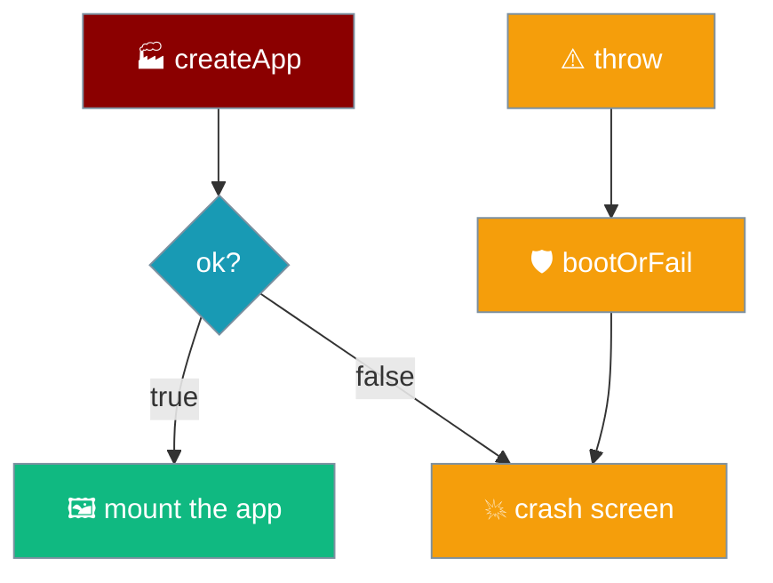

`createApp` returns a typed `BootResult`. A failure is a named `{ ok: false, reason, detail }`, and `mount()` renders it on the crash screen instead of leaving a blank or dead app. Every anticipated failure has a reason; a *thrown* failure is caught and given one too.

```ts
import { createApp, type BootResult } from "praisonai-mobile/app/boot";

const booted: BootResult = await createApp(deps);
if (!booted.ok) {
  renderFatal(root, strings.bootFailed(booted.detail)); // reason + real detail
}
```



## Quick Start

<Steps>
<Step title="Handle a failed boot">
`mount()` checks `booted.ok` and renders the crash screen with the detail. There is nothing to configure — a named failure always reaches the screen.

```ts
if (!booted.ok) {
  renderFatal(root, strings.bootFailed(booted.detail));
  return null;
}
```
</Step>

<Step title="Turn a throw into a reason">
`bootOrFail` wraps `createApp` so an unanticipated throw — a `StoragePort` failure at `settingsStore.load()` — becomes the same typed shape rather than an uncaught rejection.

```ts
try {
  return await createApp(options);
} catch (error) {
  return { ok: false, reason: "storage_unavailable", detail: String(error) };
}
```
</Step>
</Steps>

---

## Every `BootResult.reason`

| `reason` | User-visible message source | Real-world trigger |
|----------|-----------------------------|--------------------|
| `unknown_engine` | `selectEngine` — no engine with that id, or an engine reporting a different id than it registered under | A settings `engineId` naming an engine that is not built. |
| `protocol_mismatch` | `selectEngine` — the engine speaks a different `PROTOCOL_VERSION` than this build | An engine adapter upgraded out of step with the app. |
| `storage_unavailable` | `bootOrFail` — a throw from `createApp`, caught and named | `SecurityError` (site data blocked) or `QuotaExceededError` (storage pressure) at `settingsStore.load()`. |

<Note>
`unknown_engine` and `protocol_mismatch` are the two failures `selectEngine` *anticipates* and returns as a result. `storage_unavailable` is different in kind: it is a **throw** the boot never expected, turned into the same shape by `bootOrFail` so it renders the same way.
</Note>

---

## How a throw becomes a typed failure

`createApp` calls `settingsStore.load()` without a guard, so a `StoragePort` failure propagates as an exception. The chrome is already appended by the time boot runs, so an unhandled rejection would skip both the crash screen and the listener registrations — leaving a fully rendered app in which nothing happened. `bootOrFail` closes that gap.

```mermaid
sequenceDiagram
    participant Mount as mount
    participant BootOrFail as bootOrFail
    participant Create as createApp
    Mount->>BootOrFail: bootOrFail(options)
    BootOrFail->>Create: createApp(options)
    Create--xBootOrFail: throw (StoragePort failed)
    BootOrFail-->>Mount: { ok: false, reason: "storage_unavailable", detail }
    Mount->>Mount: renderFatal(detail)
```

<Warning>
The crash handler is installed in `mount()` **before** `detectPlatform()`, because `detectPlatform` reads `window.localStorage` and can itself throw `SecurityError`. See [Architecture → Boot Order](/features/mobile/architecture#boot-order) for the full ordering.
</Warning>

---

## Related

<CardGroup cols={2}>
<Card title="Architecture" icon="sitemap" href="/features/mobile/architecture">
  Boot order and where the crash handler is installed.
</Card>
<Card title="Storage & Secrets" icon="database" href="/features/mobile/storage-and-secrets">
  When the `StoragePort` is unavailable at boot.
</Card>
<Card title="Errors & Recovery" icon="triangle-exclamation" href="/features/mobile/errors-and-recovery">
  Failures that happen inside a turn, not at boot.
</Card>
<Card title="Engines" icon="plug" href="/features/mobile/engines">
  Where `unknown_engine` and `protocol_mismatch` come from.
</Card>
</CardGroup>
