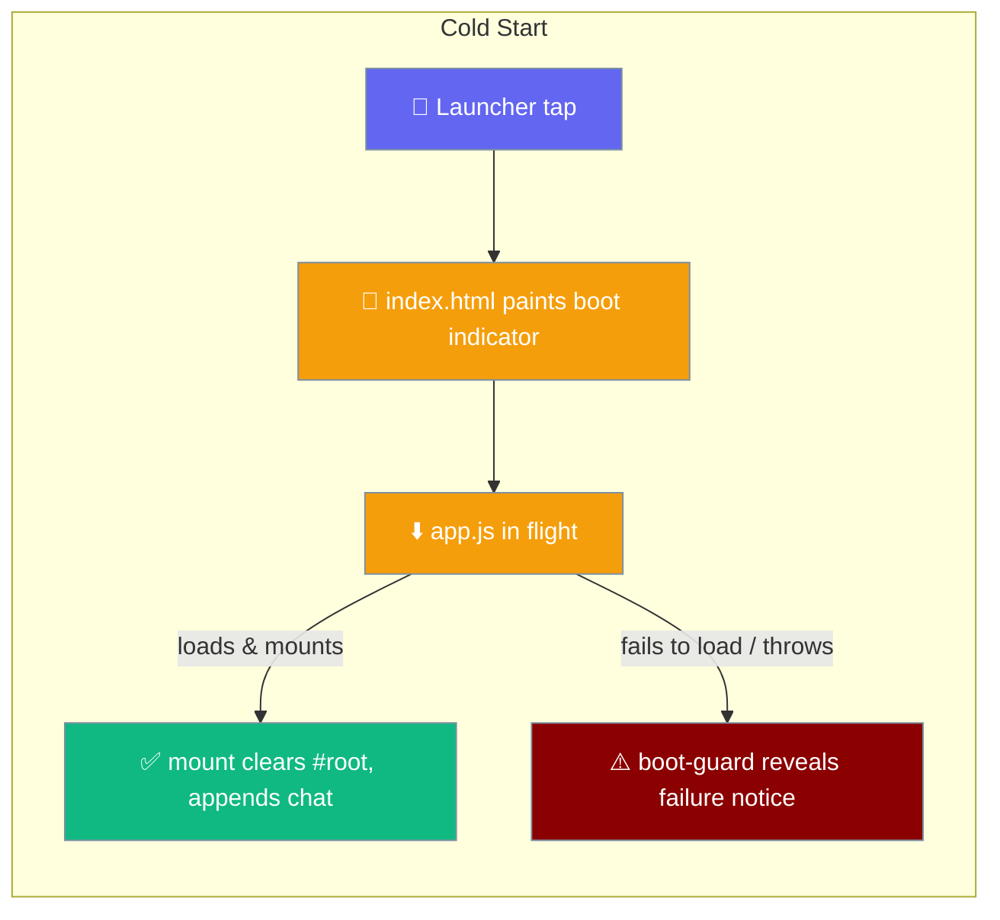
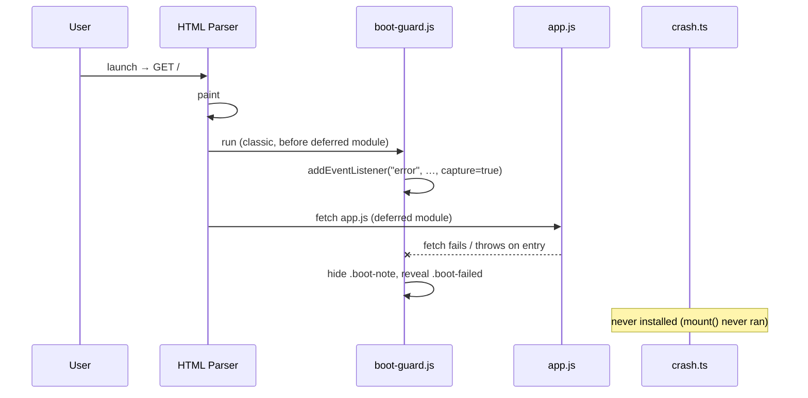

The first painted frame is no longer blank: `index.html` paints a `PraisonAI` wordmark and `Starting…` from markup, and a guard reveals a failure notice when the bundle cannot load.



## Quick Start

<Steps>
<Step title="See the boot indicator">
`index.html` paints the indicator inside `#root` on the first frame, before `app.js` runs.

```html
<div class="boot" role="status">
  <div class="boot-mark">PraisonAI</div>
  <p class="boot-note">Starting…</p>
</div>
```
</Step>

<Step title="Load the guard before the bundle">
A classic `boot-guard.js` loads **before** the deferred `app.js` module, so its `error` listener is installed while the fetch is in flight.

```html
<script src="./boot-guard.js"></script>
<script type="module" src="./app.js"></script>
```
</Step>

<Step title="Let the app retire the indicator">
`mount()` clears `#root` and appends the chat in the same statement pair, so the indicator is gone the instant the app paints.

```ts
root.textContent = "";
root.append(screen);
```
</Step>
</Steps>

---

## How It Works

`boot-guard.js` installs its `error` listener in the capture phase, then either steps aside when the app mounts or reveals the failure notice when the bundle cannot load.



| Stage | What runs | Result |
|-------|-----------|--------|
| Parse | `index.html` markup | Wordmark + `Starting…` painted |
| Guard | `boot-guard.js` (classic) | `error` listener armed in capture phase |
| Load | `app.js` (deferred module) | Mounts → indicator cleared |
| Fail | `app.js` refused / throws | `.boot-failed` notice revealed |

---

## What you see

A wordmark and one sentence tell the user the app is launching, not broken.

On a slow cold start the user sees `PraisonAI` and `Starting…`. If the bundle is refused, the note is replaced by: *"PraisonAI could not start: its code could not be loaded. Close the app and open it again."* The whole point is that a slow launch can no longer be mistaken for a broken install.

<Note>
"The app is starting" is not something the view models model — so a wordmark plus one sentence, which owns no view-model state and duplicates no layout, is honest where a fake topbar or grey bubbles would not be.
</Note>

---

## Why it is not a skeleton

A skeleton would claim a layout the boot frame cannot yet know.

A fake topbar or grey message bubbles duplicate a view they have no state for. The boot indicator paints one wordmark and one sentence — nothing that pretends to be a real view.

---

## Why it is static

A spinner would assert liveness nothing can make before `app.js` runs.

There is no download-progress event on `<script>`, and no way to ask how much of a module has parsed. The compositor keeps animating even when the main thread is dead — a moving spinner during a hung boot is a lie, so the indicator stays still.

---

## How removal works

`mount()` clears and appends in the same statement pair, so there is no frame with both the indicator and the app, and none with neither.

```ts
root.textContent = ""; // retires the boot indicator
root.append(screen);   // appends the chat screen
```

`renderFatal` clears the same way. On a boot fast enough for the first *presented* frame to already contain the app, the indicator is gone before it is ever painted.

---

## Theme awareness

Every colour is a `:root` token, so a dark device gets a dark boot screen that hands over to a dark app.

`--ground`, `--ink`, `--soft`, and `--bad` drive the boot rules, so `prefers-color-scheme: dark` swaps the boot screen along with the app.

<Warning>
A hardcoded `#fff` here would produce a white flash handing over to a dark UI — the worst possible outcome. Every boot colour must come from a token.
</Warning>

---

## Safe-area insets

The `.boot` container pads with `--inset-*`, falling back to `env(safe-area-inset-*)`, because nothing has run yet to write the shell's real numbers.

This is why a landscape viewport or large font scale does not push the wordmark into a status bar or camera cutout.

---

## The failure notice

`boot-guard.js` speaks only for a bundle that cannot load — every degraded-page failure is ignored.

| Event target | Acted on? | Why |
|---|---|---|
| `window` (thrown exception) | ✅ | `app.js` parsed and ran but threw before `mount()` installed `crash.ts` |
| `<script src="…/app.js">` failing | ✅ | The bundle itself couldn't load |
| `<script src="…/register-sw.js">` failing | ❌ | Worker declining to register is a degraded page, not a broken app |
| `<script src="…/boot-guard.js">` failing | ❌ | Precached; and would be pointing the wrong way |
| `<link rel="stylesheet">` failing | ❌ | Degraded page |
| `` (icon) failing | ❌ | Degraded page |
| Any post-`mount()` error | ❌ | `crash.ts` owns it — the guard speaks only while the boot indicator is on screen |

Resource errors do not bubble, so the guard listens for `error` in the **capture** phase.

```js
window.addEventListener("error", handler, true);
```

<Note>
The ordering is the whole guarantee: `boot-guard.js` loads **before** the deferred `app.js`, **without** `defer` / `async` / `type=module`. `<script type=module>` is implicitly deferred, so a listener installed later can miss the fetch's `error` event when a service worker or memory cache answers instantly. Pinned by `boot-screen.test.ts::"the guard is loaded before the bundle, and not deferred"` and `web-boot.test.mjs`.
</Note>

<Note>
The guard is an external file, not an inline `<script>`, because `index.html` ships `script-src 'self'` — an inline script or an `onerror=` attribute would be blocked. Same reason as `register-sw.js`.
</Note>

---

## Common Patterns

The guard hands off to `crash.ts` cleanly: once `mount()` runs, the boot indicator is gone and any later error belongs to the crash handler.

```ts
// mount() — the same clear retires the indicator and the guard's job.
root.textContent = "";
root.append(screen);
```

A failed bundle never reaches `crash.ts`, because `mount()` never ran to install it — so the guard is the only thing that can speak.

```js
// boot-guard.js — reveal the failure notice, retire "Starting…".
note.hidden = true;
failed.hidden = false;
```

---

## Best Practices

<AccordionGroup>
<Accordion title="Load the guard before the bundle, undeferred">
`<script type=module>` is implicitly deferred. Put `boot-guard.js` first as a classic script so its `error` listener is armed before `app.js` is even fetched — a service worker can answer instantly and a late listener would miss the failure.
</Accordion>

<Accordion title="Listen in the capture phase">
Resource `error` events do not bubble. `addEventListener("error", handler, true)` is the only way to hear a `<script src>` fail.
</Accordion>

<Accordion title="Ignore degraded-page failures">
A stylesheet, an icon, or `register-sw.js` declining is a degraded page, not a broken app. Only `app.js` failing — or a throw whose target is `window` — reveals the failure notice.
</Accordion>

<Accordion title="Keep every boot colour a token">
Drive the boot screen from `:root` tokens so a dark device gets a dark boot. A hardcoded colour becomes a flash at handoff.
</Accordion>

<Accordion title="Clear and append together">
Retire the indicator with the same statement pair that appends the app, so no frame shows both or neither.
</Accordion>
</AccordionGroup>

---

## What this does not cover

The pre-WebView time is unreachable from the web layer.

The gap from `am start` to `navigationStart` is Android window setup, not something a painted frame can shorten — only a native window background or a splash on `MainActivity`'s theme could cover it. The boot indicator owns everything from the first web frame onward, and nothing before it.

---

## Related

<CardGroup cols={2}>
<Card title="Boot Failures" icon="bug" href="/features/mobile/boot-failures">
  What `createApp` reports once the bundle has parsed and run.
</Card>
<Card title="Architecture" icon="sitemap" href="/features/mobile/architecture#boot-order">
  Where the boot indicator sits in the overall boot order.
</Card>
<Card title="Overview" icon="mobile" href="/features/mobile/overview">
  The launch experience and retained chat.
</Card>
<Card title="Shipping to Stores" icon="mobile-screen-button" href="/features/mobile/shipping-to-stores">
  Packaging the WebView app for release.
</Card>
</CardGroup>
