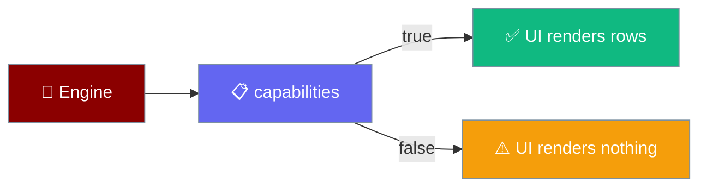
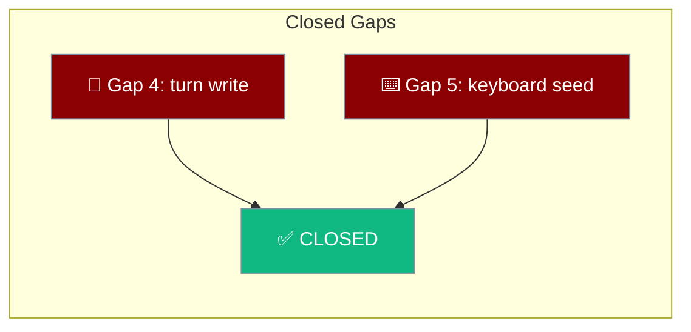

A capability flag describes what an engine can **report**, not what it can do.

```ts
import { PRAISONAI_TS_CAPABILITIES } from "praisonai-mobile/engines/praisonai-ts";

if (PRAISONAI_TS_CAPABILITIES.tools) renderToolRows();
```





## Quick Start

<Steps>
<Step title="Read a capability before rendering">
```ts
const caps = engine.capabilities;
```
Capabilities are a property, so the UI decides what to render before the first token.
</Step>

<Step title="Print the unsupported scenarios">
```bash
npm run test
```
The conformance suite prints every scenario an engine cannot produce.
</Step>
</Steps>

---

## The Capability Matrix

What each shipped engine can report.

| Capability | `praisonai-ts` | `remote-http` |
|------------|:--------------:|:-------------:|
| `streaming` | ✅ | ✅ |
| `reasoning` | ❌ | ✅ |
| `tools` | ❌ | ✅ |
| `approvals` | ❌ | ✅ |
| `cancellation` | ✅ | ✅ |
| `attachments` | ❌ | ✅ |

---

## Closed Gaps

The two rows kept from the old gap report so a reader arriving from an old bug can find where they went.

| Capability | Status | Notes |
|------------|--------|-------|
| In-process engine writes through the app's session | ✅ Supported | Closes Gap 4. Only `praisonai-ts` writes; `remote-http` does not. (PR #4552) |
| Keyboard snapshot on first paint | ✅ Supported | Closes Gap 5. Seeded from `visualViewport`, guarded against pinch-zoom. (PR #4552) |

---

## Why `tools: false` For praisonai-ts

`praisonai-ts` executes tools normally; it just never announces them. Upstream `Agent.streamEvents()` emits a three-variant union — `text`, `finish`, `error` — and none of those carry a tool call, so the engine cannot report one.

```ts
type AgentEvent =
  | { type: "text";   delta: string }
  | { type: "finish"; text: string }
  | { type: "error";  error: Error };
```

The flag describes what the engine can report. A UI that renders tool rows off a `true` flag would render nothing and look broken — and a tool call that silently failed would be indistinguishable from a normal answer, which is exactly what `tool_result.ok` was introduced to prevent.

---

## How Each Gap Closed

Gap 4 was "mechanism landed, not wired": `createSession` was called and `RunPersistence.record` was called, and nothing connected them — the two signatures did not even line up (`record(prompt, answer)` against `record(request, answer)`).

```ts
// The named adapter where the two vocabularies meet.
export function persistenceFor(session: Session) {
  return { record: (request, answer) => session.record(request.prompt, answer) };
}
```

Gap 5 was "property added, snapshot not seeded": `keyboardHeightPx` was declared `= 0` and only updated by an event, so a component mounting while the keyboard was already up laid out at 0 for one frame and then jumped.

```ts
let keyboardHeightPx = readKeyboardHeight(view); // seeded at construction
```

Both are verified by a positive control: reverting either makes a named test fail.

---

## The 5 Unsupported Scenarios

From `src/praisonai-mobile/docs/gaps.md`, the conformance scenarios `praisonai-ts` declares unsupported.

| Scenario | Reason |
|----------|--------|
| `tool_ok` | No `tool_call`/`tool_result` variant upstream. |
| `tool_failed` | No `tool_result`, so `ok: false` cannot be reported. |
| `tool_unresolved` | No `tool_call`, so there is no row to leave unresolved. |
| `approval` | `ApprovalManager` cannot reach the event channel. |
| `two_approvals` | Same as `approval`. |

Each is printed on every run, so a contract that quietly shrinks is visible rather than silently green.

<Info>
Closing the gap needs an upstream change: `AgentEvent` gaining tool and approval variants, mirroring Python's `StreamEventType`. Until then, use `remote-http` for tool visibility.
</Info>

---

## Roadmap

Closing the `TurnState` interleave gap is the prerequisite to `remote-http` becoming the default. Two Node-only imports on the Agent graph (`crypto` in `agent/simple.ts`, `events` in `ai/tool-approval.ts`) still block the in-process device build — tracked as PraisonAI PR #4438.

---

## Best Practices

<AccordionGroup>
<Accordion title="Render from the capability, not from hope">
Check `capabilities.tools` before drawing tool rows; the flag is the contract the conformance suite enforces in both directions.
</Accordion>

<Accordion title="Declare gaps, never fake them">
An honest `unsupported` entry keeps the suite meaningful; a faked scenario hides a defect it exists to catch.
</Accordion>

<Accordion title="Switch engines to gain capabilities">
`remote-http` speaks the full vocabulary because the desktop server already emits it.
</Accordion>

<Accordion title="Close a gap only when it is wired end-to-end">
A mechanism existing is not the same as a mechanism working. Gaps 4 and 5 each landed a type or a function before the wiring, and read as closed from either end until re-audited.
</Accordion>

<Accordion title="Keep retired gap rows visible">
The Gap-4 and Gap-5 rows stay in the matrix, linked to PR #4552, so a reader coming from an old bug report can find where they went rather than assuming they were dropped.
</Accordion>

<Accordion title="State scope so it is not read later as an oversight">
The remote-http exclusion is deliberate. Documenting it up front stops a future reader from filing the empty local session as a regression.
</Accordion>
</AccordionGroup>

---

## Related

<CardGroup cols={2}>
<Card title="Agent Engine Port" icon="plug" href="/features/mobile/engines">
  The port and its conformance harness.
</Card>
<Card title="The 11 Events" icon="network-wired" href="/features/mobile/protocol">
  The full event vocabulary.
</Card>
<Card title="Mobile Engines" icon="microchip" href="/features/mobile/engines">
  Which engine owns the write.
</Card>
<Card title="Shell & Adapters" icon="mobile-screen" href="/features/mobile/shell-and-adapters">
  The keyboard snapshot and its guard.
</Card>
</CardGroup>
