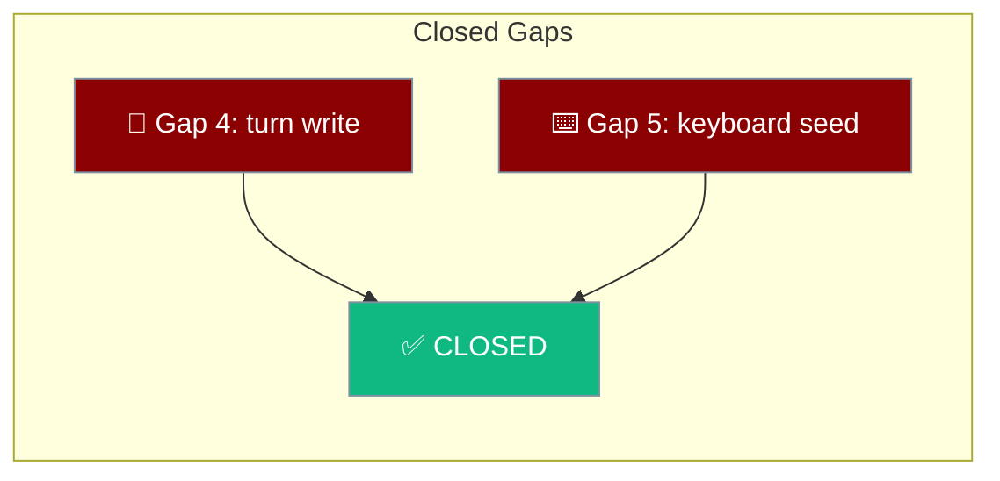

The mobile app tracks its own gaps as written facts, and two of them — the in-process turn write and the keyboard snapshot — are now closed.



## Quick Start

<Steps>
<Step title="Gap 4 — the in-process turn write">
The in-process engine now writes a completed turn through the app's session, via the named `persistenceFor` adapter and the `engines` factory.
</Step>

<Step title="Gap 5 — the keyboard snapshot">
`keyboardHeightPx` is seeded from `visualViewport` at construction, so the first paint lays out at the right height.
</Step>
</Steps>

---

## Capability Matrix

The two rows kept from the old gap report so a reader arriving from an old bug can find where they went.

| Capability | Status | Notes |
|------------|--------|-------|
| In-process engine writes through the app's session | ✅ Supported | Closes Gap 4. Only `praisonai-ts` writes; `remote-http` does not. (PR #4552) |
| Keyboard snapshot on first paint | ✅ Supported | Closes Gap 5. Seeded from `visualViewport`, guarded against pinch-zoom. (PR #4552) |

---

## Scope of the Closure

Only the in-process `praisonai-ts` engine writes through this session. `remote-http` deliberately does not. Local mirroring of a server-owned transcript is a separate feature (a read-back from the server on connect), not part of this gap's closure.

<Note>
A turn answered by the default `remote-http` engine leaves the local mobile session empty. That is intended: the desktop server it talks to owns that write and is the only thing that can report authoritative indices for its own store.
</Note>

---

## How Each Gap Closed

Gap 4 was "mechanism landed, not wired": `createSession` was called and `RunPersistence.record` was called, and nothing connected them — the two signatures did not even line up (`record(prompt, answer)` against `record(request, answer)`).

```ts
// The named adapter where the two vocabularies meet.
export function persistenceFor(session: Session) {
  return { record: (request, answer) => session.record(request.prompt, answer) };
}
```

Gap 5 was "property added, snapshot not seeded": `keyboardHeightPx` was declared `= 0` and only updated by an event, so a component mounting while the keyboard was already up laid out at 0 for one frame and then jumped.

```ts
let keyboardHeightPx = readKeyboardHeight(view); // seeded at construction
```

Both are verified by a positive control: reverting either makes a named test fail.

---

## Best Practices

<AccordionGroup>
<Accordion title="Close a gap only when it is wired end-to-end">
A mechanism existing is not the same as a mechanism working. Gaps 4 and 5 each landed a type or a function before the wiring, and read as closed from either end until re-audited.
</Accordion>

<Accordion title="Keep retired gap rows visible">
The Gap-4 and Gap-5 rows stay in the matrix, linked to PR #4552, so a reader coming from an old bug report can find where they went rather than assuming they were dropped.
</Accordion>

<Accordion title="State scope so it is not read later as an oversight">
The remote-http exclusion is deliberate. Documenting it up front stops a future reader from filing the empty local session as a regression.
</Accordion>
</AccordionGroup>

---

## Related

<CardGroup cols={2}>
<Card title="Mobile Engines" icon="microchip" href="/features/mobile/engines">
  Which engine owns the write.
</Card>
<Card title="Shell & Adapters" icon="mobile-screen" href="/features/mobile/shell-and-adapters">
  The keyboard snapshot and its guard.
</Card>
</CardGroup>
