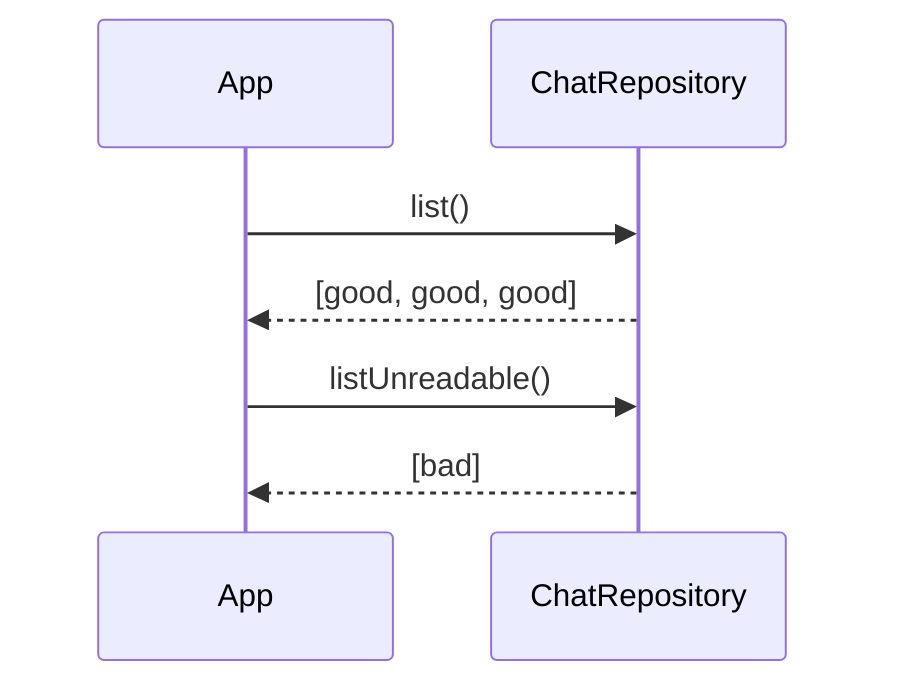
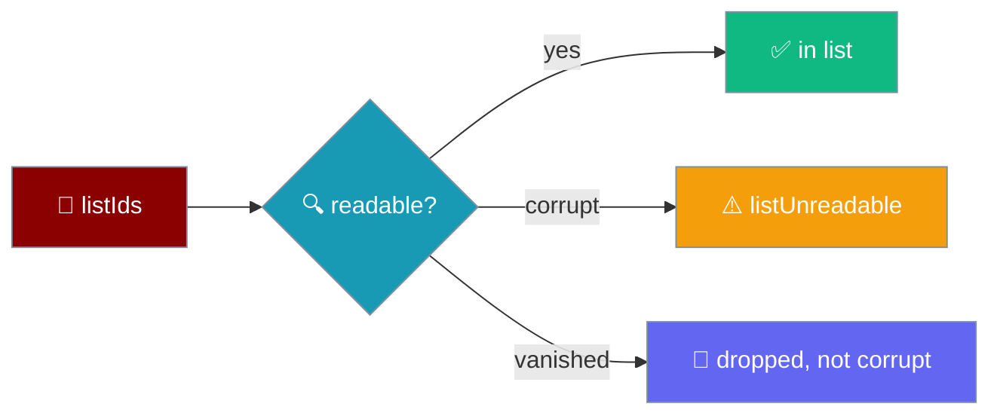

One unreadable chat is reported, never allowed to truncate the list behind it.



## Quick Start

<Steps>
<Step title="Load the readable chats">
```ts
import { createChatRepository } from "praisonai-mobile/core/chat/repository";

const repo = createChatRepository(storage);
const chats = await repo.list();
```
`list()` returns every chat it could read, newest first. A single corrupt file drops out silently here — it does not truncate the list.
</Step>

<Step title="Report the unreadable ones">
```ts
const broken = await repo.listUnreadable();
if (broken.length > 0) showRecoveryBanner(broken.length);
```
`listUnreadable()` returns the ids of every corrupt file, so the app can name an accurate count instead of losing conversations in silence.
</Step>
</Steps>

---

## How It Works

`list()` reads each id in isolation, so a failure on one file cannot stop the ones after it.



| Guarantee | Behaviour |
|-----------|-----------|
| Per-file isolation | One unparseable chat does **not** truncate the list. Every readable chat after it still appears in `list()`. |
| Corrupt files are counted | `listUnreadable()` reports every corrupt file, so the app can show an accurate "some conversations couldn't be loaded" affordance. |
| A missing `id` is unreadable | A file with no `id` (or a non-string `id`) is reported as unreadable — not loaded with `id: undefined`, not silently dropped. This stops a save writing to `chats/undefined`. |
| Vanished ≠ corrupt | A file deleted between `listIds()` and `read()` (another tab, an eviction) is **not** reported as unreadable — absent is not corrupt. It simply drops out of `list()`. |
| Legacy chats keep opening | A chat with no `engineId` loads as `engineId: "unknown"` rather than failing. |

<Note>
A future `schemaVersion` is refused as `too_new`, not truncated — reading a newer file with an older client and dropping the fields it does not understand would turn a version skew into data loss on the next write. `too_new` counts as unreadable for `listUnreadable()`.
</Note>

---

## Chat ids are never the placeholder

Every turn the app sends carries a fresh chat id from `mintChatId()`, never the sentinel `"unassigned"`.

`"unassigned"` is a value `controller.ts` uses internally to mean *nobody has said which conversation this is* — it must never reach an engine that keys history by `chat_id`, because doing so silently merges conversations. A "New chat" action now mints a real id.

```ts
setChat(mintChatId()); // a real id, not the "unassigned" placeholder
```

<Warning>
A pre-existing test only asserted two ids **differ**, and the launch id is real — so shipping `"unassigned"` on turn two passed the differ-check while merging every "new chat" turn into one conversation on the engine. The regression drives three turns across two "New chat" taps and asserts (a) none of the sent ids is `"unassigned"`, and (b) three conversations produced three distinct ids.
</Warning>

---

## Chat list ordering

`repo.list()` returns chats **newest-first by `updated`**. The `updated` timestamp advances on **every** recorded turn — not only when the chat is first created — so the conversation the user is actively in stays at the top of the list.

```ts
// repository.ts — the sort every chat list is read in.
return summaries.sort((a, b) => b.updated - a.updated);
```

<Warning>
A chat whose `updated` is pinned to its **first** message sinks to the bottom of the list the moment any other chat is touched. `updated` must be refreshed on every `session.record(prompt, answer)`, or the "recently used" list stops being recently-used — an untouched month-old chat sits at the top while the one you are typing in drops out of sight.
</Warning>

---

## User interaction flow

<Steps>
<Step title="A crash corrupts one write">
The user reopens the app after a crash truncated a chat mid-write. The conversation list still appears complete — every other chat is intact and ordered newest-first.
</Step>

<Step title="The app surfaces the count">
`listUnreadable()` returns the one broken id, so the app shows a subtle recovery banner naming the count. No conversation vanishes without the user being told.
</Step>
</Steps>

---

## Best Practices

<AccordionGroup>
<Accordion title="Always pair list() with listUnreadable()">
`list()` alone hides corrupt files by design. Call `listUnreadable()` on the same screen so a lost conversation is surfaced with a count rather than disappearing in silence.
</Accordion>

<Accordion title="Treat absent and corrupt differently">
A file that vanished between `listIds()` and `read()` is not corrupt — do not warn on it. Only ids returned by `listUnreadable()` are broken.
</Accordion>

<Accordion title="Never trust an id-less file">
A chat missing its `id` is reported as unreadable, not loaded with `id: undefined`. Saving such a chat would write to `chats/undefined` and collide with every other id-less file.
</Accordion>
</AccordionGroup>

---

## Related

<CardGroup cols={2}>
<Card title="Storage & Secrets" icon="database" href="/features/mobile/storage-and-secrets">
  Where chats persist as opaque strings.
</Card>
<Card title="Errors & Recovery" icon="triangle-exclamation" href="/features/mobile/errors-and-recovery">
  What each failure looks like on the phone.
</Card>
</CardGroup>
