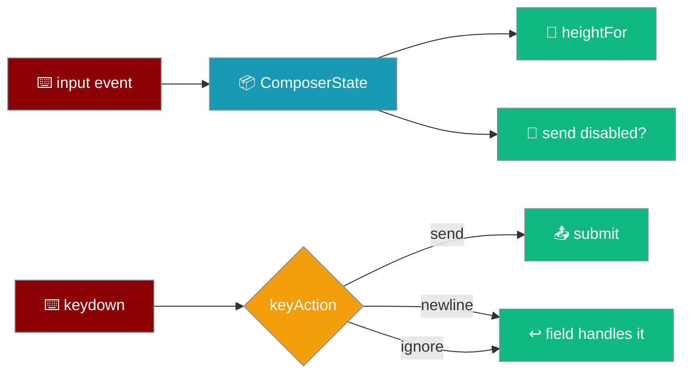

The composer is a value, not just a `<textarea>`: your draft survives a trip to Settings, the height grows with your text and stops before it eats the transcript, and Enter sends the right thing on the right keyboard.



Every decision lives in `ui/src/composer/composer` as a pure function — the field mirrors the state, the state is the source of truth.

## Quick Start

<Steps>
<Step title="Start from an empty composer">
```ts
import { emptyComposer, setDraft, draftOf } from "praisonai-mobile/ui/composer/composer";

let state = emptyComposer();
state = setDraft(state, "Plan my week");
draftOf(state); // "Plan my week"
```
`setDraft` is immutable in, immutable out — a subscriber may hold the previous state and diff against it.
</Step>

<Step title="Mirror the field to the state">
```ts
input.addEventListener("input", () => {
  composerState = setDraft(composerState, input.value);
  input.style.setProperty("height", `${heightFor(lineCountOf(input.value))}px`);
});
```
The `input` event copies the field into the state; the state drives the height back.
</Step>

<Step title="Decide what a key means">
```ts
import { keyAction } from "praisonai-mobile/ui/composer/composer";

keyAction({ key: "Enter", shiftKey: false, altKey: false,
            ctrlKey: false, metaKey: false, isComposing: false });
// "newline" under the default modifier-sends policy
```
`keyAction` is pure and total — both policies and the IME case are assertable without a keyboard.
</Step>
</Steps>

---

## The draft survives the screen that holds it

A draft lives in `ComposerState`, keyed by conversation — not in the text node a route change unmounts. Navigating to Settings and back does not eat what you typed.

```ts
// ComposerState — drafts by conversation id.
export interface ComposerState {
  readonly activeId: string;
  readonly drafts: ReadonlyMap<string, string>;
}
```

| Rule | Why |
|------|-----|
| Draft outlives the screen | iOS kills a suspended app without warning; a draft in a value survives, one in a `<textarea>` does not. |
| A draft belongs to one conversation | One shared string means text typed in one chat appears in the next opened and is sent to the wrong model with the wrong history. |
| An emptied draft is removed, not stored as `""` | Otherwise the snapshot grows one key per conversation ever opened, rewritten on every keystroke. |

<Note>
`focusDraft(state, id)` keeps the drafts map whole on a route change, so switching to another conversation shows **its** draft rather than the previous one's text.
</Note>

---

## Autosize is clamped at both ends

The composer's height is `heightFor(lineCountOf(text))` on every draft change — a floor that keeps it tappable, a ceiling that stops it eating the conversation.

```ts
import { heightFor, lineCountOf } from "praisonai-mobile/ui/composer/composer";

heightFor(lineCountOf(""));            // 52  — COMPOSER_MIN_PX floor
heightFor(lineCountOf("a\nb\nc"));     // grows one line at a time
heightFor(Number.NaN);                 // 52  — a mid-rotation NaN yields the floor
```

| Constant | Value | Meaning |
|----------|-------|---------|
| `COMPOSER_MIN_PX` | `52` | One line plus padding; the floor keeps a hit target on a phone. |
| `COMPOSER_MAX_PX` | `160` | The ceiling; past this the composer scrolls internally. |
| `COMPOSER_LINE_PX` | `22` | One rendered line. |

<Warning>
A non-finite or negative line count — what a measurement taken mid-rotation looks like — yields `COMPOSER_MIN_PX`, not `NaN`. A `NaN` reaching a style property drops the whole declaration silently and the composer lands under the keyboard.
</Warning>

---

## Send is disabled on an empty draft; Stop never is

The disable rule guards on the action so a streaming **Stop** never goes dead just because the draft happens to be empty.

```ts
// main.ts — the disable rule in publish().
sendButton.disabled = streaming ? false : draftOf(composerState).trim() === "";
```

| State | `sendButton.disabled` | Why |
|-------|----------------------|-----|
| Idle, empty draft | `true` | An empty send is a no-op, not an empty turn. |
| Idle, non-empty draft | `false` | There is something to send. |
| Streaming (button reads Stop) | `false` | Stop must stay tappable regardless of the draft. |

<Note>
The draft is trimmed before the check: a draft of spaces and newlines is an empty message that still costs a request and still ends the conversation on a blank turn.
</Note>

---

## The key policy

`keyAction` decides `send`, `newline`, or `ignore` from the handful of fields a key event actually turns on.

```ts
input.addEventListener("keydown", (event) => {
  const action = keyAction({
    key: event.key, shiftKey: event.shiftKey, altKey: event.altKey,
    ctrlKey: event.ctrlKey, metaKey: event.metaKey, isComposing: event.isComposing,
  });
  if (action === "send") {
    event.preventDefault();
    void submit();
  }
  // "newline" and "ignore" both let the field handle the key normally.
});
```

| Policy | Enter | Shift+Enter / Alt+Enter | Modifier+Enter |
|--------|-------|--------------------------|----------------|
| `modifier-sends` (default, phone) | newline | newline | send |
| `enter-sends` (tablet + hardware keyboard) | send | newline | send |

<Warning>
Enter during an IME composition is **neither** a send nor a newline — `isComposing` returns `"ignore"`. It is the key that commits a candidate; treating it as send posts a half-typed Japanese, Chinese, or Tamil message, and the author sees the mangled result only after it has gone.
</Warning>

<Info>
Under `enter-sends`, **Alt+Enter** is equivalent to **Shift+Enter** — both insert a newline. Alt is the newline muscle memory on some layouts; if only Shift escaped enter-sends, Alt+Enter would SEND a half-written message. See the [Overview composer table](/features/mobile/overview#composer) — the [#4589](https://github.com/MervinPraison/PraisonAI/pull/4589) pin still holds.
</Info>

---

## How It Works — submit is atomic

`submit(state, busy)` takes the draft and clears it in one call. That is what makes the second tap of a double tap a no-op: it finds an empty draft.

```ts
import { submit } from "praisonai-mobile/ui/composer/composer";

const result = submit(state, /* busy */ false);
result.sent; // "Plan my week" — trimmed
result.next; // draft cleared

const refused = submit(state, /* busy */ true);
refused.sent; // null — a turn is in flight
refused.next; // unchanged — a refused send must not eat the draft
```

```ts
// main.ts — the app returns without calling the controller on a refusal.
const result = submitComposer(composerState, busy);
composerState = result.next;
input.value = "";
syncComposer();
if (result.sent === null) return; // refused while a turn is in flight
await app.controller.send(result.sent);
```

<Warning>
`busy` alone cannot cover the window before streaming starts: the button is under a thumb and the first tap has no visible effect until the first token arrives. Clearing the draft inside `submit` — the same call that sends it — is what makes the second tap find nothing to send.
</Warning>

---

## Your message row appears when the run is *issued*

The user-message row is drawn when a run is actually handed to an engine (`beginTurn(prompt)`), **not** when Send is tapped. `submit` returning `sent` is the tap; the row belongs to the run that follows it.

That distinction is what keeps a stray "You said:" bubble off the screen:

| The prompt was… | A user row appears? |
|-----------------|---------------------|
| Issued to the engine | Yes — `beginTurn` seeds `turn.prompt` and the transcript draws it |
| Refused because a turn is in flight (`sent === null`) | No — nothing was handed over |
| Queued behind a running turn, not yet started | No — it produces no row until its turn begins |

See [Transcript User Row → When the row appears](/features/mobile/transcript-user-row#when-the-row-appears).

---

## Layout invariants

Three CSS rules decide whether the composer is usable on a phone, each pinned by `app/src/css.test.ts`.

| Rule | Source | What breaks if it regresses |
|---|---|---|
| A hidden screen is actually hidden | `.screen[hidden] { display: none }` | An author `display: flex` beats the user-agent `[hidden] { display: none }`, so `el.hidden = true` does nothing — every screen renders at once, half-height and stacked, and each navigation halves the viewport again. |
| The composer does not double-count the bottom inset | `padding-bottom: calc(var(--keyboard-height, 0px) + .5rem)` | `--keyboard-height` is already `max(keyboard, insets.bottom)` from `geometryOf`; adding `--safe-area-inset-bottom` back measured 76 px of padding above a 34 px home indicator where 42 px is correct. |
| The composer keeps its 12 px gutter at a zero inset | `calc(${inset}px + .75rem)` written inline in `main.ts` | An inline style beats the stylesheet's `calc(var(--safe-area-inset-left) + .75rem)`; writing the bare inset put the textarea's left edge at `x = 0` on a 320 px viewport with no side insets. |

Each of these was a measured defect, not a hypothetical. The `shipping-to-stores` page ties them into the wider [ship path](/features/mobile/shipping-to-stores).

<Note>
The double-count guard in `app/src/css.test.ts` now knows **both** the `--safe-area-inset-*` and the newer `--inset-*` variable names, so the rename that split the two apart could not silently make it stop guarding anything.
</Note>

<Note>
On **Android** the keyboard height does not come from `visualViewport` at all — it arrives through the [window-insets bridge](/features/mobile/native-shell#the-android-window-insets-bridge) on every frame of the IME animation, so `--keyboard-height` updates continuously and the composer slides with the keyboard rather than teleporting between endpoints.
</Note>

---

## Best Practices

<AccordionGroup>
<Accordion title="Keep the draft in state, not the field">
`ComposerState` is the source of truth; the `<textarea>` mirrors it. A route change unmounts the field but not the value, so the draft survives a trip to Settings.
</Accordion>

<Accordion title="Guard the send-disable on the action">
`streaming ? false : draftOf(state).trim() === ""`. Disabling on the draft alone makes a streaming Stop go dead the instant the field is empty.
</Accordion>

<Accordion title="Ignore Enter mid-composition">
Check `isComposing` before treating Enter as send. Sending during an IME composition posts a half-typed CJK or Tamil message.
</Accordion>

<Accordion title="Clamp the autosize">
Feed `heightFor(lineCountOf(text))`; the floor keeps a hit target and the ceiling stops the composer covering the transcript. A mid-rotation NaN falls back to the floor.
</Accordion>

<Accordion title="Let submit clear the draft">
Take and clear atomically so a double tap on send is a no-op. `busy` cannot close the pre-stream window on its own.
</Accordion>
</AccordionGroup>

---

## Related

<CardGroup cols={2}>
<Card title="Overview" icon="mobile" href="/features/mobile/overview">
  The Send/Stop button and the trim-empty rule.
</Card>
<Card title="Follow & Jump" icon="arrow-down-to-line" href="/features/mobile/follow-and-jump">
  Stick-to-bottom while a turn streams.
</Card>
<Card title="i18n & A11y" icon="globe" href="/features/mobile/i18n-and-a11y">
  Logical insets that mirror the composer padding under RTL.
</Card>
<Card title="Route Focus" icon="crosshairs" href="/features/mobile/route-focus">
  Where focus lands after a route change.
</Card>
</CardGroup>
