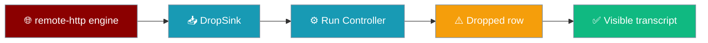
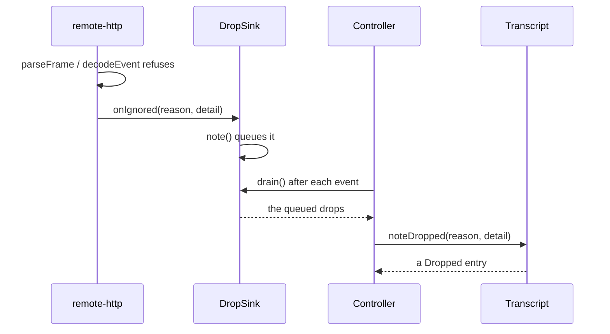
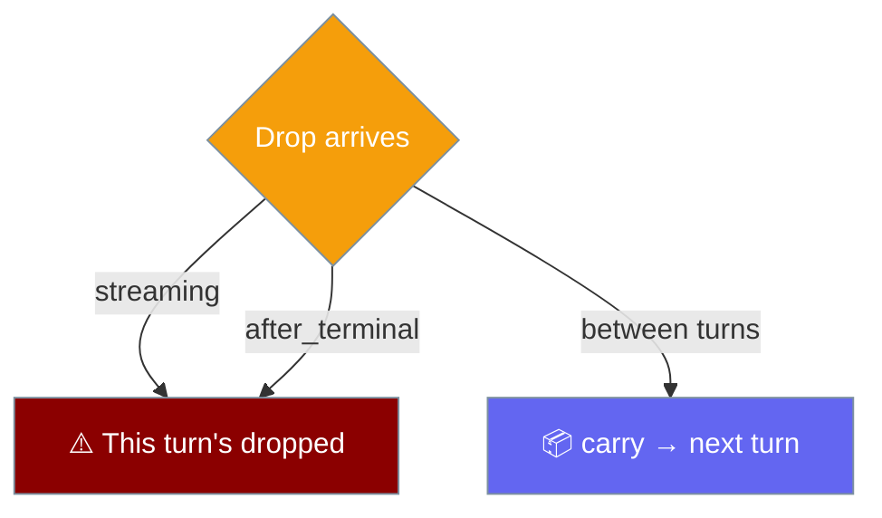

When the wire sends a frame the decoder cannot make sense of, the mobile app shows the refusal on the transcript instead of dropping it on the floor.



## Quick Start

<Steps>
<Step title="See a dropped row">
The composition root already wires the sink, so a dropped row appears on its own whenever a frame is malformed — nothing to enable.

```ts
import { createApp } from "praisonai-mobile/app/boot";

// createApp builds the DropSink and joins the engine to the controller.
// A refused frame becomes a dropped row on the turn it arrived beside.
const app = await createApp(deps);
```
</Step>

<Step title="Toggle visibility">
`settings.showDiagnostics` (labelled **"Show dropped events"**) is the switch that hides or shows dropped rows.

```ts
const show = settings.get("showDiagnostics"); // default false
```

<Warning>
`showDiagnostics` is declared but not yet consumed: dropped rows currently render unconditionally. Do not build a feature off the flag until a settings screen reads it.
</Warning>
</Step>
</Steps>

---

## How It Works

A refusal travels from the engine, through a small port, onto the transcript.



The engine and the controller cannot call each other — the engine is built at composition, the controller per app — so the `DropSink` is the seam between them.

```ts
export interface DropSink {
  note(reason: Dropped["reason"], detail: string): void;
  drain(): readonly Dropped[];
}
```

`drain()` empties the queue, so the same refusal is never repainted on a later event.

---

## The Nine Rejection Reasons

Every refusal carries a machine tag and a user-facing sentence. Seven come from the decoder; two more come from `parseFrame`, which reads the raw frame before decoding.

| Reason | What it means | Typical cause | User-facing sentence |
|--------|---------------|---------------|----------------------|
| `unparseable_json` | The frame body is not valid JSON | An HTML error page from a proxy, or a truncated body | *the engine sent something that was not valid JSON* |
| `not_an_object` | The body is a JSON array, string, or `null` | A bare value where an event object was expected | *the engine sent a value where an event was expected* |
| `missing_type` | The event has no `type` | A malformed frame with no discriminant | *an event arrived with no type* |
| `unknown_event` | An event name this version does not know | A newer engine sending an added event | *the engine sent an event this version does not know* |
| `missing_msg_id` | The event has no `msg_id` | A frame that names no message it belongs to | *an event arrived with no message it belongs to* |
| `missing_required_field` | A known event is missing a field it needs | A `tool_result` with no `ok` | *an event was missing a field it needs* |
| `empty_text` | A `delta`/`reasoning` with empty text | An empty chunk, which is not the same as no answer | *an empty piece of text, which is not the same as no answer* |
| `before_start` | An event arrived before the turn began | A late frame from a previous run | *an event arrived before the turn began* |
| `after_terminal` | An event arrived after the turn ended | A frame from the finished run arriving late | *an event arrived after the turn had already ended* |

<Note>
`parseFrame` replaced the old `safeParse`, which collapsed five distinct wire failures into one `missing_msg_id`. Keeping the real reason means a 502 page from a proxy no longer reads as an engine bug that does not exist.
</Note>

---

## The Two Drain Points

The controller drains the sink twice, and both are load-bearing.

```ts
// After every event, so a refusal paints with the frame it arrived beside.
turn = apply(turn, event);
turn = drainDrops(turn);

// In finally, so a refusal beside the LAST frame — or while the stream was
// dying — is still shown.
turn = drainDrops(turn);
turn = finish(turn);
```

The `finally` drain, not merely a `catch` drain, is what catches a last-frame refusal: the first version sat at the end of the `catch` and only ran when the turn had already failed.

---

## Cross-Turn Behaviour

A refusal belongs to exactly one turn, and `carry` is what keeps one turn's drops from staining the next.

```ts
// TurnState carries drops that arrived between turns, waiting for the next start.
readonly carry: readonly Dropped[];
```

`apply(start)` reads from `state.carry` — the drops noted while nothing was streaming — then clears it. It no longer carries the previous turn's entire `dropped` list, which used to paint every later turn as damaged for the lifetime of the app.



<Info>
`after_terminal` is the exception: a late frame from the run that just finished stays with that run. Moving it forward would blame the next answer for its predecessor's mess.
</Info>

---

## Common Patterns

A dropped row is evidence, not noise. A stream that is 40% unparseable must be visible as a defect, so the count is worth reading.

```ts
if (turn.dropped.length > 0) {
  // The turn is not a clean success — some frames were refused.
  console.log(`${turn.dropped.length} refused`);
}
```

Anyone hand-constructing the engine must pass `onIgnored`, or refusals are invisible again.

```ts
import { createRemoteHttpEngine } from "praisonai-mobile/engines/remote-http";

const engine = createRemoteHttpEngine({
  baseUrl,
  http,
  onIgnored: (reason, detail) => sink.note(reason, detail),
});
```

---

## Best Practices

<AccordionGroup>
<Accordion title="Never infer tool success from output">
`tool_result.ok` is the only signal of success. A decoder refusal is the exact failure that used to hide this — a malformed `tool_result` made its tool vanish and the turn read as a clean answer.
</Accordion>

<Accordion title="Do not build off a planned setting">
`showDiagnostics` is declared but not yet consumed. Building a UI feature off a flag before it consumes anything is how a "planned" setting ships broken.
</Accordion>

<Accordion title="Treat a dropped row as evidence, not a warning to hide">
Dropped events on a clean turn are the mechanism that proves the transcript is not lying. Hiding them reintroduces the silent drop this whole channel exists to undo.
</Accordion>

<Accordion title="Always pass onIgnored when building the engine by hand">
The composition root wires it through the `DropSink`. Without `onIgnored`, a truncated answer is reported as a clean success.
</Accordion>
</AccordionGroup>

---

## Related

<CardGroup cols={2}>
<Card title="The 11 Events" icon="network-wired" href="/features/mobile/protocol">
  How a rejection becomes a value with a reason.
</Card>
<Card title="Mobile Engines" icon="plug" href="/features/mobile/engines">
  The `onIgnored` option and the port it hangs off.
</Card>
<Card title="Capabilities & Gaps" icon="list-check" href="/features/mobile/capabilities-and-gaps">
  The closed decode-rejection gap.
</Card>
</CardGroup>
