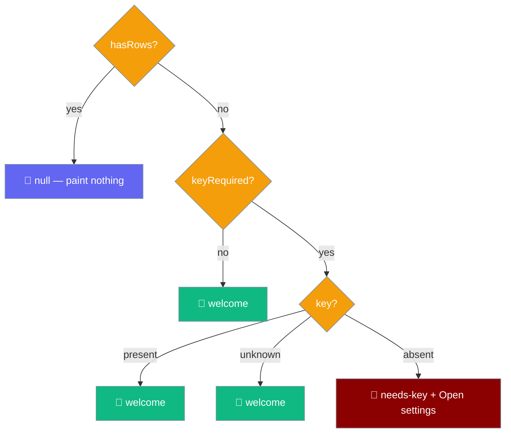

An empty transcript says one of two things: a one-line welcome, or an **"Add an API key to start"** panel with an **Open settings** button when the engine in force needs a key that is definitely not set.



`emptyState(input, strings)` is a pure decision — given whether there are rows, whether the engine needs a key, and whether one is present, it returns the view to paint, or `null` to paint nothing.

## Quick Start

<Steps>
<Step title="Fresh install, no key">
```ts
import { emptyState } from "praisonai-mobile/ui/transcript/empty-state";
import { en } from "praisonai-mobile/ui/i18n/strings";

emptyState({ hasRows: false, keyRequired: true, key: "absent" }, en);
// {
//   kind: "needs-key",
//   title: "Add an API key to start",
//   body: "PraisonAI answers using your own OpenAI account. Paste a key in Settings and this chat is ready.",
//   action: { label: "Open settings", route: "settings" },
// }
```
</Step>

<Step title="Key configured, no messages yet">
```ts
import { emptyState } from "praisonai-mobile/ui/transcript/empty-state";
import { en } from "praisonai-mobile/ui/i18n/strings";

emptyState({ hasRows: false, keyRequired: true, key: "present" }, en);
// { kind: "welcome", title: "Ask something to begin.", body: "…", action: null }
```
</Step>

<Step title="Any transcript row">
```ts
import { emptyState } from "praisonai-mobile/ui/transcript/empty-state";
import { en } from "praisonai-mobile/ui/i18n/strings";

emptyState({ hasRows: true, keyRequired: true, key: "absent" }, en);
// null — a transcript beats everything
```
</Step>
</Steps>

---

## How It Works

The whole page is four rules, checked in this order. `emptyState` returns an `EmptyStateView`, or `null` meaning "paint nothing".

```ts
import { emptyState, type KeyPresence } from "praisonai-mobile/ui/transcript/empty-state";
import { en } from "praisonai-mobile/ui/i18n/strings";

const key: KeyPresence = "unknown"; // "present" | "absent" | "unknown"
emptyState({ hasRows: false, keyRequired: true, key }, en);
```

### Rule 1 — A transcript wins over everything

`hasRows` is checked first and alone. Any row at all — restored history or a live turn — returns `null`, and the panel is not painted.

```ts
emptyState({ hasRows: true, keyRequired: true, key: "absent" }, en); // null
```

A "you need a key" panel sitting above a conversation the user is having is a worse defect than the blank rectangle, and it is reachable: the engine can be switched to one needing a key mid-chat.

### Rule 2 — No key is only a problem when something wants one

`keyRequired` comes from the engine actually in force. The remote engine authenticates at its own server, so a remote-engine user is **never** shown the "add a key" panel.

```ts
emptyState({ hasRows: false, keyRequired: false, key: "absent" }, en);
// { kind: "welcome", … } — an engine that needs no key is never told to get one
```

Sending a remote-engine user to paste an OpenAI key would send them to configure a credential nothing on the device reads.

### Rule 3 — An unresolved key check reads as "fine", not as "missing"

`KeyPresence` is a three-value type — `"present" | "absent" | "unknown"` — and `unknown` resolves to the welcome copy, not the guidance.

```ts
emptyState({ hasRows: false, keyRequired: true, key: "unknown" }, en);
// { kind: "welcome", … } — an in-flight check reads as fine
```

`SecretsPort.has()` is asynchronous, and the first paint happens before the answer lands. Guessing `"absent"` during that window would accuse every configured user of not having set a key, on every launch, and then take it back a frame later.

### Rule 4 — The action is part of the state

`action` is non-null exactly when `kind === "needs-key"`. The pairing is the invariant — a button with no reason and a reason with no button are both bugs.

```ts
const view = emptyState({ hasRows: false, keyRequired: true, key: "absent" }, en);
view?.action; // { label: "Open settings", route: "settings" }
```

The label comes from `strings.recoveryLabel("settings")` → **"Open settings"**, so the button reads the same everywhere in the app that offers this route.

---

## Exported types

```ts
export type EmptyStateKind = "needs-key" | "welcome";
export type KeyPresence = "present" | "absent" | "unknown";

export interface EmptyStateAction {
  readonly label: string;
  readonly route: "settings";
}

export interface EmptyStateView {
  readonly kind: EmptyStateKind;
  readonly title: string;
  readonly body: string;
  readonly action: EmptyStateAction | null;
}

export interface EmptyStateInput {
  readonly hasRows: boolean;
  readonly keyRequired: boolean;
  readonly key: KeyPresence;
}

export function emptyState(input: EmptyStateInput, strings: Strings): EmptyStateView | null;
```

| Field | Type | Meaning |
|-------|------|---------|
| `hasRows` | `boolean` | Anything at all in the transcript: restored history or a live turn. |
| `keyRequired` | `boolean` | Whether the engine currently selected authenticates with a key held here. False for the remote engine. |
| `key` | `KeyPresence` | `"present" \| "absent" \| "unknown"` — `unknown` is the pre-answer window. |

---

## User interaction flow

<Steps>
<Step title="A new user opens the app">
The chat screen shows the **"Add an API key to start"** heading and an **"Open settings"** button — not a raw SDK error. Tapping the button lands on Settings.
</Step>

<Step title="They paste a key and return">
Back on Chat, the panel now reads **"Ask something to begin."** with the one-sentence description of what the app does. The transition from "you cannot yet" to "start typing" is complete.
</Step>
</Steps>

---

## Strings

The four user-visible strings are constants — not functions — read straight from the `en` table.

| Key | English |
|-----|---------|
| `emptyTranscript` | `"Ask something to begin."` |
| `emptyAbout` | `"PraisonAI answers questions, explains things, and works through tasks with you."` |
| `emptyNeedsKeyTitle` | `"Add an API key to start"` |
| `emptyNeedsKeyBody` | `"PraisonAI answers using your own OpenAI account. Paste a key in Settings and this chat is ready."` |

The action button label is not a new string — it is `strings.recoveryLabel("settings")` → **"Open settings"**, reused so the app names the destination the same way everywhere.

<Note>
**No suggestion chips, on purpose.** Example prompts were rejected: a chip is read once by a user who has already understood what a message box is, then in the way of every new chat afterwards, at the cost of a translatable string per example. What the new user lacks is not inspiration — it is the key, and that is what the space is spent on.
</Note>

---

## Related

<CardGroup cols={2}>
<Card title="API Keys" icon="key" href="/features/mobile/api-keys">
  Where the "no key" guidance now appears, and how the key is stored.
</Card>
<Card title="i18n & A11y" icon="globe" href="/features/mobile/i18n-and-a11y#empty-chat-region">
  The empty-chat strings and the polite live-region announcement.
</Card>
</CardGroup>
