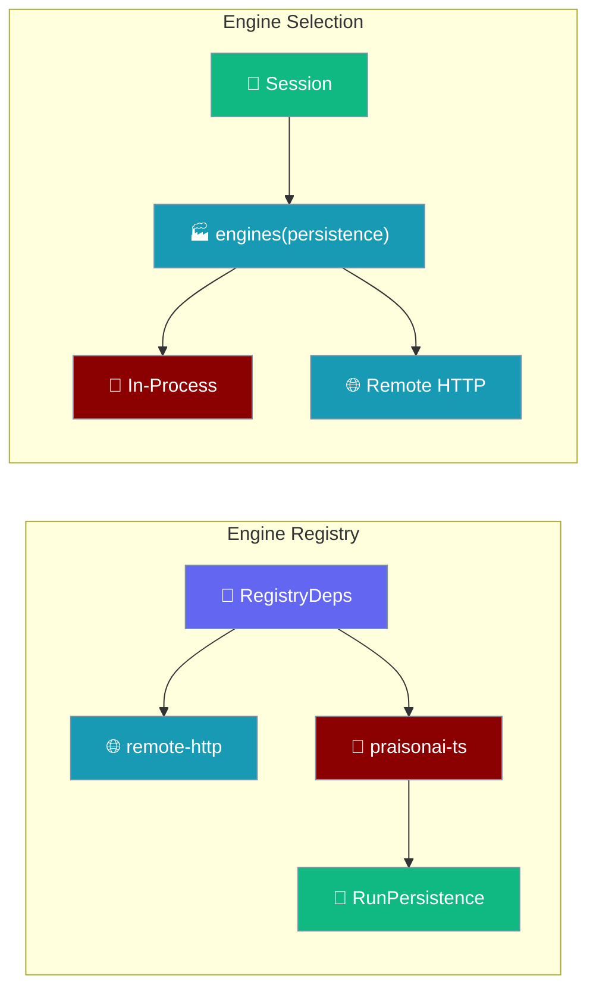
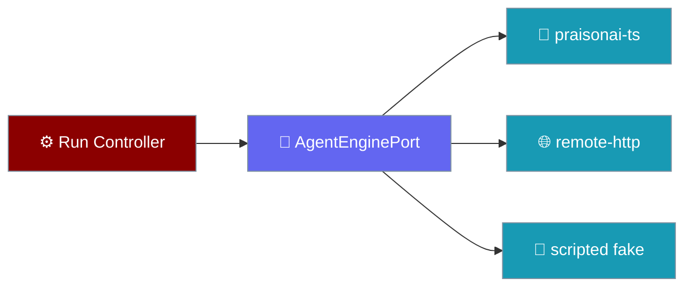
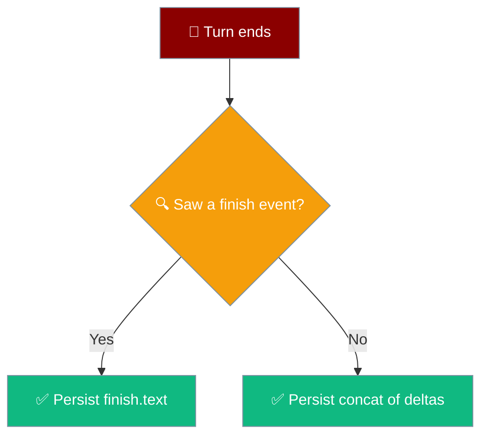
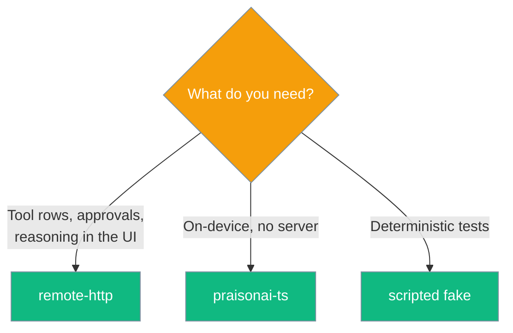

The mobile app picks an engine from a factory that is handed the store engines write through, so the in-process engine records a turn to the same session the chat list reads. Everything above the seam is written against `AgentEnginePort` and nothing else.

```ts
import { createRemoteHttpEngine } from "praisonai-mobile/engines/remote-http";

const engine = createRemoteHttpEngine({ baseUrl: "http://127.0.0.1:8765", http });
for await (const event of engine.run(request, signal)) {
  if (event.type === "delta") process.stdout.write(event.text);
}
```





## Quick Start

<Steps>
<Step title="RegistryDeps requires a persistence">
`persistence` is required. It is passed only into the in-process engine's factory.

```ts
export interface RegistryDeps {
  readonly settings: SettingsFacade;
  readonly http: HttpPort;
  readonly createInProcess?: (persistence: RunPersistence) => AgentEnginePort | Promise<AgentEnginePort>;
  readonly persistence: RunPersistence; // required
}
```
</Step>

<Step title="An EngineChoice can carry a probe">
`create` builds the engine; the optional `probe` answers whether the thing it talks to is ready. The in-process engine has no remote to probe, so it supplies none.

```ts
export interface EngineChoice {
  readonly id: string;
  readonly create: () => AgentEnginePort | Promise<AgentEnginePort>;
  /** Is the thing this engine talks to actually ready to answer?
   *  Optional — the in-process engine has no remote to probe. When
   *  present it runs at selection, so a remote that answers 200 with
   *  `{"ok": false}` is refused at boot with a name rather than
   *  surfacing as a transport error mid-turn. */
  readonly probe?: () => Promise<Readiness>;
}
```
</Step>

<Step title="selectEngine returns notReady on a retryable probe">
The success branch carries an optional `notReady`, set only for a **retryable** unreadiness. A permanent unreadiness (`version_mismatch`) takes the failure branch and disposes the engine.

```ts
export type EngineSelection =
  | {
      readonly ok: true;
      readonly engine: AgentEnginePort;
      /** The engine was selected but is not answering yet. Set only for a
       *  RETRYABLE unreadiness -- a permanent one refuses instead. */
      readonly notReady?: { readonly reason: string; readonly detail: string };
    }
  | {
      readonly ok: false;
      readonly reason: "unknown_engine" | "protocol_mismatch" | Extract<Readiness, { ready: false }>["reason"];
      readonly detail: string;
      /** Only a probe failure sets this: a transport error may resolve on a
       *  retry, a version mismatch never will. */
      readonly retryable?: boolean;
    };
```
</Step>

<Step title="enginesFor wires a probe and passes persistence to in-process only">
The remote-http choice supplies a `probe`; the remote engine deliberately does not receive `persistence`. `baseUrl` is computed **once** and shared between `create` and `probe`, so the probe hits the same address the user configured.

```ts
export function enginesFor(deps: RegistryDeps): readonly EngineChoice[] {
  const baseUrl = stringSetting(deps.settings, "baseUrl", "http://127.0.0.1:8765").replace(/\/+$/, "");
  const choices: EngineChoice[] = [
    {
      id: ENGINE_REMOTE_HTTP,
      create: () => createRemoteHttpEngine({ baseUrl, http: deps.http, id: ENGINE_REMOTE_HTTP }),
      probe: () => probeHealth(deps.http, baseUrl),
    },
  ];
  // in-process engine (no probe — it IS the device)
  if (deps.createInProcess !== undefined) {
    const build = deps.createInProcess;
    choices.push({ id: ENGINE_PRAISONAI_TS, create: () => build(deps.persistence) });
  }
  return choices;
}
```

Sharing the single `baseUrl` is pinned by `"enginesFor's probe targets the configured engine address"`.
</Step>

<Step title="Build engines from the session">
`AppDeps.engines` is a factory `(persistence) => EngineChoice[]`. The composition root builds it from the session, so an engine cannot exist without the store it writes through.
</Step>

<Step title="The shipping composition root wires it">
`appEngines` supplies `createInProcess` to `enginesFor`, so the in-process engine is on offer. The remote engine stays first, so the default keeps working with nothing configured.

```ts
import { appEngines } from "praisonai-mobile/app/main";

const choices = appEngines({
  settings,
  http: platform.http,
  persistence,
  onIgnored: (reason, detail) => sink.note(reason, detail),
});
// choices.map(c => c.id) → ["remote-http", "praisonai-ts"]
```
Pinned by `"the real composition root offers the in-process engine"` in `app/src/main.test.ts`.
</Step>

<Step title="Run a turn">
```ts
for await (const event of engine.run(request, signal)) {
  console.log(event.type);
}
```
`run` returns an `AsyncIterable`, so `for await` gives free backpressure and one cancellation path. Breaking out of the `for await` cancels the underlying response stream in a `finally` (`await reader.cancel()`), so the engine stops generating and the socket is released. Before [#4579](https://github.com/MervinPraison/PraisonAI/pull/4579) this was silently untrue for `remote-http` — the `finally` lacked the cancel, so leaving the loop left the model billing.
</Step>

<Step title="Answer an approval">
```ts
const recorded = await engine.decide(approvalId, "allow");
```
Approval is a reverse channel while the stream is live, so it is a method, not an event.
</Step>

<Step title="Surface refused frames with onIgnored">
```ts
const engine = createRemoteHttpEngine({
  baseUrl,
  http,
  onIgnored: (reason, detail) => sink.note(reason, detail),
});
```
Without `onIgnored`, decoder refusals are invisible — a truncated answer reported as a clean success. The composition root wires it via the `DropSink`; anyone hand-constructing the engine must pass it explicitly.
</Step>
</Steps>

---

## Options On remote-http

`RemoteHttpOptions` carries the request target and the refusal callback.

| Option | Type | Purpose |
|--------|------|---------|
| `baseUrl` | `string` | Engine base URL. Any number of trailing slashes are stripped before the path is appended, so `http://host`, `http://host/`, `http://host//`, and `http://host///` all POST to `http://host/chat`. Pinned by `"a base URL with several trailing slashes still builds one clean path"`. |
| `http` | `HttpPort` | All I/O goes through this port — no `fetch` in the engine. |
| `token` | `string` | Optional bearer token; loopback is unauthenticated, off-device must not be. |
| `onIgnored` | `(reason, detail) => void` | Called for every frame the decoder **refused**. Wired to `dropSink.note` by the composition root. |
| `id` | `string` | Optional engine id; defaults to `"remote-http"`. |

`ControllerDeps.dropSink` is the other end of the same seam: what the engine refuses becomes a dropped row on the turn it belonged to. See [Dropped Events](/features/mobile/dropped-events).

<Note>
**Readiness is strictly HTTP 200.** The remote-HTTP engine's readiness probe treats any non-200 status as an `http_status` failure — including sub-200 responses (100, 101, 199) that would otherwise fall through to body classification. A websocket upgrade or a `100 Continue` from a misconfigured proxy can no longer be reported as `ready: true` and then offered as a usable engine whose every request fails. Pinned by `"any status that is not exactly 200 is an http_status failure"`.
</Note>

### Readiness body rules

After the 200 passes, `classify` in `engines/src/remote-http/readiness.ts` judges the body by **strict identity**, not by truthiness. The healthy predicate is `body.ok === true` — nothing else counts as healthy.

| Body after HTTP 200 | Verdict |
|---------------------|---------|
| `{ok: true}` (optionally with a valid `version`) | **healthy** → `ready: true` |
| `{ok: "yes"}`, `{ok: 1}`, `{ok: "true"}`, `{ok: "false"}`, `{ok: {}}`, `{ok: []}` | `unhealthy` — even when a valid `version` is present |
| `ok` missing entirely, or `ok: false / null / 0` | `unhealthy` |

A missing `ok` must never be mistaken for a present healthy one: `{ok: "true"}` (a string) and a body with no `ok` at all are both refused. The paired positive case — `body.ok === true` — is what stops the predicate degenerating to "refuse everything".

<Note>
**Unhealthy is retryable — and retryable now boots the app.** An `unhealthy` verdict carries `retryable: true`. Since PR #4672 that no longer means "poll from a crash screen": `selectEngine` returns `ok: true` with the engine attached and a `notReady` field, so the app **boots** and shows a warning instead of refusing. Only `version_mismatch` still refuses boot. Pinned by `"an unhealthy engine is worth retrying"`, with `"a healthy engine IS ready - the pair"` as its companion. See [Boot Failures → An unreachable engine boots with a warning](/features/mobile/boot-failures#an-unreachable-engine-boots-with-a-warning).
</Note>

<Note>
**The probe now actually runs at boot.** These readiness rules are no longer hypothetical: `enginesFor` wires `probe: () => probeHealth(deps.http, baseUrl)` on the remote-http choice, and `selectEngine` calls it before the engine is offered. A `200 {"ok": false}`, a non-200, or an unreachable engine is handled at boot with a named reason — a permanent one refuses boot, a retryable one boots the app with a warning. See [Boot Failures → Boot-time health probe](/features/mobile/boot-failures#boot-time-health-probe).
</Note>

### Probe timeout

The probe runs *before* the app mounts, so a request or body read that never completes must abort on a deadline rather than pin `createApp` on a blank screen.

```ts
export const PROBE_TIMEOUT_MS = 5000;

// Bounded by timeoutMs; a request or body read that never completes
// aborts on the deadline and classifies as retryable transport.
await probeHealth(http, baseUrl, token, PROBE_TIMEOUT_MS);
```

A single `AbortController` covers both the request **and** the body read, so an endpoint that accepts the socket but never sends the response — a still-binding engine, a black-hole proxy — aborts on the deadline. A timeout classifies as retryable `transport`, exactly the case worth polling.

### Order of checks in `selectEngine`

A probe opens a socket, so it must not run for an engine this build cannot even speak to. The checks run in order, cheapest first.

| Step | Check | Outcome |
|------|-------|---------|
| 1 | Is `id` known? | Fails: `unknown_engine` |
| 2 | Does `protocolVersion` match? | Fails: `protocol_mismatch` |
| 3a | Probe returns `ready: false, retryable: false` | Fails: `version_mismatch`. **Engine disposed.** |
| 3b | Probe returns `ready: false, retryable: true` | Succeeds with `notReady` attached. **Engine kept** — it's the one the app will use. |

That step 3 does not run when step 2 fails is pinned by `"selectEngine runs the probe only after the protocol check passes"`. The split at step 3 mirrors `readiness.retryable`: a permanent unreadiness disposes and refuses, a retryable one keeps the engine and returns `ok: true`.

<Warning>
**The verdict `reason` is load-bearing, not just `ready`.** Readers of `classify()` route the UI on `reason: "unhealthy"` versus `reason: "version_mismatch"` — the two lead to different recovery arms (retry vs. a version-mismatch boot failure). Asserting only `ready` is what let a test hold for the wrong reason in [#4606](https://github.com/MervinPraison/PraisonAI/pull/4606); always assert the reason too. Pinned by `"a missing ok field is not read as healthy"`. The `unhealthy → retry` recovery arm is described in [Errors & Recovery](/features/mobile/errors-and-recovery).
</Warning>

<Note>
**`run_id` and `chat_id` are separate wire fields.** The stream POST body carries `run_id` and `chat_id` as **separate** fields. `POST /cancel/{runId}` matches on `run_id` alone, so swapping the two — they are the same shape — makes Stop permanently unmatched against the remote engine (the model keeps generating and keeps billing) while nothing about the payload looks wrong. Pinned by `"the request carries the RUN id and the CHAT id in their own fields"`.
</Note>

<Note>
**The stream request advertises SSE.** The `POST /chat` stream request sends `Accept: text/event-stream`. Dropping it makes a conforming proxy or engine free to answer with something else entirely, and the failure surfaces as an unparseable stream rather than as a bad request. Pinned by `"the stream request advertises that it wants SSE"`.
</Note>

---

## Who Persists

Two engines, two owners of the write.

| Engine | Receives persistence | Who owns the write |
|--------|----------------------|--------------------|
| In-process (`praisonai-ts`) | **Yes** | The mobile session on this device |
| Remote HTTP (`remote-http`) | No | The server it talks to |

The remote engine deliberately does not take persistence: the server it connects to owns the write and is the only thing that can report authoritative indices for its own store.

<Note>
A picker omits an engine whose prerequisites are absent rather than offering it and then failing. `createInProcess` is optional — when it is not supplied, only the remote engine is offered. The shipping composition root **does** supply it, via `appEngines`, so `enginesFor` returns both engines in real builds — even though only `remote-http` sits in `SETTING_DEFS.engineId.choices` (the picker). Pinned by `"the real composition root offers the in-process engine"` in `app/src/main.test.ts`.
</Note>

---

## Where a Completed Turn Is Written

Each engine owns its own write, and reports `end.userIndex` from the store it wrote to.

| Engine | Writes the turn to | Reports `end.userIndex` from |
|--------|--------------------|------------------------------|
| `praisonai-ts` (in-process) | The mobile app's session store, via the `RunPersistence` handed in at construction | The store it just wrote to |
| `remote-http` | The desktop/remote server it POSTs the run to | The server's own store (reported over the protocol) |

The in-process engine records the turn and reports the indices it actually wrote, which is what makes `end.userIndex` real:

```ts
const indices = await options.persistence.record(request, answer);
yield {
  type: "end",
  msgId,
  userIndex: indices?.userIndex ?? null,
  assistantIndex: indices?.assistantIndex ?? null,
  versions: indices?.versions ?? 1,
  active: indices?.active ?? 0,
};
```

<Warning>
A turn answered by the default `remote-http` engine does **not** currently mirror into the local mobile session. The remote server owns that transcript and is the only thing that can report authoritative indices for its own store. Local mirroring is tracked separately.
</Warning>

---

## What a Recorded Turn Returns

`session.record(prompt, answer)` writes the user message and the answer together, then returns the indices into the persisted array.

| Field | Meaning |
|-------|---------|
| `userIndex` | Position of the user message on disk |
| `assistantIndex` | Position of the answer on disk |
| `versions` | Number of stored versions |
| `active` | Which version is shown |

A `null` return means the save failed — the turn is on screen but not on disk.

<Warning>
The user message is written **when the turn succeeds**, not when the user pressed send. A turn that never completes must not leave a dangling user message with no reply under it.
</Warning>

---

## Persisted Answer Text

The in-process engine (`praisonai-ts`) writes exactly one string as the assistant answer per turn. Which string depends on whether the turn produced a `finish` event.

| Turn saw a `finish` event? | What gets persisted |
|----------------------------|---------------------|
| Yes | `finish.text` — the streamed deltas are discarded for the write |
| No  | Concatenation of every `delta.text` in order |



<Warning>
`finish.text` **replaces** the streamed accumulation — it does not append to it. A provider that both streams deltas and then emits `finish` with the full text writes the answer **once**, not twice. Appending instead leaves the on-screen answer looking correct (the screen is built from deltas) while the persisted transcript contains the answer twice — visible only when the user reopens the chat.
</Warning>

<Note>
`finish` also carries the final text for a **non-streaming** provider that emits no deltas at all. Trusting only the streamed accumulation would persist an empty string in that case.
</Note>

Why replace rather than append?

- Upstream may **normalise** the final text — a typo fix or whitespace tidy-up. Persisting the concatenation would store text the model did not finally say.
- A non-streaming provider emits **no** deltas, only `finish`. Persisting only the accumulation would drop the answer entirely.

```ts
if (event.type === "text") {
  if (event.delta === "") continue;
  answer += event.delta;                 // accumulate while streaming
  yield { type: "delta", msgId, text: event.delta };
} else if (event.type === "finish") {
  answer = event.text;                   // REPLACES the accumulation
}
```

<Info>
This rule applies to the in-process engine's own write. The `remote-http` engine does not persist locally at all — the server it talks to owns that write and reports its own indices. See [Who Persists](#who-persists) and the [Protocol](/features/mobile/protocol) for the `finish` and `end` event shapes.
</Info>

---

## The Port

`AgentEnginePort` is the entire agent-framework coupling.

| Member | Type | Purpose |
|--------|------|---------|
| `id` | `string` | Stable id, written into persisted chats. |
| `protocolVersion` | `number` | Checked once at boot; a mismatch fails boot with a name. |
| `capabilities` | `EngineCapabilities` | What the engine can **report**, checked before the first token. |
| `run(request, signal)` | `AsyncIterable<RunEvent>` | One turn: `start` first, exactly one terminal event last. |
| `decide(approvalId, choice)` | `Promise<boolean>` | Answer an approval; `false` for an unknown id, a decided id, **or a non-200 response from the engine**. |
| `cancel(runId)` | `Promise<boolean>` | Stop a run; `false` when it was not live **or when the engine returns a non-200**. |
| `dispose()` | `Promise<void>` | Release clients and sockets. Idempotent. |

---

## The Three Engines

Three implementations pass the same conformance suite, which is what makes "swappable" a fact.

| Engine | Where | Talks to |
|--------|-------|----------|
| `praisonai-ts` | `engines/src/praisonai-ts` | The agent loop, in-process on the device. |
| `remote-http` | `engines/src/remote-http` | A PraisonAI engine over HTTP + SSE. |
| scripted fake | `testing/` | Nothing — replays canned events for tests. |

### Lazy, Runtime-Computed Import

The in-process engine's `createAgent` factory loads praisonai's `Agent` through a runtime-computed dynamic import.

```ts
const specifier = ["..", "..", "..", "praisonai-ts", "src", "agent", "simple.ts"].join("/");
let mod: { Agent: PraisonAgentModule };
try {
  mod = (await import(specifier)) as { Agent: PraisonAgentModule };
} catch (cause) {
  throw new Error(
    "the in-process engine is unavailable in this build: praisonai-ts could not be loaded",
    { cause },
  );
}
```

A **computed** specifier keeps `tsc` from following the upstream graph (which does not typecheck under this strict config) and keeps `esbuild` from bundling its import-time-fatal builtins ([#4437](https://github.com/MervinPraison/PraisonAI/issues/4437)). The mobile bundle stays **48.9 kB, 0 external, 0 fatal builtins**.

---

## Conformance

Passing `engines/src/conformance.ts` **is** the definition of implementing the seam.

```ts
export interface EngineHarness {
  readonly name: string;
  create(scenario: ScenarioName): Promise<AgentEnginePort>;
  readonly unsupported?: Partial<Record<ScenarioName, string>>;
}
```

The suite also asserts the negative direction: an engine declaring `approvals: false` must never emit an `approval_request`. Every unsupported scenario is printed on each run, so a contract that quietly shrinks is visible rather than silently green.

The suite drives each guarantee against a deliberately broken run. The shipped break modes are:

| break mode | breaks the run by |
|---|---|
| `no_start` | Skipping its opening event. |
| `start_only` | Opening and then simply stopping, with **no terminal event at all**. |
| `tool_failure_as_ok` | Reporting a failed tool as ok. |
| `empty_is_fine` | Reporting an empty stream as an empty answer instead of an error. |
| `decide_always_true` | Reporting an unknown approval as accepted. |
| `abort_ignored` | Never consulting the abort signal, so a cancelled run streams to completion. |

Both `no_start` and `start_only` are caught by the same case *"a run emits start first and exactly one terminal event last"* — one missing the opening event, the other missing the terminal one. `start_only` proved the case's `events.length >= 2` assertion is redundant rather than unguarded: weakening it to `>= 1` still catches a run that opens and never ends.

<Note>
The abort case originally asserted `seen.length < 50`, but every scenario emits five events or fewer, so an engine that ignored the signal ran to completion and still satisfied it — a cap larger than any real run cannot tell stopping from finishing, and that is what an arbitrary ceiling always is. It now compares against `whole.events.length` from a real driven happy-path run, which `abort_ignored` cannot satisfy. This is `start_only` one level further in: the `>= 2` cap was redundant, the `< 50` cap was vacuous.
</Note>

<Info>
`praisonai-ts` declares `two_approvals` unsupported because upstream `Agent.streamEvents()` cannot emit `approval_request`. Tool scenarios and the single-approval scenario are produced and passing. See `src/praisonai-mobile/docs/gaps.md`.
</Info>

---

## When To Pick Which Engine



<Note>
Today only `remote-http` appears in the picker (`SETTING_DEFS.engineId.choices`). The in-process engine is offered by the factory list but is not yet a legal `engineId` setting value. In a build that ships praisonai-ts on disk, `engineId: "praisonai-ts"` can be selected programmatically; the picker gains it once [#4435](https://github.com/MervinPraison/PraisonAI/issues/4435) + [#4437](https://github.com/MervinPraison/PraisonAI/issues/4437) land.
</Note>

---

## Common Patterns

An engine whose prerequisites are absent is omitted, not offered and then failed.

```ts
// createInProcess is optional: without it, only remote-http is listed.
if (deps.createInProcess !== undefined) {
  choices.push({ id: ENGINE_PRAISONAI_TS, create: () => build(deps.persistence) });
}
```

`selectEngine` names the available engines when an id is unknown, so a missing engine is an honest message rather than a crash.

```ts
const outcome = await selectEngine("nope", choices);
// outcome.detail names what IS available, e.g. "remote-http, praisonai-ts"
```

---

## Best Practices

<AccordionGroup>
<Accordion title="Never bypass the factory">
Obtaining the engine list requires the persistence argument. Do not construct engines directly — the type makes the wiring impossible to forget.
</Accordion>

<Accordion title="Treat persistence as required, not optional">
`RegistryDeps.persistence` has no default. The in-process engine's `end.userIndex` is only real because it records through this store — without it, the turn is on screen and not on disk.
</Accordion>

<Accordion title="Do not persist remote-http into the local session">
The remote server owns its own store and reports its own indices. Writing a second copy locally reintroduces divergence between screen position and disk position.
</Accordion>

<Accordion title="Do not switch chats from the request">
The session already knows which conversation is open. Taking direction from the run request would let an in-flight turn write into whichever chat the user has since navigated to.
</Accordion>

<Accordion title="Read null as 'not on disk'">
When `record` returns null the write failed. Null travels to the UI as "do not offer Fork or Delete", because those affordances would address a message that does not exist. Index `0` is valid, so a falsy check is a trap.
</Accordion>

<Accordion title="Read capabilities before rendering">
`capabilities` is a property, not a method, so the UI decides what to render before the first token arrives.
</Accordion>

<Accordion title="Never fake an unsupported scenario">
Declaring a gap in the `unsupported` map is honest; faking it hides a defect the conformance suite exists to catch.
</Accordion>

<Accordion title="Return false, never a lie">
`decide` and `cancel` return `false` for an unknown id, a decided id, **and any non-200 response from the engine** — reporting success for a request the engine did not accept is a lie the UI cannot detect. `postOk` checks `if (response.status !== 200) return false;`, pinned by `"a decision or cancel the engine did NOT accept is reported as refused"` over `[202, 400, 401, 403, 500, 502]`.
</Accordion>

<Accordion title="Break out of the iterator to release the socket">
The consumer's `break`, `return`, or exception out of the `for await` loop is the cancellation channel — there is no separate `close()`. The engine's `finally` calls `await reader.cancel()`, so leaving the stream releases the reader and the model stops billing. The regression `"leaving the stream early releases the socket"` asserts the underlying `ReadableStream`'s `cancel()` fires when the consumer `break`s after the first delta. See [Stop is idempotent and race-safe](/features/mobile/approvals-and-cancellation#stop-is-idempotent-and-race-safe).
</Accordion>

<Accordion title="An unloadable in-process engine fails RECOVERABLY, not opaquely">
The dynamic import can reject at run time — the shipping webview bundles only `dist/`, so praisonai-ts is not on disk ([#4437](https://github.com/MervinPraison/PraisonAI/issues/4437)). When it does, the failure surfaces as a single `error` event through the run loop, never as an unhandled rejection. `create()` itself succeeds because it wires the factory, not the module. Pinned by `"the in-process engine, when its module cannot load, fails RECOVERABLY"` in `app/src/main.test.ts`.
</Accordion>

<Accordion title="A retryably unready engine boots the app, not the crash screen">
A retryable probe failure (`unhealthy`, `http_status`, `malformed`, `transport`) returns `ok: true` with a `notReady` field — the engine is kept and the app starts. Only `version_mismatch` refuses boot. On a phone with no desktop engine to reach, the old hard gate meant the app never opened and the user could not fix the address, because Settings lives inside the app that would not start. Waiting cannot fix a version mismatch, but it does fix a socket still binding. Pinned by the boot and selection tests in `app/src/boot.test.ts` and `app/src/engines.ts`. See [Boot Failures](/features/mobile/boot-failures#an-unreachable-engine-boots-with-a-warning).
</Accordion>

<Accordion title="A run given an already-aborted signal produces no answer">
When the caller passes an `AbortSignal` whose `.aborted` is already `true` — the dispose-then-new-run path, and Stop-immediately-followed-by-Send — the engine aborts its own controller **before** subscribing, so no `delta` events are emitted and nothing is persisted. Before this fix, the code path attached `addEventListener("abort")` after the fact, which never fires for a signal that went down before the listener was attached; the run streamed to completion and persisted an answer the UI had already discarded. Pinned by `"a run started with an ALREADY-aborted signal produces no answer"`, with `"a run with a live signal still streams, so the abort test is not vacuous"` as the companion. See [Approvals & Cancellation](/features/mobile/approvals-and-cancellation) for the Stop-then-Send route into the same signal.
</Accordion>
</AccordionGroup>

---

## Related

<CardGroup cols={2}>
<Card title="Architecture" icon="sitemap" href="/features/mobile/architecture">
  Boot order and the engines factory shape.
</Card>
<Card title="Overview" icon="mobile" href="/features/mobile/overview">
  Native navigation and the retained chat screen.
</Card>
<Card title="Capabilities & Gaps" icon="list-check" href="/features/mobile/capabilities-and-gaps">
  What each engine can and cannot report.
</Card>
<Card title="Shell & Adapters" icon="mobile-screen" href="/features/mobile/shell-and-adapters">
  The keyboard snapshot and the pinch-zoom guard.
</Card>
<Card title="Protocol" icon="network-wired" href="/features/mobile/protocol">
The 11 events every engine speaks.
</Card>
<Card title="Dropped Events" icon="triangle-exclamation" href="/features/mobile/dropped-events">
Where a refused frame lands via onIgnored.
</Card>
<Card title="Boot Failures" icon="bug" href="/features/mobile/boot-failures">
Where a retryable probe boots the app with a warning, and a permanent one refuses.
</Card>
</CardGroup>
