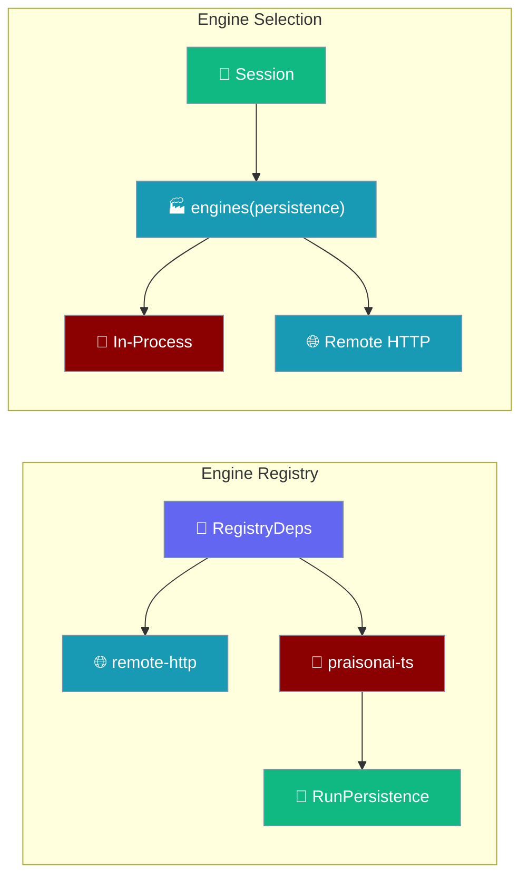
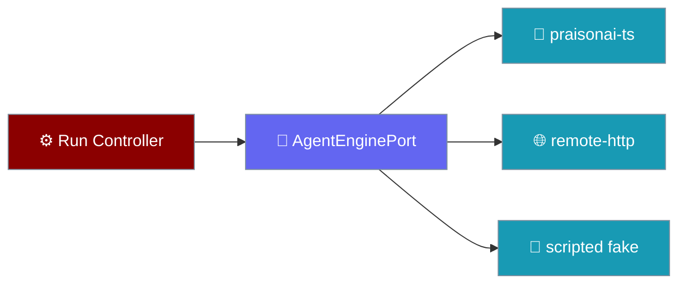
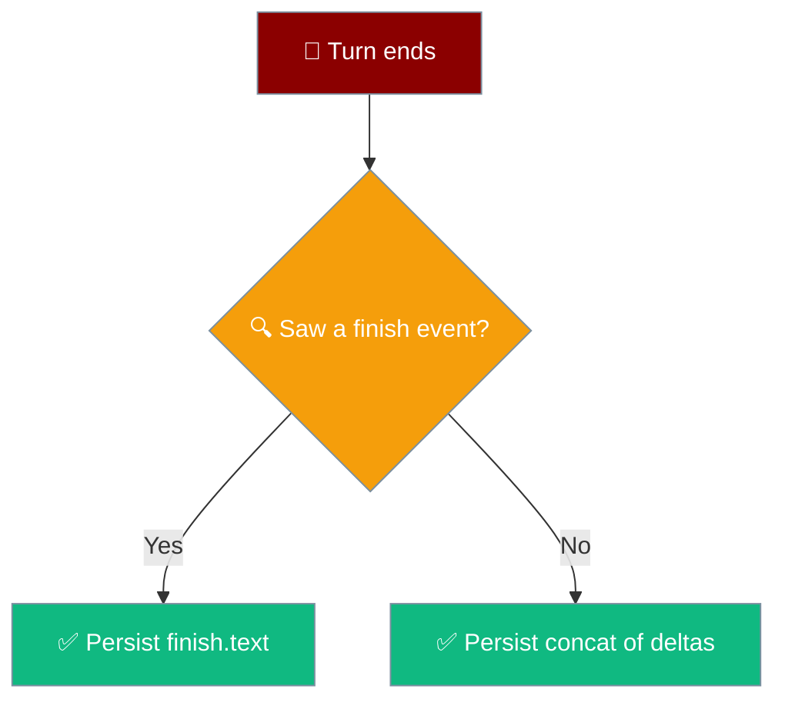
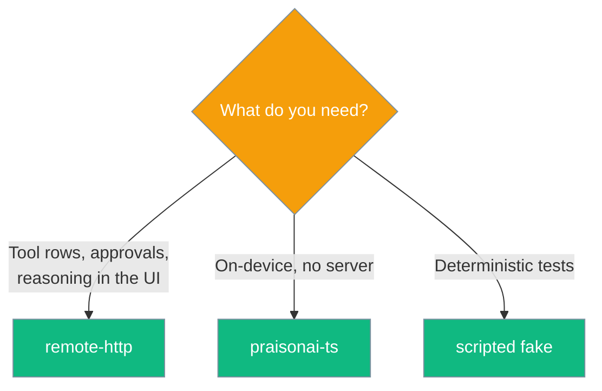

The mobile app picks an engine from a factory that is handed the store engines write through, so the in-process engine records a turn to the same session the chat list reads. Everything above the seam is written against `AgentEnginePort` and nothing else.

```ts
import { createRemoteHttpEngine } from "praisonai-mobile/engines/remote-http";

const engine = createRemoteHttpEngine({ baseUrl: "http://127.0.0.1:8765", http });
for await (const event of engine.run(request, signal)) {
  if (event.type === "delta") process.stdout.write(event.text);
}
```





## Quick Start

<Steps>
<Step title="RegistryDeps requires a persistence">
`persistence` is required. It is passed only into the in-process engine's factory.

```ts
export interface RegistryDeps {
  readonly settings: SettingsFacade;
  readonly http: HttpPort;
  readonly createInProcess?: (persistence: RunPersistence) => AgentEnginePort | Promise<AgentEnginePort>;
  readonly persistence: RunPersistence; // required
}
```
</Step>

<Step title="enginesFor passes persistence to the in-process engine only">
The remote engine deliberately does not receive it.

```ts
export function enginesFor(deps: RegistryDeps): readonly EngineChoice[] {
  const choices: EngineChoice[] = [
    { id: ENGINE_REMOTE_HTTP, create: () => createRemoteHttpEngine({ ... }) },
  ];
  if (deps.createInProcess !== undefined) {
    const build = deps.createInProcess;
    choices.push({ id: ENGINE_PRAISONAI_TS, create: () => build(deps.persistence) });
  }
  return choices;
}
```
</Step>

<Step title="Build engines from the session">
`AppDeps.engines` is a factory `(persistence) => EngineChoice[]`. The composition root builds it from the session, so an engine cannot exist without the store it writes through.
</Step>

<Step title="Run a turn">
```ts
for await (const event of engine.run(request, signal)) {
  console.log(event.type);
}
```
`run` returns an `AsyncIterable`, so `for await` gives free backpressure and one cancellation path.
</Step>

<Step title="Answer an approval">
```ts
const recorded = await engine.decide(approvalId, "allow");
```
Approval is a reverse channel while the stream is live, so it is a method, not an event.
</Step>

<Step title="Surface refused frames with onIgnored">
```ts
const engine = createRemoteHttpEngine({
  baseUrl,
  http,
  onIgnored: (reason, detail) => sink.note(reason, detail),
});
```
Without `onIgnored`, decoder refusals are invisible — a truncated answer reported as a clean success. The composition root wires it via the `DropSink`; anyone hand-constructing the engine must pass it explicitly.
</Step>
</Steps>

---

## Options On remote-http

`RemoteHttpOptions` carries the request target and the refusal callback.

| Option | Type | Purpose |
|--------|------|---------|
| `baseUrl` | `string` | Engine base URL, no trailing slash. |
| `http` | `HttpPort` | All I/O goes through this port — no `fetch` in the engine. |
| `token` | `string` | Optional bearer token; loopback is unauthenticated, off-device must not be. |
| `onIgnored` | `(reason, detail) => void` | Called for every frame the decoder **refused**. Wired to `dropSink.note` by the composition root. |
| `id` | `string` | Optional engine id; defaults to `"remote-http"`. |

`ControllerDeps.dropSink` is the other end of the same seam: what the engine refuses becomes a dropped row on the turn it belonged to. See [Dropped Events](/features/mobile/dropped-events).

---

## Who Persists

Two engines, two owners of the write.

| Engine | Receives persistence | Who owns the write |
|--------|----------------------|--------------------|
| In-process (`praisonai-ts`) | **Yes** | The mobile session on this device |
| Remote HTTP (`remote-http`) | No | The server it talks to |

The remote engine deliberately does not take persistence: the server it connects to owns the write and is the only thing that can report authoritative indices for its own store.

<Note>
A picker omits an engine whose prerequisites are absent rather than offering it and then failing. `createInProcess` is optional — when it is not supplied, only the remote engine is offered.
</Note>

---

## Where a Completed Turn Is Written

Each engine owns its own write, and reports `end.userIndex` from the store it wrote to.

| Engine | Writes the turn to | Reports `end.userIndex` from |
|--------|--------------------|------------------------------|
| `praisonai-ts` (in-process) | The mobile app's session store, via the `RunPersistence` handed in at construction | The store it just wrote to |
| `remote-http` | The desktop/remote server it POSTs the run to | The server's own store (reported over the protocol) |

The in-process engine records the turn and reports the indices it actually wrote, which is what makes `end.userIndex` real:

```ts
const indices = await options.persistence.record(request, answer);
yield {
  type: "end",
  msgId,
  userIndex: indices?.userIndex ?? null,
  assistantIndex: indices?.assistantIndex ?? null,
  versions: indices?.versions ?? 1,
  active: indices?.active ?? 0,
};
```

<Warning>
A turn answered by the default `remote-http` engine does **not** currently mirror into the local mobile session. The remote server owns that transcript and is the only thing that can report authoritative indices for its own store. Local mirroring is tracked separately.
</Warning>

---

## What a Recorded Turn Returns

`session.record(prompt, answer)` writes the user message and the answer together, then returns the indices into the persisted array.

| Field | Meaning |
|-------|---------|
| `userIndex` | Position of the user message on disk |
| `assistantIndex` | Position of the answer on disk |
| `versions` | Number of stored versions |
| `active` | Which version is shown |

A `null` return means the save failed — the turn is on screen but not on disk.

<Warning>
The user message is written **when the turn succeeds**, not when the user pressed send. A turn that never completes must not leave a dangling user message with no reply under it.
</Warning>

---

## Persisted Answer Text

The in-process engine (`praisonai-ts`) writes exactly one string as the assistant answer per turn. Which string depends on whether the turn produced a `finish` event.

| Turn saw a `finish` event? | What gets persisted |
|----------------------------|---------------------|
| Yes | `finish.text` — the streamed deltas are discarded for the write |
| No  | Concatenation of every `delta.text` in order |



<Warning>
`finish.text` **replaces** the streamed accumulation — it does not append to it. A provider that both streams deltas and then emits `finish` with the full text writes the answer **once**, not twice. Appending instead leaves the on-screen answer looking correct (the screen is built from deltas) while the persisted transcript contains the answer twice — visible only when the user reopens the chat.
</Warning>

<Note>
`finish` also carries the final text for a **non-streaming** provider that emits no deltas at all. Trusting only the streamed accumulation would persist an empty string in that case.
</Note>

Why replace rather than append?

- Upstream may **normalise** the final text — a typo fix or whitespace tidy-up. Persisting the concatenation would store text the model did not finally say.
- A non-streaming provider emits **no** deltas, only `finish`. Persisting only the accumulation would drop the answer entirely.

```ts
if (event.type === "text") {
  if (event.delta === "") continue;
  answer += event.delta;                 // accumulate while streaming
  yield { type: "delta", msgId, text: event.delta };
} else if (event.type === "finish") {
  answer = event.text;                   // REPLACES the accumulation
}
```

<Info>
This rule applies to the in-process engine's own write. The `remote-http` engine does not persist locally at all — the server it talks to owns that write and reports its own indices. See [Who Persists](#who-persists) and the [Protocol](/features/mobile/protocol) for the `finish` and `end` event shapes.
</Info>

---

## The Port

`AgentEnginePort` is the entire agent-framework coupling.

| Member | Type | Purpose |
|--------|------|---------|
| `id` | `string` | Stable id, written into persisted chats. |
| `protocolVersion` | `number` | Checked once at boot; a mismatch fails boot with a name. |
| `capabilities` | `EngineCapabilities` | What the engine can **report**, checked before the first token. |
| `run(request, signal)` | `AsyncIterable<RunEvent>` | One turn: `start` first, exactly one terminal event last. |
| `decide(approvalId, choice)` | `Promise<boolean>` | Answer an approval; `false` for an unknown or decided id. |
| `cancel(runId)` | `Promise<boolean>` | Stop a run; `false` when it was not live. |
| `dispose()` | `Promise<void>` | Release clients and sockets. Idempotent. |

---

## The Three Engines

Three implementations pass the same conformance suite, which is what makes "swappable" a fact.

| Engine | Where | Talks to |
|--------|-------|----------|
| `praisonai-ts` | `engines/src/praisonai-ts` | The agent loop, in-process on the device. |
| `remote-http` | `engines/src/remote-http` | A PraisonAI engine over HTTP + SSE. |
| scripted fake | `testing/` | Nothing — replays canned events for tests. |

---

## Conformance

Passing `engines/src/conformance.ts` **is** the definition of implementing the seam.

```ts
export interface EngineHarness {
  readonly name: string;
  create(scenario: ScenarioName): Promise<AgentEnginePort>;
  readonly unsupported?: Partial<Record<ScenarioName, string>>;
}
```

The suite also asserts the negative direction: an engine declaring `approvals: false` must never emit an `approval_request`. Every unsupported scenario is printed on each run, so a contract that quietly shrinks is visible rather than silently green.

<Info>
`praisonai-ts` declares 5 of 11 events unsupported because upstream `Agent.streamEvents()` emits only `text` / `finish` / `error`. See `src/praisonai-mobile/docs/gaps.md`.
</Info>

---

## When To Pick Which Engine



---

## Common Patterns

An engine whose prerequisites are absent is omitted, not offered and then failed.

```ts
// createInProcess is optional: without it, only remote-http is listed.
if (deps.createInProcess !== undefined) {
  choices.push({ id: ENGINE_PRAISONAI_TS, create: () => build(deps.persistence) });
}
```

`selectEngine` names the available engines when an id is unknown, so a missing engine is an honest message rather than a crash.

```ts
const outcome = await selectEngine("nope", choices);
// outcome.detail names what IS available, e.g. "remote-http, praisonai-ts"
```

---

## Best Practices

<AccordionGroup>
<Accordion title="Never bypass the factory">
Obtaining the engine list requires the persistence argument. Do not construct engines directly — the type makes the wiring impossible to forget.
</Accordion>

<Accordion title="Treat persistence as required, not optional">
`RegistryDeps.persistence` has no default. The in-process engine's `end.userIndex` is only real because it records through this store — without it, the turn is on screen and not on disk.
</Accordion>

<Accordion title="Do not persist remote-http into the local session">
The remote server owns its own store and reports its own indices. Writing a second copy locally reintroduces divergence between screen position and disk position.
</Accordion>

<Accordion title="Do not switch chats from the request">
The session already knows which conversation is open. Taking direction from the run request would let an in-flight turn write into whichever chat the user has since navigated to.
</Accordion>

<Accordion title="Read null as 'not on disk'">
When `record` returns null the write failed. Null travels to the UI as "do not offer Fork or Delete", because those affordances would address a message that does not exist. Index `0` is valid, so a falsy check is a trap.
</Accordion>

<Accordion title="Read capabilities before rendering">
`capabilities` is a property, not a method, so the UI decides what to render before the first token arrives.
</Accordion>

<Accordion title="Never fake an unsupported scenario">
Declaring a gap in the `unsupported` map is honest; faking it hides a defect the conformance suite exists to catch.
</Accordion>

<Accordion title="Return false, never a lie">
`decide` and `cancel` return `false` for an unknown id — reporting success for an id the engine never issued is a lie the UI cannot detect.
</Accordion>
</AccordionGroup>

---

## Related

<CardGroup cols={2}>
<Card title="Architecture" icon="sitemap" href="/features/mobile/architecture">
  Boot order and the engines factory shape.
</Card>
<Card title="Overview" icon="mobile" href="/features/mobile/overview">
  Native navigation and the retained chat screen.
</Card>
<Card title="Capabilities & Gaps" icon="list-check" href="/features/mobile/capabilities-and-gaps">
  What each engine can and cannot report.
</Card>
<Card title="Shell & Adapters" icon="mobile-screen" href="/features/mobile/shell-and-adapters">
  The keyboard snapshot and the pinch-zoom guard.
</Card>
<Card title="Protocol" icon="network-wired" href="/features/mobile/protocol">
The 11 events every engine speaks.
</Card>
<Card title="Dropped Events" icon="triangle-exclamation" href="/features/mobile/dropped-events">
Where a refused frame lands via onIgnored.
</Card>
</CardGroup>
