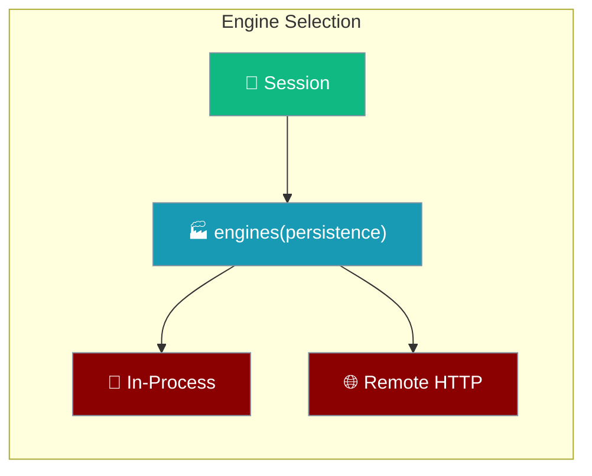

The mobile app picks an engine from a factory that is handed the store engines write through, so the in-process engine records a turn to the same session the chat list reads.

## Quick Start

<Steps>
<Step title="Build engines from the session">
`AppDeps.engines` is a factory `(persistence) => EngineChoice[]`. The composition root builds it from the session, so an engine cannot exist without the store it writes through.
</Step>

<Step title="Let the in-process engine record the turn">
`enginesFor({ ..., persistence })` passes the session's persistence only to the in-process engine via `createInProcess(persistence)`. When a turn succeeds, the engine records it and reports the indices it actually wrote.
</Step>
</Steps>

---

## Who persists

Two engines, two owners of the write.

| Engine | Receives persistence | Who owns the write |
|--------|----------------------|--------------------|
| In-process (`praisonai-ts`) | **Yes** | The mobile session on this device |
| Remote HTTP (`remote-http`) | No | The server it talks to |

The remote engine deliberately does not take persistence: the server it connects to owns the write and is the only thing that can report authoritative indices for its own store.

<Note>
A picker omits an engine whose prerequisites are absent rather than offering it and then failing. `createInProcess` is optional — when it is not supplied, only the remote engine is offered.
</Note>

---

## What a recorded turn returns

`session.record(prompt, answer)` writes the user message and the answer together, then returns the indices into the persisted array.

| Field | Meaning |
|-------|---------|
| `userIndex` | Position of the user message on disk |
| `assistantIndex` | Position of the answer on disk |
| `versions` | Number of stored versions |
| `active` | Which version is shown |

A `null` return means the save failed — the turn is on screen but not on disk.

<Warning>
The user message is written **when the turn succeeds**, not when the user pressed send. A turn that never completes must not leave a dangling user message with no reply under it.
</Warning>

---

## Best Practices

<AccordionGroup>
<Accordion title="Never bypass the factory">
Obtaining the engine list requires the persistence argument. Do not construct engines directly — the type makes the wiring impossible to forget, which is exactly why an in-process turn was never saved before this landed.
</Accordion>

<Accordion title="Do not switch chats from the request">
The session already knows which conversation is open. Taking direction from the run request would let an in-flight turn write into whichever chat the user has since navigated to.
</Accordion>

<Accordion title="Read the reported index">
`end.userIndex` is produced by whatever actually did the write. Treat `null` as "not on disk" and withhold Fork and Delete — index `0` is valid.
</Accordion>
</AccordionGroup>

---

## Related

<CardGroup cols={2}>
<Card title="Architecture" icon="layer-group" href="/features/mobile/architecture">
The named persistence adapter and the route→screen seam.
</Card>
<Card title="Overview" icon="mobile" href="/features/mobile/overview">
Native navigation and the retained chat screen.
</Card>
</CardGroup>
