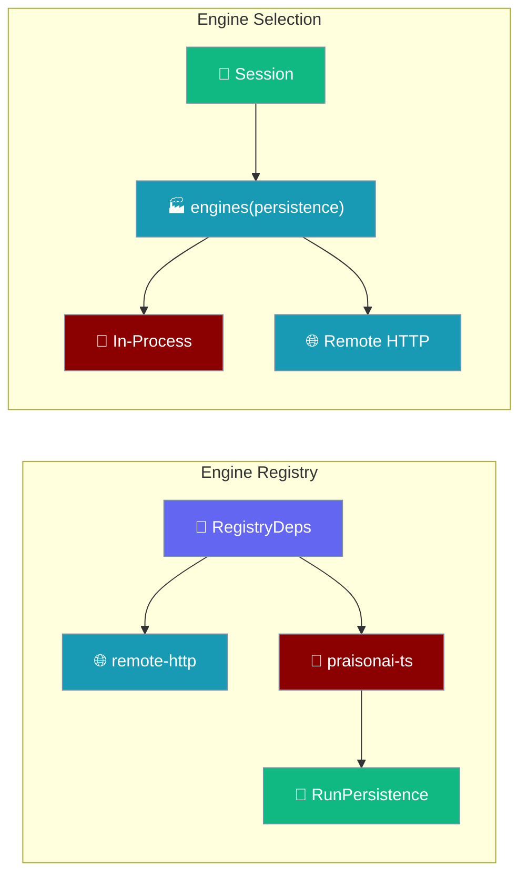
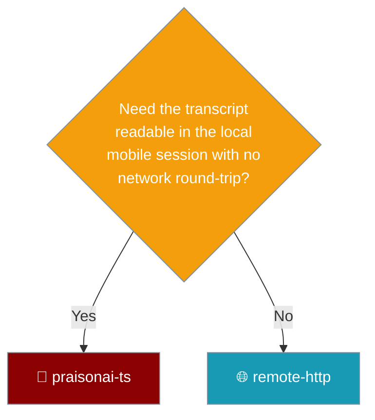

The mobile app offers two engines, and only the in-process one writes a completed turn into the app's local session. The engine list is built from the session via a factory, so the in-process engine cannot exist without the store it writes through.



## Quick Start

<Steps>
<Step title="RegistryDeps requires a persistence">
`persistence` is required. It is passed only into the in-process engine's factory.

```ts
export interface RegistryDeps {
  readonly settings: SettingsFacade;
  readonly http: HttpPort;
  readonly createInProcess?: (persistence: RunPersistence) => AgentEnginePort | Promise<AgentEnginePort>;
  readonly persistence: RunPersistence; // required
}
```
</Step>

<Step title="enginesFor passes persistence to the in-process engine only">
The remote engine deliberately does not receive it.

```ts
export function enginesFor(deps: RegistryDeps): readonly EngineChoice[] {
  const choices: EngineChoice[] = [
    { id: ENGINE_REMOTE_HTTP, create: () => createRemoteHttpEngine({ ... }) },
  ];
  if (deps.createInProcess !== undefined) {
    const build = deps.createInProcess;
    choices.push({ id: ENGINE_PRAISONAI_TS, create: () => build(deps.persistence) });
  }
  return choices;
}
```
</Step>

<Step title="Build engines from the session">
`AppDeps.engines` is a factory `(persistence) => EngineChoice[]`. The composition root builds it from the session, so an engine cannot exist without the store it writes through.
</Step>
</Steps>

---

## Who Persists

Two engines, two owners of the write.

| Engine | Receives persistence | Who owns the write |
|--------|----------------------|--------------------|
| In-process (`praisonai-ts`) | **Yes** | The mobile session on this device |
| Remote HTTP (`remote-http`) | No | The server it talks to |

The remote engine deliberately does not take persistence: the server it connects to owns the write and is the only thing that can report authoritative indices for its own store.

<Note>
A picker omits an engine whose prerequisites are absent rather than offering it and then failing. `createInProcess` is optional — when it is not supplied, only the remote engine is offered.
</Note>

---

## Where a Completed Turn Is Written

Each engine owns its own write, and reports `end.userIndex` from the store it wrote to.

| Engine | Writes the turn to | Reports `end.userIndex` from |
|--------|--------------------|------------------------------|
| `praisonai-ts` (in-process) | The mobile app's session store, via the `RunPersistence` handed in at construction | The store it just wrote to |
| `remote-http` | The desktop/remote server it POSTs the run to | The server's own store (reported over the protocol) |

The in-process engine records the turn and reports the indices it actually wrote, which is what makes `end.userIndex` real:

```ts
const indices = await options.persistence.record(request, answer);
yield {
  type: "end",
  msgId,
  userIndex: indices?.userIndex ?? null,
  assistantIndex: indices?.assistantIndex ?? null,
  versions: indices?.versions ?? 1,
  active: indices?.active ?? 0,
};
```

<Warning>
A turn answered by the default `remote-http` engine does **not** currently mirror into the local mobile session. The remote server owns that transcript and is the only thing that can report authoritative indices for its own store. Local mirroring is tracked separately.
</Warning>

---

## What a Recorded Turn Returns

`session.record(prompt, answer)` writes the user message and the answer together, then returns the indices into the persisted array.

| Field | Meaning |
|-------|---------|
| `userIndex` | Position of the user message on disk |
| `assistantIndex` | Position of the answer on disk |
| `versions` | Number of stored versions |
| `active` | Which version is shown |

A `null` return means the save failed — the turn is on screen but not on disk.

<Warning>
The user message is written **when the turn succeeds**, not when the user pressed send. A turn that never completes must not leave a dangling user message with no reply under it.
</Warning>

---

## When to Pick Which Engine

The deciding question is whether the transcript must be readable locally without a network round-trip.



---

## Common Patterns

An engine whose prerequisites are absent is omitted, not offered and then failed.

```ts
// createInProcess is optional: without it, only remote-http is listed.
if (deps.createInProcess !== undefined) {
  choices.push({ id: ENGINE_PRAISONAI_TS, create: () => build(deps.persistence) });
}
```

`selectEngine` names the available engines when an id is unknown, so a missing engine is an honest message rather than a crash.

```ts
const outcome = await selectEngine("nope", choices);
// outcome.detail names what IS available, e.g. "remote-http, praisonai-ts"
```

---

## Best Practices

<AccordionGroup>
<Accordion title="Never bypass the factory">
Obtaining the engine list requires the persistence argument. Do not construct engines directly — the type makes the wiring impossible to forget.
</Accordion>

<Accordion title="Treat persistence as required, not optional">
`RegistryDeps.persistence` has no default. The in-process engine's `end.userIndex` is only real because it records through this store — without it, the turn is on screen and not on disk.
</Accordion>

<Accordion title="Do not persist remote-http into the local session">
The remote server owns its own store and reports its own indices. Writing a second copy locally reintroduces divergence between screen position and disk position.
</Accordion>

<Accordion title="Do not switch chats from the request">
The session already knows which conversation is open. Taking direction from the run request would let an in-flight turn write into whichever chat the user has since navigated to.
</Accordion>

<Accordion title="Read null as 'not on disk'">
When `record` returns null the write failed. Null travels to the UI as "do not offer Fork or Delete", because those affordances would address a message that does not exist. Index `0` is valid, so a falsy check is a trap.
</Accordion>
</AccordionGroup>

---

## Related

<CardGroup cols={2}>
<Card title="Architecture" icon="sitemap" href="/features/mobile/architecture">
  Boot order and the engines factory shape.
</Card>
<Card title="Overview" icon="mobile" href="/features/mobile/overview">
  Native navigation and the retained chat screen.
</Card>
<Card title="Capabilities & Gaps" icon="list-check" href="/features/mobile/capabilities-and-gaps">
  What each engine can and cannot report.
</Card>
<Card title="Shell & Adapters" icon="mobile-screen" href="/features/mobile/shell-and-adapters">
  The keyboard snapshot and the pinch-zoom guard.
</Card>
</CardGroup>
