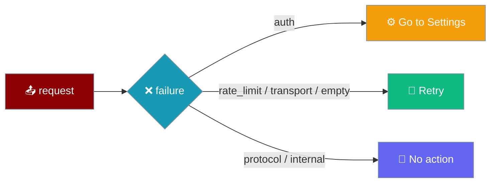

Every turn that fails ends on a real error row carrying the reason and one recovery affordance. The row's `kind` — never its prose message — chooses whether the user is sent to Settings, offered Retry, or shown no action at all.

```ts
import { recoveryFor } from "praisonai-mobile/ui/transcript/view-model";

recoveryFor("auth");      // "settings" — the credential was rejected
recoveryFor("transport"); // "retry"    — the stream broke
recoveryFor("protocol");  // "none"      — nothing the user can do
```



## Quick Start

<Steps>
<Step title="See a 401 (auth)">
An expired or wrong API key returns `kind: "auth"`. The error row offers **Go to Settings**, because a retry with the same rejected credential just fails again.

```ts
recoveryFor("auth"); // "settings"
```
</Step>

<Step title="See a 502 (transport)">
A dead socket or a proxy returning an HTML error page classifies as `kind: "transport"`. The error row offers **Retry** — the engine may be fine and the next attempt may reach it.

```ts
recoveryFor("transport"); // "retry"
```
</Step>
</Steps>

---

## The Recovery Mapping

`recoveryFor(kind)` is exhaustive over `ErrorKind`. Every kind lands in exactly one of three affordances.

| `ErrorKind` | Meaning | `recovery` |
|-------------|---------|------------|
| `auth` | The provider rejected the credential (HTTP **401 / 403**). | `settings` |
| `rate_limit` | Too many requests (HTTP **429**); retrying later is meaningful. | `retry` |
| `transport` | The stream broke (HTTP **502**, a dead socket); the engine may be fine. | `retry` |
| `empty` | The engine produced no output at all. | `retry` |
| `protocol` | Client and engine disagree about the contract. | `none` |
| `internal` | Anything else, including an unrecognised kind. | `none` |

<Note>
The message text is prose from a provider and may say anything. The recovery button is chosen from `kind` alone, so a reworded provider error never silently loses its affordance.
</Note>

---

## Pre-first-token and mid-stream are unified

A failure before the first token now surfaces the same real reason as one mid-stream. Both reach the error row with their true `kind`.

`transcript.ts::apply()` promotes an `error` that arrives while the turn is still idle: it flips the turn to `streaming` and reprocesses the event, so the reason survives. Before this, every pre-first-token failure was dropped and re-labelled `kind: "empty"`, so a 401 and a dead socket rendered identically — and the `auth → settings` branch was unreachable.

```ts
// transcript.ts — an idle-state error is promoted, not dropped.
if (state.phase === "idle" && event.type === "error") {
  return apply({ ...state, phase: "streaming", msgId: event.msgId }, event);
}
```

The transcript-level promotion sits alongside a **controller-level** rule that fixes the same failure earlier. A pre-first-token failure now starts a fresh `turn` at the top of `runTurn`, so an error arriving without a `start` event is applied to the *new* turn rather than dropped as `wrong_msg_id` against the previous turn's `ended` state.

```ts
// controller.ts — every turn starts fresh, so an error with no start lands.
turn = initialTurn;
publish();
```

See [Dropped Events](/features/mobile/dropped-events#the-error-before-start-exception) for how this exception sits against the general before-`start` drop rule.

---

## Common Pitfalls

<AccordionGroup>
<Accordion title="The default baseUrl is the phone itself">
The default `baseUrl` is `127.0.0.1:8765`, which on a phone resolves to the phone — not your dev machine. With nothing listening there, the very first turn fails with a refused connection. Set the engine address in **Settings** before the first send.
</Accordion>

<Accordion title="Expired credentials vs. offline">
An expired key is `auth` and routes to Settings; being offline is `transport` and routes to Retry. They are distinct kinds precisely so the app does not tell an offline user to fix credentials that are fine.
</Accordion>

<Accordion title="A 403 is auth, not transport">
A `403` — what a scoped key or a proxy returns — is `kind: "auth"`, so it sends the user to credentials rather than offering an endless Retry.
</Accordion>

<Accordion title="Before this fix, the second-turn failure was silent">
Turn 1 answered, turn 2 got a 401, and the screen still showed turn 1's answer with turn 1's `end` outcome. The composer cleared on Send, but the user got no error row, no auth prompt, and no hint a run was attempted. Silent, repeatable, permanent.

If you integrate against pre-4572 mobile builds, expect the failure to appear only *after* the next successful turn — carrying a "1 event could not be read" row blaming itself for its predecessor. The default `baseUrl` is `127.0.0.1:8765` — the phone itself — so "engine unreachable" is the common case, not an exotic one.
</Accordion>

<Accordion title="Before this fix, HTTP errors from the web adapter were invisible">
`createWebHttp` hard-coded `status: 200`, so a 401 / 403 / 429 / 502 was reported as success. The engine reads the status to pick `auth` vs `transport`, so the whole recovery distinction — go to settings, or retry — was fed a constant, and both the `auth → settings` and `transport → retry` branches were unreachable through the web adapter. The tests that covered the distinction drove the fake http, not the adapter, so the one place the real status is read was unguarded. Fixed in [#4578](https://github.com/MervinPraison/PraisonAI/pull/4578); the regression now reports the received status across `[200, 204, 401, 403, 429, 500, 502]`.
</Accordion>

<Accordion title="Send empties the composer">
A second tap on an emptied composer is a no-op — not a re-send of the previous question. Before [#4578](https://github.com/MervinPraison/PraisonAI/pull/4578), the sent text stayed in the box; a user could double-tap Send, re-submit the same question, and pay twice with no on-screen sign it happened.
</Accordion>
</AccordionGroup>

---

## Related

<CardGroup cols={2}>
<Card title="Approvals & Cancellation" icon="hand-back-fist" href="/features/mobile/approvals-and-cancellation">
  Stopping a run, and what a refused stop does.
</Card>
<Card title="Dropped Events" icon="triangle-exclamation" href="/features/mobile/dropped-events">
  The before-`start` drop rule and the `error` exception.
</Card>
<Card title="Boot Failures" icon="bug" href="/features/mobile/boot-failures">
  Failures that never reach a turn at all.
</Card>
<Card title="Protocol" icon="network-wired" href="/features/mobile/protocol">
  The `error` event and its `kind` field on the wire.
</Card>
<Card title="Chat Recovery" icon="database" href="/features/mobile/chat-recovery">
  A corrupt chat file surfaced without hiding the rest.
</Card>
</CardGroup>
