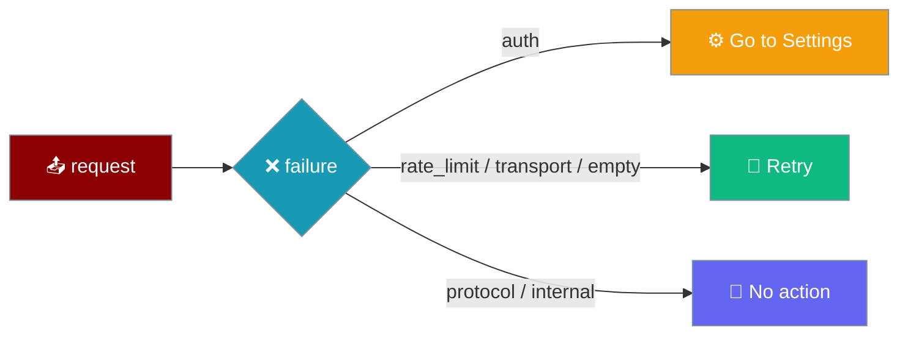

Every turn that fails ends on a real error row carrying the reason and one recovery affordance. The row's `kind` — never its prose message — chooses whether the user is sent to Settings, offered Retry, or shown no action at all.

```ts
import { recoveryFor } from "praisonai-mobile/ui/transcript/view-model";

recoveryFor("auth");      // "settings" — the credential was rejected
recoveryFor("transport"); // "retry"    — the stream broke
recoveryFor("protocol");  // "none"      — nothing the user can do
```



A `transport` failure caused by an unreachable engine on a phone is also recovered from **Settings** — edit `baseUrl` — even though the classifier routes `transport` to Retry. Retry against the same unreachable address just re-fails; Settings is where the address lives. See [Settings Screen](/features/mobile/settings-screen).

## Quick Start

<Steps>
<Step title="See a 401 (auth)">
An expired or wrong API key returns `kind: "auth"`. The error row offers **Go to Settings**, because a retry with the same rejected credential just fails again.

```ts
recoveryFor("auth"); // "settings"
```
</Step>

<Step title="See a 500 (transport)">
A plain HTTP **500** — the most common provider failure — classifies as `kind: "transport"`, along with the rest of the 500–504 range. The error row offers **Retry** — the engine may be fine and the next attempt may reach it.

```ts
recoveryFor("transport"); // "retry"
```
</Step>
</Steps>

---

## The Recovery Mapping

`recoveryFor(kind)` is exhaustive over `ErrorKind`. Every kind lands in exactly one of three affordances.

| `ErrorKind` | Meaning | `recovery` |
|-------------|---------|------------|
| `auth` | The provider rejected the credential (HTTP **401 / 403**). | `settings` |
| `rate_limit` | Too many requests (HTTP **429**); retrying later is meaningful. | `retry` |
| `transport` | The stream broke (HTTP **500–504**, a dead socket); the engine may be fine. | `retry` |
| `empty` | The engine produced no output at all. | `retry` |
| `protocol` | Client and engine disagree about the contract. | `none` |
| `internal` | Anything else, including a 4xx client error that is **not** `auth`/`rate_limit` (e.g. **400 / 422**) and any unrecognised kind. 4xx is **not** transport. | `none` |

<Note>
The message text is prose from a provider and may say anything. The recovery button is chosen from `kind` alone, so a reworded provider error never silently loses its affordance.
</Note>

<Note>
**A local list-load failure on the `chats` route is a separate class from these pipeline errors.** It is neither an `ErrorKind` nor a `BootResult` — it is a caught rejection inside the route handler that renders `strings.crashed` in place of the chat list. There is no button: recovery is to *back out of the route* and keep using the conversation you were in. Pinned by `"a storage failure while the chat list loads stays LOCAL, not fatal"`. See [History & Reopen → When the list load itself fails](/features/mobile/history-and-reopen#when-the-list-load-itself-fails).
</Note>

<Info>
The in-process engine now **ships** as a lazy chunk. Two failure modes both surface as an ordinary recoverable `error` event, so the standard Retry affordance applies to each: (1) the engine chunk fails to **fetch** — flaky connection, hashed file the page no longer matches — caught by the `loadPraisonAgent` guard and pinned by `"the in-process engine, when its chunk cannot load, fails RECOVERABLY"` in `app/src/main.test.ts`; and (2) the chunk loads but the first turn reaches the model layer with **no API-key setting** and fails there. Neither is a crash. See [Engines → The known API-key gap](/features/mobile/engines#the-known-api-key-gap).
</Info>

<Note>
**An unreachable engine is caught at boot, not on the first message.** Since [PR #4672](https://github.com/MervinPraison/PraisonAI/pull/4672), a remote engine that is unreachable at launch no longer manifests as a mid-turn transport error on the first send. The boot-time health probe reports a retryable unreadiness, the app **still boots**, and the transcript already carries a warning notice (`booted.notReady`) — so the user can open Settings and correct the address before typing. If a support ticket says "a warning row appeared right after opening", that is the boot notice, not this mid-turn path. See [Boot Failures → An unreachable engine boots with a warning](/features/mobile/boot-failures#an-unreachable-engine-boots-with-a-warning).
</Note>

---

## Pre-first-token and mid-stream are unified

A failure before the first token now surfaces the same real reason as one mid-stream. Both reach the error row with their true `kind`.

`transcript.ts::apply()` promotes an `error` that arrives while the turn is still idle: it flips the turn to `streaming` and reprocesses the event, so the reason survives. Before this, every pre-first-token failure was dropped and re-labelled `kind: "empty"`, so a 401 and a dead socket rendered identically — and the `auth → settings` branch was unreachable.

```ts
// transcript.ts — an idle-state error is promoted, not dropped.
if (state.phase === "idle" && event.type === "error") {
  return apply({ ...state, phase: "streaming", msgId: event.msgId }, event);
}
```

The transcript-level promotion sits alongside a **controller-level** rule that fixes the same failure earlier. A pre-first-token failure now starts a fresh `turn` at the top of `runTurn`, so an error arriving without a `start` event is applied to the *new* turn rather than dropped as `wrong_msg_id` against the previous turn's `ended` state.

```ts
// controller.ts — every turn starts fresh, so an error with no start lands.
turn = initialTurn;
publish();
```

See [Dropped Events](/features/mobile/dropped-events#the-error-before-start-exception) for how this exception sits against the general before-`start` drop rule.

---

## Body and transport rules for cancel and approve POSTs

Status is only half the contract. `postOk` / `decide` / `cancel` in `engines/src/remote-http/engine.ts` also judge the **body** and survive a **thrown transport** — a 200 with a bad body is "a lie the UI cannot detect", so a Stop or an approval is confirmed only when the engine actually accepted it.

| Response to `/cancel` or `/approve` | `decide` / `cancel` returns |
|---|---|
| Non-200 status | `false` |
| 200 with `body.ok === true` | `true` |
| 200 with any other body — `{}`, `{ok: null}`, `{ok: 0}`, `{ok: "true"}`, `{error: "unknown run id"}`, `[]`, `null` | `false` |
| Transport threw (`ECONNRESET`, timeout, …) | `false` |

<Warning>
**A dropped connection is not a successful cancel.** A thrown transport on the way to `/cancel` or `/approve` reports `false`, never `true`. The worst failure the port contract names — a Stop button that confirms a cancellation that never happened — is closed by this. Pinned by `"a 200 whose body does not say ok:true is reported as refused"` and `"a cancel whose transport THREW is reported as refused"`.
</Warning>

<Note>
The pair keeps the rule honest: a 200 with `{"ok": true}` **must** still succeed, so the module cannot degenerate to "refuse everything". Pinned by `"a 200 with ok:true IS accepted -- the pair"`. The UX side of the same Stop button is described in [Approvals & Cancellation](/features/mobile/approvals-and-cancellation).
</Note>

---

## Tool rows in the transcript

A tool call renders as a single-line **preview** (the first line of `output`) plus a full `output` field kept for the expanded view. This is what keeps every `ls`, every stack trace, and every file read from breaking the transcript's row layout.

```ts
// view-model.ts — the preview is firstLine(output); output is retained whole.
preview: firstLine(output), // one line for the row
output,                     // the full text, for the expanded view
```

<Note>
A multi-line tool output previews as **one** line. Dropping `firstLine(output)` — showing the raw `output` in the row — lets a stack trace or a long `ls` blow out the row height. The full text stays in `output` for the expanded view. Pinned by `"a multi-line tool output previews as ONE line"`.
</Note>

A `tool_result` must **preserve** the arguments its matching `tool_call` recorded. A completed tool row is the record of what the tool ran with — and the same `args` are what an approval row showed the user before they allowed it. Wiping them to `{}` on completion means the user (and any future audit of the transcript) can no longer see what a finished tool actually did. An orphan `tool_result` — one with no matching `tool_call` — records `{}` rather than inventing arguments. Pinned by `"a tool_result keeps the arguments its tool_call recorded"` and `"a tool_result with no matching call records empty args rather than inventing them"`.

`reasoning` events accumulate — the visible thinking on screen is the concatenation of every `reasoning` chunk, in order. Assigning each chunk instead of appending it truncates the model's thinking to only its final fragment. Pinned by `"reasoning accumulates across chunks"`.

---

## A message that was never stored says so

When a turn ends without an `end.userIndex` — an offline send, a cancelled turn, or an engine error before persistence — the user row moves to `unstored` and shows a caveat under it:

> Not saved — this message is not in the stored conversation

The caveat is only ever on an `unstored` row. A live turn (`sent`) and a saved one (`stored`) carry no note — a warning on every message is a warning nobody reads. The same `isPersisted` predicate that suppresses Fork and Delete for an unsaved turn is what puts the caveat here, so the two can never disagree.

See [Transcript User Row → Three storage states](/features/mobile/transcript-user-row#three-storage-states).

---

## Common Pitfalls

<AccordionGroup>
<Accordion title="The default baseUrl is the phone itself">
The default `baseUrl` is `127.0.0.1:8765`, which on a phone resolves to the phone — not your dev machine. With nothing listening there, the boot-time probe cannot reach it. Since [PR #4672](https://github.com/MervinPraison/PraisonAI/pull/4672) the app still opens and shows a warning notice (`booted.notReady`) instead of failing on the first send — so the user can set the engine address in **Settings** before typing.

The full recovery loop needs no relaunch:

- **The field is editable and persists the change** (from [PR #4685](https://github.com/MervinPraison/PraisonAI/pull/4685)).
- **The correction takes effect immediately** — the next `/chat` and `/health` resolve the new `baseUrl`, because `enginesFor` reads it per request rather than capturing it at boot (from [PR #4694](https://github.com/MervinPraison/PraisonAI/pull/4694)).
- **A refused address is spoken back**, not silently reset — `settingRejected(label)` names the setting in an assertive alert, so a typo on the recovery screen no longer looks like the tap did not register.

See [Settings Screen → How a refusal is spoken](/features/mobile/settings-screen#how-a-refusal-is-spoken) and [Boot Failures → An unreachable engine boots with a warning](/features/mobile/boot-failures#an-unreachable-engine-boots-with-a-warning).
</Accordion>

<Accordion title="Expired credentials vs. offline">
An expired key is `auth` and routes to Settings; being offline is `transport` and routes to Retry. They are distinct kinds precisely so the app does not tell an offline user to fix credentials that are fine.
</Accordion>

<Accordion title="A 403 is auth, not transport">
A `403` — what a scoped key or a proxy returns — is `kind: "auth"`, so it sends the user to credentials rather than offering an endless Retry. The branch is **status-first**: `{status: 403, message: "nope"}` classifies as `auth` even when the message says nothing recognisable. Without the status branch, only prose containing the literal `"403"` or `"forbidden"` would be caught, and a provider whose message is silent would misclassify as `internal` and offer no route to Settings. `{status: 401}` behaves the same way. Pinned by `"a 403 is an auth failure even when its message says nothing useful"`.
</Accordion>

<Accordion title="Message-only auth classification: the `authentication` alternative">
When a provider error arrives **without a status** — a thrown SDK error, an unwrapped provider response — `classify` in `engines/src/praisonai-ts/classify.ts` falls back to a message regex. That regex holds **two independent** word-alternatives, and either one alone routes to Settings:

| Alternative | Example error string that matches |
|---|---|
| `invalid[ _-]?x?-?api[ _-]?key` | `"Invalid API key"`, `"invalid_x_api_key"` |
| `authentication` | `"authentication_error"`, `"Authentication Error"`, `"Authentication failed"` |

A bare `authentication_error` with no "invalid api key" phrase still classifies as `auth`, so the user is sent to Settings rather than to a Retry that fails again with the same rejected credential. Drop the `authentication` alternative and such an error misclassifies as `internal` with no route to Settings — the exact regression the source comment records as fixed. Pinned by `"anthropic auth, no key phrase"`, `"authentication, spelled out"`, and `"authentication failed"`.
</Accordion>

<Accordion title="HTTP 500 is transport (Retry offered)">
A plain HTTP `500` — the single most common provider failure — is `transport`, so the user is offered Retry. The boundary is `status >= 500`, pinned by tests over `[500, 501, 502, 503, 504]`. 502/503/504 were already transport; before this fix, exactly 500 fell through to `internal` and the user was told *"something went wrong"* with no recovery affordance. Pinned by `"an HTTP 500 is transport, so the UI still offers Retry"`.
</Accordion>

<Accordion title="A 4xx is not transport — Retry cannot help">
A `400` (bad request) or `422` (unprocessable) is `internal`, not `transport`, so no Retry is offered. Offering Retry for a malformed request or a revoked key is a promise the user can never make good on. The pair `[400, 422]` is asserted to never classify as transport, pinned by `"a 4xx is not transport, so Retry is not offered where it cannot help"`.
</Accordion>

<Accordion title="Before this fix, the second-turn failure was silent">
Turn 1 answered, turn 2 got a 401, and the screen still showed turn 1's answer with turn 1's `end` outcome. The composer cleared on Send, but the user got no error row, no auth prompt, and no hint a run was attempted. Silent, repeatable, permanent.

If you integrate against pre-4572 mobile builds, expect the failure to appear only *after* the next successful turn — carrying a "1 event could not be read" row blaming itself for its predecessor. The default `baseUrl` is `127.0.0.1:8765` — the phone itself — so "engine unreachable" is the common case, not an exotic one.
</Accordion>

<Accordion title="Before this fix, HTTP errors from the web adapter were invisible">
`createWebHttp` hard-coded `status: 200`, so a 401 / 403 / 429 / 502 was reported as success. The engine reads the status to pick `auth` vs `transport`, so the whole recovery distinction — go to settings, or retry — was fed a constant, and both the `auth → settings` and `transport → retry` branches were unreachable through the web adapter. The tests that covered the distinction drove the fake http, not the adapter, so the one place the real status is read was unguarded. Fixed in [#4578](https://github.com/MervinPraison/PraisonAI/pull/4578); the regression now reports the received status across `[200, 204, 401, 403, 429, 500, 502]`.
</Accordion>

<Accordion title="Before #4579, the engine's own POST responses ignored status too">
Even with the web adapter fixed, `postOk` inside `engines/src/remote-http/engine.ts` did not check the status it received — so `decide` and `cancel` returned `true` for a rejected credential (401), a rate-limited stop (429), or a proxy error (502). The `run` stream classified status correctly, but the approval and cancel POSTs did not. The two fixes together are what make the `auth → settings` / `transport → retry` mapping reachable for approval and cancel posts, not only for the streaming `run`. The regression `"a decision or cancel the engine did NOT accept is reported as refused"` iterates `[202, 400, 401, 403, 500, 502]` and asserts both `decide` and `cancel` return `false`.
</Accordion>

<Accordion title="Send empties the composer">
A second tap on an emptied composer is a no-op — not a re-send of the previous question. Before [#4578](https://github.com/MervinPraison/PraisonAI/pull/4578), the sent text stayed in the box; a user could double-tap Send, re-submit the same question, and pay twice with no on-screen sign it happened.
</Accordion>

<Accordion title="Overscroll does not switch off follow-the-stream">
On iOS, rubber-banding past the bottom of the transcript legitimately reports a negative `scrollTop` on the visual viewport. Distance-from-bottom is clamped with `Math.max(0, scrollTop)` before the comparison, so an overscroll counts as "at the bottom" and follow-the-stream stays engaged. Before [#4589](https://github.com/MervinPraison/PraisonAI/pull/4589), a negative `scrollTop` made the distance come out positive and follow-the-stream switched itself off mid-answer on every rubber-band — the exact behaviour the module exists to prevent. The paired guarantee is unchanged: a real scroll away from the bottom (`scrollHeight > clientHeight` with a non-negative `scrollTop`) is still reported and still stops the transcript following. Pinned by `"iOS rubber-banding past the bottom still counts as being at the bottom"` and `"a real scroll away from the bottom is still reported"` in `scroll.test.ts`.
</Accordion>
</AccordionGroup>

---

## Related

<CardGroup cols={2}>
<Card title="Approvals & Cancellation" icon="hand-back-fist" href="/features/mobile/approvals-and-cancellation">
  Stopping a run, and what a refused stop does.
</Card>
<Card title="Dropped Events" icon="triangle-exclamation" href="/features/mobile/dropped-events">
  The before-`start` drop rule and the `error` exception.
</Card>
<Card title="Boot Failures" icon="bug" href="/features/mobile/boot-failures">
  Failures that never reach a turn at all.
</Card>
<Card title="Protocol" icon="network-wired" href="/features/mobile/protocol">
  The `error` event and its `kind` field on the wire.
</Card>
<Card title="Chat Recovery" icon="database" href="/features/mobile/chat-recovery">
  A corrupt chat file surfaced without hiding the rest.
</Card>
</CardGroup>
