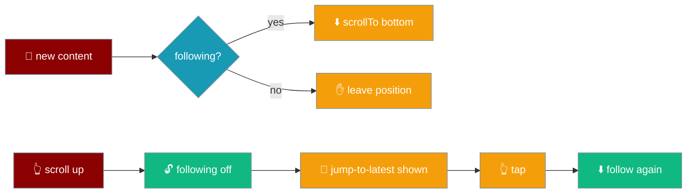
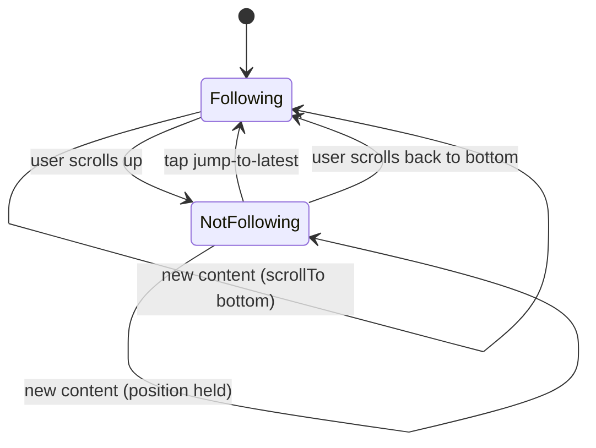

While an answer streams the transcript follows it to the bottom — but the moment you scroll up to re-read something, following stops and a jump-to-latest button appears instead of dragging you back down.



`transcript/scroll` is called on every publish and from the `scroll` DOM event — the follow decision is data, not a scroll handler.

## Quick Start

<Steps>
<Step title="Seed the follow state">
```ts
import { initialFollow } from "praisonai-mobile/ui/transcript/scroll";

let follow = initialFollow; // { sticky: true, pendingAutoScrolls: 0 }
```
The app starts following, so the first tokens paint at the bottom.
</Step>

<Step title="Update on scroll">
```ts
import { onScroll } from "praisonai-mobile/ui/transcript/scroll";

transcript.addEventListener("scroll", () => {
  follow = onScroll(follow, metricsOf());
  applyFollow();
});
```
Only a scroll event changes whether the view is following.
</Step>

<Step title="React to new content">
```ts
import { onContentChanged } from "praisonai-mobile/ui/transcript/scroll";

const outcome = onContentChanged(follow, metricsOf());
follow = outcome.state;
if (outcome.action.kind === "scrollTo") transcript.scrollTop = outcome.action.top;
```
New content **asks** to be scrolled to; whether it is depends on the follow state.
</Step>
</Steps>

<Note>
`ScrollMetrics` is the three numbers every platform reports — `scrollTop`, `scrollHeight`, `clientHeight` — so `scroll.ts` needs no DOM and the same rule serves a React Native port.
</Note>

---

## The follow state machine

Following is on by default. A user scroll off the bottom turns it off; a tap on jump-to-latest turns it back on.



| Function | Returns | When it runs |
|----------|---------|--------------|
| `onScroll(state, metrics)` | next `FollowState` | on the `scroll` DOM event |
| `onContentChanged(state, metrics)` | `{ state, action }` | on every publish |
| `jumpToLatest(state, metrics)` | `{ state, action }` | on a jump-to-latest tap |
| `shouldShowJumpToLatest(state)` | `boolean` | after any of the above, to toggle the button |

<Note>
"At the bottom" is a threshold (`FOLLOW_THRESHOLD_PX = 48`, roughly one line), not an equality. Fractional device pixels, a rubber-band overscroll, and a settling keyboard all mean the exact equality never holds on a real device, so following would never engage without the tolerance.
</Note>

---

## The affordance

The jump-to-latest button lives inside the chat screen, `hidden` by default. Its visibility is driven entirely by `shouldShowJumpToLatest(follow)`.

```ts
// main.ts — the affordance and its toggle.
const jumpLatest = doc.createElement("button");
jumpLatest.dataset["action"] = "jump-latest";
jumpLatest.hidden = true;

const applyFollow = (): void => {
  jumpLatest.hidden = !shouldShowJumpToLatest(follow);
};
```

`shouldShowJumpToLatest` shows the button exactly when following is off — the user has scrolled up off the bottom of a streaming transcript.

### The tap is a scroll decision, not an intent

The delegated `click` listener on `root` special-cases `jump-latest` **before** `intentFrom`, because it is a scroll decision, not an engine call — it never reaches the intent router.

```ts
// main.ts — root click listener.
const chain = chainOf(target);
if (chain.some((el) => el.dataset["action"] === "jump-latest")) {
  const outcome = jumpToLatest(follow, metricsOf());
  follow = outcome.state;
  if (outcome.action.kind === "scrollTo") transcript.scrollTop = outcome.action.top;
  applyFollow();
  event.preventDefault();
  return;
}
const intent = intentFrom(chain);
```

<Warning>
`jumpToLatest` is the one place following may be turned back **on** without a scroll event, because the user asked for it. Routing the tap through `intentFrom` instead would send it to `perform` — where there is no matching intent and the scroll would never happen.
</Warning>

---

## How It Works

The subtle part is that our own auto-scroll comes back as a `scroll` event a frame later. Counting outstanding auto-scrolls is what stops that correction — caught mid-flight at a position that is not yet the bottom — from being read as *"the user scrolled up"*.

```ts
// onScroll — one of ours coming back is consumed, following left alone.
if (state.pendingAutoScrolls > 0) {
  return { sticky: state.sticky, pendingAutoScrolls: state.pendingAutoScrolls - 1 };
}
return { sticky: isAtBottom(metrics, thresholdPx), pendingAutoScrolls: 0 };
```

| Rule | Behaviour |
|------|-----------|
| Only a scroll event changes following | New content never unsticks the view; it only asks to be scrolled to. |
| Auto-scrolls are counted | An emitted `scrollTo` increments `pendingAutoScrolls`; the answering scroll event decrements it, so our own correction is never mistaken for the user. |
| Already-at-the-bottom emits nothing | If `maxScrollTop === scrollTop`, `onContentChanged` returns `{ kind: "none" }` — a pending auto-scroll no scroll event answers would leave the counter forever undrained. |
| `scrollTo`, never `scrollBy` | A delta applied to a position that moved in between lands somewhere nobody chose. |

<Warning>
This is the bug every streaming chat UI ships first: you scroll up to read, the next token arrives, and the view yanks you back. It is unfixable from inside a scroll handler because the handler cannot tell *why* the position changed — which is why the decision is modelled explicitly here.
</Warning>

---

## Best Practices

<AccordionGroup>
<Accordion title="Let scroll.ts own the follow decision">
Do not read `scrollTop` and decide in the renderer. Feed `ScrollMetrics` to `onScroll` / `onContentChanged` and apply the returned action — the pure function is where the auto-scroll counting lives.
</Accordion>

<Accordion title="Count your own auto-scrolls">
Every `scrollTo` you apply comes back as a scroll event. Without `pendingAutoScrolls`, that echo unsticks the view and following works for two seconds, then stops for the rest of the answer.
</Accordion>

<Accordion title="Handle jump-to-latest before the intent walk">
It is a scroll decision, not an engine call. Special-case `data-action="jump-latest"` ahead of `intentFrom` so it never reaches the intent router.
</Accordion>

<Accordion title="Toggle the button from shouldShowJumpToLatest">
Bind the affordance's `hidden` to `!shouldShowJumpToLatest(follow)` after every follow update, so it appears exactly when following is off.
</Accordion>
</AccordionGroup>

---

## Related

<CardGroup cols={2}>
<Card title="Composer Behavior" icon="keyboard" href="/features/mobile/composer-behavior">
  Draft persistence, autosize, and the Enter policy.
</Card>
<Card title="History & Reopen" icon="clock-rotate-left" href="/features/mobile/history-and-reopen">
  Restored messages painted through the reconciler.
</Card>
<Card title="Overview" icon="mobile" href="/features/mobile/overview">
  The retained chat screen and its transcript.
</Card>
<Card title="Shell & Adapters" icon="mobile-button" href="/features/mobile/shell-and-adapters">
  Keyboard height and safe-area geometry.
</Card>
</CardGroup>
