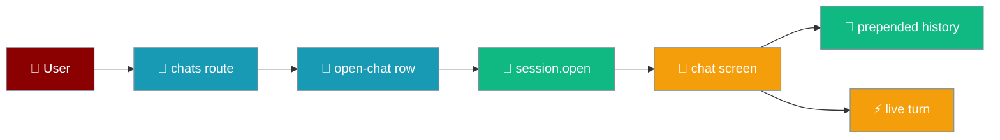
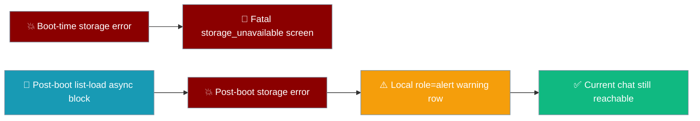
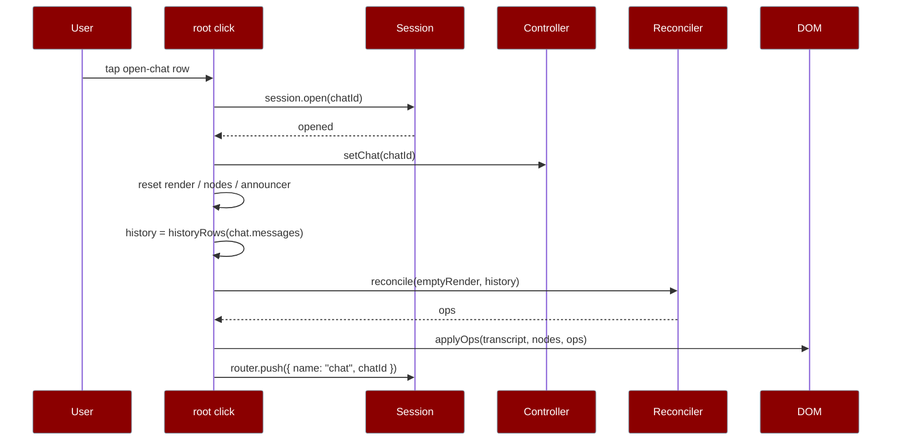
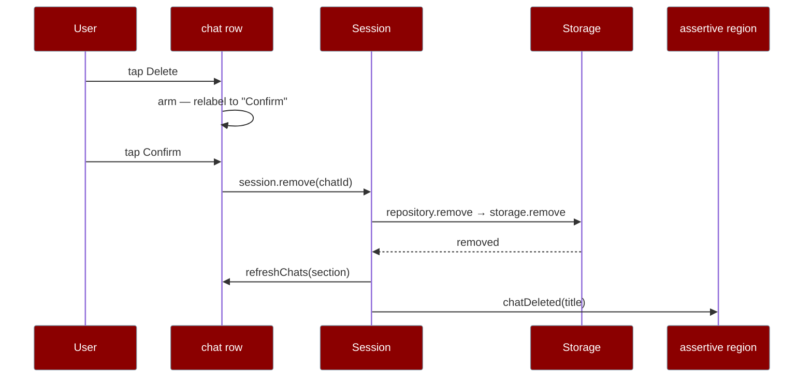
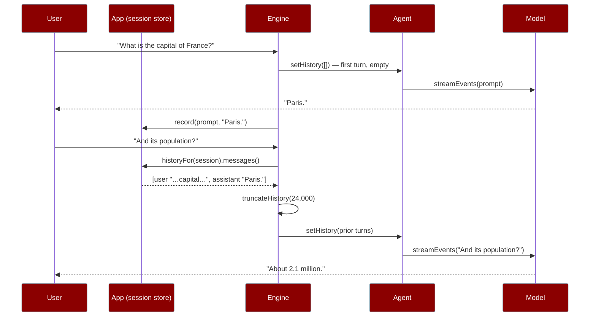
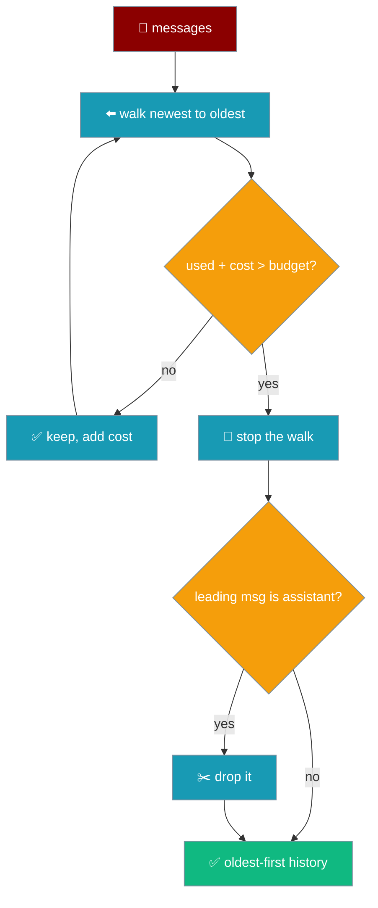

Tap **Chats**, pick a conversation, and it reopens with its stored messages painted back into the transcript as real rows — so the next turn you send lands below them, not above.



`session.list()` and `session.open()` are reachable from the running app for the first time — the chat list is the path back into a stored transcript.

## Quick Start

<Steps>
<Step title="Open the chat list">
The top bar carries a **Chats** button. Tapping it pushes the `chats` route and paints the `screen-chats` DOM from a fresh snapshot.

```ts
const [summaries, unreadable] = await Promise.all([
  app.session.list(),
  app.session.repository.listUnreadable(),
]);
```
Both lists, always together: a chat that failed to parse becomes a row rather than a conversation that silently vanished.
</Step>

<Step title="Build the rows">
```ts
import { buildChatList } from "praisonai-mobile/ui/chats/list-view-model";

const view = buildChatList(summaries, unreadableIds, Date.now());
```
Only rows where `kind === "chat"` carry `data-action="open-chat"` and `data-chat-id`. Unreadable rows are shown but inert.
</Step>

<Step title="Reopen a conversation">
Tapping an `open-chat` row calls `session.open(chatId)`, reloads the stored messages, and repaints them through the reconciler as real `Row`s.
</Step>
</Steps>

---

## The chats screen

`buildChatsScreen` renders one snapshot: an empty state, an all-unreadable warning, or a list of rows.

| View state | What renders | Source |
|------------|--------------|--------|
| `none` | `strings.chatsEmpty` — a new install, not data loss | `buildChatList` returns `state: "none"` |
| `all-unreadable` | `strings.chatsAllUnreadable(count)` warning row | every file failed to parse |
| `has-chats` | a `<div class="row-chat">` per row — an **Open** button and a **Delete** button | at least one chat read cleanly |

Each chat row is a `<div>` holding two controls: an **Open** button carrying the title and a muted `.chat-updated` span, and a **Delete** button on the right. The row is a `<div>` rather than a `<button>` because a `<button>` cannot legally contain another `<button>`.

```ts
// buildChatsScreen — only real chats carry the open-chat intent.
if (row.kind === "chat") {
  open.dataset["action"] = "open-chat";
  open.dataset["chatId"] = row.id;
  open.textContent = row.title;
  const updated = doc.createElement("span");
  updated.className = "chat-updated";
  updated.textContent = row.updatedLabel;
  open.append(updated);
  open.setAttribute(
    "aria-label",
    strings.chatUpdated(chatRowName(strings, row), row.updatedLabel),
  );
} else {
  open.setAttribute("aria-label", chatRowName(strings, row));
}
```

The open button's `aria-label` is `strings.chatUpdated(title, updatedLabel)` — one string builds both the visible time and the spoken time, so the two cannot drift. An unreadable row has no update time and keeps the bare `chatRowName`. The `updatedLabel` was computed on every visit by `buildChatList(summaries, unreadableIds, Date.now())` all along; the row is now what finally renders it, so a list sorted by recency shows why one "Untitled" sorts above another.

<Note>
An empty list and a list that is empty because everything in it failed to parse are **not** the same screen. The first is a new install; the second is data loss. `buildChatList` distinguishes them so the UI can too — see [Chat Recovery](/features/mobile/chat-recovery).
</Note>

### Unreadable rows are shown, not hidden

`repository.listUnreadable()` feeds the ids of every corrupt file into the same view. Those rows sort to the top and carry **no** `open-chat` intent — a tap on an unreadable row has nowhere useful to go, and `intents.ts` refuses a missing `chatId` anyway.

<Warning>
A UI that calls `list()` and stops turns a carefully reported failure back into a conversation that silently disappeared. The chats screen renders **both** lists so a corrupt file is a visible row, not a gap.
</Warning>

---

## When the list load itself fails

**What happens if storage fails while I'm on the chats screen?** You keep the conversation you were in. A failed chat list stays a *local* failure — the screen you were on stays reachable, and the back gesture keeps you in the conversation you were in.

`session.list()` and `repository.listUnreadable()` are async calls against `StoragePort`. The same throws `bootOrFail` catches at boot can be raised here too:

| Trigger | When it fires |
|---------|---------------|
| `SecurityError` | Site data is blocked — a WKWebView with storage disabled rejects the read. |
| `QuotaExceededError` | The device is out of room to persist. |

The list rebuild runs in a floating async block inside the route handler. A rejection there is **caught inside that block**, so it never escalates to the global crash handler `mount()` installs at step 0. Only the `chats` section repaints — the top bar, the current chat, and the composer stay live.

```ts
// main.ts — the caught list-rebuild block on the chats route.
(async () => {
  // ...rebuild the list...
  section.textContent = "";
  for (const child of [...fresh.children]) section.append(child as HTMLElement);
})().catch(() => {
  // A floating rejection here reaches the global crash handler and replaces
  // the WHOLE app with the fatal screen; a failed chat list must stay a
  // LOCAL failure, so the user can go back and keep using the conversation.
  section.textContent = "";
  const notice = doc.createElement("p");
  notice.className = "row row-notice";
  notice.dataset["tone"] = "warning";
  notice.setAttribute("role", "alert");
  notice.textContent = strings.crashed;
  section.append(notice);
});
```

The section's contents are cleared and replaced with a single `<p class="row row-notice" role="alert">` carrying `strings.crashed`. `role="alert"` announces it through the screen reader; `data-tone="warning"` styles it distinctly from a data-loss `error` tone.



The previous conversation is retained on the chat screen and reachable via the back gesture and the top bar — nothing about the open chat depends on the list load succeeding.

<Note>
The guarantee is pinned by `"a storage failure while the chat list loads stays LOCAL, not fatal"` in `app/src/main.test.ts`. It boots the app, fails the next storage read while entering the `chats` route, and asserts the chat screen's composer is still reachable and the fatal "could not start" screen never appeared. The same LOCAL-not-fatal rule now also covers a rejection raised by the title lookup done for the delete announcement — see [Delete a conversation](#delete-a-conversation).
</Note>

---

## How It Works

Reopening resets the live render state, then seeds the reconciler with the stored history before any new turn arrives.



The reopen handler runs a fixed sequence:

```ts
// main.ts — the "open-chat" intent.
const opened = await app.session.open(intent.chatId);
if (!opened) return;
app.controller.setChat(intent.chatId);
render = emptyRender;
nodes.nodes.clear();
announcer = initialAnnouncer;
transcript.textContent = "";
polite.textContent = "";
assertive.textContent = "";
const chat = app.session.current();
history = chat === null ? [] : historyRows(chat.messages);
const seeded = reconcile(render, history);
applyOps(transcript, nodes, seeded.ops, strings);
render = seeded.next;
app.router.push({ name: "chat", chatId: intent.chatId });
```

<Note>
`history` lives in the mount closure and is **prepended to every reconcile** in `publish`. A follow-up turn's rows land below it, and because history is inside the render state, a reconcile never emits `remove` for rows it did not know about. New chat resets `history = []`.
</Note>

---

## Delete a conversation

Deleting a chat closes the loop from `session.remove` → `repository.remove` → `storage.remove` — all three were implemented and contract-tested with no app caller, so until now a stored conversation could be opened but never removed.



Deletion is **two taps** and the state machine disarms itself the moment the route changes.


The `delete-chat` intent handler runs a fixed sequence.

```ts
// main.ts — the "delete-chat" intent.
const title = await titleOf(app, intent.chatId); // read stays OUTSIDE the try
try {
  await app.session.remove(intent.chatId);
} catch {
  assertive.textContent = strings.chatDeleteFailed;
  return;
}
if (controller.chatId === intent.chatId) {
  controller.setChat(null);           // clears the open chat off screen
  render = emptyRender;
  nodes.nodes.clear();
  announcer = initialAnnouncer;
  transcript.textContent = "";
  polite.textContent = "";
  assertive.textContent = "";
}
await refreshChats(section);          // same rebuild the route builder uses
assertive.textContent = strings.chatDeleted(title);
```

<Steps>
<Step title="First tap arms">
The delete button re-labels to `strings.actionConfirmDelete` ("Confirm") and its `aria-label` becomes `strings.deleteChatConfirm(title)`. Nothing is removed yet. This is the only irreversible action in the app, and the delete control sits millimetres from the open control on a touch screen.
</Step>

<Step title="Second tap on the same row removes">
`session.remove(chatId)` runs the `repository.remove` → `storage.remove` chain. A tap on a **different** row moves the arming instead of deleting — the first tap never deletes.
</Step>

<Step title="Leaving the chats route disarms">
Any armed delete is reset on route change, so a first tap in one visit cannot spend itself into a delete on the next.
</Step>
</Steps>

The assertive announcement uses the chat's clean title, looked up via `session.list` in a `titleOf` helper that degrades to the chat id if the list read rejects. The read stays **outside** the `remove` try, so a failed lookup for a nicety cannot escalate to the app-wide crash screen.

<Warning>
A refused `storage.remove` — `SecurityError` with site data blocked, or `QuotaExceededError` — is announced through the assertive live region as `strings.chatDeleteFailed` ("That conversation could not be deleted."), not swallowed. A delete that quietly did nothing leaves the user believing a conversation is gone when it is still there.
</Warning>

The list rebuilds through the extracted `refreshChats(section)` helper — the same function the route builder uses on visit — so "the row is gone" and "the list is now empty" (falling back to `strings.chatsEmpty`) are the **same** rendering, not two hand-written paths that can drift.

<AccordionGroup>
<Accordion title="The first tap on Delete never deletes">
Two taps on the same row, in that order. A tap on a different row moves the arming rather than deleting two.
</Accordion>

<Accordion title="Deleting the open chat clears it off screen">
The transcript, live regions and render state are reset in the same step, so the user is not left typing into a conversation that no longer exists on disk — the next turn would otherwise silently re-create it.
</Accordion>

<Accordion title="A storage refusal is spoken, not silent">
`chatDeleteFailed` reaches the assertive region; a delete that quietly did nothing leaves the user believing a conversation is gone when it is still there.
</Accordion>
</AccordionGroup>

<Note>
The delete-time LOCAL-not-fatal guarantee is pinned by `"a delete when the chat list read REJECTS stays LOCAL, not fatal"` in `app/src/main.test.ts`. The same rule that keeps a chat-list load failure local now also covers a rejection raised by the title lookup done for the delete announcement — `titleOf` degrades to the chat id rather than crashing the app.
</Note>

---

## History rows carry a prefixed id

`historyRows` maps each stored message to a `Row` whose id is `history:{index}:{role}`, and the **role decides the row kind** — a reopened chat now paints your messages as *yours*, not as another block of assistant text.

```ts
import { historyRows } from "praisonai-mobile/app/main";

historyRows([
  { role: "user", content: "Plan my week" },
  { role: "assistant", content: "Here is a plan." },
]);
// [
//   { kind: "user", id: "history:0:user", text: "Plan my week", state: "stored" },
//   { kind: "text", id: "history:1:assistant", text: "Here is a plan.", streaming: false },
// ]
```

A `user` message becomes a `{ kind: "user", … }` row and an `assistant` message a `{ kind: "text", … }` row — the two speakers are no longer identical. A stored message is `state: "stored"` by definition: it was read back off the disk the row is asking about. See [Transcript User Row](/features/mobile/transcript-user-row) for the three storage states.

The prefix does two jobs:

| Property | Why the id shape matters |
|----------|--------------------------|
| Stable across re-open | The same message paints the same row — a re-open is not a source of duplicates. |
| Cannot collide with a live turn | A live turn's rows carry `text:N` ids. A collision would make the first streamed paragraph **update a history row in place** instead of appending after it. |

<Warning>
The bug this replaces appended stored messages as raw `<p>` nodes **outside** `render`/`nodes`, with `render` reset to empty. The next turn then reconciled from nothing and inserted its rows at index 0 — **above** the restored history — while the manual `<p>` nodes could never be updated. Holding history as real `Row`s keeps it in the same coordinate system the stream appends to, and makes it survive the next turn's reconcile.
</Warning>

---

## The model actually gets the conversation

Before PR #4816 the app stored a conversation, rendered it, and showed the model **none** of it — the follow-up now resolves against the prior turn.


Ask the capital of France, get "Paris." Then ask "And its population?" — before the fix that second question reached the provider with no subject, so the honest reply was a request for clarification. After the fix the engine restores the prior turn onto the agent first, so the follow-up is answerable.

### Restore happens on every turn

The engine builds a **fresh agent per turn** — the model and the API key come from settings and can change between messages — so upstream's own accumulation across `streamEvents` calls dies with each agent. `Agent.setHistory` is therefore called before **every** stream, the first turn included, so the empty conversation is not a separate code path.

```ts
// engine.ts — restore before the prompt is sent, unconditionally.
agent.setHistory(
  truncateHistory(options.history.messages(), options.historyBudget ?? HISTORY_CHAR_BUDGET)
    .messages,
);

for await (const event of agent.streamEvents(request.prompt, { signal })) {
  // …stream the new turn…
}
```

Only **completed** prior turns are replayed. The current turn's prompt travels as `RunRequest.prompt`, never duplicated into history — a model asked the same question twice in one request answers the wrong one about half the time.

### History is read from the session store, not an in-process buffer

`historyFor(session)` reads the same `current()` chat the transcript scrolls through, so a **reopened** conversation carries its memory: the messages a user scrolls back through and the messages the next turn remembers are one array.

```ts
// session.ts — the read-side projection, the mirror of persistenceFor.
export function historyFor(session: Session): { messages(): readonly HistoryMessage[] } {
  return {
    messages: () =>
      (session.current()?.messages ?? []).map((m) => ({ role: m.role, content: m.content })),
  };
}
```

A history buffered in-process would pass the multi-turn case and fail every relaunch — the case a phone hits daily, because a phone kills backgrounded apps.



### The 24,000-character truncation budget

A long conversation eventually outgrows any context window, so `truncateHistory` bounds the restored history to `HISTORY_CHAR_BUDGET` — 24,000 characters, roughly the last ~6,000 tokens.

```ts
import { HISTORY_CHAR_BUDGET } from "praisonai-mobile/core/chat/history";

HISTORY_CHAR_BUDGET; // 24_000 — an order of magnitude under gpt-4o-mini's window
```

Three deliberate rules, each pinned by a mutation test that names the failure it prevents:

| Rule | What it does | Failure it prevents |
|------|--------------|---------------------|
| **Keep the recent end** | Walks newest → oldest, taking messages while cumulative `content.length` fits | Dropping the recent end leaves "and its population?" unanswerable |
| **Stop, don't skip** | Stops at the first message that does not fit and does not resume | Skipping a large message to fit an older one reorders the conversation around a hole |
| **Drop a leading assistant** | If the kept history would begin with an assistant message, drop it | An answer with no question above it reads to the model as something it asserted unprompted |



The budget counts **characters, not tokens**: tokenizing would pull a model-specific tokenizer into a webview bundle. It is deliberately an unexposed constant, not a setting — a setting invites a value that is wrong for whichever model the user later picks, and the provider 400 mid-answer that produces is exactly what the budget exists to make impossible.

<Warning>
**Truncation is not surfaced in the UI — a known-open gap.** When it fires, the transcript on screen is **unchanged and complete**: nothing is deleted, and scrolling back still shows every message. But the model stops being able to refer to the oldest turns, and **the user is not told**. Protocol v2 has no event for "context was trimmed" and adding one is a protocol bump, so this is recorded rather than half-done. `truncateHistory` already returns `dropped`, so the value a future notice would carry exists — nothing consumes it yet.
</Warning>

<Note>
**Only the in-process engine restores.** `praisonai-ts` gets `historyFor(session)` and replays locally; `remote-http` deliberately does **not**. It POSTs `chat_id` to a server that keeps its own history for that id, so sending client-side history there would send every prior turn twice — once from the client, once from the server's store. A doubled conversation is worse than a missing one: silent, growing, and it makes the model contradict itself. A chat answered by the remote engine therefore leaves the local session empty and has no local history to restore.
</Note>

---

## Common Patterns

A reopened chat and a fresh one share the same publish path — only `history` differs.

```ts
// publish() — history is prepended, empty for a fresh chat.
const rows = history.length === 0 ? built.rows : [...history, ...built.rows];
const diff = reconcile(render, rows);
applyOps(transcript, nodes, diff.ops, strings);
render = diff.next;
```

For a fresh chat `history` is `[]`, so this is a no-op prepend; for a reopened chat it keeps the restored conversation above the turn now streaming and inside the render state.

---

## Best Practices

<AccordionGroup>
<Accordion title="Fetch a fresh snapshot on every visit">
The `chats` builder calls `session.list()` + `listUnreadable()` each time the route is entered, so a chat created since the list was last seen appears and one deleted is gone.
</Accordion>

<Accordion title="Render both lists, never just list()">
`list()` alone hides corrupt files by design. Pair it with `listUnreadable()` on the same screen so a lost conversation is surfaced as a row with a count rather than disappearing in silence.
</Accordion>

<Accordion title="Paint restored messages through the reconciler">
Reopened messages are real `Row`s seeded with `reconcile(emptyRender, history)`, not raw nodes. That is what keeps them in the same coordinate system the next turn's stream appends to.
</Accordion>

<Accordion title="Give history rows a namespaced id">
The `history:{index}:{role}` prefix keeps restored rows stable across re-open and out of collision range of a live turn's `text:N` ids.
</Accordion>

<Accordion title="Restore the conversation onto the model every turn">
A fresh agent is built per turn, so `Agent.setHistory(truncateHistory(historyFor(session).messages()))` runs before every stream — the first, empty turn included. Reading from the session store rather than an in-process buffer is what makes a relaunched chat still remember its own turns.
</Accordion>
</AccordionGroup>

---

## Related

<CardGroup cols={2}>
<Card title="Chat Recovery" icon="database" href="/features/mobile/chat-recovery">
  How `list()` and `listUnreadable()` keep a corrupt file visible.
</Card>
<Card title="Follow & Jump" icon="arrow-down-to-line" href="/features/mobile/follow-and-jump">
  Stick-to-bottom and the jump-to-latest affordance.
</Card>
<Card title="Route Focus" icon="crosshairs" href="/features/mobile/route-focus">
  Where focus lands when a route pushes or pops.
</Card>
<Card title="Overview" icon="mobile" href="/features/mobile/overview">
  The top bar, the retained chat screen, and New chat.
</Card>
</CardGroup>
