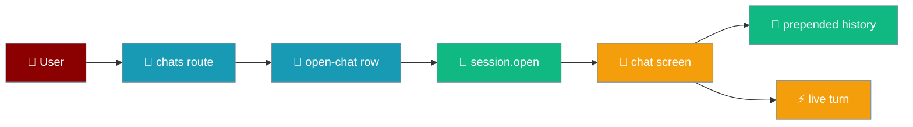
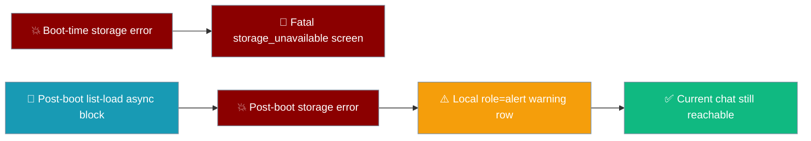
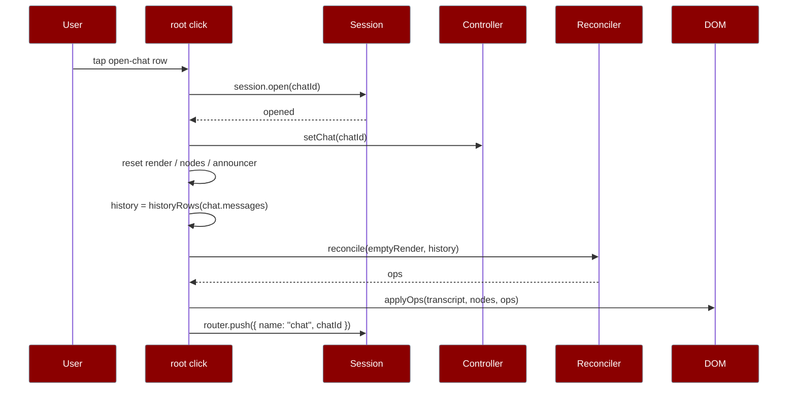

Tap **Chats**, pick a conversation, and it reopens with its stored messages painted back into the transcript as real rows — so the next turn you send lands below them, not above.



`session.list()` and `session.open()` are reachable from the running app for the first time — the chat list is the path back into a stored transcript.

## Quick Start

<Steps>
<Step title="Open the chat list">
The top bar carries a **Chats** button. Tapping it pushes the `chats` route and paints the `screen-chats` DOM from a fresh snapshot.

```ts
const [summaries, unreadable] = await Promise.all([
  app.session.list(),
  app.session.repository.listUnreadable(),
]);
```
Both lists, always together: a chat that failed to parse becomes a row rather than a conversation that silently vanished.
</Step>

<Step title="Build the rows">
```ts
import { buildChatList } from "praisonai-mobile/ui/chats/list-view-model";

const view = buildChatList(summaries, unreadableIds, Date.now());
```
Only rows where `kind === "chat"` carry `data-action="open-chat"` and `data-chat-id`. Unreadable rows are shown but inert.
</Step>

<Step title="Reopen a conversation">
Tapping an `open-chat` row calls `session.open(chatId)`, reloads the stored messages, and repaints them through the reconciler as real `Row`s.
</Step>
</Steps>

---

## The chats screen

`buildChatsScreen` renders one snapshot: an empty state, an all-unreadable warning, or a list of rows.

| View state | What renders | Source |
|------------|--------------|--------|
| `none` | `strings.chatsEmpty` — a new install, not data loss | `buildChatList` returns `state: "none"` |
| `all-unreadable` | `strings.chatsAllUnreadable(count)` warning row | every file failed to parse |
| `has-chats` | a `<button>` per row | at least one chat read cleanly |

```ts
// buildChatsScreen — only real chats carry the open-chat intent.
if (row.kind === "chat") {
  el.dataset["action"] = "open-chat";
  el.dataset["chatId"] = row.id;
}
el.setAttribute("aria-label", chatRowName(strings, row));
```

<Note>
An empty list and a list that is empty because everything in it failed to parse are **not** the same screen. The first is a new install; the second is data loss. `buildChatList` distinguishes them so the UI can too — see [Chat Recovery](/features/mobile/chat-recovery).
</Note>

### Unreadable rows are shown, not hidden

`repository.listUnreadable()` feeds the ids of every corrupt file into the same view. Those rows sort to the top and carry **no** `open-chat` intent — a tap on an unreadable row has nowhere useful to go, and `intents.ts` refuses a missing `chatId` anyway.

<Warning>
A UI that calls `list()` and stops turns a carefully reported failure back into a conversation that silently disappeared. The chats screen renders **both** lists so a corrupt file is a visible row, not a gap.
</Warning>

---

## When the list load itself fails

**What happens if storage fails while I'm on the chats screen?** You keep the conversation you were in. A failed chat list stays a *local* failure — the screen you were on stays reachable, and the back gesture keeps you in the conversation you were in.

`session.list()` and `repository.listUnreadable()` are async calls against `StoragePort`. The same throws `bootOrFail` catches at boot can be raised here too:

| Trigger | When it fires |
|---------|---------------|
| `SecurityError` | Site data is blocked — a WKWebView with storage disabled rejects the read. |
| `QuotaExceededError` | The device is out of room to persist. |

The list rebuild runs in a floating async block inside the route handler. A rejection there is **caught inside that block**, so it never escalates to the global crash handler `mount()` installs at step 0. Only the `chats` section repaints — the top bar, the current chat, and the composer stay live.

```ts
// main.ts — the caught list-rebuild block on the chats route.
(async () => {
  // ...rebuild the list...
  section.textContent = "";
  for (const child of [...fresh.children]) section.append(child as HTMLElement);
})().catch(() => {
  // A floating rejection here reaches the global crash handler and replaces
  // the WHOLE app with the fatal screen; a failed chat list must stay a
  // LOCAL failure, so the user can go back and keep using the conversation.
  section.textContent = "";
  const notice = doc.createElement("p");
  notice.className = "row row-notice";
  notice.dataset["tone"] = "warning";
  notice.setAttribute("role", "alert");
  notice.textContent = strings.crashed;
  section.append(notice);
});
```

The section's contents are cleared and replaced with a single `<p class="row row-notice" role="alert">` carrying `strings.crashed`. `role="alert"` announces it through the screen reader; `data-tone="warning"` styles it distinctly from a data-loss `error` tone.



The previous conversation is retained on the chat screen and reachable via the back gesture and the top bar — nothing about the open chat depends on the list load succeeding.

<Note>
The guarantee is pinned by `"a storage failure while the chat list loads stays LOCAL, not fatal"` in `app/src/main.test.ts`. It boots the app, fails the next storage read while entering the `chats` route, and asserts the chat screen's composer is still reachable and the fatal "could not start" screen never appeared.
</Note>

---

## How It Works

Reopening resets the live render state, then seeds the reconciler with the stored history before any new turn arrives.



The reopen handler runs a fixed sequence:

```ts
// main.ts — the "open-chat" intent.
const opened = await app.session.open(intent.chatId);
if (!opened) return;
app.controller.setChat(intent.chatId);
render = emptyRender;
nodes.nodes.clear();
announcer = initialAnnouncer;
transcript.textContent = "";
polite.textContent = "";
assertive.textContent = "";
const chat = app.session.current();
history = chat === null ? [] : historyRows(chat.messages);
const seeded = reconcile(render, history);
applyOps(transcript, nodes, seeded.ops, strings);
render = seeded.next;
app.router.push({ name: "chat", chatId: intent.chatId });
```

<Note>
`history` lives in the mount closure and is **prepended to every reconcile** in `publish`. A follow-up turn's rows land below it, and because history is inside the render state, a reconcile never emits `remove` for rows it did not know about. New chat resets `history = []`.
</Note>

---

## History rows carry a prefixed id

`historyRows` maps each stored message to a `Row` whose id is `history:{index}:{role}`.

```ts
import { historyRows } from "praisonai-mobile/app/main";

historyRows([
  { role: "user", content: "Plan my week" },
  { role: "assistant", content: "Here is a plan." },
]);
// [
//   { kind: "text", id: "history:0:user", text: "Plan my week", streaming: false },
//   { kind: "text", id: "history:1:assistant", text: "Here is a plan.", streaming: false },
// ]
```

The prefix does two jobs:

| Property | Why the id shape matters |
|----------|--------------------------|
| Stable across re-open | The same message paints the same row — a re-open is not a source of duplicates. |
| Cannot collide with a live turn | A live turn's rows carry `text:N` ids. A collision would make the first streamed paragraph **update a history row in place** instead of appending after it. |

<Warning>
The bug this replaces appended stored messages as raw `<p>` nodes **outside** `render`/`nodes`, with `render` reset to empty. The next turn then reconciled from nothing and inserted its rows at index 0 — **above** the restored history — while the manual `<p>` nodes could never be updated. Holding history as real `Row`s keeps it in the same coordinate system the stream appends to, and makes it survive the next turn's reconcile.
</Warning>

---

## Common Patterns

A reopened chat and a fresh one share the same publish path — only `history` differs.

```ts
// publish() — history is prepended, empty for a fresh chat.
const rows = history.length === 0 ? built.rows : [...history, ...built.rows];
const diff = reconcile(render, rows);
applyOps(transcript, nodes, diff.ops, strings);
render = diff.next;
```

For a fresh chat `history` is `[]`, so this is a no-op prepend; for a reopened chat it keeps the restored conversation above the turn now streaming and inside the render state.

---

## Best Practices

<AccordionGroup>
<Accordion title="Fetch a fresh snapshot on every visit">
The `chats` builder calls `session.list()` + `listUnreadable()` each time the route is entered, so a chat created since the list was last seen appears and one deleted is gone.
</Accordion>

<Accordion title="Render both lists, never just list()">
`list()` alone hides corrupt files by design. Pair it with `listUnreadable()` on the same screen so a lost conversation is surfaced as a row with a count rather than disappearing in silence.
</Accordion>

<Accordion title="Paint restored messages through the reconciler">
Reopened messages are real `Row`s seeded with `reconcile(emptyRender, history)`, not raw nodes. That is what keeps them in the same coordinate system the next turn's stream appends to.
</Accordion>

<Accordion title="Give history rows a namespaced id">
The `history:{index}:{role}` prefix keeps restored rows stable across re-open and out of collision range of a live turn's `text:N` ids.
</Accordion>
</AccordionGroup>

---

## Related

<CardGroup cols={2}>
<Card title="Chat Recovery" icon="database" href="/features/mobile/chat-recovery">
  How `list()` and `listUnreadable()` keep a corrupt file visible.
</Card>
<Card title="Follow & Jump" icon="arrow-down-to-line" href="/features/mobile/follow-and-jump">
  Stick-to-bottom and the jump-to-latest affordance.
</Card>
<Card title="Route Focus" icon="crosshairs" href="/features/mobile/route-focus">
  Where focus lands when a route pushes or pops.
</Card>
<Card title="Overview" icon="mobile" href="/features/mobile/overview">
  The top bar, the retained chat screen, and New chat.
</Card>
</CardGroup>
