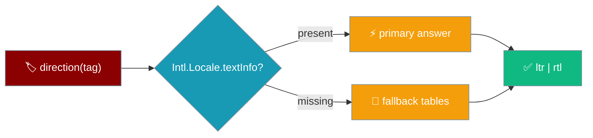
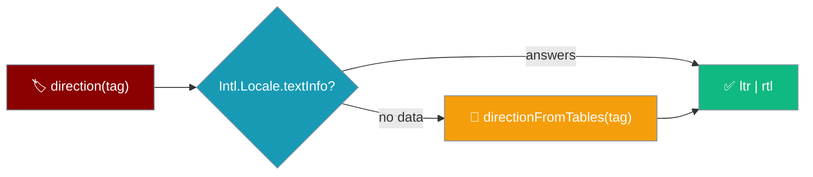
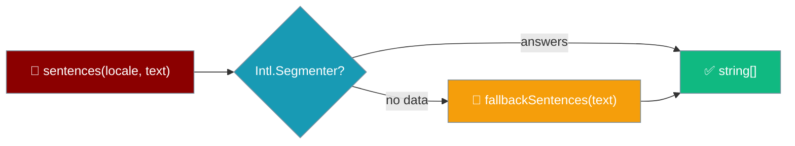

Both text direction and sentence splitting answer on every host, degrading to explicit tables when `Intl` has no data.



## Quick Start

<Steps>
<Step title="Ask which way the text runs">
```ts
import { direction } from "praisonai-mobile/ui/i18n/locale";

direction("ar");      // "rtl"
direction("en-GB");   // "ltr"
```
`direction` is total: it returns `"ltr"` or `"rtl"` for any string, and never throws.
</Step>

<Step title="Split a streaming answer into sentences">
```ts
import { sentences } from "praisonai-mobile/ui/i18n/segment";

sentences("en", 'He said "stop." Then left.'); // two sentences
```
`sentences` drives the screen-reader announcement policy, so only finished sentences are spoken.
</Step>
</Steps>

---

## Text direction

`direction(tag)` asks ICU first and falls back to explicit tables.



The fallback is exported as `directionFromTables(tag)` so app code and tests can call it directly on hosts where the primary path answers first — an older Android WebView without `Intl.Locale.textInfo`.

```ts
import { directionFromTables } from "praisonai-mobile/ui/i18n/locale";

directionFromTables("az-Arab"); // "rtl" — script beats language
directionFromTables("ar-Latn"); // "ltr" — script beats language
```

| Rule | Behaviour |
|------|-----------|
| RTL languages | `ar`, `ckb`, `dv`, `fa`, `he`, `ks`, `nqo`, `pnb`, `ps`, `sd`, `syr`, `ug`, `ur`, `yi`, `arc` (source: `RTL_LANGUAGES` in `locale.ts`). |
| Script subtag beats the language | `az-Arab` and `ku-Arab` are RTL (LTR languages in an RTL script); `ar-Latn` and `ks-Deva` are LTR (RTL languages in an LTR script). |
| Script matched case-insensitively | `az-arab`, `az-ARAB`, `az-Arab` all resolve the same. |
| Region subtags are not scripts | A 2-letter or 3-digit region is not mistaken for a script — `ar-EG` stays RTL, `ar-001` stays RTL. |
| Total | Never throws on any input — empty string, garbage, and malformed tags all resolve to a direction. |

<Note>
`"ltr"` is the default for anything unrecognised: laying an Arabic UI out left-to-right is ugly, but laying an English one out right-to-left is unusable. The asymmetry decides the default.
</Note>

---

## Sentence segmentation

`sentences(locale, text)` asks `Intl.Segmenter` first and falls back to `fallbackSentences(text)`.



```ts
import { fallbackSentences } from "praisonai-mobile/ui/i18n/segment";

fallbackSentences("Version 1.2.3 is out.");      // one sentence
fallbackSentences('He said "stop." Then left.'); // two sentences
```

| Rule | Behaviour |
|------|-----------|
| Does not split on a decimal point | `"Version 1.2.3 is out."` is one sentence — a terminator glued to the next character is a decimal, not a sentence end. |
| Splits after a quoted full stop | `'He said "stop." Then left.'` is two sentences. |
| Keeps the unterminated tail | The trailing half-sentence is its own segment, so a streaming answer is spoken as it arrives. |
| Seam guarantee | `fallbackSentences(text).join("") === text` for every input — no character is ever lost. |

<Note>
The seam guarantee is why a caller can hold back the last segment until it is finished and resume from the same cursor: `text.slice(0, n)` and `text.slice(n)` recombine exactly.
</Note>

---

## User interaction flow

<Steps>
<Step title="Modern iOS — the primary path answers">
An Arabic user opens the app on a modern iOS WebView. `Intl.Locale.textInfo` answers `"rtl"`, and the composer, send button, and safe-area padding all mirror to the correct side.
</Step>

<Step title="Older Android WebView — the tables answer">
The same user opens the app on an older Android WebView with no `Intl.Locale.textInfo`. `directionFromTables("ar")` answers `"rtl"`, and the UI still mirrors correctly — the fallback is not a downgrade in behaviour.
</Step>
</Steps>

---

## Best Practices

<AccordionGroup>
<Accordion title="Decide direction by script, not a language list">
`az-Arab` is right-to-left and `az` is not. A hand-written list of RTL language codes gets script variants wrong; the script subtag decides, and ICU is asked before the table.
</Accordion>

<Accordion title="Never assume Intl is complete">
Older Android WebViews ship without `Intl.Locale.textInfo` and `Intl.Segmenter`. `directionFromTables` and `fallbackSentences` are exported precisely so the degraded path is exercised, not left untested.
</Accordion>

<Accordion title="Hold the unterminated tail on a stream">
Announcing a half-typed sentence makes a screen reader say "The file cont" and then repeat the whole sentence. Speak only completed sentences and keep the tail until it terminates.
</Accordion>
</AccordionGroup>

---

## Related

<CardGroup cols={2}>
<Card title="Shell & Adapters" icon="mobile-button" href="/features/mobile/shell-and-adapters">
  Logical insets that mirror with direction.
</Card>
<Card title="Errors & Recovery" icon="triangle-exclamation" href="/features/mobile/errors-and-recovery">
  What each failure looks like on the phone.
</Card>
</CardGroup>
