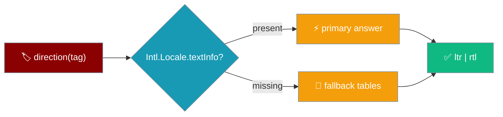
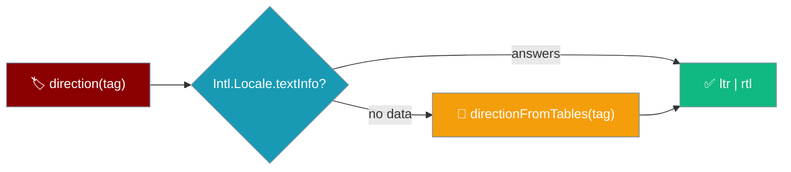
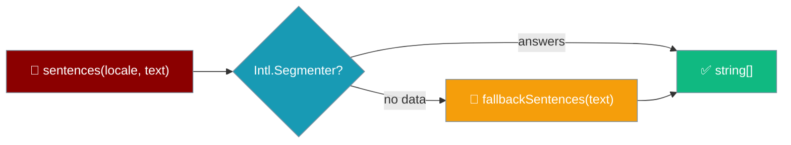
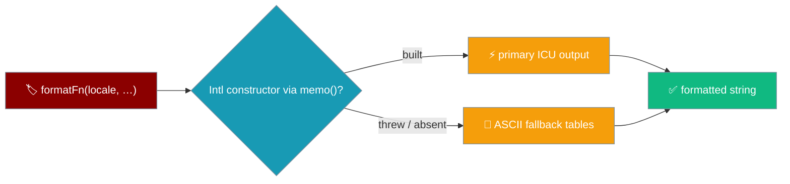
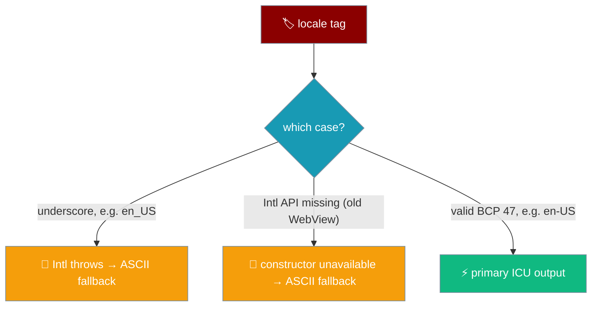

Text direction, sentence splitting, and number/date/duration formatting all answer on every host, degrading to explicit fallbacks when `Intl` has no data — or when a stored locale reaches the UI as an underscore tag like `"en_US"`.



## Quick Start

<Steps>
<Step title="Ask which way the text runs">
```ts
import { direction } from "praisonai-mobile/ui/i18n/locale";

direction("ar");      // "rtl"
direction("en-GB");   // "ltr"
```
`direction` is total: it returns `"ltr"` or `"rtl"` for any string, and never throws.
</Step>

<Step title="Split a streaming answer into sentences">
```ts
import { sentences } from "praisonai-mobile/ui/i18n/segment";

sentences("en", 'He said "stop." Then left.'); // two sentences
```
`sentences` drives the screen-reader announcement policy, so only finished sentences are spoken.
</Step>
</Steps>

---

## Text direction

`direction(tag)` asks ICU first and falls back to explicit tables.



The fallback is exported as `directionFromTables(tag)` so app code and tests can call it directly on hosts where the primary path answers first — an older Android WebView without `Intl.Locale.textInfo`.

```ts
import { directionFromTables } from "praisonai-mobile/ui/i18n/locale";

directionFromTables("az-Arab"); // "rtl" — script beats language
directionFromTables("ar-Latn"); // "ltr" — script beats language
```

| Rule | Behaviour |
|------|-----------|
| RTL languages | Base set: `ar`, `arc`, `az-arab`, `ckb`, `dv`, `fa`, `he`, `ks`, `ku-arab`, `nqo`, `pnb`, `ps`, `sd`, `syr`, `ug`, `ur`, `yi`. Spoken Arabic varieties: `aeb`, `acm`, `ajp`, `apc`, `ary`, `arz`. Persian-script and Perso-Arabic languages: `bal`, `glk`, `haz`, `lrc`, `mzn`, `skr`. Rohingya (Hanifi script): `rhg`. Source: `RTL_LANGUAGES` in `src/praisonai-mobile/ui/src/i18n/locale.ts`. |
| Script subtag beats the language | `az-Arab` and `ku-Arab` are RTL (LTR languages in an RTL script); `ar-Latn` and `ks-Deva` are LTR (RTL languages in an LTR script). |
| Script matched case-insensitively | `az-arab`, `az-ARAB`, `az-Arab` all resolve the same. |
| Region subtags are not scripts | A 2-letter or 3-digit region is not mistaken for a script — `ar-EG` stays RTL, `ar-001` stays RTL. |
| Total | Never throws on any input — empty string, garbage, and malformed tags all resolve to a direction. |

<Note>
The fallback table is only consulted on hosts where `Intl.Locale.textInfo` is absent — older Android and iOS WebViews. On every host that has `textInfo`, Intl answers first and the table is invisible. The list above was reconciled against `Intl.Locale.textInfo` across a ~50-tag corpus so the fallback path agrees with the primary path on locales like `aeb`, `arz`, `rhg`, and `skr` that a phone actually reports in the wild.
</Note>

<Note>
`"ltr"` is the default for anything unrecognised: laying an Arabic UI out left-to-right is ugly, but laying an English one out right-to-left is unusable. The asymmetry decides the default.
</Note>

---

## Sentence segmentation

`sentences(locale, text)` asks `Intl.Segmenter` first and falls back to `fallbackSentences(text)`.



```ts
import { fallbackSentences } from "praisonai-mobile/ui/i18n/segment";

fallbackSentences("Version 1.2.3 is out.");      // one sentence
fallbackSentences('He said "stop." Then left.'); // two sentences
```

| Rule | Behaviour |
|------|-----------|
| Does not split on a decimal point | `"Version 1.2.3 is out."` is one sentence — a terminator glued to the next character is a decimal, not a sentence end. |
| Splits after a quoted full stop | `'He said "stop." Then left.'` is two sentences. |
| Keeps the unterminated tail | The trailing half-sentence is its own segment, so a streaming answer is spoken as it arrives. |
| A lone terminator is a complete sentence | A one-character sentence made only of a terminator is complete. `endsSentence("。") === true` and `completedLength("ja", "。") === 1`. CJK writes short sentences; a lone `。` (or `.`, `!`, `?`, `！`, `？`) is a whole one, and without this the screen-reader announcement stalls. See [Screen-reader hygiene](#screen-reader-hygiene). |
| Seam guarantee | `fallbackSentences(text).join("") === text` for every input — no character is ever lost. |

<Note>
The seam guarantee is why a caller can hold back the last segment until it is finished and resume from the same cursor: `text.slice(0, n)` and `text.slice(n)` recombine exactly.
</Note>

---

## Number, date, and duration formatting

Chat-list dates, message timestamps, tool-call durations, and transcript counts all come from `format-intl`, which asks `Intl` first and falls back to ASCII when a tag is refused.



Every formatter shares the pattern of `directionFromTables` and `fallbackSentences`: an `Intl` constructor is memoised behind a `try/catch`, and every entry point has a non-throwing answer.

### Quick Start

<Steps>
<Step title="Format a number, a count, or a date">
```ts
import { formatNumber, formatCountLocalised, formatDate } from "praisonai-mobile/ui/i18n/format-intl";

formatNumber("en", 1234.5);                   // "1,234.5"
formatCountLocalised("ja", 15000);            // "1.5万"
formatDate("en", 1_700_000_000_000, "UTC");   // "Nov 14, 2023"
```
`timeZone` is a required argument on `formatDate` — pass `null` for the host's zone, but it must be typed.
</Step>

<Step title="Format a relative or elapsed time">
```ts
import { formatRelativeLocalised, formatElapsedLocalised } from "praisonai-mobile/ui/i18n/format-intl";
import { en } from "praisonai-mobile/ui/i18n/strings";

const now = Date.now();

formatRelativeLocalised("en", en, now - 10 * 60 * 1000, now, null); // "10 minutes ago"
formatElapsedLocalised("en", en, 3720);                             // "1h 02m"
formatElapsedLocalised("en", en, 5.25);                             // "5.3s"
```
`formatElapsedLocalised` takes `seconds: number | null`; `null`, negative, and `NaN` all render as `strings.unknownValue`.
</Step>
</Steps>

<Note>
**The "just now" threshold is 45 seconds exactly.** `formatRelative` / `formatRelativeLocalised` return the localised *"just now"* string for a delta strictly less than **45 seconds** (`seconds < 45`). At 45s exactly and beyond, they switch to `"N minutes ago"` (or the localised equivalent). `format.ts` and `format-intl.ts` share this boundary — it is pinned separately in both, so the two paths cannot drift. Pinned by `"formatRelative's just-now threshold is 45 seconds exactly"`.
</Note>

### When does the fallback fire?



The underscore case is the one the fallback exists to serve first: `new Intl.NumberFormat("en_US")` throws `RangeError`, and `locale.ts` accepts underscore tags as a valid stored preference.

### Rules

| Rule | Behaviour |
|------|-----------|
| Every entry point is total | An unparseable tag (`"en_US"`, empty, garbage) never throws — the function returns a well-formed ASCII fallback. |
| `timeZone` is a required argument on `formatDate` | Pass `null` for the host's zone, but the argument must be typed. A defaulted zone is how a chat saved at 23:40 shows tomorrow's date. |
| Unknown values render as `strings.unknownValue` | On `formatElapsedLocalised`, `null`, negative, and `NaN` seconds all render as unknown — not as `0s`. The engine not observing a call begin is not the same as the call returning instantly. |
| Fallback outputs are ASCII and locale-independent | Number → `String(value)`; count → whole integer via `String(whole)`; date → ISO `YYYY-MM-DD` (`toISOString().slice(0, 10)`); padded → `padStart(2, "0")`; sub-10s duration → `toFixed(1)`; relative time → the localisable `Strings` table (`minutesAgo` / `hoursAgo` / `daysAgo`). |
| `memo()` caches successes **and** failures | A bad tag costs one throw per process, not one per frame — safe in a streaming transcript row that re-formats on every publish. |
| The primary path picks the right script | `Intl.NumberFormat` in Arabic may render Arabic-Indic digits; `formatPadded` never pads an Arabic-Indic number with an ASCII `"0"`. The fallback uses ASCII by design, but the primary path never mixes scripts. |

<Note>
**The `"en_US"` trigger.** Every `Intl` constructor throws `RangeError` on an underscore tag, and `locale.ts` accepts underscore tags as a valid stored preference (`tag.split(/[-_]/)`). So the fallback is not a hypothetical old-WebView path — it fires whenever a stored preference reaches the UI as `"en_US"` instead of `"en-US"`. That is the case the fallback exists to serve, first.
</Note>

<Note>
**Determinism split with `format.ts`.** `ui/src/format.ts` emits ASCII and ISO deterministically and is what the package's own tests assert against; `format-intl.ts` is the path a renderer uses on top, and is additive — nothing in `format.ts` changes. Read this split before writing your own formatter; the header comment in `format-intl.ts` is the source of truth.
</Note>

---

## User interaction flow

<Steps>
<Step title="Modern iOS — the primary path answers">
An Arabic user opens the app on a modern iOS WebView. `Intl.Locale.textInfo` answers `"rtl"`, and the composer, send button, and safe-area padding all mirror to the correct side.
</Step>

<Step title="Older Android WebView — the tables answer">
The same user opens the app on an older Android WebView with no `Intl.Locale.textInfo`. `directionFromTables("ar")` answers `"rtl"`, and the UI still mirrors correctly — the fallback is not a downgrade in behaviour.
</Step>

<Step title="Bad stored locale — the fallback answers">
A user's stored preference is `"en_US"` (an underscore tag from an older settings write). `memo(...)` caches `null`, `formatDate` returns the ISO date, `formatElapsedLocalised` returns `"1h 02m"`, and the chat list still reads correctly. No row blanks; no timestamp goes missing.
</Step>
</Steps>

---

## Screen-reader hygiene

Starting a new chat empties the live regions, not just the announcer.

When the user starts a new chat, the shell empties the `polite` and `assertive` live regions in addition to resetting the announcer state. Resetting the announcer decides what to *say* next; it does not empty the regions themselves — so without this clear, the previous conversation's answer lingered in the accessibility tree of an apparently empty chat. See [Overview → New chat](/features/mobile/overview#new-chat).

---

## Chat-row accessible name

Every chat row has a name: a titled row is announced by its title; an untitled one by the localised **"Untitled"** string — never as an empty accessible name.

```ts
import { chatRowName } from "praisonai-mobile/ui/a11y/names";
import { en } from "praisonai-mobile/ui/i18n/strings";

chatRowName(en, { title: "Quarterly plan" }); // "Quarterly plan"
chatRowName(en, { title: "" });               // en.untitled — never ""
```

| Row state | `chatRowName(en, row)` returns | Screen reader says |
|-----------|-------------------------------|--------------------|
| `title: "Quarterly plan"` | `"Quarterly plan"` | *"Quarterly plan, button"* |
| `title: ""` | `en.untitled` | *"Untitled, button"* |
| `title: ""` returning `""` | never | *"button"* — indistinguishable from the row above |

<Warning>
The fallback is `en.untitled`, not the empty string. A nameless row reads as just *"button"* and cannot be told apart from its neighbours — which is exactly what a per-row accessible name exists to prevent. The guard is `row.title === "" ? strings.untitled : row.title`; flipping the `===` to `!==` reads a real title as *Untitled* and leaves an untitled row nameless.
</Warning>

---

## Missing-translation marks need both brackets

The missing-strings reporter wraps an untranslated key as `⟦…⟧`, and `isMarked` only recognises a string carrying **both** brackets.

```ts
import { markMissing, isMarked } from "praisonai-mobile/ui/i18n/bundle";

markMissing("save");        // "⟦save⟧"
isMarked("⟦save⟧");         // true  — opens ⟦ AND ends ⟧
isMarked("⟦save");          // false — a half-bracketed string
```

`isMarked(s)` returns `true` only when `s` starts with `⟦` **and** ends with `⟧`. A half-bracketed string — a translator's own literal `⟦` or `⟧` — is not a marked-missing key, so the report never blames translations that are actually present.

<Note>
The guard is `s.startsWith("⟦") && s.endsWith("⟧")`. Flipping the `&&` to `||` counts a lone bracket as a marked-missing key and reports a real, present translation as absent. Pinned by `"a half-bracketed string is not a marked-missing one"`.
</Note>

---

## Best Practices

<AccordionGroup>
<Accordion title="Decide direction by script, not a language list">
`az-Arab` is right-to-left and `az` is not. A hand-written list of RTL language codes gets script variants wrong; the script subtag decides, and ICU is asked before the table.
</Accordion>

<Accordion title="Never assume Intl is complete">
Older Android WebViews ship without `Intl.Locale.textInfo` and `Intl.Segmenter`, so `directionFromTables` and `fallbackSentences` are exported precisely to exercise the degraded path. But the fallback is not only an old-WebView concern: every `Intl` constructor throws `RangeError` on an underscore tag, and `locale.ts` accepts `"en_US"` as a valid stored preference — so the number, date, and duration fallbacks fire in production the moment a stored locale reaches the UI with an underscore.
</Accordion>

<Accordion title="Hold the unterminated tail on a stream">
Announcing a half-typed sentence makes a screen reader say "The file cont" and then repeat the whole sentence. Speak only completed sentences and keep the tail until it terminates.
</Accordion>
</AccordionGroup>

---

## Related

<CardGroup cols={2}>
<Card title="Shell & Adapters" icon="mobile-button" href="/features/mobile/shell-and-adapters">
  Logical insets that mirror with direction.
</Card>
<Card title="Errors & Recovery" icon="triangle-exclamation" href="/features/mobile/errors-and-recovery">
  What each failure looks like on the phone.
</Card>
</CardGroup>
