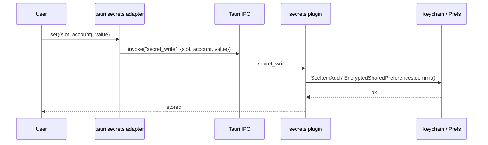
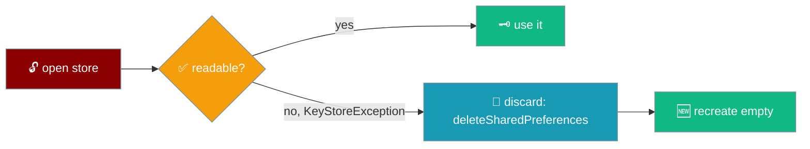

An API key you paste into the app lives in the platform keychain — iOS / macOS Keychain, Android `EncryptedSharedPreferences` — and survives an app restart.


## Quick Start

<Steps>
<Step title="Build the mobile shell — you already get the native store">
There is no SDK call to make. `secretsFor(kind, bridge)` in `app/src/platform.ts` picks the keychain for you the moment the app runs inside the Tauri shell.

```ts
// app/src/platform.ts — the store is chosen from the detected platform kind.
export function secretsFor(kind, bridge): SecretsPort {
  if (kind !== "tauri") return createWebSecrets();       // browser: a Map
  return createTauriSecrets({ invoke: bridge.invokeStrict }); // phone: the keychain
}
```
</Step>

<Step title="Paste a key in Settings">
Under **Engine → OpenAI API key**, paste the key and blur the field. It is written straight to the keychain, and the presence label flips to **Configured**.
</Step>

<Step title="Restart the app">
Reopen the app. The key is still there — the settings row reads **Configured**, and the next message is authenticated with no re-entry. See [API Keys](/features/mobile/api-keys).
</Step>
</Steps>

<Note>
This page is for mobile-app builders — how the store is picked and why. For the end-user flow of pasting and rotating a key, read [API Keys](/features/mobile/api-keys).
</Note>

---

## How It Works

A pasted key travels from the webview through Tauri IPC to a Rust command, which writes it to the platform's native store.



The webview reaches the store through four commands, declared once in `src-tauri/src/secrets.rs` and matched on the TS side in `adapters/src/tauri/secrets.ts`.

| Command | Body | Notes |
|---|---|---|
| `secret_read` | Returns the value or `null` | Called only when the engine needs the key; never on paint. |
| `secret_write` | Writes a value | An empty string is a stored value, not a delete. |
| `secret_remove` | Removes | Deleting an absent secret succeeds. |
| `secret_has` | Presence only | Its **own** command — does NOT call `read()`. |

The four names are pinned to agree across the seam by `tools/secrets-seam.test.mjs` (`"the four secret command names agree across the seam"`), and each is registered with Tauri in `src-tauri/src/lib.rs` (`"every command the adapter can send is registered with Tauri"`).

---

## Per-platform behaviour

The store is picked from the detected platform kind; an unsupported host stores nothing.

| Platform kind | Store | Backed by |
|---|---|---|
| `"tauri"` on iOS / macOS | `createTauriSecrets({ invoke })` | `SecItemAdd` / `SecItemCopyMatching` (`kSecClassGenericPassword`) — value held by the keychain daemon, nothing in the app sandbox |
| `"tauri"` on Android | `createTauriSecrets({ invoke })` | `EncryptedSharedPreferences`: keys AES256-SIV, values AES256-GCM, master key from `AndroidKeyStore` (non-extractable) |
| `"tauri"` on any other host | **refuses** | nothing, ever |
| `"web"` | `createWebSecrets()` | Module-scoped `Map` — lost on every reload |

Because the plugin **refuses** rather than falling back on an unsupported platform, "a secret stored through this adapter at all is in a hardware-backed store" is an invariant — which is why `isHardwareBacked` can be answered synchronously during the first paint, with no async probe. Source: `adapters/src/tauri/secrets.ts` header, `secretsFor` in `app/src/platform.ts`.

---

## Design decisions

<AccordionGroup>
<Accordion title="Why not tauri-plugin-stronghold">
Stronghold is a password-encrypted **file**, not a hardware store. `isHardwareBacked` could not honestly become `true`, and the encryption password would itself have to be kept somewhere — the same problem one indirection down. Source: comment block at the top of `src-tauri/plugins/secrets/src/lib.rs`.
</Accordion>

<Accordion title="Why not the keyring crate">
The `keyring` crate has macOS, Windows and Linux backends but **no Android backend** — half the platforms this app ships to. A store that works on the desktop dev machine and silently has nowhere to go on a phone is worse than an honest refusal.
</Accordion>

<Accordion title="Why refuse on an unsupported platform instead of falling back">
A silent fallback to an encrypted file would make `isHardwareBacked` lie. Refusing keeps the invariant "anything stored here is in a hardware store", so the settings warning and the `isHardwareBacked` flag stay honest without an async platform probe.
</Accordion>

<Accordion title="Why has() is a separate command">
`has: (ref) => (await get(ref)) !== null` returns the right booleans and copies the user's key into the webview heap on every settings repaint. `secret_has` is its own command: on Apple it uses a presence query with no `kSecReturnData`, on Android `contains(keyFor(...))`, so the value never crosses the FFI boundary. Pinned by `"presence has its own command on every side of the seam"` and `"asking whether a key is configured never sends the read command"`.
</Accordion>

<Accordion title="Why the SecretSlot union lives in Rust too">
A TS-only union is erased at runtime, so the webview could hand any string as a service name. `secrets.rs` repeats the five slots as a `pub const SLOTS` allowlist and refuses anything else, so the two can never drift. Pinned by `"the Rust slot allowlist and the port's closed union are the same five"` and `secrets::tests::a_slot_outside_the_union_is_refused_rather_than_named`.
</Accordion>

<Accordion title="Why the Android write is commit(), not apply()">
`apply()` is asynchronous: it returns before the bytes hit disk, so a key written just before the OS kills the app could be lost. `commit()` is synchronous and returns a success boolean. `commit()` → `apply()` is a one-word edit that keeps every test green, so `secrets-seam.test.mjs` pins the string with `"the Android write is committed rather than applied"`.
</Accordion>
</AccordionGroup>

---

## Android backup & restore

The store self-heals after a Google auto-backup restores the app onto a new device.

The master key that decrypts `EncryptedSharedPreferences` is generated inside `AndroidKeyStore` and is device-local — it does not travel with the backup. So the restored preferences file cannot be decrypted, and `EncryptedSharedPreferences.create` throws a `KeyStoreException`.



`store()` in `SecretsPlugin.kt` catches that exception, calls `discard()` — which uses `context.deleteSharedPreferences(PREFS_FILE)`, **not** `getSharedPreferences(...).edit().clear()`, because a cleared handle still points at a file it cannot read — and rebuilds the store from scratch. Future writes work; any pre-restore secrets are gone and the user re-enters them once, exactly like a fresh install.

<Warning>
`discard()` must use `deleteSharedPreferences`, not `clear()`. Clearing through a handle over an undecryptable file does not remove the corrupt master-key binding, so the next `create` throws again. The seam test forbids the `clear()` string for that reason.
</Warning>

---

## Verification on device

How you would check yourself that the key never leaks — the same evidence collected on the PR.

<AccordionGroup>
<Accordion title="logcat never carries the key">
Run `adb logcat` while pasting and using a key. The value never appears — the plugin logs presence and errors, never the secret.
</Accordion>

<Accordion title="No file under the app's data dir contains it">
`adb shell run-as ai.praison.mobile` and grep the data directory: no file under `/data/data/ai.praison.mobile/` contains the plaintext key. It lives in `EncryptedSharedPreferences`, encrypted under a master key held in `AndroidKeyStore`.
</Accordion>

<Accordion title="Even the entry names are encrypted">
The shared-prefs XML does not even carry the readable slot name (`openai:default`). `EncryptedSharedPreferences` encrypts **keys** with AES256-SIV, so the stored entry name is ciphertext too.
</Accordion>
</AccordionGroup>

<Note>
On iOS the equivalent check is that the value is in the Keychain (`kSecClassGenericPassword`), not in the app's container — nothing in the sandbox holds the plaintext, because `SecItemAdd` hands it to the keychain daemon.
</Note>

---

## Related

<CardGroup cols={2}>
<Card title="Storage & Secrets" icon="database" href="/features/mobile/storage-and-secrets">
  `SecretsPort`, the per-platform table, and why storage and secrets are kept apart.
</Card>
<Card title="API Keys" icon="key" href="/features/mobile/api-keys">
  The user-facing flow: paste, rotate, and remove a key.
</Card>
<Card title="Settings Screen" icon="sliders" href="/features/mobile/settings-screen#secret-rows">
  How a secret row renders and where the software-secrets warning fires.
</Card>
<Card title="Adapter Conformance" icon="shield-check" href="/features/mobile/adapter-conformance#the-secrets-contract-now-has-durability-and-presence-branches">
  The durability and presence branches this store must pass.
</Card>
</CardGroup>
