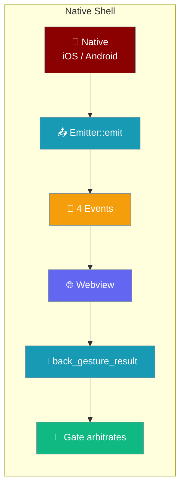
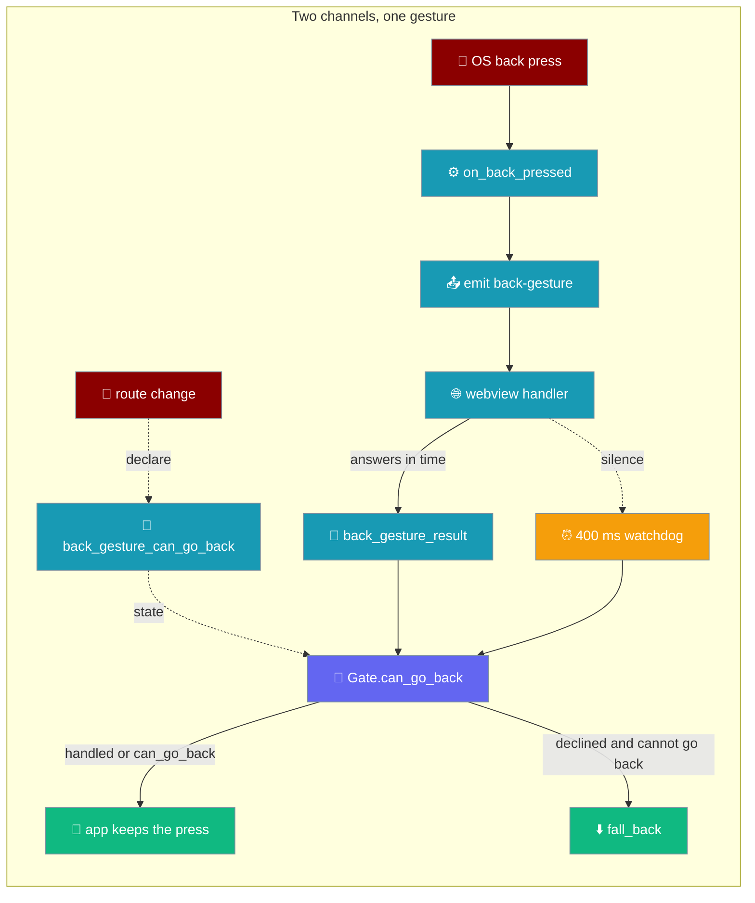
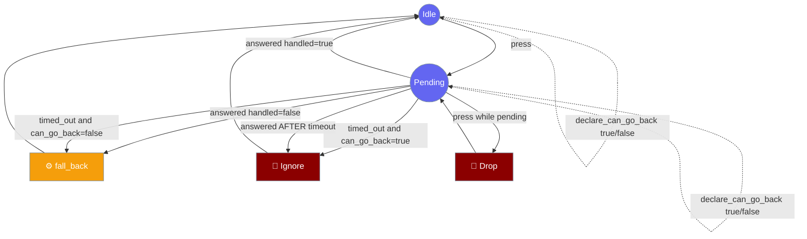
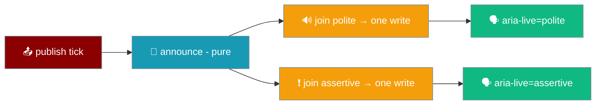

Everything the mobile app *does* runs in the webview. The native shell exists to tell it four things a browser cannot know — the safe-area insets, the keyboard height, the lifecycle phase, and that the user pressed back — and to act on the one answer it sends back.



## Quick Start

<Steps>
<Step title="Enable in a mobile build">
The `praisonai-mobile` npm workspace already carries the Tauri config, so a mobile build needs no extra setup here.

<Note>
`gen/apple` and `gen/android` are committed to the repo, so no init step is needed for a first device build — see [Platform Builds](/features/mobile/platform-builds).
</Note>
</Step>

<Step title="Run the desktop dev binary">
`cargo tauri dev` runs `src/main.rs`, the desktop-only dev binary. iOS and Android enter through the `mobile_entry_point` in `lib.rs` instead.

```bash
cd src-tauri && cargo tauri dev
```
</Step>

<Step title="Run the shell tests">
`npm run test:rust` runs the 14 Rust tests that pin the arbitration and the contract.

```bash
npm run test:rust   # → cd src-tauri && cargo test
```

The Node cross-language contract test lives at `tools/shell-seam.test.mjs` and greps the same event strings out of both languages.

<Note>
The same `cargo test` and `cargo clippy -- -D warnings` run in CI on both `ubuntu-22.04` and `macos-15` via the `shell` job in `.github/workflows/mobile.yml`. Both platforms are covered deliberately: the crate is `cfg`-heavy — the back-gesture fallback is `#[cfg(target_os = "android")]` / `ios` / `not(mobile)` — and a `cfg` mistake compiles perfectly on whichever host you happened to try.
</Note>
</Step>
</Steps>

---

## The shell contract — four events + two commands

Four events go native → web, and two commands come web → native — a press answer and a standing back-declaration. Every string below is pinned by `src-tauri/tests/contract.rs` on the Rust side and `tools/shell-seam.test.mjs` on the TypeScript side — a rename on either side breaks the shell silently.

| Direction | Name (string literal) | Rust constant | Payload | Notes |
|---|---|---|---|---|
| Native → Web | `safe-area-changed` | `EVT_SAFE_AREA` | Insets object. **A payload carrying even one edge is applied, not discarded.** A payload with *no* edges at all = "re-read the CSS" (not "every inset is zero"). Emitted on `Resized` and `ScaleFactorChanged` with a **deliberately empty payload** — on iOS and desktop Tauri does not expose the insets, so the WebView re-reads the CSS `env()` variables it has already recomputed. On Android that re-read is **suppressed** once `nativeInsetsSeen` is `true` (see the [Android window-insets bridge](#the-android-window-insets-bridge)), because `env()` there is the display cutout only and re-reading it after a rotation would drop the status/navigation bars back to 0. | Consumed by `coerceInsets` in `adapters/src/tauri/shell.ts` |
| Native → Web | `keyboard-height` | `EVT_KEYBOARD` | Number (px) | **`0` is a value, not an absence.** Must fire *through* the show/hide transition, not only at endpoints — or the composer teleports while the keyboard slides |
| Native → Web | `lifecycle` | `EVT_LIFECYCLE` | `"active" \| "inactive" \| "background"` | Unrecognised phase is dropped by TS, never defaulted (defaulting to `active` would resume the render loop while the app is suspended) |
| Native → Web | `back-gesture` | `EVT_BACK` | *(no payload)* | The handler takes no argument |
| Web → Native | `back_gesture_result` | `CMD_BACK_RESULT` | `{ handled: boolean }` | Answered via `bridge.invoke`; failures are swallowed — see arbitration below (no capability entry — app commands via `invoke_handler` are always reachable) |
| Web → Native | `back_gesture_can_go_back` | `CMD_BACK_CAN_GO_BACK` | `{ canGoBack: boolean }` | Standing declaration, sent on route-stack change (not in reply to a press); read by the watchdog when an answer never arrives. Default is `false`, so a bundle that never loaded still lets back leave the app. See arbitration below |

On iOS and desktop the Tauri shell falls back to `visualViewport` when the native `keyboard-height` event has not fired yet, and hands over to native the moment one arrives. On Android `visualViewport` reports nothing while `enableEdgeToEdge()` is on, so the handover is triggered by the [Android window-insets bridge](#the-android-window-insets-bridge) (`NATIVE_INSETS_GLOBAL`, which carries both channels) instead. The `on_window_event` handler emits `lifecycle` and `safe-area-changed` on device; the `keyboard-height` Tauri event is still not natively emitted anywhere. See [Shell & Adapters → The three-source keyboard model](/features/mobile/shell-and-adapters#the-three-source-keyboard-model).

<Warning>
Tauri exposes two different event channels. TypeScript subscribes via `plugin:event|listen`, which is Tauri's **event registry**. Only `Emitter::emit` reaches it. A Tauri mobile *plugin* calling `Plugin.trigger` hits a **completely separate** channel — nothing would fire and there would be no error. Use `Emitter::emit` from `on_window_event` or command handlers; do not switch to `Plugin.trigger`.
</Warning>

<Note>
The `keyboard-height` **Tauri event** still does not fire — there is no Tauri window event for it, and no iOS `keyboardWillShow`/`Hide` listener has been added either. On **iOS** the shell therefore reads `visualViewport` for the keyboard height and would hand over the moment a native emitter lands. On **Android** that gap is now closed differently: the [window-insets bridge](#the-android-window-insets-bridge) delivers the keyboard height on the `keyboard` field of `NATIVE_INSETS_GLOBAL` — not through the `keyboard-height` event — because `visualViewport` reads nothing there. Every other event in the contract is live natively.
</Note>

The capability file `src-tauri/capabilities/default.json` grants what this seam needs: `core:event:default`, so the webview can subscribe via `plugin:event|listen`, plus `opener:allow-open-url` and `opener:allow-default-urls` so `openExternal` actually reaches the OS. Without the `opener:*` scope every `http(s)`/`mailto`/`tel` URL is still refused. The `back_gesture_result` command is deliberately **not** listed — an app command registered through `invoke_handler` is always reachable and has no ACL entry to grant; naming one that does not exist fails `tauri-build` before the crate compiles.

```json
{
  "$schema": "../gen/schemas/mobile-schema.json",
  "identifier": "default",
  "windows": ["main"],
  "platforms": ["android", "iOS", "macOS", "windows", "linux"],
  "permissions": [
    "core:event:default",
    "opener:allow-open-url",
    "opener:allow-default-urls"
  ]
}
```

The `platforms` array is explicit because every permission here exists on all five — the desktop dev build must not fail on it. A mobile-only grant belongs in its own capability scoped to its platform.

<Warning>
Do **not** add an `allow-back-gesture-result` (or similar `allow-<command_name>`) entry to `capabilities/default.json`. Only *plugin* commands have ACL entries; app commands registered via `invoke_handler` are always reachable, and naming a non-existent permission fails `tauri-build`. The in-repo `tauri-plugin-back-gesture` has no JS-facing commands, so nothing there needs an ACL entry either.
</Warning>

---

## Presence detection — both, not either

Before any of the events above can fire, the bridge has to decide whether the Tauri host is actually there. `isPresent()` in `adapters/src/tauri/bridge.ts` returns `true` **only** when the `__TAURI_INTERNALS__` global carries **both** `invoke` **and** `transformCallback`.

| `__TAURI_INTERNALS__` carries | `isPresent()` | Why |
|---|---|---|
| both `invoke` and `transformCallback` | `true` | A Tauri version this bridge speaks |
| only one of the two functions | `false` | A half-present global is a version this bridge does **not** speak — treat as absent |
| neither | `false` | No host |

The check is `&& / not / ||` — "both, not either", explicitly. A half-present global read as present makes the shell call `transformCallback` inside `listen`, which throws, is caught, and turns every shell subscription silently into a no-op.

<Warning>
**Copy the both-not-either rule when you port.** Porting to React Native or bumping Tauri means re-deriving this presence check; getting it wrong is invisible — a half-present global does not error, it just makes every subscription a silent no-op. Pinned by `"a HALF-present Tauri global is treated as absent"`.
</Warning>

<Note>
The pair keeps the check from degenerating to "always absent": a fully present global with **both** functions must read as present, or the bridge silently pushes every user onto the web adapter. Pinned by `"a FULLY present Tauri global is treated as present -- the pair"`.
</Note>

---

## Insets and keyboard

The shell writes safe-area insets to the `#root` element and the keyboard height to the composer's own screen as CSS custom properties, and keeps them current for the life of the app.

| Custom property | Written on | Source | When it updates |
|-----------------|-----------|--------|-----------------|
| `--inset-top` | `#root` | `insets.top` | mount + every `onInsetsChanged` |
| `--inset-bottom` | `#root` | `insets.bottom` | mount + every `onInsetsChanged` |
| `--inset-left` / `--inset-right` | `#root` | `insets.left` / `insets.right` | mount + every `onInsetsChanged` |
| `--keyboard-height` | composer screen | `keyboardHeightPx` | mount + every `onKeyboardHeightChanged` |

Top comes from top and bottom from bottom — the two were swapped at one point, and a regression test now pins the mapping.

<Note>
`main.ts` writes `--inset-*` on `#root` (not on the chat `.screen` element) so sibling screens — Settings and Chats — read the same numbers. `--inset-*` sits alongside the pre-existing `--safe-area-inset-*` mirror: the **layout** consumes `--inset-*`, while the **shell** reads `--safe-area-inset-*` back through `readInsets`. The `env(safe-area-inset-*)` mirror is deliberately left untouched, so the pre-script paint is still inset on iOS.
</Note>

<Note>
`onInsetsChanged` and `onKeyboardHeightChanged` are subscribed for the life of the app, not just at mount. Rotation, keyboard show/hide, and safe-area changes all reach the layout after the first frame — a shell adapter that fires `onInsetsChanged` only once looks correct on load and wrong on rotation.
</Note>

### Coalescing rules for insets

`coerceInsets` distinguishes a partial payload from an empty one, and the Tauri shell dedupes across all four edges.

| Native emits | Shell does | Why |
|---|---|---|
| Every edge present, values changed | Apply all four, publish once | The normal path |
| Only the edges that changed (partial payload) | Apply the payload, publish — the guard returns `null` only when *every* edge is absent | An adapter that discards the whole event because a key is missing leaves the composer under the home indicator after a rotation |
| No edges at all (empty payload) | Re-read the CSS snapshot; do **not** zero the insets | Zeroing slides the composer under the home indicator |
| An identical four-edge payload | Do **not** republish (Tauri only) | Every frame of a rotation would otherwise relayout |
| An identical payload **except for the right edge** | Publish — the right edge counts | A landscape notch appearing on the right otherwise deduped away as "no change", and content sat under it |

<Warning>
The empty-vs-partial guard is `&&` — `coerceInsets` re-reads CSS only when `top`, `bottom`, `left`, **and** `right` are all absent. Requiring all four to be *present* instead (`||`) discards every partial payload, and a native side that sends only the edge that moved never reaches the layout.
</Warning>

<Warning>
The dedupe belongs on the Tauri shell adapter, not the shared contract. The fake and web shells republish an identical payload, so a shared-contract assertion of "does not republish" fails two of three implementations. The partial-payload assertion IS shared — every shell owes that.
</Warning>

<Note>
Assert insets are non-negative before layout. A negative inset lifts content off the wrong edge — a negative `top` pushes the composer up under the notch instead of clear of it. The *"no inset is negative"* case is now pinned against hollowing by the `shell_negative_insets` break mode — see [Adapter Conformance](/features/mobile/adapter-conformance#the-ten-break-modes).
</Note>

---

## The Android window-insets bridge {#the-android-window-insets-bridge}

On Android none of the web APIs can see the system bars or the software keyboard, so a native → web global (`NATIVE_INSETS_GLOBAL`) carries both. It is the Android-only source that feeds the shell's insets **and** keyboard height.

### Why it exists

`MainActivity.onCreate` calls `enableEdgeToEdge()`, which sets `decorFitsSystemWindows = false`. With that, the window is never resized by the system bars or the IME, so **no web API observes them**:

| Web API | With the IME shown, edge-to-edge on |
|---|---|
| `env(safe-area-inset-*)` | The **display cutout only** — not the status bar, not the navigation bar, never the keyboard |
| `window.innerHeight` | The full viewport |
| `visualViewport.height` | The full viewport |
| `navigator.virtualKeyboard.boundingRect` | `0×0` |

Measured on an Android 15 emulator (Pixel-class, 1080×2400 @ 420 dpi): with a portrait cutout, `env(safe-area-inset-top)` read `49px` — the cutout at dpr 2.625 — while the 24 CSS-px status bar contributed 0. Rotated to landscape, that same 49 px moved to `left` and `top` became 0 even though the status bar was still along the top edge. With the IME shown and the textarea focused, every keyboard read was 0, so `readKeyboardHeight` returned 0 and the composer painted underneath the keyboard.

The values exist only in native `WindowInsetsCompat`. `MainActivity` reads them and pushes them across.

### The seam

One string, pinned on both sides by `tools/shell-seam.test.mjs`:

| Side | Symbol | Value |
|---|---|---|
| Kotlin (`MainActivity.kt`) | `INSETS_GLOBAL` | `__praisonaiNativeInsets` |
| TypeScript (`adapters/src/tauri/shell.ts`) | `NATIVE_INSETS_GLOBAL` | `__praisonaiNativeInsets` |

A rename on either side is otherwise silent — `evaluateJavascript` calls `window.<name> && window.<name>(...)`, so a name the shell does not install is a legal no-op, and the app lays out as though the phone had no bars and no keyboard.

### The payload

```ts
export interface NativeInsetsPayload {
  readonly top?: unknown;
  readonly right?: unknown;
  readonly bottom?: unknown;
  readonly left?: unknown;
  readonly keyboard?: unknown;
}
```

Every field is optional and every field is coerced through `toPx`, because the payload crosses an `evaluateJavascript` string boundary and a `NaN` reaching a CSS length silently drops the whole declaration.

| Field | What Kotlin sends |
|---|---|
| `top` / `right` / `bottom` / `left` | `getInsets(systemBars() or displayCutout())`, folded into one "do not paint here" number per edge |
| `keyboard` | `getInsets(ime()).bottom` |

The cutout is folded into the edges because on devices whose cutout is deeper than the status bar — every emulator AVD with a punch hole, and any such phone in landscape — the bars alone are too small.

<Warning>
The keyboard travels on its **own** field, never folded into `bottom`. `ui/src/layout/insets.ts` composes it with `bottom` using `max()`, so sending it on both channels would compute `bottom + keyboard` — the "web page in a box" double-count. `shell-seam.test.mjs` pins `bottom` to the system bars and `keyboard` to the IME inset.
</Warning>

### The animation callback

`setOnApplyWindowInsetsListener` fires once at each end of the IME transition, so on its own the composer teleports between endpoints. `WindowInsetsAnimationCompat.Callback` (registered with `DISPATCH_MODE_CONTINUE_ON_SUBTREE`) runs `onProgress` every frame in between, which is what makes the composer slide with the keyboard instead of jumping.

<Note>
The listener **returns** the insets rather than consuming them — the WebView is not the only view in the tree, so consuming would starve any sibling view of the same data.
</Note>

### The retry-until-acknowledged loop

The very first `requestApplyInsets` evaluates `window.<global> && window.<global>(...)` against a document that has no global yet — a legal no-op — and Android has no reason to redispatch, so without a retry the app sat at zero insets until the user rotated the phone.

| Constant | Value | Meaning |
|---|---|---|
| `PUSH_RETRY_MS` | `120` | Delay between pushes |
| `MAX_PUSH_ATTEMPTS` | `125` | Ceiling on retries (~15 s total) |

The loop pushes until the injected JS returns `"true"` — the acknowledgement that the global ran — then stops.

```mermaid
graph TB
    Push[📤 evaluateJavascript push] --> Ack{🔍 returned "true"?}
    Ack -->|yes| Stop[✅ stop — page acknowledged]
    Ack -->|no, page not booted| Retry{⏱️ attempt ≤ 125?}
    Retry -->|yes| Wait[💤 wait 120 ms] --> Push
    Retry -->|no ~15 s elapsed| Give[🛑 give up]

    classDef push fill:#8B0000,stroke:#7C90A0,color:#fff
    classDef guard fill:#F59E0B,stroke:#7C90A0,color:#fff
    classDef ok fill:#10B981,stroke:#7C90A0,color:#fff
    classDef stop fill:#189AB4,stroke:#7C90A0,color:#fff

    class Push push
    class Ack,Retry guard
    class Stop ok
    class Wait,Give stop
```

<Note>
Polling rather than `@JavascriptInterface`: the WebView is Tauri's, and interfaces added in `onWebViewCreate` only inject into documents loaded **after** the call, so the interface would miss the very first document. A `density <= 0` guard sits on the divide that converts device pixels to CSS pixels — a NaN reaching a CSS length silently drops the whole declaration.
</Note>

### The handover in the shell

When `NATIVE_INSETS_GLOBAL` fires, the shell publishes **both** insets and keyboard, retires the `visualViewport` listener (it reports nothing on Android anyway), and sets `nativeInsetsSeen = true`. From then on, a subsequent empty `safe-area-changed` payload is **dropped** rather than re-read from `env()` — re-reading would silently drop the status and navigation bars back to 0. The global is installed on `view`, not `globalThis`, so a test drives it with a fake window and no phone.

---

## Back-gesture arbitration

Android presses back, Rust asks the webview whether it wants it, and if the webview says no — or cannot answer in time — Rust lets the system act. To decide the timeout case correctly, the webview also declares, out of band, whether it could take the next press.

### The in-repo `tauri-plugin-back-gesture`

The Android back callback is owned end-to-end by an in-repo Rust plugin, `tauri-plugin-back-gesture`, not by Tauri's own `AppPlugin`.

Tauri's `AppPlugin` already installs an `OnBackPressedCallback`, but it routes the press to *JavaScript plugin listeners* via `Plugin.trigger` — a completely separate channel that reaches neither Tauri's event registry nor Rust. Wiring it that way would fire nothing, with no error anywhere. Arbitration also has to run in Rust: the webview's answer is fire-and-forget (`bridge.invoke` swallows every rejection into `null`), so only Rust can time it out.

The press travels Kotlin → `Channel` → Rust → `emit`:

```
BackGesturePlugin.kt   OnBackPressedCallback, registered in `load` not `init`
                       so it is always newer than Tauri's, and the dispatcher
                       consults the most recently added callback first
  -> trigger(EVENT)    the base Plugin class's own `registerListener` command,
                       handed a Rust-owned tauri::ipc::Channel
  -> Rust closure      commands::on_back_pressed
  -> Emitter::emit     "back-gesture" — what the webview actually hears
  -> back_gesture_result(handled), or a 400ms watchdog if silence — and the
                       watchdog reads the standing back_gesture_can_go_back
                       declaration instead of treating silence as "declined"
  -> defer()           at the task root, moveTaskToBack(true) — the task goes
                       behind the launcher and the process stays warm; above the
                       root, re-dispatch with the callback disabled so the SYSTEM
                       default runs beneath it
```

Two channels feed one gesture: a press that has already happened (answered in reply, or timed out) and a standing declaration sent ahead of any press whenever the route stack changes.



The Kotlin callback is registered in `load(webView)` — **not** `init()` — so it is always newer than Tauri's own callback. Android's `OnBackPressedDispatcher` consults the most recently added enabled callback first, and `load` runs once the WebView exists, after every plugin's `init`, so this callback always wins. Registered in `init` it would win only when the plugin store happened to initialise it after Tauri's.

The public Rust API, from `src-tauri/plugins/back-gesture/src/lib.rs`:

```rust
pub const PLUGIN_NAME: &str = "back-gesture";
pub enum Error { Platform(String) }
pub struct BackGesture<R: Runtime> { ... }
impl<R: Runtime> BackGesture<R> {
    pub fn fall_back(&self) -> Result<(), Error>;
}
pub trait BackGestureExt<R: Runtime> {
    fn back_gesture(&self) -> &BackGesture<R>;
}
pub fn init<R: Runtime>(
    on_press: impl Fn(&AppHandle<R>) + Send + Sync + 'static,
) -> TauriPlugin<R>;
```

| Constant | Value | Pinned by |
|---|---|---|
| `PLUGIN_NAME` | `"back-gesture"` | `src-tauri/tests/contract.rs` |
| Java package / `PLUGIN_IDENTIFIER` | `ai.praison.mobile.backgesture` | Kotlin `package` |
| Kotlin event name / `EVT_PRESSED` | `"pressed"` | must match Rust |

<Note>
The plugin surface above is unchanged by the back-declaration channel. `back_gesture_can_go_back` is an **app** command in `src-tauri/src/commands.rs` (added to `generate_handler!` in `lib.rs`), not a plugin method — it only writes the `Gate`'s standing state, which `Gate::timed_out` reads. The plugin still exposes exactly `fall_back`, and the two-path choice between `moveTaskToBack(true)` and re-dispatch lives inside the plugin's Kotlin `defer()`.
</Note>

<Note>
On iOS and desktop the plugin is inert by design: it registers nothing, `on_press` never fires, and `fall_back` does nothing. iOS has no OS-level back, and an app that terminates itself is an App Review rejection that reads to the user as a crash.
</Note>

<Note>
`back-gesture` is not the only in-repo plugin. `src-tauri/plugins/secrets` is the platform keychain: iOS / macOS via `SecItem*`, Android via `EncryptedSharedPreferences`, and a refusal on any host without a hardware store. See [Native Secrets](/features/mobile/native-secrets).
</Note>

The state diagram below is what the arbitration *inside* that plugin's Rust closure does with each press.



`declare_can_go_back` is a dotted self-loop, not an edge between states: it sets out-of-band state (`Gate::can_go_back`, default `false`) that `timed_out` reads. It never changes whether a press is pending — only which way the watchdog resolves silence.

Four failure modes shape the `Gate` in `src-tauri/src/shell/back.rs`.

1. **The answer may never come.** `bridge.invoke` on the TS side swallows every rejection into `null`, so silence is indistinguishable from success. Without a watchdog (`ANSWER_TIMEOUT_MS = 400`), a bundle that failed to load leaves a back button that does nothing *forever* — worse than one that exits.

<Note>
The floor of `ANSWER_TIMEOUT_MS` is enforced at **compile time** in `src-tauri/src/shell/back.rs`:

```rust
const _: () = assert!(ANSWER_TIMEOUT_MS >= 250);
```

Lowering it under 250 ms stops the crate compiling (`E0080`) rather than failing a test someone could skip. Too short a timeout falls back *while a slow handler is still deciding*, sending the app to the background for a back press the user's own UI was about to handle.
</Note>
2. **There is no correlation id.** The webview sends `{ handled }` and nothing else. Two presses close together produce two answers Rust cannot tell apart — the second could pop an activity the first decided to keep. **Dropping while pending is the only correct option available on this side.**
3. **A late answer must not act twice.** If the watchdog fires and the app has backgrounded, an answer arriving after must be ignored, not sent back again. It is the bug this design is most likely to ship, and has its own test in `src-tauri/tests/back_gesture.rs`.
4. **Slow is not dead.** The round trip is not bounded by anything this crate controls: the emit reaches the webview on the platform's UI thread, and the handler runs on the thread that is painting. On an Android 15 emulator the same press was answered in 0.7 s once and 5.4 s the next time, both far past the watchdog. Treating that silence as "the app does not want this press" sent an app the user was actively using to the background — back on the Settings screen left the app entirely, while its own router had already popped back to the chat. So the webview **declares**, in advance and out of band, whether it can go back (`Gate::declare_can_go_back`), and the watchdog only lets the platform act when the app has said it cannot.

<Note>
The declaration only decides what silence means; an explicit answer still outranks it. `answered(false)` falls back even when the last declaration was `true`, and `answered(true)` is honoured regardless — the standing state is consulted by `timed_out`, never by `answered`.
</Note>

The `Gate` returns an `Action` rather than performing it, so the decision is testable and the side effect lives at the edge.

| Method | Returns | Meaning |
|---|---|---|
| `Gate::new()` | `Gate` | Create in Idle, `can_go_back = false` |
| `press()` | `Action::Ask \| Action::Drop` | Ask webview, or drop if already pending |
| `answered(handled: bool)` | `Action::Ignore \| Action::FallBack` | Ignore if late; fall back if `handled=false` |
| `timed_out()` | `Action::FallBack \| Action::Ignore` | Fall back once when the app has declared it cannot go back; ignore otherwise (or if a stray) |
| `declare_can_go_back(canGoBack: bool)` | `()` | Set the standing answer; read by `timed_out` when a press is unanswered |
| `can_go_back()` | `bool` | Read back the last declaration (default `false`) |
| `is_pending()` | `bool` | Test hook |

The fallback itself differs per platform, from `src-tauri/src/commands.rs`.

| Platform | Fallback action | Rationale |
|---|---|---|
| Android | `defer()` branches on `isTaskRoot` — `moveTaskToBack(true)` at the root, else re-dispatch with our callback disabled | On Android 12+ the system-default path backgrounds a root activity, but **only** when the *system* dispatches the press. Re-dispatching it ourselves at the root walks the app-level path to `finishAfterTransition()`, killing the process. `moveTaskToBack(true)` sends the task behind the launcher and keeps the process warm; above the root, re-dispatch runs whatever sits beneath. |
| iOS | No-op | An iOS app must never terminate itself — App Review rejection, reads as a crash |
| Desktop (dev) | No-op | The desktop `main.rs` is a dev binary only |

### Who declares, and when

The standing `setCanGoBack` declaration has one router-side caller and one hard rule for when it is `false`.

| Caller | Declares | Why |
|---|---|---|
| `attachBackGesture` in `ui/src/router.ts` | `backDecision(stack).consumed` on attach, on every stack change (via `router.subscribe`), and `false` on detach | Same pure decision the press handler makes, so the declaration and the answer never disagree; `false` on detach because a torn-down view's router speaks for nothing |
| The crash handler in `app/src/main.ts` | `false` **before** repainting the fatal screen | A dead webview must not swallow the gesture |
| The Tauri adapter in `adapters/src/tauri/shell.ts` | Sends on change; suppresses no-op re-sends but always sends the **first** value — even `false` | The first send overwrites whatever the previous page declared after a reload; a chat-to-chat move keeps the answer `true` and is deduped away |
| The web adapter in `adapters/src/web/shell.ts` | Documented **no-op** | Browser `popstate` is answered synchronously in the same task — there is no bridge to race with |

---

## Live regions and screen-reader announcements

The DOM layer joins every polite announcement produced in one render pass into a single write, so an answer that finishes inside one tick still reaches the live region. The pure `announce()` function may return several utterances at once; assigning them one at a time overwrote all but the last.



Each region is assigned once per pass, with every utterance of that politeness joined by a space. A short answer completing inside one interval produced `["The capital of France is Paris.", "Response complete"]`; assigning per item left a screen-reader user hearing only *"Response complete."* — exactly the failure `announce.ts` rule 4 exists to prevent, reintroduced where the pure function meets the DOM.

```ts
// main.ts — join once per region, never assign per item.
const polites = spoken.announcements.filter((a) => a.politeness !== "assertive");
if (polites.length > 0) polite.textContent = polites.map((a) => a.text).join(" ");
```

<Note>
The transcript element is deliberately **not** a live region — `reconcile`/`applyOps` mutate it every publish, so `aria-live` there would restart the reader on each token batch. Announcements go through the small polite/assertive regions below it instead.
</Note>

---

## Lifecycle mapping decision

Tauri surfaces suspend/resume/focus and `ShellPort` declares three phases, so `phase_for` in `src-tauri/src/shell/lifecycle.rs` maps five window events between them.

| Tauri `WindowEvent` | `phase_for` returns | Emitted after `Tracker` observes |
|---|---|---|
| `Suspended` | `"background"` | Yes — first observation after any other phase |
| `Resumed` | `"active"` | Yes — first observation after any other phase |
| `Focused(true)` | `"active"` | Suppressed when it immediately follows `Resumed` (identical phase) |
| `Focused(false)` | `"inactive"` | Suppressed when it immediately follows `Suspended` (background → inactive would lie about direction) |
| *(anything else)* | *dropped* | — |

<Note>
`Suspended` maps to `background`, not `inactive`, and that is deliberate. `boot.ts` only flushes on `background`, and on iOS the app can be killed while suspended with no further callback — so anything unflushed at that moment is lost. Mapping to `inactive` would mean the flush never runs and transcripts are lost on every backgrounding. The cost — a control-centre pull-down stopping the run loop — is the cheaper mistake.
</Note>

`inactive` **is** now emitted, from `Focused(false)` — a system dialog over the activity, or a window blur on the desktop dev build — except when suppressed after `Suspended`. `active` comes from both `Resumed` and focus gain, because a control-centre dismissal on iOS is `didBecomeActive` with no `willEnterForeground` before it.

### The `Tracker` — why raw phases go through a filter

The lifecycle emitter runs each phase through `Tracker` in `src-tauri/src/shell/lifecycle.rs` before it emits, because the platforms deliver focus and suspension in an order that would otherwise announce `inactive` after `background`, or `active` twice. State lives in `pub struct LifecycleState(pub Mutex<Tracker>)` in `shell/mod.rs`, `manage`d on the app.

| Suppressed sequence | Why |
|---|---|
| Android: `onPause` → `onWindowFocusChanged(false)` | The focus-change would report the app as having come *up* to `inactive` while it is already backgrounded. Emit `background` once and drop the trailing `inactive`. |
| Android: `onResume` → `onWindowFocusChanged(true)` | Both events say `active`; emit once. |
| Any repeated phase | The current phase is remembered; a duplicate is dropped. |

Pinned by `android_home_press_announces_background_once_and_not_inactive_after_it` and `android_return_announces_active_once_for_resume_plus_focus`.

---

## Platform floors

The mobile build sets its platform minimums for the first time in `tauri.conf.json`.

| Platform | Minimum |
|---|---|
| iOS | **16.0** (`bundle.iOS.minimumSystemVersion`) |
| Android | **API 26** (`bundle.android.minSdkVersion`) |
| Bundle identifier | `ai.praison.mobile` |
| Product name | `PraisonAI` |

These floors also drive the CSP, the WebView bundle target, and the store version story — see [Shipping to iOS and Android](/features/mobile/shipping-to-stores).

<Note>
The in-repo `tauri-plugin-back-gesture` sets its own lower floor in `build.gradle.kts` (`minSdk = 24`, `compileSdk = 36`) and requires `AppCompatActivity`. The **app** still requires API 26 — the higher floor wins. The plugin's lower floor only means it could be reused in an app with a lower minimum; it does not change the app's floor.
</Note>

---

## Panic handling — why release does not set `panic = "abort"`

The release profile deliberately leaves `panic = "abort"` unset, unlike the desktop crate.

> `panic = "abort"` is deliberately NOT set (unlike the desktop crate). `mobile_entry_point` wraps the app in `catch_unwind` so a panic prints and aborts cleanly instead of unwinding across the JNI/ObjC boundary, which is undefined behaviour. `abort` turns a readable message into a bare SIGABRT — on a phone with no console, that is the difference between a crash you can read and one you cannot.

```toml
[profile.release]
codegen-units = 1
lto = true
opt-level = "s"
strip = "debuginfo"
# panic = "abort" -- deliberately NOT set (see above)
```

The same reasoning keeps the `mobile_entry_point` attribute on `run()`: the macro expands to the JNI symbol on Android and `start_app` on iOS, so renaming `run` breaks the entry point.

<Note>
`run()`'s builder chain is split into `configure()` so tests build the same app on Tauri's mock runtime. The chain a dev editing `lib.rs` must not drop is:

```rust
builder
    .plugin(tauri_plugin_opener::init())
    .plugin(tauri_plugin_back_gesture::init(commands::on_back_pressed))
    .manage(commands::BackState::default())
    .manage(shell::LifecycleState::default())
    .invoke_handler(tauri::generate_handler![commands::back_gesture_result])
    .on_window_event(shell::on_window_event)
```

`.on_window_event(...)` itself is covered by a **source-string assertion** in `tests/wiring.rs`, not a behavioural test, because Tauri's `MockRuntime` accepts the callback and drops it — `test/mock_runtime.rs` never stores it. The test labels this explicitly. Wiring is otherwise covered by mutation-tested behavioural tests in `src-tauri/tests/wiring.rs` and `tests/lifecycle.rs`.
</Note>

---

## Best Practices

<AccordionGroup>
<Accordion title="Never rename an event string on one side only">
The seam fails silently — the webview simply stops receiving an event and lays out as though the phone had no notch, keyboard, or lifecycle. Both `contract.rs` and `shell-seam.test.mjs` guard the five constants; run `npm run test:rust` and the Node cross-language test before landing any change to them.
</Accordion>

<Accordion title="Emit keyboard-height continuously through show/hide">
Emitting only `0` → `340` teleports the composer instead of tracking the slide. Fire `keyboard-height` through the whole transition, not just at its endpoints.
</Accordion>

<Accordion title="Dedupe insets across all four edges, including right">
`sameInsets` must compare `top`, `right`, `bottom`, and `left`. Leaving `right` out makes a landscape notch appearing on the right invisible to the shell — the payload is deduped away as "no change" and content sits under the notch.
</Accordion>

<Accordion title="Do not emit an unrecognised lifecycle phase">
TypeScript drops an unknown phase silently — better to add the phase on both sides than to hope a default kicks in. Defaulting to `active` would resume the render loop on a suspended app.
</Accordion>

<Accordion title="Do not use Plugin.trigger for shell events">
The TypeScript subscribes to Tauri's event registry, which only `Emitter::emit` reaches. `Plugin.trigger` hits a separate channel and fails with no error.
</Accordion>

<Accordion title="Do not use Plugin.trigger for back-gesture from a Tauri plugin either">
Even from inside the in-repo `tauri-plugin-back-gesture`, the press is routed through `registerListener` + a Rust-owned `tauri::ipc::Channel` → `Emitter::emit`, never `Plugin.trigger`, for the same reason: `Plugin.trigger` reaches JS plugin listeners, not Tauri's event registry or Rust.
</Accordion>

<Accordion title="Do not lower the answer-timeout below 250 ms">
The floor is a compile-time assertion in `shell::back`, not a runtime test, so lowering it stops the crate compiling. Too short a timeout falls back while a slow handler is still deciding.
</Accordion>

<Accordion title="Keep false as the safe default for setCanGoBack">
A shell that has never been told otherwise must behave as though `false` was declared: a bundle that never loaded declared nothing, and back must still be able to leave the app. The router declares on attach, on every stack change, and `false` on detach; the crash screen declares `false` before repainting. Never default the standing state to `true`.
</Accordion>

<Accordion title="Background a root activity — never re-dispatch it">
At the task root, `defer()` calls `moveTaskToBack(true)`; re-dispatching the press ourselves walks the app-level path to `finishAfterTransition()`, which kills the process and turns the next return into a cold start with the transcript lost. Only re-dispatch above the root.
</Accordion>

<Accordion title="Keep the mobile_entry_point attribute on run()">
Do not rename `run`. The macro expands to the JNI/ObjC entry point on Android/iOS, and the CLI resolves it by that exact name.
</Accordion>
</AccordionGroup>

---

## Related

<CardGroup cols={2}>
<Card title="Shell & Adapters" icon="mobile-screen" href="/features/mobile/shell-and-adapters">
  The TypeScript/web counterpart — the keyboard snapshot and pinch-zoom guard.
</Card>
<Card title="Architecture" icon="sitemap" href="/features/mobile/architecture">
  Boot order and where the session join lives.
</Card>
<Card title="Overview" icon="mobile" href="/features/mobile/overview">
  Retained chat and native navigation.
</Card>
<Card title="Engines" icon="plug" href="/features/mobile/engines">
  In-process vs remote engine.
</Card>
</CardGroup>
