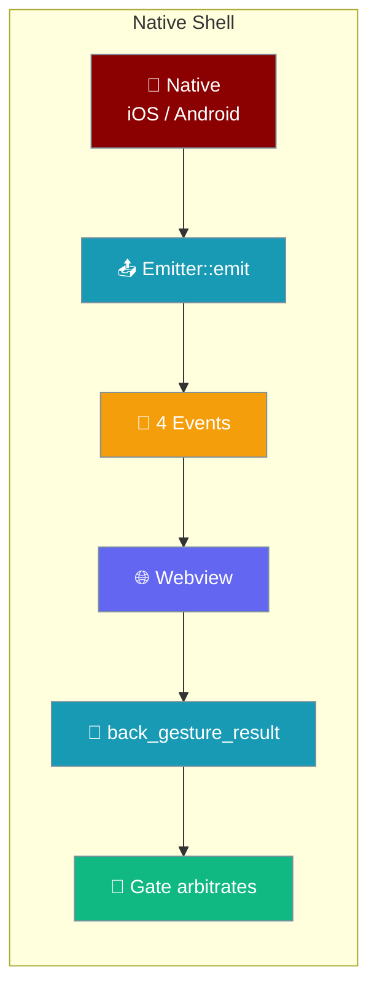
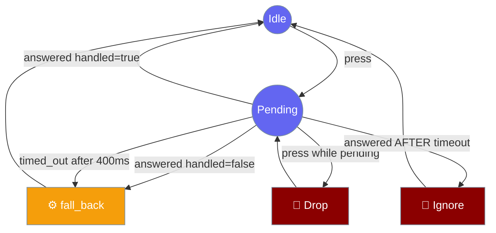

Everything the mobile app *does* runs in the webview. The native shell exists to tell it four things a browser cannot know — the safe-area insets, the keyboard height, the lifecycle phase, and that the user pressed back — and to act on the one answer it sends back.



## Quick Start

<Steps>
<Step title="Enable in a mobile build">
The `praisonai-mobile` npm workspace already carries the Tauri config, so a mobile build needs no extra setup here.

<Note>
The iOS and Android targets initialise separately with `cargo tauri ios init` / `cargo tauri android init`. Those generate `gen/apple` and `gen/android` and are not part of this shell — set them up before a first device build.
</Note>
</Step>

<Step title="Run the desktop dev binary">
`cargo tauri dev` runs `src/main.rs`, the desktop-only dev binary. iOS and Android enter through the `mobile_entry_point` in `lib.rs` instead.

```bash
cd src-tauri && cargo tauri dev
```
</Step>

<Step title="Run the shell tests">
`npm run test:rust` runs the 14 Rust tests that pin the arbitration and the contract.

```bash
npm run test:rust   # → cd src-tauri && cargo test
```

The Node cross-language contract test lives at `tools/shell-seam.test.mjs` and greps the same event strings out of both languages.

<Note>
The same `cargo test` and `cargo clippy -- -D warnings` run in CI on both `ubuntu-22.04` and `macos-15` via the `shell` job in `.github/workflows/mobile.yml`. Both platforms are covered deliberately: the crate is `cfg`-heavy — the back-gesture fallback is `#[cfg(target_os = "android")]` / `ios` / `not(mobile)` — and a `cfg` mistake compiles perfectly on whichever host you happened to try.
</Note>
</Step>
</Steps>

---

## The shell contract — four events + one command

Four events go native → web, one command comes web → native. Every string below is pinned by `src-tauri/tests/contract.rs` on the Rust side and `tools/shell-seam.test.mjs` on the TypeScript side — a rename on either side breaks the shell silently.

| Direction | Name (string literal) | Rust constant | Payload | Notes |
|---|---|---|---|---|
| Native → Web | `safe-area-changed` | `EVT_SAFE_AREA` | Insets object; a payload with no edges = "re-read the CSS" | Consumed by `coerceInsets` in `adapters/src/tauri/shell.ts` |
| Native → Web | `keyboard-height` | `EVT_KEYBOARD` | Number (px) | **`0` is a value, not an absence.** Must fire *through* the show/hide transition, not only at endpoints — or the composer teleports while the keyboard slides |
| Native → Web | `lifecycle` | `EVT_LIFECYCLE` | `"active" \| "inactive" \| "background"` | Unrecognised phase is dropped by TS, never defaulted (defaulting to `active` would resume the render loop while the app is suspended) |
| Native → Web | `back-gesture` | `EVT_BACK` | *(no payload)* | The handler takes no argument |
| Web → Native | `back_gesture_result` | `CMD_BACK_RESULT` | `{ handled: boolean }` | Answered via `bridge.invoke`; failures are swallowed — see arbitration below (no capability entry — app commands via `invoke_handler` are always reachable) |

<Warning>
Tauri exposes two different event channels. TypeScript subscribes via `plugin:event|listen`, which is Tauri's **event registry**. Only `Emitter::emit` reaches it. A Tauri mobile *plugin* calling `Plugin.trigger` hits a **completely separate** channel — nothing would fire and there would be no error. Use `Emitter::emit` from `on_window_event` or command handlers; do not switch to `Plugin.trigger`.
</Warning>

<Note>
The events do not fire yet in a production build. `on_window_event` in `lib.rs` is intentionally a stub in this shell ("no dead emit on desktop") — the contract and the arbitration are wired, the emit lines land once the mobile targets are initialised.
</Note>

The capability file `src-tauri/capabilities/default.json` grants the one permission this seam needs: `core:event:default`, so the webview can subscribe via `plugin:event|listen`. The `back_gesture_result` command is deliberately **not** listed — an app command registered through `invoke_handler` is always reachable and has no ACL entry to grant; naming one that does not exist fails `tauri-build` before the crate compiles.

<Warning>
Do **not** add an `allow-back-gesture-result` (or similar `allow-<command_name>`) entry to `capabilities/default.json`. Only *plugin* commands have ACL entries; app commands registered via `invoke_handler` are always reachable, and naming a non-existent permission fails `tauri-build`.
</Warning>

---

## Back-gesture arbitration

Android presses back, Rust asks the webview whether it wants it, and if the webview says no, Rust lets the system act.



Three failure modes shape the `Gate` in `src-tauri/src/shell/back.rs`.

1. **The answer may never come.** `bridge.invoke` on the TS side swallows every rejection into `null`, so silence is indistinguishable from success. Without a watchdog (`ANSWER_TIMEOUT_MS = 400`), a bundle that failed to load leaves a back button that does nothing *forever* — worse than one that exits.

<Note>
The floor of `ANSWER_TIMEOUT_MS` is enforced at **compile time** in `src-tauri/src/shell/back.rs`:

```rust
const _: () = assert!(ANSWER_TIMEOUT_MS >= 250);
```

Lowering it under 250 ms stops the crate compiling (`E0080`) rather than failing a test someone could skip. Too short a timeout falls back *while a slow handler is still deciding*, sending the app to the background for a back press the user's own UI was about to handle.
</Note>
2. **There is no correlation id.** The webview sends `{ handled }` and nothing else. Two presses close together produce two answers Rust cannot tell apart — the second could pop an activity the first decided to keep. **Dropping while pending is the only correct option available on this side.**
3. **A late answer must not act twice.** If the watchdog fires and the app has backgrounded, an answer arriving after must be ignored, not sent back again. It is the bug this design is most likely to ship, and has its own test in `src-tauri/tests/back_gesture.rs`.

The `Gate` returns an `Action` rather than performing it, so the decision is testable and the side effect lives at the edge.

| Method | Returns | Meaning |
|---|---|---|
| `Gate::new()` | `Gate` | Create in Idle |
| `press()` | `Action::Ask \| Action::Drop` | Ask webview, or drop if already pending |
| `answered(handled: bool)` | `Action::Ignore \| Action::FallBack \| Action` | Ignore if late; fall back if `handled=false` |
| `timed_out()` | `Action::FallBack \| Action::Ignore` | Fall back once; subsequent calls ignore |
| `is_pending()` | `bool` | Test hook |

The fallback itself differs per platform, from `src-tauri/src/commands.rs`.

| Platform | Fallback action | Rationale |
|---|---|---|
| Android | Re-dispatch with our callback disabled so the system default runs | On Android 12+ this moves the task to the back rather than destroying the activity |
| iOS | No-op | An iOS app must never terminate itself — App Review rejection, reads as a crash |
| Desktop (dev) | No-op | The desktop `main.rs` is a dev binary only |

---

## Lifecycle mapping decision

Tauri surfaces two states and `ShellPort` declares three, so `phase_for` in `src-tauri/src/shell/lifecycle.rs` maps between them.

| Tauri event | `phase_for` returns | Semantic on OS |
|---|---|---|
| `WindowEvent::Suspended` | `"background"` | `willResignActive` (iOS) / `onPause` (Android) — semantically **inactive** |
| `WindowEvent::Resumed` | `"active"` | `willEnterForeground` / `onResume` |
| *(anything else)* | *dropped* | TS drops unrecognised phases rather than defaulting |

<Note>
`Suspended` maps to `background`, not `inactive`, and that is deliberate. `boot.ts` only flushes on `background`, and on iOS the app can be killed while suspended with no further callback — so anything unflushed at that moment is lost. Mapping to `inactive` would mean the flush never runs and transcripts are lost on every backgrounding. The cost — a control-centre pull-down stopping the run loop — is the cheaper mistake.
</Note>

`inactive` is not currently emitted by this shell at all; reporting all three phases needs platform code (`didEnterBackgroundNotification` on iOS, `ProcessLifecycleOwner` on Android).

---

## Platform floors

The mobile build sets its platform minimums for the first time in `tauri.conf.json`.

| Platform | Minimum |
|---|---|
| iOS | **16.0** (`bundle.iOS.minimumSystemVersion`) |
| Android | **API 26** (`bundle.android.minSdkVersion`) |
| Bundle identifier | `ai.praison.mobile` |
| Product name | `PraisonAI` |

---

## Panic handling — why release does not set `panic = "abort"`

The release profile deliberately leaves `panic = "abort"` unset, unlike the desktop crate.

> `panic = "abort"` is deliberately NOT set (unlike the desktop crate). `mobile_entry_point` wraps the app in `catch_unwind` so a panic prints and aborts cleanly instead of unwinding across the JNI/ObjC boundary, which is undefined behaviour. `abort` turns a readable message into a bare SIGABRT — on a phone with no console, that is the difference between a crash you can read and one you cannot.

```toml
[profile.release]
codegen-units = 1
lto = true
opt-level = "s"
strip = "debuginfo"
# panic = "abort" -- deliberately NOT set (see above)
```

The same reasoning keeps the `mobile_entry_point` attribute on `run()`: the macro expands to the JNI symbol on Android and `start_app` on iOS, so renaming `run` breaks the entry point.

---

## Best Practices

<AccordionGroup>
<Accordion title="Never rename an event string on one side only">
The seam fails silently — the webview simply stops receiving an event and lays out as though the phone had no notch, keyboard, or lifecycle. Both `contract.rs` and `shell-seam.test.mjs` guard the five constants; run `npm run test:rust` and the Node cross-language test before landing any change to them.
</Accordion>

<Accordion title="Emit keyboard-height continuously through show/hide">
Emitting only `0` → `340` teleports the composer instead of tracking the slide. Fire `keyboard-height` through the whole transition, not just at its endpoints.
</Accordion>

<Accordion title="Do not emit an unrecognised lifecycle phase">
TypeScript drops an unknown phase silently — better to add the phase on both sides than to hope a default kicks in. Defaulting to `active` would resume the render loop on a suspended app.
</Accordion>

<Accordion title="Do not use Plugin.trigger for shell events">
The TypeScript subscribes to Tauri's event registry, which only `Emitter::emit` reaches. `Plugin.trigger` hits a separate channel and fails with no error.
</Accordion>

<Accordion title="Do not lower the answer-timeout below 250 ms">
The floor is a compile-time assertion in `shell::back`, not a runtime test, so lowering it stops the crate compiling. Too short a timeout falls back while a slow handler is still deciding.
</Accordion>

<Accordion title="Keep the mobile_entry_point attribute on run()">
Do not rename `run`. The macro expands to the JNI/ObjC entry point on Android/iOS, and the CLI resolves it by that exact name.
</Accordion>
</AccordionGroup>

---

## Related

<CardGroup cols={2}>
<Card title="Shell & Adapters" icon="mobile-screen" href="/features/mobile/shell-and-adapters">
  The TypeScript/web counterpart — the keyboard snapshot and pinch-zoom guard.
</Card>
<Card title="Architecture" icon="sitemap" href="/features/mobile/architecture">
  Boot order and where the session join lives.
</Card>
<Card title="Overview" icon="mobile" href="/features/mobile/overview">
  Retained chat and native navigation.
</Card>
<Card title="Engines" icon="plug" href="/features/mobile/engines">
  In-process vs remote engine.
</Card>
</CardGroup>
