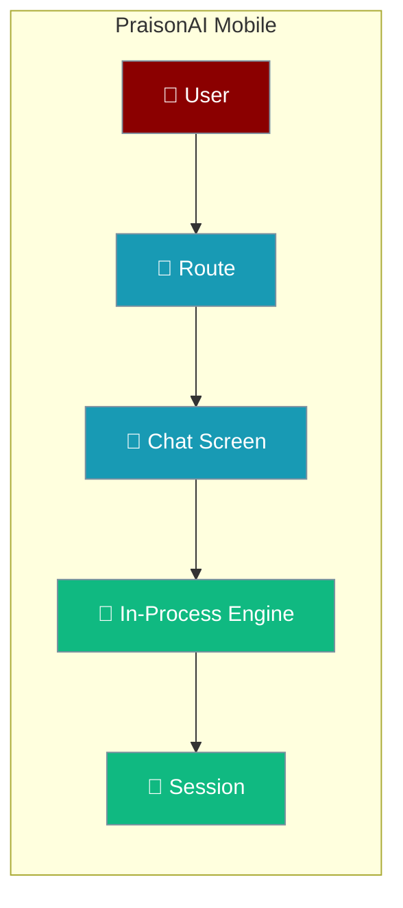

PraisonAI Mobile runs the agent loop on the phone, dispatches routes to real screens, and keeps your conversation exactly where you left it.

## Quick Start

<Steps>
<Step title="Open a conversation">
Tap a chat and the app dispatches the `chat` route to a live screen — the transcript streams the agent's reply token by token.
</Step>

<Step title="Move around, then come back">
Open **Settings**, scroll, tap **About**, then return. The chat screen is retained, so you land back where you were — same scroll position, same in-flight streaming.
</Step>
</Steps>

---

## Navigation

The app dispatches four screens. Only the chat screen survives navigation; the rest rebuild fresh on return.

| Screen | Route | Retained | Why |
|--------|-------|----------|-----|
| `chats` | Chat list | No | Cheap to rebuild; keeps the list fresh |
| `chat` | A conversation | **Yes** | Holds scroll position and live streaming |
| `settings` | Settings | No | Re-reads current values on return |
| `about` | About | No | Static; nothing to preserve |

<Note>
When you scroll up in a conversation, open Settings, and come back, you land where you left off — the transcript keeps its scroll position and any in-flight streaming.
</Note>

Destroying the other screens on exit is deliberate: they re-read fresh state on return instead of showing stale data.

---

## Why it feels native

<AccordionGroup>
<Accordion title="Your conversation is preserved">
The chat screen is the only screen kept in the DOM when you navigate away. Its nodes stay, so scroll position and any streaming reply survive a trip to Settings and back.
</Accordion>

<Accordion title="No blank frame during navigation">
The next screen mounts before the current one hides, so navigation never flashes an empty page.
</Accordion>

<Accordion title="Conversations are saved on this device">
When the on-device engine answers, the completed turn is written to the same session the chat list reads — so a conversation you had is there the next time you open the app.
</Accordion>
</AccordionGroup>

---

## Related

<CardGroup cols={2}>
<Card title="Architecture" icon="layer-group" href="/features/mobile/architecture">
How routes become screens, and where the session join lives.
</Card>
<Card title="Engines" icon="plug" href="/features/mobile/engines">
The in-process engine, and how it persists a turn.
</Card>
</CardGroup>
