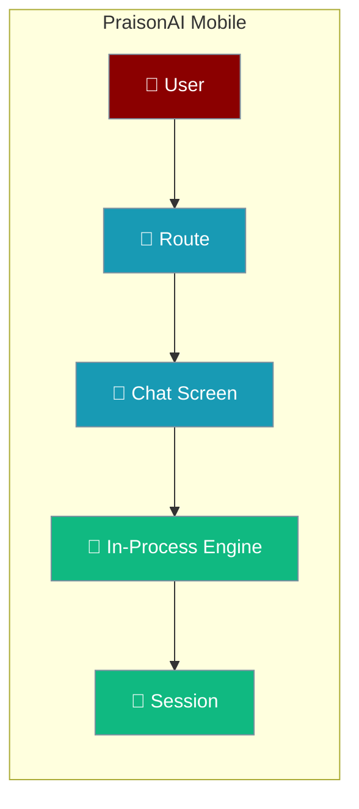
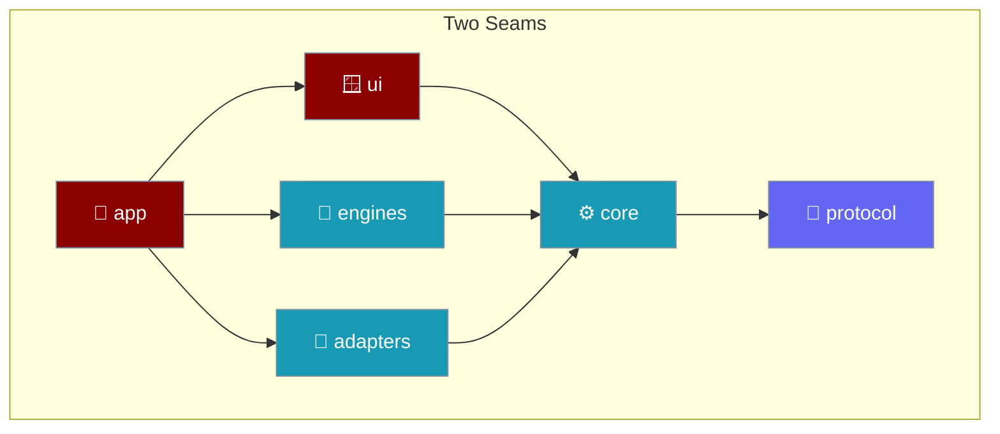
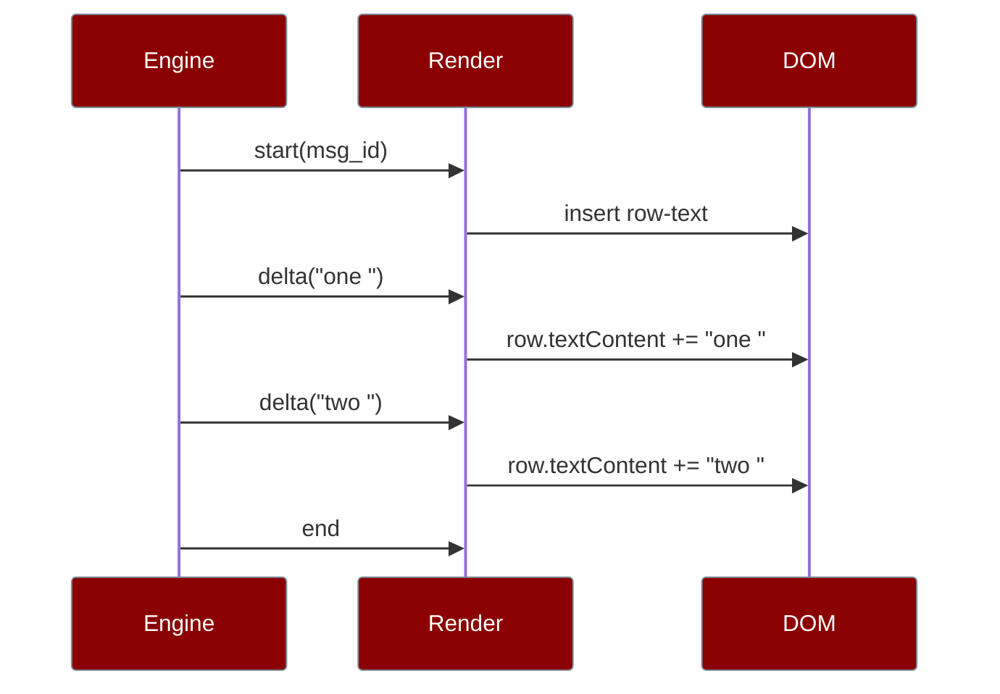
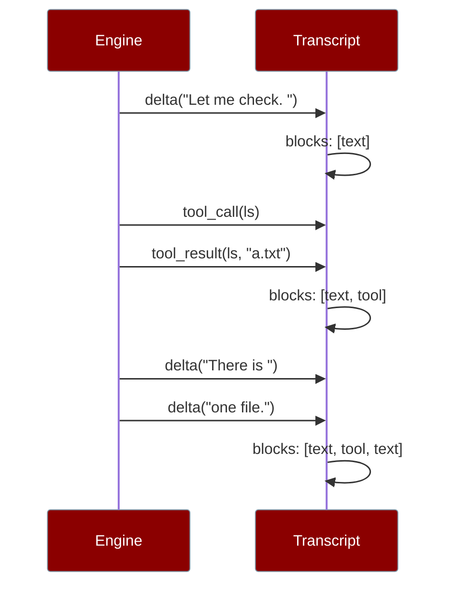
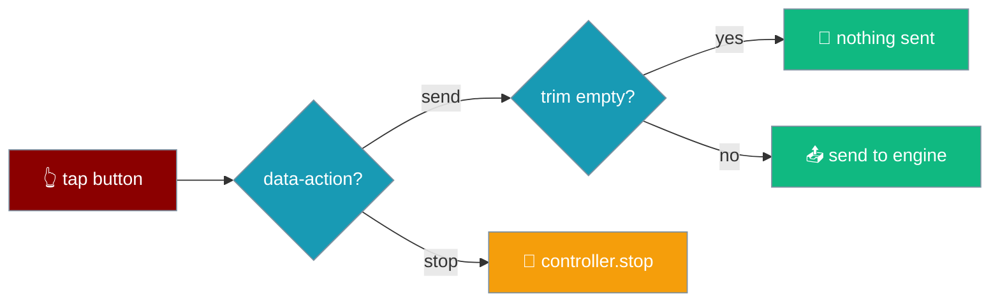

PraisonAI Mobile runs the agent loop on the phone, dispatches routes to real screens, and keeps your conversation exactly where you left it. One bundle ships to **three targets** — iOS (Tauri), Android (Tauri), and the **Web** (an installable PWA) — with the native shell providing the on-device platform integration a browser cannot.

Run PraisonAI agents natively on iOS and Android — no server, no Python, no subprocess — or open the same app as a PWA in any browser tab.

<Note>
The same `dist/` serves all three: the Tauri shell on iOS and Android, and a browser as a Progressive Web App. The manifest, icons, and service worker are inert inside the shell, so one build covers every target. See [Web App (PWA)](/features/mobile/web-app).
</Note>

```ts
import { createRemoteHttpEngine } from "praisonai-mobile/engines/remote-http";

const engine = createRemoteHttpEngine({ baseUrl: "http://127.0.0.1:8765", http });
for await (const event of engine.run({ prompt: "Plan my week", chatId: "c1", runId: "r1", tools: true, regenerateOf: null, attachments: [] }, signal)) {
  if (event.type === "delta") console.log(event.text);
}
```



`praisonai-mobile` is a Tauri 2 shell around a webview that runs the agent loop in-process. The whole conversation happens on the device.

<Info>
Assistant messages and tool results render as plain text by construction — every row's content is set through `textContent`, never `innerHTML`. Model output, tool results, and summarised web pages cannot inject markup into the transcript. An untrusted string can appear on screen; it cannot become a script.
</Info>

## Quick Start

<Steps>
<Step title="Clone and install">
```bash
git clone https://github.com/MervinPraison/PraisonAI
cd PraisonAI/src/praisonai-mobile
npm install
```
</Step>

<Step title="Open a conversation">
Tap a chat and the app dispatches the `chat` route to a live screen — the transcript streams the agent's reply token by token.
</Step>

<Step title="Move around, then come back">
Open **Settings**, scroll, tap **About**, then return. The chat screen is retained, so you land back where you were — same scroll position, same in-flight streaming.
</Step>

<Step title="Verify everything passes">
```bash
npm run check
```
`check` runs `typecheck`, `boundaries`, and `test` — the three gates that keep the two seams honest.
</Step>
</Steps>

<Note>
The app ships on **iOS 16+** and **Android API 26+** via Tauri. The native shell handles safe-area insets, keyboard height, lifecycle, and the back gesture — see [Native Shell](/features/mobile/native-shell).
</Note>

---

## Navigation

The app dispatches four screens. Only the chat screen survives navigation; the rest rebuild fresh on return. The top bar carries a **Chats** button next to **New chat** and **Settings**.

| Screen | Route | Retained | Why |
|--------|-------|----------|-----|
| `chats` | Chat list | No | Rebuilds from a fresh snapshot each visit |
| `chat` | A conversation | **Yes** | Holds scroll position and live streaming |
| `settings` | Settings | No | Re-reads current values on return |
| `about` | About | No | Static; nothing to preserve |

<Note>
When you scroll up in a conversation, open Settings, and come back, you land where you left off — the transcript keeps its scroll position and any in-flight streaming. `main.ts` registers the retained chat screen with `screens.nodes.set("chat", screen)`, so `transition` treats it as live and never rebuilds it.
</Note>

Destroying the other screens on exit is deliberate: they re-read fresh state on return instead of showing stale data. The `chats` screen fetches a fresh snapshot each visit — `session.list()` plus `repository.listUnreadable()` — so a chat created since the list was last seen appears, and one deleted is gone. See [History & Reopen](/features/mobile/history-and-reopen).

### New chat

New chat is a clean break: it stops any live run, mints a fresh `chat_id`, and resets session and transcript state.

| Step | What happens | Why |
|------|--------------|-----|
| Stop the run | `controller.stop()` | Without this the previous turn kept streaming; its next token re-inserted the old rows into the "fresh" chat. |
| Mint a new id | `controller.setChat(mintChatId())` | `setChat` was never called before, so every request carried `chat_id: "unassigned"` and an engine keyed one thread for every conversation. |
| Reset state | `session.reset()`, clear render and transcript | Starts the new conversation from empty. |
| Reset the turn | `setChat` also sets `turn = initialTurn` | Without this, a pending approval from the previous chat reappeared on the next Send with live buttons. |
| Clear the live regions | `polite.textContent = ""`, `assertive.textContent = ""` | Resetting `announcer` decides what to *say* next; it does not empty the regions themselves. Without this, the previous conversation's answer stayed in the accessibility tree of what the user believes is an empty chat — not announced again, but still there for anyone navigating the page. |

```ts
// main.ts — the "new-chat" intent, in order.
void app.controller.stop();           // stop FIRST
app.controller.setChat(mintChatId()); // own chat_id, and resets turn
app.session.reset();
transcript.textContent = "";          // safe: not a live region
polite.textContent = "";              // clear the live regions too
assertive.textContent = "";           // — resetting `announcer` clears
                                       //   what to SAY next, not what
                                       //   the regions still HOLD.
```

<Warning>
The stop comes **before** the clear. Clearing without stopping left the previous run streaming into an empty render, which re-inserted the old conversation's rows — and queued prompts ran into it too.
</Warning>

<Warning>
The transcript is a plain element; the live regions are what a screen reader inspects. Emptying one is not emptying the other. New chat has to clear both.
</Warning>

<Note>
**The launch conversation also gets a real `chat_id`.** `createApp` now passes `chatId: deps.newChatId()` into `createRunController`, so the very first conversation of every launch — the one the user never explicitly created via New chat — no longer goes to the engine as the literal `"unassigned"`. Against an engine keying history by `chat_id`, that string once made every user's first chat on every device one shared thread. See [Architecture — Boot Order](/features/mobile/architecture#boot-order).
</Note>

---

## Why It Matters

Every selling point is one line.

| Feature | What you get |
|---------|--------------|
| On-device runtime | The agent loop runs inside the phone webview. |
| Offline-capable shell | The UI shell persists chats and settings locally. |
| Swappable engine | `praisonai-ts` (in-process) or `remote-http`, same interface. |
| Swappable UI shell | Tauri today, React Native later — one directory swap. |
| 11-event streaming protocol | Every token, tool call, and result is a typed event. |
| Approvals & cancellation | Human-in-the-loop and Stop are built into the run loop. |

---

## How It Works

The app is six layers with two enforced seams: one for the agent framework, one for the UI shell.



A streaming answer is one text row. Every `delta` event advances the render state in place; the row's `textContent` grows, but the DOM node is the same one from the `start` event to the `end` event.



### Tool cards survive text on either side

A tool row is its own block; the text before and after it are two more. When the answer keeps talking after a tool result, the transcript's block list is `["text", "tool", "text"]` — never `["text", "text"]` with the tool row overwritten. Appending to the trailing text block extends only that block; it must not touch the block before it.



<Note>
The tool row is not merged into an adjacent text block — its output belongs to a specific `tool_call` and lives on its own row. Rendering that treats the transcript as one growing string cannot represent a tool that ran mid-answer.
</Note>

<Note>
The transcript carries a **jump-to-latest** button, hidden by default and shown only when you have scrolled off the bottom of a streaming transcript. New tokens never yank you back down while you are reading; a tap on the button follows the stream again. See [Follow & Jump](/features/mobile/follow-and-jump).
</Note>

---

## Composer

The composer button toggles between Send and Stop, refuses empty input, and keeps your draft as data — so it survives a trip to Settings and autosizes as you type. Full detail on [Composer Behavior](/features/mobile/composer-behavior).

| Behaviour | How it works | Why |
|-----------|--------------|-----|
| Send / Stop | The button carries `data-action="send"` and reads **Send** when idle; while a run streams, the dataset flips to `data-action="stop"` **and the label flips to Stop in the same pass**. | Label and behaviour must never disagree — a button that reads *Send* and stops a run, or reads *Stop* while sending, is a bug no dataset-only assertion catches. Tapping Stop calls `controller.stop()` — the run ends and no further tokens are billed. |
| Empty and whitespace input | The composer trims and blocks a submit whose remaining text is `""`. Send is disabled when the trimmed draft is `""`; **Stop is always tappable while streaming** — the disable is guarded on the action (`streaming ? false : draftOf(state).trim() === ""`) so Stop never goes dead just because the draft happens to be empty. | Whitespace-only prompts never reach the engine, and a streaming run can always be stopped. |
| Draft persistence | The draft lives in `ComposerState`, keyed by conversation — not in the `<textarea>`. Navigating to Settings and back restores what you typed. | A route change unmounts the field but not the value; iOS also kills suspended apps without warning. |
| Autosize | The height is `heightFor(lineCountOf(text))` on every draft change, clamped between `COMPOSER_MIN_PX` (52) and `COMPOSER_MAX_PX` (160). | The floor keeps a hit target; the ceiling stops the composer eating the transcript. A mid-rotation NaN falls back to the floor. |
| Enter under enter-sends | On a tablet with a hardware keyboard, the composer picks `enter-sends` and a bare **Enter** submits. **Shift+Enter** and **Alt+Enter** both insert a newline instead. | Alt is the newline muscle memory on some keyboard layouts; if only Shift+Enter escaped enter-sends, **Alt+Enter would SEND a half-written message** — the exact behaviour [#4589](https://github.com/MervinPraison/PraisonAI/pull/4589) fixed. |



<Info>
Alt+Enter and Shift+Enter are equivalent under enter-sends. On-screen keyboards without an Alt key are unaffected — they never send with Alt. Pinned by `"Alt+Enter inserts a newline under enter-sends, like Shift+Enter"` and `"a bare Enter still sends under enter-sends"` in `composer.test.ts`.
</Info>

---

## Best Practices

<AccordionGroup>
<Accordion title="Your conversation is preserved">
The chat screen is the only screen kept in the DOM when you navigate away. Its nodes stay, so scroll position and any streaming reply survive a trip to Settings and back.
</Accordion>

<Accordion title="No blank frame during navigation">
The next screen mounts before the current one hides, so navigation never flashes an empty page.
</Accordion>

<Accordion title="Conversations are saved on this device">
When the on-device engine answers, the completed turn is written to the same session the chat list reads — so a conversation you had is there the next time you open the app.
</Accordion>

<Accordion title="Pick the engine that reports what your UI renders">
The in-process `praisonai-ts` engine executes tools but does not announce them, so `capabilities.tools` is `false`. Use `remote-http` when you need tool rows, approvals, or reasoning in the UI.
</Accordion>

<Accordion title="Treat every stream event as typed">
Read events through the 11-event protocol rather than parsing prose. A tool call that silently failed still looks like a normal answer if you infer from text.
</Accordion>

<Accordion title="Never derive message indices client-side">
`end.userIndex` comes from the engine. A cancelled or errored turn is never persisted, so any index you compute from screen position drifts.
</Accordion>

<Accordion title="Assert the composer label, not just its dataset">
`data-action` and `textContent` are set from the same render tick — both keyed on `view.turn.phase === "streaming"`. Assert the label in tests, not just the dataset: a transposition of the ternary that assigns the label survives every test that only reads `data-action`, leaving a button that reads *Send* while it stops the run.
</Accordion>
</AccordionGroup>

---

## Related

<CardGroup cols={2}>
<Card title="Architecture" icon="layer-group" href="/features/mobile/architecture">
How routes become screens, and where the session join lives.
</Card>
<Card title="Engines" icon="plug" href="/features/mobile/engines">
The in-process engine, and how it persists a turn.
</Card>
<Card title="Native Shell" icon="mobile-button" href="/features/mobile/native-shell">
The Tauri shell — safe-area, keyboard, lifecycle, and back-gesture arbitration.
</Card>
<Card title="Web App (PWA)" icon="globe" href="/features/mobile/web-app">
The third target — installable, offline-capable, deployed to GitHub Pages.
</Card>
<Card title="Getting Started" icon="play" href="/features/mobile/getting-started">
Clone, run in the webview, and swap engines.
</Card>
<Card title="History & Reopen" icon="clock-rotate-left" href="/features/mobile/history-and-reopen">
The chats list and reopening a stored conversation.
</Card>
<Card title="Composer Behavior" icon="keyboard" href="/features/mobile/composer-behavior">
Draft persistence, autosize, and the Enter policy.
</Card>
<Card title="Follow & Jump" icon="arrow-down-to-line" href="/features/mobile/follow-and-jump">
Stick-to-bottom and jump-to-latest.
</Card>
<Card title="Route Focus" icon="crosshairs" href="/features/mobile/route-focus">
Where focus lands on every route change.
</Card>
</CardGroup>
