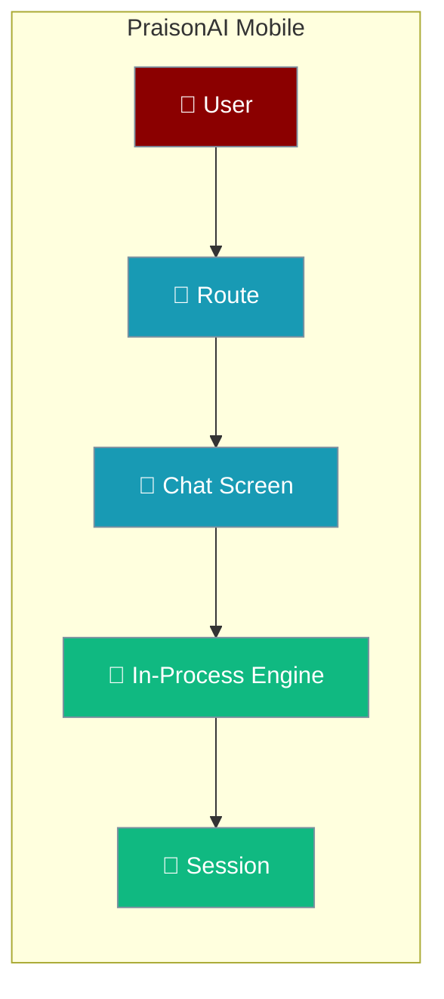
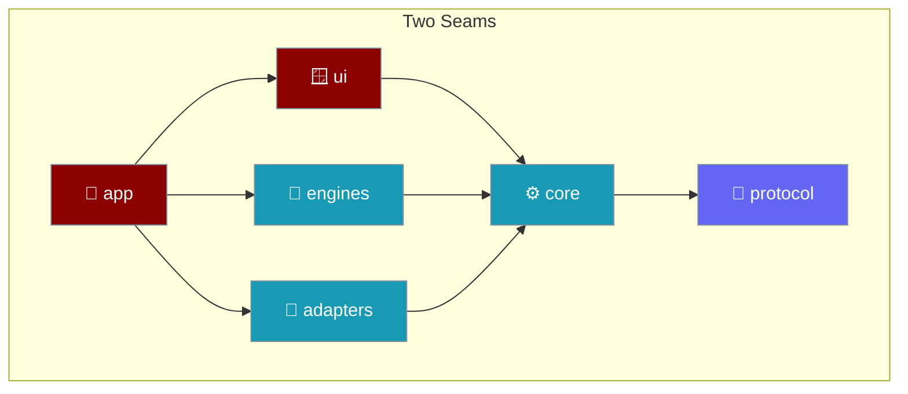

PraisonAI Mobile runs the agent loop on the phone, dispatches routes to real screens, and keeps your conversation exactly where you left it — wrapped in a native Tauri shell that provides the platform integration a browser cannot.

Run PraisonAI agents natively on iOS and Android — no server, no Python, no subprocess.

```ts
import { createRemoteHttpEngine } from "praisonai-mobile/engines/remote-http";

const engine = createRemoteHttpEngine({ baseUrl: "http://127.0.0.1:8765", http });
for await (const event of engine.run({ prompt: "Plan my week", chatId: "c1", runId: "r1", tools: true, regenerateOf: null, attachments: [] }, signal)) {
  if (event.type === "delta") console.log(event.text);
}
```



`praisonai-mobile` is a Tauri 2 shell around a webview that runs the agent loop in-process. The whole conversation happens on the device.

<Info>
Assistant messages and tool results render as plain text by construction — every row's content is set through `textContent`, never `innerHTML`. Model output, tool results, and summarised web pages cannot inject markup into the transcript. An untrusted string can appear on screen; it cannot become a script.
</Info>

## Quick Start

<Steps>
<Step title="Clone and install">
```bash
git clone https://github.com/MervinPraison/PraisonAI
cd PraisonAI/src/praisonai-mobile
npm install
```
</Step>

<Step title="Open a conversation">
Tap a chat and the app dispatches the `chat` route to a live screen — the transcript streams the agent's reply token by token.
</Step>

<Step title="Move around, then come back">
Open **Settings**, scroll, tap **About**, then return. The chat screen is retained, so you land back where you were — same scroll position, same in-flight streaming.
</Step>

<Step title="Verify everything passes">
```bash
npm run check
```
`check` runs `typecheck`, `boundaries`, and `test` — the three gates that keep the two seams honest.
</Step>
</Steps>

<Note>
The app ships on **iOS 16+** and **Android API 26+** via Tauri. The native shell handles safe-area insets, keyboard height, lifecycle, and the back gesture — see [Native Shell](/features/mobile/native-shell).
</Note>

---

## Navigation

The app dispatches four screens. Only the chat screen survives navigation; the rest rebuild fresh on return.

| Screen | Route | Retained | Why |
|--------|-------|----------|-----|
| `chats` | Chat list | No | Cheap to rebuild; keeps the list fresh |
| `chat` | A conversation | **Yes** | Holds scroll position and live streaming |
| `settings` | Settings | No | Re-reads current values on return |
| `about` | About | No | Static; nothing to preserve |

<Note>
When you scroll up in a conversation, open Settings, and come back, you land where you left off — the transcript keeps its scroll position and any in-flight streaming.
</Note>

Destroying the other screens on exit is deliberate: they re-read fresh state on return instead of showing stale data.

### New chat

New chat is a clean break: it stops any live run, mints a fresh `chat_id`, and resets session and transcript state.

| Step | What happens | Why |
|------|--------------|-----|
| Stop the run | `controller.stop()` | Without this the previous turn kept streaming; its next token re-inserted the old rows into the "fresh" chat. |
| Mint a new id | `controller.setChat(mintChatId())` | `setChat` was never called before, so every request carried `chat_id: "unassigned"` and an engine keyed one thread for every conversation. |
| Reset state | `session.reset()`, clear render and transcript | Starts the new conversation from empty. |

```ts
// main.ts — the "new-chat" intent, in order.
void app.controller.stop();          // stop FIRST
app.controller.setChat(mintChatId()); // own chat_id
app.session.reset();
transcript.textContent = "";          // safe: not a live region
```

<Warning>
The stop comes **before** the clear. Clearing without stopping left the previous run streaming into an empty render, which re-inserted the old conversation's rows — and queued prompts ran into it too.
</Warning>

---

## Why It Matters

Every selling point is one line.

| Feature | What you get |
|---------|--------------|
| On-device runtime | The agent loop runs inside the phone webview. |
| Offline-capable shell | The UI shell persists chats and settings locally. |
| Swappable engine | `praisonai-ts` (in-process) or `remote-http`, same interface. |
| Swappable UI shell | Tauri today, React Native later — one directory swap. |
| 11-event streaming protocol | Every token, tool call, and result is a typed event. |
| Approvals & cancellation | Human-in-the-loop and Stop are built into the run loop. |

---

## How It Works

The app is six layers with two enforced seams: one for the agent framework, one for the UI shell.



---

## Best Practices

<AccordionGroup>
<Accordion title="Your conversation is preserved">
The chat screen is the only screen kept in the DOM when you navigate away. Its nodes stay, so scroll position and any streaming reply survive a trip to Settings and back.
</Accordion>

<Accordion title="No blank frame during navigation">
The next screen mounts before the current one hides, so navigation never flashes an empty page.
</Accordion>

<Accordion title="Conversations are saved on this device">
When the on-device engine answers, the completed turn is written to the same session the chat list reads — so a conversation you had is there the next time you open the app.
</Accordion>

<Accordion title="Pick the engine that reports what your UI renders">
The in-process `praisonai-ts` engine executes tools but does not announce them, so `capabilities.tools` is `false`. Use `remote-http` when you need tool rows, approvals, or reasoning in the UI.
</Accordion>

<Accordion title="Treat every stream event as typed">
Read events through the 11-event protocol rather than parsing prose. A tool call that silently failed still looks like a normal answer if you infer from text.
</Accordion>

<Accordion title="Never derive message indices client-side">
`end.userIndex` comes from the engine. A cancelled or errored turn is never persisted, so any index you compute from screen position drifts.
</Accordion>
</AccordionGroup>

---

## Related

<CardGroup cols={2}>
<Card title="Architecture" icon="layer-group" href="/features/mobile/architecture">
How routes become screens, and where the session join lives.
</Card>
<Card title="Engines" icon="plug" href="/features/mobile/engines">
The in-process engine, and how it persists a turn.
</Card>
<Card title="Native Shell" icon="mobile-button" href="/features/mobile/native-shell">
The Tauri shell — safe-area, keyboard, lifecycle, and back-gesture arbitration.
</Card>
<Card title="Getting Started" icon="play" href="/features/mobile/getting-started">
Clone, run in the webview, and swap engines.
</Card>
<Card title="Protocol" icon="network-wired" href="/features/mobile/protocol">
The 11 events every engine speaks.
</Card>
</CardGroup>
