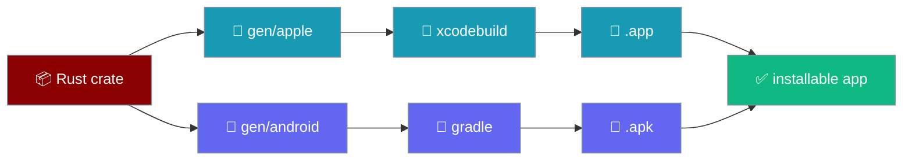
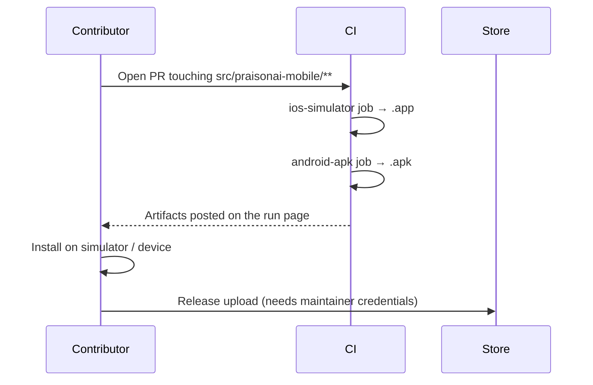

The two platform projects (`gen/apple`, `gen/android`) are committed to the repo, and the `mobile platforms` workflow turns the crate into a real installable app on every mobile PR.



## Quick Start

<Steps>
<Step title="Run both builds locally">
Build the simulator `.app` and the debug `.apk` from a fresh clone.

```bash
cd src/praisonai-mobile
npm ci
npx tauri ios build --debug --target aarch64-sim --no-sign --ci
npx tauri android build --debug --apk --target aarch64 --ci
```

Both projects already exist, so `init` is a no-op — the builds run straight through.
</Step>

<Step title="Or let CI do it for you">
The `mobile platforms` workflow runs on every PR that touches `src/praisonai-mobile/**`. Open the run page and download the `PraisonAI-ios-simulator-app` and `PraisonAI-android-debug-arm64-apk` artifacts.

```bash
# nothing to run — push a branch that changes src/praisonai-mobile/** and the workflow starts
```
</Step>

<Step title="Regenerate a project if you truly need to">
The init step is guarded: if `src-tauri/gen/apple` (or `gen/android`) exists, it is not regenerated. Delete the folder first if you truly need a fresh one.

```bash
rm -rf src-tauri/gen/apple      # only if you must regenerate
npx tauri ios init --ci --skip-targets-install
```
</Step>
</Steps>

---

## How It Works

A mobile PR triggers CI, both jobs build inside the committed projects, and the artifacts land on the run page for a contributor to install.



| Job | Runner | Produces | How it verifies |
|---|---|---|---|
| `ios-simulator` | `macos-15` | Unsigned arm64 simulator `.app`, zipped with `ditto` | Reads `CFBundleExecutable` from `Info.plist`, greps Rust crate symbols out of the binary (Rust is linked as a `staticlib`, so there is no `.so` on iOS) |
| `android-apk` | `ubuntu-22.04` | Debug arm64-v8a `.apk` | `unzip -l` asserts `lib/arm64-v8a/libpraisonai_mobile_lib.so` is inside |

---

## Storage per build

`storageFor(kind, bridge, view)` (`app/src/platform.ts`) picks the backing store from the detected platform, so the native build gets durable disk and the web build gets `localStorage`:

| Build | Storage | Durability |
|---|---|---|
| Tauri (iOS, Android, macOS, Windows, Linux desktop) | Native filesystem under the app's data directory | Survives eviction, WebKit reclaims, "clear cache" |
| Web | `localStorage` | Survives the tab; may be evicted under storage pressure or cleared by the user |

Only **storage** moved to a native adapter. Two ports stay on the web adapter under Tauri, deliberately, for now — `platform.ts` says so in a comment (*"a deliberate, temporary state and not an oversight"*):

- **Secrets** — a keychain `SecretsPort` is its own piece of work; `createWebSecrets()` is used on Tauri today. See [Storage & Secrets → SecretsPort](/features/mobile/storage-and-secrets#secretsport).
- **HTTP** — a Rust-side `HttpPort` (so a request is not subject to the WebView) is its own piece of work; `createWebHttp()` is used today.

See [Storage & Secrets](/features/mobile/storage-and-secrets#native-store-on-tauri) for the native store's layout, the atomic write path, and the one-time migration out of `localStorage`.

---

## Why both projects are committed

Committing both projects means any contributor builds either platform from a fresh clone, on any OS, with no init step.

- `gen/android` is generated locally and committed, so a Linux contributor never needs `xcodegen` or macOS to change Android code.
- `gen/apple` is generated on the `macos-15` runner the first time (the workflow uploads it as the `gen-apple` artifact) and then committed, because the maintainer's laptop has only Command Line Tools, not Xcode. Once committed, the init step becomes a no-op — the workflow's own final run proves that, with no `gen-apple` artifact.
- `gen/apple/.gitignore` and `gen/android/.gitignore` (and `gen/android/app/.gitignore`) are the template's own — they exclude `build/`, `xcuserdata/`, `Externals/`, and the like, so only source is committed.

---

## The mobile-platforms workflow — job by job

The workflow lives at `.github/workflows/mobile-platforms.yml` and runs two jobs.

- **Triggers:** `workflow_dispatch` plus `pull_request` on `src/praisonai-mobile/**` and on the workflow file itself.
- **Concurrency group:** `mobile-platforms-${{ github.ref }}` with `cancel-in-progress: true`.

### iOS — `ios-simulator`

Runs on `macos-15` with Node 22.18 and Rust targets `aarch64-apple-ios,aarch64-apple-ios-sim`.

`brew install xcodegen` runs up front so the CLI does not prompt for it mid-run. The build uses `--target aarch64-sim --no-sign --debug`. A dedicated step copies `src-tauri/icons/ios/*.png` into `Assets.xcassets/AppIcon.appiconset/`, because `tauri ios init` writes the CLI's own placeholder AppIcon and never replaces it (`tauri icon` writes only to `src-tauri/icons/ios/`, with no iOS-project wiring).

| Assertion | Why |
|---|---|
| An `.app` exists under `build/arm64-sim/…` | The bundler exits 0 on a silently-skipped target |
| `file $exe` reports `arm64` | We asked for the simulator SDK on Apple silicon |
| The Rust crate symbols are inside the binary | Rust is linked as a `staticlib` on iOS — there is no `.so` to look for |
| Symbols dumped to a temp file before `grep -qi` | `strings \| grep -q` under `pipefail` reports SIGPIPE as a failed pipeline, so the check *failed* when it *found* the symbol |

### Android — `android-apk`

Runs on `ubuntu-22.04` with JDK **17 Temurin** — Gradle 8.14.3's Groovy front end rejects JDK 25 with *"Unsupported class file major version 69"*, and 17 is what AGP 8.11 documents.

`android-actions/setup-android` installs `platform-tools platforms;android-36 build-tools;36.0.0`. The NDK is `r28c` (28.2.13676358) via `nttld/setup-ndk@v1` with `add-to-path: false`, exported as `NDK_HOME`. The Rust target is `aarch64-linux-android`, and the build passes `--target aarch64` on purpose — every phone sold in the last several years is arm64-v8a, and the `universal` segment in the output path is Gradle's name for "not split per ABI", not a claim about content. Verification asserts the APK contains `lib/arm64-v8a/libpraisonai_mobile_lib.so`.

---

## Icons

Every raster the app needs is generated from one source vector, never edited by hand.

| File | Purpose |
|---|---|
| `icon/app-icon.svg` | Source vector — a geometric **P** with one amber dot on flat indigo `#312E81`, white foreground |
| `icon/app-icon.png` | 1024×1024 store icon (the App Store's minimum) — regenerated from the SVG |
| `icon/render.sh` | Renders every raster the CLI needs from the SVG |
| `icon/icon.json` | Input to `npx tauri icon` — regenerates the full iOS AppIcon set, Android adaptive-icon mipmaps, and desktop icons |
| `icon/android-{fg,bg,monochrome}.png` + `.svg` | Adaptive-icon layers used by `mipmap-anydpi-v26/ic_launcher.xml` |

The mark is generated art, and says so — there was no source art (`icons/icon.png` was a 512 px placeholder) and stores want 1024. Any redesign replaces the SVG and re-runs `render.sh` + `npx tauri icon icon/icon.json`.

---

## What CI still can't do (needs maintainer credentials)

The per-PR builds are unsigned; a real store upload needs credentials that are the maintainer's and live outside the repo.

| Target | What's missing | Where it goes |
|---|---|---|
| iOS device / TestFlight / App Store | Apple Developer Team ID | `bundle.iOS.developmentTeam` in `src-tauri/tauri.conf.json` (currently unset) |
| iOS device / TestFlight / App Store | Distribution cert + provisioning profile on the runner, **or** App Store Connect API creds | `APPLE_API_ISSUER`, `APPLE_API_KEY`, `APPLE_API_KEY_PATH` env vars (`tauri` picks them up) |
| iOS build command with signing | — | `tauri ios build --export-method app-store-connect` (a 1024 px icon is already at `icon/app-icon.png`) |
| Android release / Play Store | Release keystore for `gen/android/app` | `keystore.properties` (already `.gitignore`d by the template) |
| Android release / Play Store | Play Console listing | — |
| Android release build command | — | `tauri android build --aab` |

Nothing else is blocked, and neither credential is needed for the builds this workflow runs on every PR.

---

## Best Practices

<AccordionGroup>
<Accordion title="Don't hand-run tauri ios init / tauri android init on a checked-out tree">
Both projects exist; re-init would fight the guard in the workflow. If you truly need to regenerate one, delete the folder first — this is the CLI's own contract.
</Accordion>

<Accordion title="Regenerate icons through render.sh and npx tauri icon, never by hand">
The Android adaptive icons and the iOS `AppIcon.appiconset` are wired to specific filenames the tools own. Edit `icon/app-icon.svg`, then re-run `render.sh` and `npx tauri icon icon/icon.json`.
</Accordion>

<Accordion title="Do not lower the Android minSdk below 26 without also lowering the WebView floor">
See [Shipping to Stores → The bundle must parse on the floor](/features/mobile/shipping-to-stores#the-bundle-must-parse-on-the-floor).
</Accordion>

<Accordion title="Trust the workflow, not the step passing">
The bundler exits 0 on a silently-skipped target — the workflow's verification steps look inside the produced artifact on purpose.
</Accordion>
</AccordionGroup>

---

## Related

<CardGroup cols={2}>
<Card title="Shipping to Stores" icon="mobile-screen-button" href="/features/mobile/shipping-to-stores">
  The CSP, WebView floor, and monotonic versioning story.
</Card>
<Card title="Native Shell" icon="mobile-button" href="/features/mobile/native-shell">
  The Tauri events and the back-gesture arbitration.
</Card>
<Card title="Getting Started" icon="play" href="/features/mobile/getting-started">
  Clone, run in the webview, and get a chat answering.
</Card>
<Card title="Architecture" icon="sitemap" href="/features/mobile/architecture">
  Boot order and where the shell is injected.
</Card>
</CardGroup>
