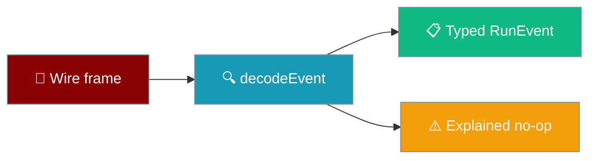
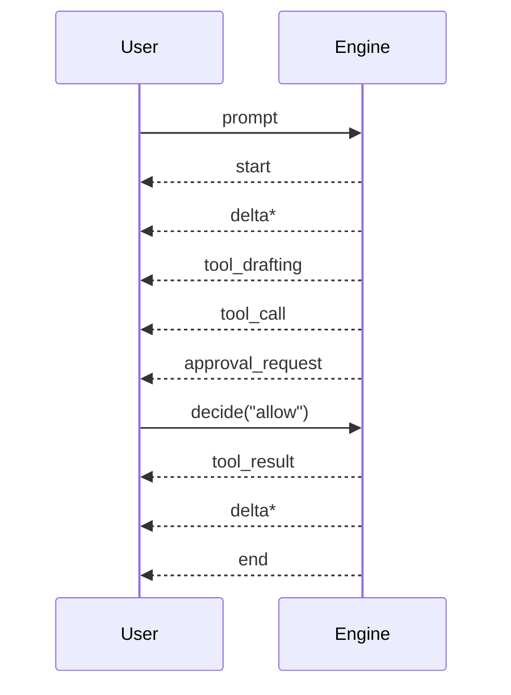

Every turn is a stream of typed events, decoded once so nothing above has to parse prose.

```ts
import { decodeEvent, isDecoded } from "praisonai-mobile/protocol/decode";

const outcome = decodeEvent(rawFrame);
if (isDecoded(outcome) && outcome.event.type === "delta") {
  render(outcome.event.text);
}
```



## Quick Start

<Steps>
<Step title="Decode a frame">
```ts
const outcome = decodeEvent(rawFrame);
```
`decodeEvent` never throws. Every rejection is a value with a reason, so a client can count them.
</Step>

<Step title="Stop at the terminal event">
```ts
import { isTerminal } from "praisonai-mobile/protocol/events";

if (isTerminal(event)) return;
```
After a terminal event nothing else follows.
</Step>
</Steps>

---

## What Happens To A Rejection

A rejection is not silent — it lands on the transcript as a dropped row.

<Warning>
A refused frame is **not** discarded. The mobile app surfaces it as a dropped event, so a shorter-than-expected reply must never be treated as a clean answer. See [Dropped Events](/features/mobile/dropped-events).
</Warning>

`parseFrame` adds two reasons the decoder alone could not report — `unparseable_json` (an HTML error page or truncated body) and `not_an_object` (a JSON array, string, or `null`) — so five distinct wire failures are no longer collapsed to one `missing_msg_id`.

---

## The 11 Events

Every event carries `msgId`. Fields listed are the ones beyond that.

| Event | Purpose | Key fields | Terminal |
|-------|---------|-----------|----------|
| `start` | A turn begins | `runId` | No |
| `delta` | Assistant text | `text` (never empty) | No |
| `reasoning` | Intermediate thinking | `text` | No |
| `tool_drafting` | A tool is being drafted (a status, not a row) | `name` | No |
| `tool_call` | A tool call is issued | `callId`, `name`, `args` | No |
| `tool_result` | A tool call returns | `callId`, `name`, `ok`, `output`, `seconds` | No |
| `approval_request` | The agent asks permission | `approvalId`, `callId`, `name`, `args` | No |
| `usage` | Cost/timing report | `chars`, `seconds`, `ttftSeconds` | No |
| `cancelled` | The turn was stopped | `runId` | **Yes** |
| `error` | The turn failed | `kind`, `message` | **Yes** |
| `end` | The turn completed | `userIndex`, `assistantIndex`, `versions`, `active` | **Yes** |

---

## What The Decoder Refuses

`decodeEvent` takes `unknown`, so the validation below is the wire contract — not a suggestion a buggy engine adapter can skip.

| Rule | Behaviour | Why it matters |
|------|-----------|----------------|
| Empty-string `msg_id`, `type`, `call_id`, `approval_id` | Frame is refused (surfaces as a dropped row) | An empty `msg_id` is accepted-then-orphaned: every later event mismatches it and is dropped as `wrong_msg_id` — the UI reports "engine said nothing". |
| `NaN` / `+Infinity` / `-Infinity` in `versions`, `active`, `chars`, `seconds` | Not a finite number, so the field falls back to its default (`1`, `0`, `undefined`, `null` respectively) | JSON cannot carry these, but `decodeEvent` takes `unknown` and a buggy engine adapter can. |
| `versions` | Clamped to `Math.max(1, versions)` — never `0` or negative | `versions: 0` reaching the UI = a message that exists in zero versions. |
| `active` | Clamped into `[0, versions - 1]` | An out-of-range `active` renders the message bubble blank. |
| `assistant_index` absent | Derived as `user_index + 1` (never equal to `user_index`) | Pointing at the user's own index would render the prompt back as the answer. |
| `assistant_index: undefined` (present but `undefined`) | Malformed → resolves to `null` (Fork/Delete withheld), NOT derived | Present-but-undefined is a serializer bug; deriving would fabricate an index the disk never wrote. |
| `end.active` absent when `versions` is set | Defaults to `0` (first version), NEVER `1` | Silently selecting the second version of every message is invisible with a single version but wrong the moment there are two. |
| `tool_call.args` = JSON array | Refused; consumers see `{}` | Args render to the user as the command being approved; `[1, 2]` becoming `{"0":1,"1":2}` misrepresents what they are authorising. |

<Warning>
The **"always allow"** button exists in the UI and is bound to the string `"always"`. Any decoder that quietly maps an unknown choice to a default authorises something the user did not pick — and the falsy direction to guess is `"allow"`, which is the dangerous one.
</Warning>

### Approval choices

The decoder exports `decodeApprovalChoice`, and the set is exhaustive — every unknown string returns `null`, never a silent default.

```ts
import { decodeApprovalChoice } from "praisonai-mobile/protocol/decode";

decodeApprovalChoice("allow");   // "allow"
decodeApprovalChoice("always");  // "always"  — do NOT omit; the button is real
decodeApprovalChoice("deny");    // "deny"
decodeApprovalChoice("maybe");   // null      — never a silent default
decodeApprovalChoice("ALLOW");   // null      — case-sensitive
```

---

## Event type comes from the SSE `event:` line, never the data payload

The event's `type` is read from the SSE `event:` line, not from any `type` field inside the frame's data object.

The engine builds the decoded event as `decodeEvent({ ...parsed.value, type: frame.event })` — the `event:` name overwrites any `type` the payload carried. A `delta` frame whose data object happens to include `type: "error"` is still a `delta`:

```ts
// A delta frame that carries its own conflicting `type` in the payload.
// event: delta
// data: { "msg_id": "m1", "text": "kept", "type": "error" }
// -> decoded as a delta with text "kept". The `event:` line wins.
```

This is the shape assumption the whole 11-event contract stands on. Before [#4579](https://github.com/MervinPraison/PraisonAI/pull/4579) the two were transposed, so a delta with `type: "error"` in its payload decoded as an ill-formed `error`, was dropped silently, and text vanished from the answer.

<Warning>
This class of mis-decode never reached `onIgnored`: the frame was **mis-typed**, not refused, so the DropSink channel could not have caught it. See [Dropped Events](/features/mobile/dropped-events). The regression `"the SSE event name decides the type, not a field inside the payload"` pins that a `delta` frame whose data object carries `type: "error"` is decoded as a `delta` — `assert.equal(delta.text, "kept")`.
</Warning>

---

## How A Turn Streams



---

## Fields That Trap Readers

<Warning>
**`callId` vs `approvalId` are never interchangeable.** `callId` says which row to attach the prompt to; `approvalId` is what gets sent back. In the two-approval case the prompts arrive in the *opposite* order to their tool rows, so zipping by index crosses `rm` with `curl`.
</Warning>

<Warning>
**`end.userIndex === null` means "not on disk".** The write failed, so Fork and Delete must be withheld. Index `0` is a valid, persisted message — a falsy check (`if (!userIndex)`) is a trap.
</Warning>

<Note>
**Terminal events are mutually exclusive and final.** After `end`, `cancelled`, or `error`, nothing else may follow. A cancelled turn is never persisted, so no `end` and no `usage` follow it.
</Note>

<Note>
**`chat_id` on the wire is per-conversation.** Each request carries the id of the conversation it belongs to, minted at New chat via `controller.setChat(mintChatId())`. In a shipped app it is never the literal `"unassigned"` — that placeholder only appears when `setChat` is never called, which keys every conversation to one server-side thread against an engine that stores history by `chat_id`. See [New chat semantics](/features/mobile/overview#new-chat).
</Note>

<Info>
**Unknown `ErrorKind` degrades to `"internal"`.** `decode.ts` maps any kind it does not recognise to `"internal"` rather than dropping the event, so a newer engine's category still reaches the user.
</Info>

---

## Error Kinds

`ErrorKind` selects the recovery the UI offers.

| Kind | Meaning |
|------|---------|
| `auth` | The provider rejected the credential (HTTP **401 or 403**) — send the user to settings. |
| `rate_limit` | Retrying is meaningful. |
| `empty` | The engine produced no output at all. |
| `transport` | The stream broke; the engine may be fine. |
| `protocol` | Client and engine disagree about the contract. |
| `internal` | Anything else, including unrecognised kinds. |

Before this, a `403` — what an engine behind a proxy or a scoped key actually returns — was classified `transport`, so the UI offered Retry forever instead of sending the user to credentials.

<Info>
A CRLF, LF, or bare-CR stream is handled identically. `createSseReader` tracks a pending `\r` across chunk boundaries, so a `\r\n` split between two chunks is still one terminator, and a lone-CR stream still completes its last frame. Before this, a chunk ending in `\r` followed by a chunk beginning `\n` synthesised a spurious frame boundary and half the answer could vanish.
</Info>

---

## Best Practices

<AccordionGroup>
<Accordion title="Trust tool_result.ok, never the output">
`ok` is the only signal of tool success. Inferring success from a non-empty `output` is the exact defect the field prevents.
</Accordion>

<Accordion title="Route approvals by approvalId">
Bind a decision to a row by `approvalId`, not by position — position holds only while exactly one approval is outstanding.
</Accordion>

<Accordion title="Treat null as a real value">
For `end.userIndex` and `tool_result.seconds`, `null` means "unknown / not persisted", which is different from `0` and from absent.
</Accordion>
</AccordionGroup>

---

## Related

<CardGroup cols={2}>
<Card title="Approvals & Cancellation" icon="hand-back-fist" href="/features/mobile/approvals-and-cancellation">
  The human-in-the-loop flow on mobile.
</Card>
<Card title="Capabilities & Gaps" icon="list-check" href="/features/mobile/capabilities-and-gaps">
  Which events each engine emits today.
</Card>
<Card title="Dropped Events" icon="triangle-exclamation" href="/features/mobile/dropped-events">
  Where a refused frame goes instead of the floor.
</Card>
<Card title="Errors & Recovery" icon="triangle-exclamation" href="/features/mobile/errors-and-recovery">
  How each `ErrorKind` maps to a recovery affordance.
</Card>
</CardGroup>
