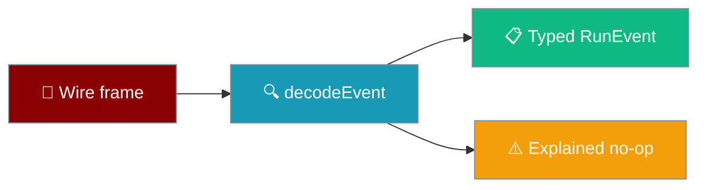
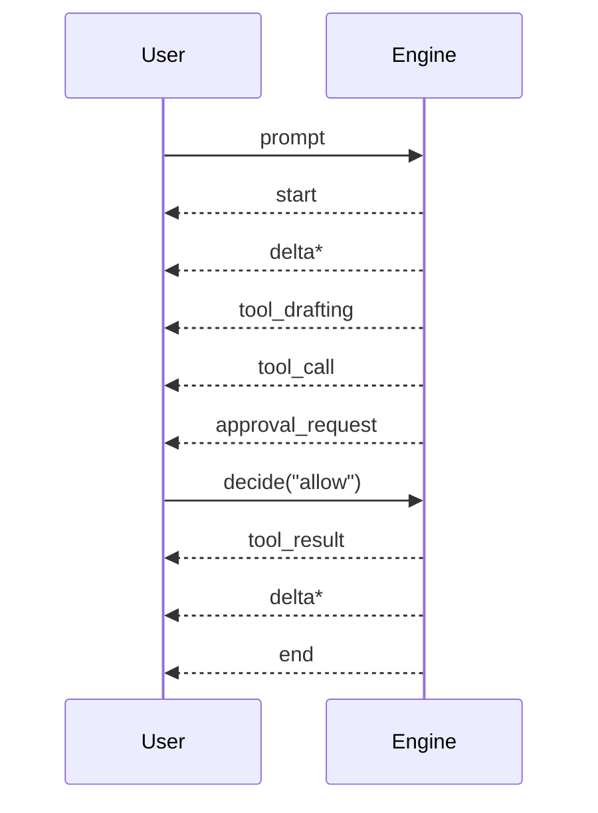

Every turn is a stream of typed events, decoded once so nothing above has to parse prose.

```ts
import { decodeEvent, isDecoded } from "praisonai-mobile/protocol/decode";

const outcome = decodeEvent(rawFrame);
if (isDecoded(outcome) && outcome.event.type === "delta") {
  render(outcome.event.text);
}
```



## Quick Start

<Steps>
<Step title="Decode a frame">
```ts
const outcome = decodeEvent(rawFrame);
```
`decodeEvent` never throws. Every rejection is a value with a reason, so a client can count them.
</Step>

<Step title="Stop at the terminal event">
```ts
import { isTerminal } from "praisonai-mobile/protocol/events";

if (isTerminal(event)) return;
```
After a terminal event nothing else follows.
</Step>
</Steps>

---

## What Happens To A Rejection

A rejection is not silent — it lands on the transcript as a dropped row.

<Warning>
A refused frame is **not** discarded. The mobile app surfaces it as a dropped event, so a shorter-than-expected reply must never be treated as a clean answer. See [Dropped Events](/features/mobile/dropped-events).
</Warning>

`parseFrame` adds two reasons the decoder alone could not report — `unparseable_json` (an HTML error page or truncated body) and `not_an_object` (a JSON array, string, or `null`) — so five distinct wire failures are no longer collapsed to one `missing_msg_id`.

---

## The 11 Events

Every event carries `msgId`. Fields listed are the ones beyond that.

| Event | Purpose | Key fields | Terminal |
|-------|---------|-----------|----------|
| `start` | A turn begins | `runId` | No |
| `delta` | Assistant text | `text` (never empty) | No |
| `reasoning` | Intermediate thinking | `text` | No |
| `tool_drafting` | A tool is being drafted (a status, not a row) | `name` | No |
| `tool_call` | A tool call is issued | `callId`, `name`, `args` | No |
| `tool_result` | A tool call returns | `callId`, `name`, `ok`, `output`, `seconds` | No |
| `approval_request` | The agent asks permission | `approvalId`, `callId`, `name`, `args` | No |
| `usage` | Cost/timing report | `chars`, `seconds`, `ttftSeconds` | No |
| `cancelled` | The turn was stopped | `runId` | **Yes** |
| `error` | The turn failed | `kind`, `message` | **Yes** |
| `end` | The turn completed | `userIndex`, `assistantIndex`, `versions`, `active` | **Yes** |

---

## How A Turn Streams



---

## Fields That Trap Readers

<Warning>
**`callId` vs `approvalId` are never interchangeable.** `callId` says which row to attach the prompt to; `approvalId` is what gets sent back. In the two-approval case the prompts arrive in the *opposite* order to their tool rows, so zipping by index crosses `rm` with `curl`.
</Warning>

<Warning>
**`end.userIndex === null` means "not on disk".** The write failed, so Fork and Delete must be withheld. Index `0` is a valid, persisted message — a falsy check (`if (!userIndex)`) is a trap.
</Warning>

<Note>
**Terminal events are mutually exclusive and final.** After `end`, `cancelled`, or `error`, nothing else may follow. A cancelled turn is never persisted, so no `end` and no `usage` follow it.
</Note>

<Info>
**Unknown `ErrorKind` degrades to `"internal"`.** `decode.ts` maps any kind it does not recognise to `"internal"` rather than dropping the event, so a newer engine's category still reaches the user.
</Info>

---

## Error Kinds

`ErrorKind` selects the recovery the UI offers.

| Kind | Meaning |
|------|---------|
| `auth` | The provider rejected the credential — send the user to settings. |
| `rate_limit` | Retrying is meaningful. |
| `empty` | The engine produced no output at all. |
| `transport` | The stream broke; the engine may be fine. |
| `protocol` | Client and engine disagree about the contract. |
| `internal` | Anything else, including unrecognised kinds. |

---

## Best Practices

<AccordionGroup>
<Accordion title="Trust tool_result.ok, never the output">
`ok` is the only signal of tool success. Inferring success from a non-empty `output` is the exact defect the field prevents.
</Accordion>

<Accordion title="Route approvals by approvalId">
Bind a decision to a row by `approvalId`, not by position — position holds only while exactly one approval is outstanding.
</Accordion>

<Accordion title="Treat null as a real value">
For `end.userIndex` and `tool_result.seconds`, `null` means "unknown / not persisted", which is different from `0` and from absent.
</Accordion>
</AccordionGroup>

---

## Related

<CardGroup cols={2}>
<Card title="Approvals & Cancellation" icon="hand-back-fist" href="/features/mobile/approvals-and-cancellation">
  The human-in-the-loop flow on mobile.
</Card>
<Card title="Capabilities & Gaps" icon="list-check" href="/features/mobile/capabilities-and-gaps">
  Which events each engine emits today.
</Card>
<Card title="Dropped Events" icon="triangle-exclamation" href="/features/mobile/dropped-events">
  Where a refused frame goes instead of the floor.
</Card>
</CardGroup>
