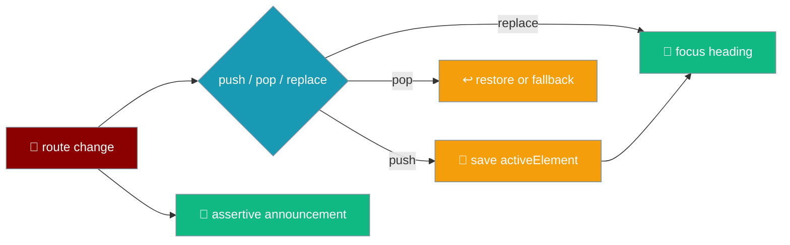
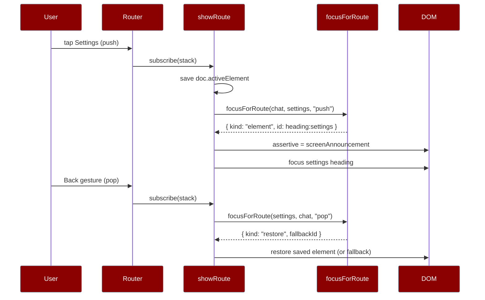

Every time the app changes screens it moves focus to the new heading, snapshots where you were so a Back gesture returns you there, and announces the change — so a screen reader user is never left reading the screen they just left, or worse, nothing at all.



`a11y/focus` and `a11y/names` are called on every route change — the decision is pure, and the renderer's three lines (move, save, restore) are the only part a unit test cannot reach.

<Note>
A route change now carries a **second** responsibility: `attachBackGesture` declares the back-navigability of the new stack via `shell.setCanGoBack(...)` on every change, so the native side already knows whether the app can go back when a press arrives. See [Native Shell → Back-gesture arbitration](/features/mobile/native-shell#back-gesture-arbitration).
</Note>

## Quick Start

<Steps>
<Step title="Make each heading focusable">
```ts
heading.setAttribute("tabindex", "-1");
heading.dataset["focusId"] = headingId(route);
```
A heading is not focusable otherwise, so every screen's heading carries `tabindex="-1"` and a `data-focus-id`.
</Step>

<Step title="Ask where focus belongs">
```ts
import { focusForRoute } from "praisonai-mobile/ui/a11y/focus";

const target = focusForRoute(previous, next, nav);
// { kind: "element", id } | { kind: "restore", fallbackId } | { kind: "none" }
```
`focusForRoute` returns a `FocusTarget`; the renderer applies it.
</Step>

<Step title="Announce the change">
```ts
import { screenAnnouncement } from "praisonai-mobile/ui/a11y/focus";

assertive.textContent = screenAnnouncement(strings, route);
```
Written into the `assertive` live region so a screen reader hears the change even when focus lands on a short-named element.
</Step>
</Steps>

---

## The FocusTarget

`focusForRoute(from, to, nav)` answers with one of three shapes.

| `FocusTarget` | When | What the renderer does |
|---------------|------|------------------------|
| `{ kind: "none" }` | a re-render or a push of the route already on top | leaves focus where it is |
| `{ kind: "element", id }` | first paint, a push, or a replace | focuses the heading by id |
| `{ kind: "restore", fallbackId }` | a pop | restores the saved element, or the heading if it is gone |

```ts
// focusForRoute — the pop case returns to where the user was.
if (from === null) return { kind: "element", id: headingId(to) };
if (sameRoute(from, to)) return { kind: "none" };
if (nav === "pop") return { kind: "restore", fallbackId: headingId(to) };
return { kind: "element", id: headingId(to) };
```

<Note>
A push of the route already on top is `{ kind: "none" }`, not a focus move. Moving focus on a re-render would yank the caret out of the composer mid-sentence every time the transcript published — which on a streaming turn is several times a second.
</Note>

---

## Save on push, restore on pop

The app snapshots `doc.activeElement` **before** the DOM changes, but only on a push — a pop consumes the saved target, and a replace is not a place to come back to.

```ts
// main.ts — save the control the user is leaving from, on a push only.
if (nav === "push") {
  const active = doc.activeElement;
  restoreFocus = active instanceof HTMLElement ? active : null;
}
```

```ts
// applyFocus — restore the saved element, or fall back to the heading.
case "restore": {
  const saved = restoreFocus;
  if (saved !== null && saved.isConnected) saved.focus();
  else byFocusId(target.fallbackId)?.focus();
  restoreFocus = null;
  return;
}
```

<Warning>
The saved element may be gone — popping back after deleting the chat you were viewing means the row you came from no longer exists. `isConnected` is checked, and focus falls back to the destination's heading via `fallbackId` rather than focusing nothing. Restoring to a detached node silently focuses `<body>`.
</Warning>

---

## How It Works

A push-then-back cycle saves focus on the way in and restores it on the way out.



### Navigation is classified by stack depth

The router reports a stack; the app compares its length to the previous depth to tell a push from a pop.

```ts
const nav: Navigation =
  stack.length < previousDepth ? "pop" :
  stack.length > previousDepth ? "push" : "replace";
```

| Comparison | Navigation |
|-----------|------------|
| `stack.length < previousDepth` | `pop` |
| `stack.length > previousDepth` | `push` |
| `stack.length === previousDepth` | `replace` |

<Note>
`previousDepth` is seeded at `1` after the boot-time `replace({ name: "chat", chatId: "" })`, so the first real navigation classifies correctly. The router's default `chats` root is replaced with the chat screen the app actually opens on — otherwise pushing `chats` later would be swallowed as a push of the route already on top.
</Note>

---

## Every route change is announced

The `assertive` live region gets `screenAnnouncement(strings, route)` on every change, so a route change is never silent to a screen reader even when focus lands on a short-named element.

```ts
// showRoute — announce, then move focus.
if (focus.kind === "element" && focus.id !== "") {
  assertive.textContent = screenAnnouncement(strings, route);
}
applyFocus(focus);
```

<Note>
`screenAnnouncement` composes `strings.announceScreen(routeTitle(strings, route))` from `a11y/names` — the same `routeTitle` a heading uses, so the spoken name and the visible heading cannot drift apart.
</Note>

---

## The click listener is on root, not the screen

The delegated `click` listener is registered on `root`, not on the chat screen — the settings and chats screens are **siblings** of the chat screen, so a tap on the settings or chats screen would otherwise never be heard.

```ts
// main.ts — delegated on root so sibling screens are reachable.
root.addEventListener("click", (event) => { /* ... */ });
```

<Warning>
Registering the listener on the chat `screen` element instead of `root` means a tap on a chats-screen row — a sibling node — never fires the handler, and `open-chat` silently does nothing.
</Warning>

---

## Best Practices

<AccordionGroup>
<Accordion title="Give every screen heading a tabindex and a focus id">
`tabindex="-1"` makes a heading focusable; `data-focus-id={headingId(route)}` lets the renderer find it. Without both, a route change drops focus to `<body>`.
</Accordion>

<Accordion title="Save focus before the DOM changes, on push only">
Snapshot `doc.activeElement` ahead of the mount so a later pop can return to it. A pop consumes the saved target; a replace is not a place to come back to.
</Accordion>

<Accordion title="Check isConnected before restoring">
The row you came from may have been deleted. Fall back to the destination heading via `fallbackId` rather than focusing a detached node — which silently focuses nothing.
</Accordion>

<Accordion title="Announce on every route change">
Write `screenAnnouncement(strings, route)` into the assertive region so the change is heard even when focus lands somewhere with a short name.
</Accordion>

<Accordion title="Delegate clicks on root">
Sibling screens are not descendants of the chat screen. Bind the click listener to `root` so taps on settings and chats rows are heard.
</Accordion>
</AccordionGroup>

---

## Related

<CardGroup cols={2}>
<Card title="i18n & A11y" icon="globe" href="/features/mobile/i18n-and-a11y">
  Live regions, `focusAfterDisable`, and accessible names.
</Card>
<Card title="History & Reopen" icon="clock-rotate-left" href="/features/mobile/history-and-reopen">
  The chats route and the open-chat flow.
</Card>
<Card title="Architecture" icon="layer-group" href="/features/mobile/architecture">
  The route→screen seam and the retained chat screen.
</Card>
<Card title="Overview" icon="mobile" href="/features/mobile/overview">
  The top bar and native navigation.
</Card>
</CardGroup>
