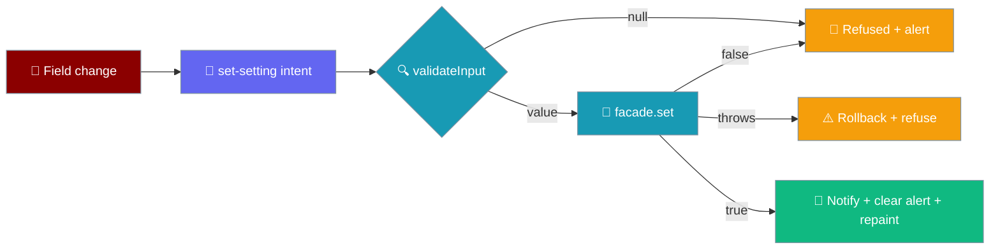
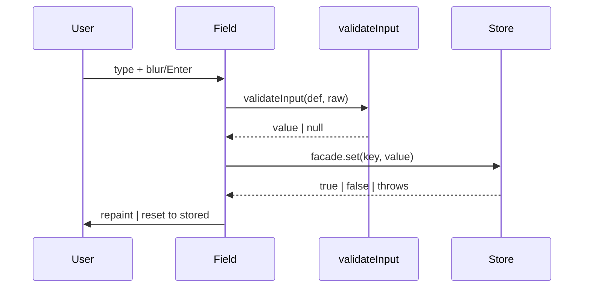
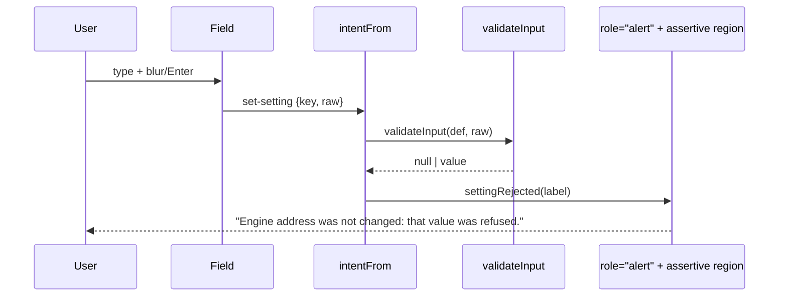

The Settings screen edits the live settings store on the device, and its `baseUrl` field is the recovery path when a phone cannot reach the default engine.



## Layout

The Settings and Chats screens are bare `<section class="screen screen-settings">` / `screen-chats` with **no `.topbar`**. Before this was fixed they consumed no insets at all: on an Android 15 emulator (Pixel-class, 49 px cutout) the "Settings" heading's box started at `y = 20` with a 49 px top inset, so ~29 px of the title painted underneath the status-bar clock, and every heading sat at `x = 0` — inside the left cutout in landscape. The screen could not scroll either, so a longer list, a large font scale, or landscape left the bottom rows unreachable.

The `.screen-settings, .screen-chats` rule in `app.css` fixes both:

| Property | Value | Why |
|---|---|---|
| `padding` (all four edges) | `calc(var(--inset-*) + .75rem)` | The chat screen's `.topbar` is the only rule that consumes the top inset, and these screens have none — so they apply all four `--inset-*` values plus a 12 px gutter themselves. |
| `overflow-y` | `auto` | `.screen` is `flex: 1; min-height: 0` with `overflow: visible`; the chat screen scrolls via its inner `.transcript`, but these screens **are** their own scroller and must say so. |

<Note>
The insets flow from `#root` (written by `main.ts` from `shell.insets`), not from a chat-screen-scoped variable — sibling screens need to read the same numbers. See [Native Shell → Insets and keyboard](/features/mobile/native-shell#insets-and-keyboard).
</Note>

Chat rows use the class **`.row-chat`**, renamed in this change from a stylesheet-only `.chat-row` that `buildChatsScreen` never emitted — so every row had been falling back to the bare `button` rule (a centre-aligned, auto-width pill) instead of a full-width list row. The truncation for a long title is now on the row itself, where a chat named from a long first message would otherwise wrap to as many lines as it liked.

---

## Quick Start

<Steps>
<Step title="Open Settings from the top bar">
The Settings screen renders one editable row per `value` setting. On a fresh phone install, the **Engine address** field shows the default `http://127.0.0.1:8765` — the phone itself, which nothing answers.
</Step>

<Step title="Change the Engine address">
Edit **Engine address** to a reachable host — your dev machine on the LAN, for example:

```
http://10.0.0.7:9000
```
</Step>

<Step title="Blur the field or press Enter">
The write commits on `change`, not per keystroke. On blur or Enter the value is validated, then persisted through `facade.set`.
</Step>

<Step title="Send the next message">
No relaunch. The next `/chat` and `/health` request resolves `baseUrl` fresh from the store, so the very next message reaches the address you just typed. Any turn already streaming stays pinned to the address it started at — its `/cancel` and `/approve` still land on the engine that issued the run.
</Step>
</Steps>

---

## How It Works

Every `value` row is an editable control wired to the same pure `validateInput` the store would run.



| Rule | Behaviour |
|------|-----------|
| `value` rows are editable | Rendered as `<select>` / `<input>`. `secret` rows are **also** editable now, through the dedicated `set-secret` / `clear-secret` intents — a masked field plus a Remove button, with the value never read back from the facade. See [Secret rows](#secret-rows). |
| Control kind | `choice` → `<select>`, `number` → `<input type="number">`, everything else → `<input type="text">`. |
| Validation | The change listener runs `validateInput(def, raw)` — parse, then the def's own `validate` — before calling `settings.set`. |
| Refusal resets | A `null` from `validateInput`, a `false` from `set`, or a thrown persist resets the field to `String(settings.get(def.key) ?? def.default)`. |
| Commit timing | Persist runs on `change` (blur/Enter), not `input` (per keystroke). |

The four input paths and their outcomes:

| Input path | `set` returns | In-memory value | Disk | Subscribers | Field |
|------------|---------------|-----------------|------|-------------|-------|
| `validateInput` returns `null` | *never called* | unchanged | unchanged | not notified | resets to stored value |
| `def.validate` returns `null` via `set` | `false` | unchanged | unchanged | not notified | resets to stored value |
| Persist succeeds | `true` | new value | new value | notified | shows new value |
| Persist **throws** (SecurityError / QuotaExceededError) | *throws* | rolled back | unchanged | not notified | resets to stored value; app keeps running |

---

## How a refusal is spoken

A refused value is said, not silently undone.

Each row carries a `role="alert"` node from first paint — empty and `hidden` — so an assertive announcement is picked up reliably by screen readers. An alert region inserted at the moment it has something to say is announced unreliably by every screen reader, so the node exists from the start and only its text changes.



The message is the labeled i18n string `settingRejected(label)` — `"Engine address was not changed: that value was refused."` — not a generic `"Invalid value"`. It names the setting because the field may already have scrolled off, and it is set on both the inline `role="alert"` node **and** the assertive live region, so the user hears it interrupt rather than wait behind queued status ticks.

<Note>
**Only the refused key's message is touched.** A successful write on one key clears its own message and leaves another key's refusal standing. Clearing every note would wipe a refusal the user has not read off a different setting; leaving them all would keep accusing a write that has since succeeded. The guard is `if (errorFor !== key) continue;` in `syncSettings`.
</Note>

---

## How the change reaches the store

Committing a field is an intent, decoded on the app root — never a per-field listener.

The control emits `{ kind: "set-setting"; key; raw }` (`app/src/intents.ts`). One `change` listener sits on the app root and decodes the target's `Actionable` chain through `intentFrom(chain)`: a `data-action="set-setting"` element carrying `data-setting-key="..."` **and** an `Actionable.value`.

```ts
// app/src/main.ts — the input carries only data, no listener.
control.dataset["action"] = "set-setting";
control.dataset["settingKey"] = def.key; // e.g. "baseUrl"
```

`Actionable.value` is absent on every non-field element on purpose: absence means "not a field", never "cleared". A `<div>` row, a `<span>` label, or a section heading has no `value`, so a stray tap on a row background cannot decode into a `set-setting` with an empty `raw` and wipe the engine address. Both the key and the value are required — a missing key is refused (the store would refuse `""` silently), and a missing value means the element is not a field at all.

A secret field emits `set-secret`, not `set-setting`, and its Remove button emits `clear-secret`. The two intents are kept separate on purpose (from the `intents.ts` block comment): so no single code path decides at runtime whether a value lands in the plaintext settings file or in the keychain — a shared `set-setting` with a boolean flag would be exactly that path, and getting the boolean wrong once from a stale def puts an API key on disk. Two intents cannot make that mistake. For `set-secret`, `intentFrom` applies the trim-and-refuse-empty rule: a cleared field on blur (`raw.trim() === ""`) is refused rather than treated as "delete it", because removing a credential must be asked for by name through `clear-secret`.

<Note>
The settings screen is rebuilt on every visit, so a listener attached to a field would belong to a node thrown away on the next navigation. Delegating on the root — like every tap — is what keeps the commit path alive across navigations.
</Note>

---

## Secret rows

A secret row is a masked field, a Remove button, and a separate presence node — never a value read back from the store.

`secretControls` in `app/src/main.ts` builds the row under a three-property contract, and each property has a broken version that looks completely normal on screen:

| Property | Rule |
|----------|------|
| Value | **Never assigned.** `settingControl` seeds a value field from the store; the mirror of that line here would be the leak. The field paints empty on every visit, and `syncSecret` empties it again after every commit — the value is in the DOM only while the user is holding it there. |
| Masking | `type="password"` with `autocomplete="off"`, `autocapitalize="off"`, `autocorrect="off"`, `spellcheck="false"` — dots for a shoulder-surfer, no autofill, and no unrecognised token shipped off to a spellchecker. |
| Presence | A separate node (`data-secret-presence`) starting at **UNKNOWN**, never at "Not set": telling someone their key is missing while the async `hasSecret` lookup is still in flight is how a working key gets pasted twice. |

`refreshSecretPresence` resolves `hasSecret` for every secret def and writes the answer into that presence node. It is **sequence-guarded**: a save followed by a Remove fires two overlapping lookups, and with a native keychain adapter `hasSecret` can resolve out of order, so an older answer landing last would paint a stale label over the current one. Each call takes a `latestPresenceSeq` ticket, and only the latest is allowed to write.

`syncSecret(key, refusal)` empties the field after every commit and sets the refusal text on the row's `role="alert"` node (or clears and hides it when there is none) — the same assertive channel a rejected `value` setting uses.

See [API Keys](/features/mobile/api-keys) for the user-facing flow and [Storage & Secrets](/features/mobile/storage-and-secrets#how-a-setting-reaches-the-keychain) for where the value lives.

### The software-secrets warning {#the-software-secrets-warning}

The "secrets are not hardware-backed" warning is now keyed off `facade.secretsAreHardwareBacked` — a platform-shape check — not off a hard-coded platform name. `buildSettings` in `ui/src/settings/view-model.ts` renders the warning row **only** when that flag is `false`, which for the shipping app is only the browser: a phone gets `src-tauri/plugins/secrets` and never shows it.

Keying off the adapter rather than a name means a future adapter that cannot reach a keychain gets the warning without anyone remembering to add it. The wording was also rewritten — see [Storage & Secrets → the four Tauri commands](/features/mobile/storage-and-secrets#the-four-tauri-commands-and-the-closed-union) — to speak only to browsers now that a device no longer keeps secrets in a `Map`.

```ts
// view-model.ts — the warning is a row, decided by the adapter's flag.
const warnings: WarningRow[] = facade.secretsAreHardwareBacked
  ? []
  : [{ kind: "warning", id: "warning:software-secrets", text: SOFTWARE_SECRETS_WARNING }];
```

<Note>
The row is emitted by the same loop as every other row, so a renderer that only walks rows cannot forget it. Anchor: `SOFTWARE_SECRETS_WARNING` and `buildSettings` in `ui/src/settings/view-model.ts`.
</Note>

---

## Configuration Options

`SETTING_DEFS` ships three editable settings today — two `value` rows and one `secret` row (source: `app/src/registry.ts`).

| Key | Type | Default | Control | Notes |
|-----|------|---------|---------|-------|
| `engineId` | `string` (choice) | `remote-http` | `<select>` | Choices come from `SETTING_DEFS.engineId.choices`: `remote-http` and `praisonai-ts`. |
| `baseUrl` | `string` | `http://127.0.0.1:8765` | `<input type="text">` | Resolved per request by `enginesFor` — the next `/chat` and `/health` go to the current stored value. Trailing slashes are stripped per resolution. Changing it is the recovery for an unreachable engine. |
| `openaiApiKey` | `secret` | `""` (never stored) | `<input type="password">` + Remove button | Kept in the keychain; never in the settings file; never shown back. Read per turn by the in-process engine via `apiKeyFor`. See [API Keys](/features/mobile/api-keys). |

<Note>
The store's coercion and validation machinery stays intact for any future setting; `engineId`, `baseUrl`, and `openaiApiKey` are the keys the shipping app reads (`CONSUMED_SETTING_KEYS`), and `registry.test.ts` forbids a declared-but-unread setting. See [Storage & Secrets → Shipped defaults are valid](/features/mobile/storage-and-secrets).
</Note>

---

## Common Patterns

**Recover from an unreachable engine on a phone** — the golden path this change unblocks.

```ts
// The user edits the Engine address field; the screen calls, in effect:
await settings.set("baseUrl", "http://10.0.0.7:9000");
// Persisted. The next /chat and /health request resolves baseUrl fresh — the
// change is live on the next message, not the next launch.
```

**A refused change never shows a phantom value** — a value the store rejects snaps the field back.

```ts
// validateInput refuses an unparseable number; set is never called.
validateInput(def, "not-a-number"); // null → field resets to String(settings.get(key) ?? def.default)
```

**A storage failure stays LOCAL** — the QuotaExceededError / SecurityError pathologies mobile webviews raise on device are caught at the field.

```ts
try {
  if (!(await settings.set(def.key, validated))) reset();
} catch {
  reset(); // a thrown persist is caught here, not floated to the crash handler
}
```

---

## Best Practices

<AccordionGroup>
<Accordion title="A refusal is refused, and said">
`validateInput` runs before `set`, so an invalid input is rejected before it reaches the store. And the refusal is not silent: `settingRejected(label)` is written to the field's `role="alert"` node and the assertive live region, so a typo on the recovery screen no longer looks like the tap did not register.
</Accordion>

<Accordion title="A change reaches the store as an intent, not a per-field listener">
Committing a field emits `{ kind: "set-setting"; key; raw }`, decoded by one root-delegated `change` handler through `intentFrom`. `Actionable.value` is absent on non-field elements on purpose — absence means "not a field", never "cleared" — so a stray tap on a row background cannot wipe the engine address.
</Accordion>

<Accordion title="Persist commits on blur/Enter">
The control listens on `change`, not `input`, so a half-typed address is never stored and `set` is not hit per keystroke.
</Accordion>

<Accordion title="Reset from the store, not from the last-seen value">
The field resets to `settings.get(key) ?? def.default`, so a value that never persisted cannot linger in memory. A rolled-back write leaves the field showing what the next launch will actually read.
</Accordion>

<Accordion title="A secret row takes writes but never reads back">
Editing a secret is a first-class row now: a masked field commits through `set-secret`, and a Remove button through `clear-secret`. But the value is unreadable from the UI facade — the row shows presence and takes writes; only the engine, holding the full `SecretsPort`, reads the value back. See [API Keys](/features/mobile/api-keys) and [Storage & Secrets](/features/mobile/storage-and-secrets).
</Accordion>
</AccordionGroup>

---

## Related

<CardGroup cols={2}>
<Card title="Storage & Secrets" icon="database" href="/features/mobile/storage-and-secrets">
  The persist-before-mutate contract behind `set`.
</Card>
<Card title="Errors & Recovery" icon="triangle-exclamation" href="/features/mobile/errors-and-recovery">
  Where an unreachable engine routes the user.
</Card>
<Card title="Engines" icon="plug" href="/features/mobile/engines">
  How `engineId` and `baseUrl` pick and reach an engine.
</Card>
<Card title="Boot Failures" icon="bug" href="/features/mobile/boot-failures">
  The warning notice a phone sees before editing the address.
</Card>
<Card title="i18n & A11y" icon="globe" href="/features/mobile/i18n-and-a11y#how-a-refusal-is-spoken">
  Why `settingRejected` is announced assertively.
</Card>
</CardGroup>
