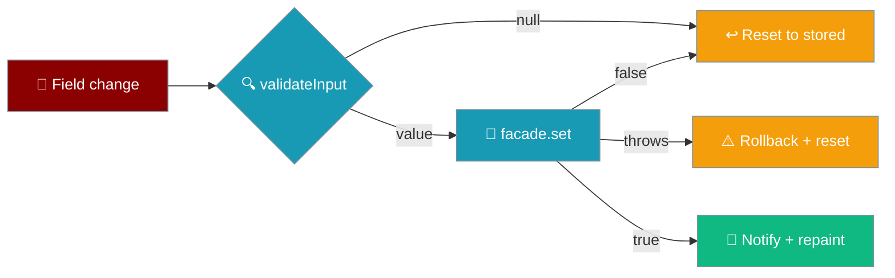
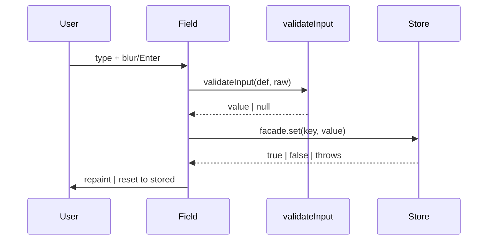

The Settings screen edits the live settings store on the device, and its `baseUrl` field is the recovery path when a phone cannot reach the default engine.



## Quick Start

<Steps>
<Step title="Open Settings from the top bar">
The Settings screen renders one editable row per `value` setting. On a fresh phone install, the **Engine address** field shows the default `http://127.0.0.1:8765` — the phone itself, which nothing answers.
</Step>

<Step title="Change the Engine address">
Edit **Engine address** to a reachable host — your dev machine on the LAN, for example:

```
http://10.0.0.7:9000
```
</Step>

<Step title="Blur the field or press Enter">
The write commits on `change`, not per keystroke. On blur or Enter the value is validated, then persisted through `facade.set`.
</Step>

<Step title="Relaunch">
The app boots against the new address. A persisted `baseUrl` is read by `enginesFor` at boot and outranks the compiled-in default.
</Step>
</Steps>

---

## How It Works

Every `value` row is an editable control wired to the same pure `validateInput` the store would run.



| Rule | Behaviour |
|------|-----------|
| `value` rows are editable | Rendered as `<select>` / `<input>`; `secret` rows stay presence-only (the facade has no getter for a secret). |
| Control kind | `choice` → `<select>`, `number` → `<input type="number">`, everything else → `<input type="text">`. |
| Validation | The change listener runs `validateInput(def, raw)` — parse, then the def's own `validate` — before calling `settings.set`. |
| Refusal resets | A `null` from `validateInput`, a `false` from `set`, or a thrown persist resets the field to `String(settings.get(def.key) ?? def.default)`. |
| Commit timing | Persist runs on `change` (blur/Enter), not `input` (per keystroke). |

The four input paths and their outcomes:

| Input path | `set` returns | In-memory value | Disk | Subscribers | Field |
|------------|---------------|-----------------|------|-------------|-------|
| `validateInput` returns `null` | *never called* | unchanged | unchanged | not notified | resets to stored value |
| `def.validate` returns `null` via `set` | `false` | unchanged | unchanged | not notified | resets to stored value |
| Persist succeeds | `true` | new value | new value | notified | shows new value |
| Persist **throws** (SecurityError / QuotaExceededError) | *throws* | rolled back | unchanged | not notified | resets to stored value; app keeps running |

---

## Configuration Options

`SETTING_DEFS` ships exactly two editable settings today (source: `app/src/registry.ts`).

| Key | Type | Default | Control | Notes |
|-----|------|---------|---------|-------|
| `engineId` | `string` (choice) | `remote-http` | `<select>` | Choices come from `SETTING_DEFS.engineId.choices` — the picker lists **both** `remote-http` and `praisonai-ts` in shipping builds, since the in-process engine ships as a lazy chunk. The `Default` column is the setting's stored fallback; the *first-launch* default is platform-aware (`defaultEngineIdFor(kind)` — tauri → `praisonai-ts`, web → `remote-http`). See [Engines → First-Launch Default](/features/mobile/engines#first-launch-default). |
| `baseUrl` | `string` | `http://127.0.0.1:8765` | `<input type="text">` | Read by `enginesFor` at boot; trailing slashes are stripped when building the request URL. Changing it is the recovery for an unreachable engine. |

<Note>
The store's coercion and validation machinery stays intact for any future setting, but only `engineId` and `baseUrl` are read by the shipping app today. See [Storage & Secrets → Shipped defaults are valid](/features/mobile/storage-and-secrets).
</Note>

---

## Common Patterns

**Recover from an unreachable engine on a phone** — the golden path this change unblocks.

```ts
// The user edits the Engine address field; the screen calls, in effect:
await settings.set("baseUrl", "http://10.0.0.7:9000");
// Persisted. enginesFor reads it at the next boot and the app reaches the engine.
```

**A refused change never shows a phantom value** — a value the store rejects snaps the field back.

```ts
// validateInput refuses an unparseable number; set is never called.
validateInput(def, "not-a-number"); // null → field resets to String(settings.get(key) ?? def.default)
```

**A storage failure stays LOCAL** — the QuotaExceededError / SecurityError pathologies mobile webviews raise on device are caught at the field.

```ts
try {
  if (!(await settings.set(def.key, validated))) reset();
} catch {
  reset(); // a thrown persist is caught here, not floated to the crash handler
}
```

---

## Best Practices

<AccordionGroup>
<Accordion title="Refuse at the field, not in the store">
`validateInput` runs before `set`, so an invalid input is rejected at the input rather than accepted into the UI and dropped by `set`. The screen never offers a value the store then silently refuses.
</Accordion>

<Accordion title="Persist commits on blur/Enter">
The control listens on `change`, not `input`, so a half-typed address is never stored and `set` is not hit per keystroke.
</Accordion>

<Accordion title="Reset from the store, not from the last-seen value">
The field resets to `settings.get(key) ?? def.default`, so a value that never persisted cannot linger in memory. A rolled-back write leaves the field showing what the next launch will actually read.
</Accordion>

<Accordion title="Never call the settings screen a secrets UI">
`SettingsFacade` has no `getSecret`; secret rows stay presence-only. Editing a secret from the Settings screen is not possible — rotate secrets through `SecretsPort`. See [Storage & Secrets](/features/mobile/storage-and-secrets).
</Accordion>
</AccordionGroup>

---

## Related

<CardGroup cols={2}>
<Card title="Storage & Secrets" icon="database" href="/features/mobile/storage-and-secrets">
  The persist-before-mutate contract behind `set`.
</Card>
<Card title="Errors & Recovery" icon="triangle-exclamation" href="/features/mobile/errors-and-recovery">
  Where an unreachable engine routes the user.
</Card>
<Card title="Engines" icon="plug" href="/features/mobile/engines">
  How `engineId` and `baseUrl` pick and reach an engine.
</Card>
<Card title="Boot Failures" icon="bug" href="/features/mobile/boot-failures">
  The warning notice a phone sees before editing the address.
</Card>
</CardGroup>
