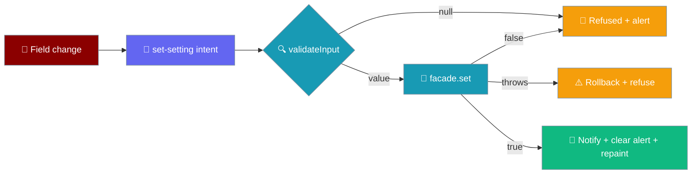
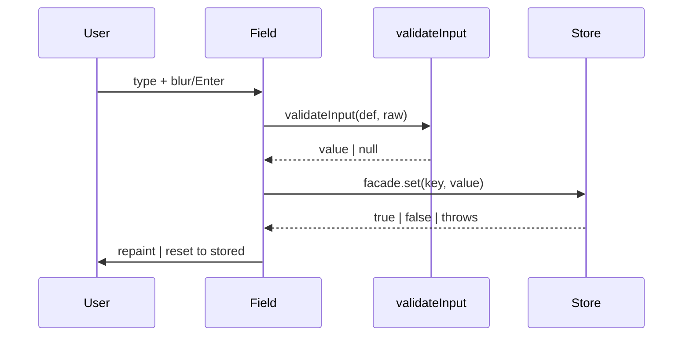
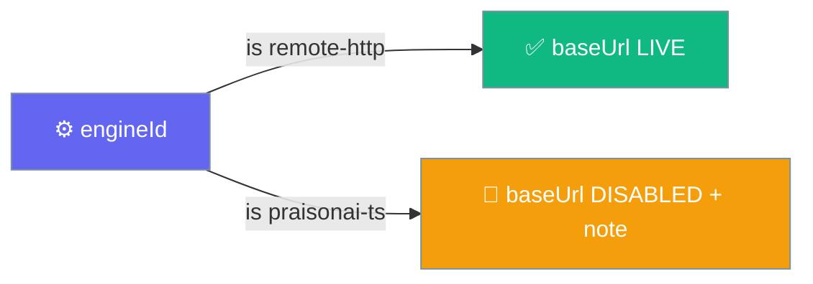
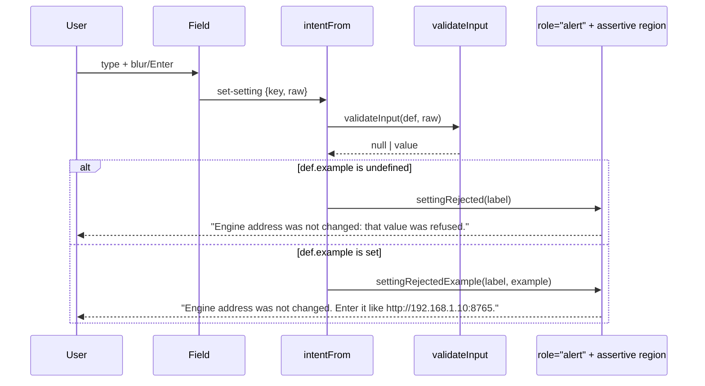

The Settings screen edits the live settings store on the device, and its `baseUrl` field is the recovery path when a phone cannot reach the default engine.

<Note>
Back on Settings returns to the chat, not out of the app — see [Native Shell → Back-gesture arbitration](/features/mobile/native-shell#back-gesture-arbitration) for how the app declares its back state out of band so it never races the Android watchdog.
</Note>



## Layout

The Settings and Chats screens are bare `<section class="screen screen-settings">` / `screen-chats` with **no `.topbar`**. Before this was fixed they consumed no insets at all: on an Android 15 emulator (Pixel-class, 49 px cutout) the "Settings" heading's box started at `y = 20` with a 49 px top inset, so ~29 px of the title painted underneath the status-bar clock, and every heading sat at `x = 0` — inside the left cutout in landscape. The screen could not scroll either, so a longer list, a large font scale, or landscape left the bottom rows unreachable.

The `.screen-settings, .screen-chats` rule in `app.css` fixes both:

| Property | Value | Why |
|---|---|---|
| `padding` (all four edges) | `calc(var(--inset-*) + .75rem)` | The chat screen's `.topbar` is the only rule that consumes the top inset, and these screens have none — so they apply all four `--inset-*` values plus a 12 px gutter themselves. |
| `overflow-y` | `auto` | `.screen` is `flex: 1; min-height: 0` with `overflow: visible`; the chat screen scrolls via its inner `.transcript`, but these screens **are** their own scroller and must say so. |

<Note>
The insets flow from `#root` (written by `main.ts` from `shell.insets`), not from a chat-screen-scoped variable — sibling screens need to read the same numbers. See [Native Shell → Insets and keyboard](/features/mobile/native-shell#insets-and-keyboard).
</Note>

Chat rows use the class **`.row-chat`**, renamed in this change from a stylesheet-only `.chat-row` that `buildChatsScreen` never emitted — so every row had been falling back to the bare `button` rule (a centre-aligned, auto-width pill) instead of a full-width list row. The truncation for a long title is now on the row itself, where a chat named from a long first message would otherwise wrap to as many lines as it liked.

### Sections, in registry order

The screen paints top-to-bottom in the order `SETTING_DEFS` declares its keys — the API key first, in a section of its own, then the engine:

1. **API key** (lead section, panel background, ink-coloured heading) — the one field a new user came for. It sat third under a heading called "Engine" until [#4847](https://github.com/MervinPraison/PraisonAI/pull/4847); a credential is not an engine setting.
2. **Engine** (soft heading) — the `Engine` picker and the `Engine address` field beneath it.

Registry order **is** screen order. `buildSettings` groups rows by insertion order (`view-model.ts`: "section order is REGISTRY order: the order the author of the registry chose"), so moving a def in `SETTING_DEFS` is the whole of the reordering — there is no second list to keep in step. The section names are named constants (`SECTION_API_KEY = "API key"`, `SECTION_ENGINE = "Engine"` in `app/src/registry.ts`) rather than repeated literals, so a typo like `"Engine "` cannot silently split one heading into two.

The lead section is marked, not hard-coded. `buildSettingsScreen` sets `title.dataset["lead"] = "true"` on `index === 0` and the same mark on each row under it, so the stylesheet gives the first section weight without the renderer having to know **which** section is the lead — registry order decides.

<Note>
**The headings are styled against the class the app actually emits.** `buildSettingsScreen` emits `<h3 class="settings-section">`, but `app.css` styled `.section-heading` (which nothing paints), so until #4847 every heading rendered at the browser's default `h3` and the whole screen read as one flat list where a credential and an engine address had the same weight. The rules now target `.screen-settings .settings-section`, with `[data-lead]` colouring the lead heading `var(--ink)` and `.row-setting[data-lead]` giving the lead rows a `var(--panel)` background.
</Note>

### Help text is now painted per row

Every def has carried a `help` string since the registry was written, and nothing rendered it until #4847 — a silent-since-inception defect, not a new field.

- Each row now paints `<p class="setting-help">` between the label and the control, seeded from `SettingDef.help` (`settingHelp` in `main.ts`).
- The control's `aria-describedby` includes the help id (`setting-help-<key>`), so a screen reader that focuses a field hears its label followed by what the field is for.
- The help colour is `var(--soft)` at `.84rem`; it is not faded when the row is disabled — see [When a setting depends on another](#when-a-setting-depends-on-another).

---

## Quick Start

<Steps>
<Step title="Open Settings from the top bar">
The **API key** section paints first, as the lead — an **OpenAI API key** row on a panel background. Below it, the **Engine** section holds the `Engine` picker and the **Engine address** field, which on a fresh phone install shows the default `http://127.0.0.1:8765` — the phone itself, which nothing answers.
</Step>

<Step title="Change the Engine address">
Edit **Engine address** to a reachable host — your dev machine on the LAN, for example:

```
http://10.0.0.7:9000
```
</Step>

<Step title="Blur the field or press Enter">
The write commits on `change`, not per keystroke. On blur or Enter the value is validated, then persisted through `facade.set`.
</Step>

<Step title="Send the next message">
No relaunch. The next `/chat` and `/health` request resolves `baseUrl` fresh from the store, so the very next message reaches the address you just typed. Any turn already streaming stays pinned to the address it started at — its `/cancel` and `/approve` still land on the engine that issued the run.
</Step>
</Steps>

---

## How It Works

Every `value` row is an editable control wired to the same pure `validateInput` the store would run.



| Rule | Behaviour |
|------|-----------|
| `value` rows are editable | Rendered as `<select>` / `<input>`, each preceded by a `<p class="setting-help">` seeded from `SettingDef.help`. `secret` rows are **also** editable, through the dedicated `set-secret` / `clear-secret` intents — a masked field plus a Remove button *offered only when a key is present*, with the value never read back from the facade. See [Secret rows](#secret-rows). |
| Dependent rows | A def with `appliesWhen` is **disabled, not hidden**, when its controller does not hold the required value, with a `.setting-inactive` note naming the switch. See [When a setting depends on another](#when-a-setting-depends-on-another). |
| Control kind | `choice` → `<select>`, `number` → `<input type="number">`, everything else → `<input type="text">`. |
| Validation | The change listener runs `validateInput(def, raw)` — parse, then the def's own `validate` — before calling `settings.set`. |
| Refusal resets | A `null` from `validateInput`, a `false` from `set`, or a thrown persist resets the field to `String(settings.get(def.key) ?? def.default)`. |
| Commit timing | Persist runs on `change` (blur/Enter), not `input` (per keystroke). |

The four input paths and their outcomes:

| Input path | `set` returns | In-memory value | Disk | Subscribers | Field |
|------------|---------------|-----------------|------|-------------|-------|
| `validateInput` returns `null` | *never called* | unchanged | unchanged | not notified | resets to stored value |
| `def.validate` returns `null` via `set` | `false` | unchanged | unchanged | not notified | resets to stored value |
| Persist succeeds | `true` | new value | new value | notified | shows new value |
| Persist **throws** (SecurityError / QuotaExceededError) | *throws* | rolled back | unchanged | not notified | resets to stored value; app keeps running |

---

## When a setting depends on another {#when-a-setting-depends-on-another}

The **Engine address** field applies only under the remote engine. Pick the in-process engine and the row stays on screen — **disabled, not hidden** — with a note naming the switch that turns it back on. {#applieswhen}



**`SettingDef.appliesWhen`** is `{ key, equals }`, declared on the def in the registry — not derived by the screen. `baseUrl` carries `appliesWhen: { key: "engineId", equals: ENGINE_REMOTE_HTTP }`. It is declared here for the same reason `secretRef` is: the registry is the only layer allowed to name a concrete setting, and a view that hard-codes "baseUrl is dead unless engineId is remote-http" goes stale the day a third engine lands.

**`appliesTo(def, read)`** (in `core/src/settings/store.ts`) returns `true` for any def with no `appliesWhen`. It reads the dependency through `get`, **not** `isSet`, so a def's default counts — `engineId` really is `remote-http` on first launch before the user touches the picker, and reading `isSet` would report every dependent setting as inactive until its controller had been changed at least once.

On the view model, `ValueRow.applies` and `ValueRow.inactiveBecause` carry this to the row. `inactiveBecause` names the controller by **label** (`{ label, value }`), not by key — so the sentence the user reads matches the picker the user sees, never a raw `engineId`.

The row is kept **disabled, not hidden**, deliberately:

- A field that disappears takes its value off the screen. A user flipping between engines to compare would watch their typed address vanish and reappear (the store keeps it — but the user cannot *see* that nothing is lost).
- An address is what a user looks for **before** choosing the engine that uses it. A greyed row that names the switch teaches that the two are connected in one glance; a row that is not there cannot.

The inactive-note lives in its own `<p class="setting-inactive">` node, hidden when the row applies. It is deliberately **not** `role="alert"` — nothing has gone wrong, and announcing it would interrupt the very edit that produced it. Its text is the i18n key `settingInactive(label, value)`:

```ts
settingInactive("Engine", "remote-http")
// → "Set Engine to remote-http to use this."
```

Only the control is greyed — not the label or the help — so the two lines still worth reading stay legible:

```css
.row-setting .setting-input:disabled,
.row-setting select:disabled { color: var(--soft); background: transparent; border-style: dashed; }
```

For a screen reader, when a row is inactive the control's `aria-describedby` also points at the inactive-note id (`setting-inactive-<key>`); when it applies again, `syncSettings` removes that id from the list so no stale reason is read.

<Note>
**Paint and sync say the same thing.** `syncSettings` recomputes `applies`, `disabled`, `aria-describedby` and the inactive-note text in one walk using `rowsOf(buildSettings(app.settings))` — the **same** function first paint uses. Changing one setting can switch another off (picking the in-process engine is what makes the address stop meaning anything), and recomputing here rather than on a rebuild keeps whatever the user typed in the fields while the dependency flips.
</Note>

---

## What `baseUrl` will accept {#httpurl}

`baseUrl` shipped with **no validator at all**, so `7.0.0.1:8765` was stored in silence, displayed back, and discovered to be wrong only when a turn failed with a transport error naming nothing the user had typed. The refusal *path* existed since [#4694](https://github.com/MervinPraison/PraisonAI/pull/4694); nothing had ever been handed to it to refuse. `validate: httpUrl()` (in `core/src/settings/store.ts`) is that missing half — and it normalises as well as refuses.

| Input | Outcome | Why |
|---|---|---|
| `7.0.0.1:8765` | **Refused** | `new URL` cannot parse it; stored silently before. |
| `localhost:8765` | **Refused** | Parses as a URL whose protocol is `localhost:` — the near-miss a developer types. Only `http:` and `https:` are accepted. |
| `ftp://host:9000` | **Refused** | Non-http scheme. |
| `http://host:9000/?token=abc` | **Refused** | A query string breaks endpoint concatenation (`${base}/chat` → `${base}/?token=abc/chat`). Same rule for `#fragment`. |
| `  http://10.0.0.7:9000/  ` | Accepted, stored as `http://10.0.0.7:9000` | Trimmed, trailing slash stripped. |
| `http://HOST:9000` | Accepted, stored as `http://host:9000` | `url.origin` lowercases the host. |

Normalising here rather than at every call site keeps one address from being stored as three settings that behave identically — a trailing slash, a trailing space and an uppercase host all mean the same engine. Query and fragment are refused because the engine builds `${base}/chat`, `${base}/health`, `${base}/approve/{id}` by plain concatenation (`engines/src/remote-http/engine.ts`): a stored `http://host:8765/?token=abc` would become `http://host:8765/?token=abc/chat`, a request for `/` with a mangled query rather than `/chat`.

---

## How a refusal is spoken

A refused value is said, not silently undone.

Each row carries a `role="alert"` node from first paint — empty and `hidden` — so an assertive announcement is picked up reliably by screen readers. An alert region inserted at the moment it has something to say is announced unreliably by every screen reader, so the node exists from the start and only its text changes.



Two labeled i18n strings, not one generic `"Invalid value"`. `main.ts` chooses `settingRejectedExample(label, example)` when `def.example !== undefined`, otherwise falls back to `settingRejected(label)`:

| Def carries | String used | Rendered |
|---|---|---|
| an `example` | `settingRejectedExample(label, example)` | `"Engine address was not changed. Enter it like http://192.168.1.10:8765."` |
| no `example` | `settingRejected(label)` | `"Engine address was not changed: that value was refused."` |

`settingRejected` names the setting and stops there — the whole of what it can say for a def whose `validate` is a clamp. For `baseUrl`, stopping there left the user staring at the field they just typed into with no idea which part was wrong: `7.0.0.1:8765` and `http://192.168.1.10:8765` differ in a scheme, and nothing on the screen said one was expected. The new `SettingDef.example` field (in `store.ts`) is shown **only** when `validate` refuses; a def with no `validate` has nothing to refuse and needs no example. The message names the setting because the field may already have scrolled off, and it is set on both the inline `role="alert"` node **and** the assertive live region, so the user hears it interrupt rather than wait behind queued status ticks.

<Note>
**Only the refused key's message is touched.** A successful write on one key clears its own message and leaves another key's refusal standing. Clearing every note would wipe a refusal the user has not read off a different setting; leaving them all would keep accusing a write that has since succeeded. The guard is `if (errorFor !== key) continue;` in `syncSettings`.
</Note>

---

## How the change reaches the store

Committing a field is an intent, decoded on the app root — never a per-field listener.

The control emits `{ kind: "set-setting"; key; raw }` (`app/src/intents.ts`). One `change` listener sits on the app root and decodes the target's `Actionable` chain through `intentFrom(chain)`: a `data-action="set-setting"` element carrying `data-setting-key="..."` **and** an `Actionable.value`.

```ts
// app/src/main.ts — the input carries only data, no listener.
control.dataset["action"] = "set-setting";
control.dataset["settingKey"] = def.key; // e.g. "baseUrl"
```

`Actionable.value` is absent on every non-field element on purpose: absence means "not a field", never "cleared". A `<div>` row, a `<span>` label, or a section heading has no `value`, so a stray tap on a row background cannot decode into a `set-setting` with an empty `raw` and wipe the engine address. Both the key and the value are required — a missing key is refused (the store would refuse `""` silently), and a missing value means the element is not a field at all.

A secret field emits `set-secret`, not `set-setting`, and its Remove button emits `clear-secret`. The two intents are kept separate on purpose (from the `intents.ts` block comment): so no single code path decides at runtime whether a value lands in the plaintext settings file or in the keychain — a shared `set-setting` with a boolean flag would be exactly that path, and getting the boolean wrong once from a stale def puts an API key on disk. Two intents cannot make that mistake. For `set-secret`, `intentFrom` applies the trim-and-refuse-empty rule: a cleared field on blur (`raw.trim() === ""`) is refused rather than treated as "delete it", because removing a credential must be asked for by name through `clear-secret`.

<Note>
The settings screen is rebuilt on every visit, so a listener attached to a field would belong to a node thrown away on the next navigation. Delegating on the root — like every tap — is what keeps the commit path alive across navigations.
</Note>

---

## Secret rows {#secret-rows}

A secret row is a masked field, a separate presence node, and a Remove button **that is offered only when there is a key to remove** — never a value read back from the store.

<Note>
**Remove is not always shown.** The screen shipped with an unconditional Remove button under a row that read "Not set" — a control that destroyed nothing and reported nothing. It was never intended to be always-visible, and it was a defect for months. Since #4847 the button is painted only when a key is present to remove.
</Note>

`secretControls` in `app/src/main.ts` builds the row under a contract, and each property has a broken version that looks completely normal on screen:

| Property | Rule |
|----------|------|
| Value | **Never assigned.** `settingControl` seeds a value field from the store; the mirror of that line here would be the leak. The field paints empty on every visit, and `syncSecret` empties it again after every commit — the value is in the DOM only while the user is holding it there. |
| Masking | `type="password"` with `autocomplete="off"`, `autocapitalize="off"`, `autocorrect="off"`, `spellcheck="false"` — dots for a shoulder-surfer, no autofill, and no unrecognised token shipped off to a spellchecker. |
| Presence | A separate node (`data-secret-presence`) starting at **UNKNOWN**, never at "Not set": telling someone their key is missing while the async `hasSecret` lookup is still in flight is how a working key gets pasted twice. |
| Remove | Painted and clickable **only** when `canClear` is true. `secretControls` sets both `clear.hidden` and `clear.disabled` from `!row.canClear`. |

### `Presence → canClear`

`SecretRow.canClear` (in `ui/src/settings/view-model.ts`) is `state === "configured" && status?.ref !== undefined` — a key is confirmed present **and** the screen knows which slot to clear:

| Presence state | `canClear` | Remove |
|---|---|---|
| `unknown` (keychain lookup in flight) | `false` | not painted, not clickable |
| `not-set` | `false` | not painted, not clickable |
| `configured` (**and** a `ref` is known) | `true` | painted, clickable |

The rule is `state === "configured"`, **not** `state !== "not-set"`. `unknown` is a check still in flight (rule 2 in `view-model.ts`), and offering to destroy a credential the app has not yet confirmed exists is the same false promise pointed the other way. `unknown` is also the state every row is in on first paint, so this fix stops Remove flashing in and out while `hasSecret` lands.

Both `hidden` **and** `disabled` are set. `hidden` alone is insufficient because the click handler is delegated on root — a hidden node still answers a synthetic click. The CSS is stated explicitly because `.setting-clear` is a flex item and `align-self` does not create a display declaration:

```css
.setting-clear[hidden] { display: none; }
```

`refreshSecretPresence` resolves `hasSecret` for every secret def and now flips **presence and Remove in the same pass**: after filling each `data-secret-presence` node it walks the `data-action="clear-secret"` nodes and sets `node.hidden = !configured`. Two passes (or a rebuild) is exactly what let a row read "Not set" with a live Remove under it. It is still **sequence-guarded** — a save followed by a Remove fires two overlapping lookups, and with a native keychain adapter `hasSecret` can resolve out of order, so each call takes a `latestPresenceSeq` ticket and only the latest is allowed to write. The answers map now stores a `boolean` (`configured`) rather than a pre-rendered presence label; the label is derived at write time inside the walk.

`syncSecret(key, refusal)` empties the field after every commit and sets the refusal text on the row's `role="alert"` node (or clears and hides it when there is none) — the same assertive channel a rejected `value` setting uses.

See [API Keys](/features/mobile/api-keys) for the user-facing flow and [Storage & Secrets](/features/mobile/storage-and-secrets#how-a-setting-reaches-the-keychain) for where the value lives.

### The software-secrets warning {#the-software-secrets-warning}

The "secrets are not hardware-backed" warning is now keyed off `facade.secretsAreHardwareBacked` — a platform-shape check — not off a hard-coded platform name. `buildSettings` in `ui/src/settings/view-model.ts` renders the warning row **only** when that flag is `false`, which for the shipping app is only the browser: a phone gets `src-tauri/plugins/secrets` and never shows it.

Keying off the adapter rather than a name means a future adapter that cannot reach a keychain gets the warning without anyone remembering to add it. The wording was also rewritten — see [Storage & Secrets → the four Tauri commands](/features/mobile/storage-and-secrets#the-four-tauri-commands-and-the-closed-union) — to speak only to browsers now that a device no longer keeps secrets in a `Map`.

```ts
// view-model.ts — the warning is a row, decided by the adapter's flag.
const warnings: WarningRow[] = facade.secretsAreHardwareBacked
  ? []
  : [{ kind: "warning", id: "warning:software-secrets", text: SOFTWARE_SECRETS_WARNING }];
```

<Note>
The row is emitted by the same loop as every other row, so a renderer that only walks rows cannot forget it. Anchor: `SOFTWARE_SECRETS_WARNING` and `buildSettings` in `ui/src/settings/view-model.ts`.
</Note>

---

## Configuration Options

`SETTING_DEFS` ships three editable settings today — one `secret` row and two `value` rows, in the order they paint (source: `app/src/registry.ts`).

| Key | Type | Default | Section | Applies when | Validate | Example |
|-----|------|---------|---------|--------------|----------|---------|
| `openaiApiKey` | secret | `""` (never stored) | **API key** (lead) | always | — | — |
| `engineId` | choice | `remote-http` | Engine | always | (choice enum) | — |
| `baseUrl` | text | `http://127.0.0.1:8765` | Engine | `engineId == remote-http` | `httpUrl()` | `http://192.168.1.10:8765` |

- **`openaiApiKey`** — kept in the keychain, never in the settings file, never shown back; read per turn by the in-process engine via `apiKeyFor`. See [API Keys](/features/mobile/api-keys) and [Secret rows](#secret-rows).
- **`engineId`** — choices from `SETTING_DEFS[1].choices`: `remote-http` and `praisonai-ts`.
- **`baseUrl`** — resolved per request by `enginesFor`, so the next `/chat` and `/health` go to the current stored value; validated and normalised by [`httpUrl()`](#httpurl), and [disabled under the in-process engine](#when-a-setting-depends-on-another). Changing it is the recovery for an unreachable engine.

Each row's `help` string, verbatim from `registry.ts`:

| Key | `help` |
|---|---|
| `openaiApiKey` | "The in-process engine signs its requests with this. It is kept in the platform secret store, never in the settings file, and never shown back to you." |
| `engineId` | "Which agent runtime answers. Remote talks to a PraisonAI engine over HTTP; in-process runs the agent loop on this device." |
| `baseUrl` | "Where the remote engine listens. Include the scheme and the port." |

<Note>
The store's coercion and validation machinery stays intact for any future setting; `engineId`, `baseUrl`, and `openaiApiKey` are the keys the shipping app reads (`CONSUMED_SETTING_KEYS`), and `registry.test.ts` forbids a declared-but-unread setting. See [Storage & Secrets → Shipped defaults are valid](/features/mobile/storage-and-secrets).
</Note>

---

## Common Patterns

**Recover from an unreachable engine on a phone** — the golden path this change unblocks.

```ts
// The user edits the Engine address field; the screen calls, in effect:
await settings.set("baseUrl", "http://10.0.0.7:9000");
// Persisted. The next /chat and /health request resolves baseUrl fresh — the
// change is live on the next message, not the next launch.
```

**A refused change never shows a phantom value** — a value the store rejects snaps the field back.

```ts
// validateInput refuses an unparseable number; set is never called.
validateInput(def, "not-a-number"); // null → field resets to String(settings.get(key) ?? def.default)
```

**A storage failure stays LOCAL** — the QuotaExceededError / SecurityError pathologies mobile webviews raise on device are caught at the field.

```ts
try {
  if (!(await settings.set(def.key, validated))) reset();
} catch {
  reset(); // a thrown persist is caught here, not floated to the crash handler
}
```

---

## Best Practices

<AccordionGroup>
<Accordion title="A refusal is refused, and said">
`validateInput` runs before `set`, so an invalid input is rejected before it reaches the store. And the refusal is not silent: `settingRejected(label)` is written to the field's `role="alert"` node and the assertive live region, so a typo on the recovery screen no longer looks like the tap did not register.
</Accordion>

<Accordion title="A change reaches the store as an intent, not a per-field listener">
Committing a field emits `{ kind: "set-setting"; key; raw }`, decoded by one root-delegated `change` handler through `intentFrom`. `Actionable.value` is absent on non-field elements on purpose — absence means "not a field", never "cleared" — so a stray tap on a row background cannot wipe the engine address.
</Accordion>

<Accordion title="Persist commits on blur/Enter">
The control listens on `change`, not `input`, so a half-typed address is never stored and `set` is not hit per keystroke.
</Accordion>

<Accordion title="Reset from the store, not from the last-seen value">
The field resets to `settings.get(key) ?? def.default`, so a value that never persisted cannot linger in memory. A rolled-back write leaves the field showing what the next launch will actually read.
</Accordion>

<Accordion title="A secret row takes writes but never reads back">
Editing a secret is a first-class row now: a masked field commits through `set-secret`, and a Remove button through `clear-secret`. But the value is unreadable from the UI facade — the row shows presence and takes writes; only the engine, holding the full `SecretsPort`, reads the value back. See [API Keys](/features/mobile/api-keys) and [Storage & Secrets](/features/mobile/storage-and-secrets).
</Accordion>

<Accordion title="Remove is offered only when there is a key to remove">
`SecretRow.canClear` is `state === "configured" && ref !== undefined`. The button sets both `hidden` and `disabled` from `!canClear`, and `refreshSecretPresence` flips it in the same pass as the presence label — so a row reading "Not set" never carries a live Remove. See [Presence → canClear](#secret-rows).
</Accordion>

<Accordion title="A setting that does not apply is disabled, not hidden">
`baseUrl` carries `appliesWhen: { key: "engineId", equals: "remote-http" }`. Under the in-process engine the row stays on screen, greyed, with a `.setting-inactive` note reading "Set Engine to remote-http to use this." — so the typed address never vanishes and the connection between the two settings is visible at a glance. See [When a setting depends on another](#when-a-setting-depends-on-another).
</Accordion>

<Accordion title="baseUrl refuses anything that is not an http(s) origin">
`httpUrl()` rejects a bare host (`7.0.0.1:8765`), a non-http scheme (`ftp://…`, and `localhost:8765` whose protocol is `localhost:`), and any query or fragment; it trims, strips a trailing slash and lowercases the host on what it accepts. A refusal names an example — `settingRejectedExample(label, example)` → "Engine address was not changed. Enter it like http://192.168.1.10:8765." See [What `baseUrl` will accept](#httpurl).
</Accordion>
</AccordionGroup>

---

## Related

<CardGroup cols={2}>
<Card title="Storage & Secrets" icon="database" href="/features/mobile/storage-and-secrets">
  The persist-before-mutate contract behind `set`.
</Card>
<Card title="Errors & Recovery" icon="triangle-exclamation" href="/features/mobile/errors-and-recovery">
  Where an unreachable engine routes the user.
</Card>
<Card title="Engines" icon="plug" href="/features/mobile/engines">
  How `engineId` and `baseUrl` pick and reach an engine.
</Card>
<Card title="Boot Failures" icon="bug" href="/features/mobile/boot-failures">
  The warning notice a phone sees before editing the address.
</Card>
<Card title="i18n & A11y" icon="globe" href="/features/mobile/i18n-and-a11y#how-a-refusal-is-spoken">
  Why `settingRejected` is announced assertively.
</Card>
</CardGroup>
