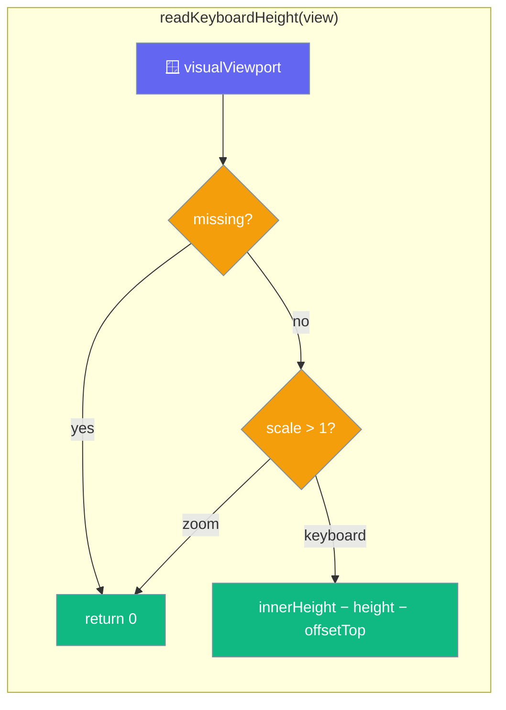

The web shell reads the keyboard height from `visualViewport` and seeds it synchronously at construction, so the first frame lays out correctly.



## Quick Start

<Steps>
<Step title="readKeyboardHeight is the single source of truth">
One exported function computes the keyboard height, with the clamp and the zoom guard in one place.

```ts
export function readKeyboardHeight(view: Window): number {
  const viewport = view.visualViewport;
  if (viewport === null || viewport === undefined) return 0;
  if (viewport.scale > 1) return 0;
  return Math.max(0, view.innerHeight - viewport.height - viewport.offsetTop);
}
```
</Step>

<Step title="createWebShell seeds the snapshot at construction">
`keyboardHeightPx` is seeded, not declared `= 0`.

```ts
export function createWebShell(view: Window = window): WebShell {
  let keyboardHeightPx = readKeyboardHeight(view); // seeded, not 0
  // ... the live handler calls the SAME readKeyboardHeight(view)
}
```
</Step>
</Steps>

---

## How It Works

The seed at construction and the live handler read through the same function, so the clamp-at-0 and the pinch-zoom guard cannot drift between the first frame and every frame after it.

| Behaviour | Result | Why |
|-----------|--------|-----|
| `visualViewport` missing | `0` | A desktop browser with no software keyboard reports nothing. |
| `visualViewport.scale > 1` | `0` | Pinch-zoom shrinks the viewport exactly as a keyboard does; a software keyboard never changes `scale`. |
| otherwise | `Math.max(0, innerHeight − height − offsetTop)` | The gap between the layout and visual viewports, clamped so overscroll cannot make it negative. |

The `keyboardHeightPx` snapshot is seeded at construction, so a component mounting during a warm resume, or with a hardware or floating keyboard already up, lays out correctly on its first frame.

<Warning>
Pinch-zoom shrinks the visual viewport just like a keyboard does. `readKeyboardHeight` guards this with `viewport.scale > 1`. If you re-implement the shell for a different platform, replicate this guard, or a zoomed webview will push the composer up by the wrong amount.
</Warning>

---

## The native counterpart

On desktop and web-only builds, `readKeyboardHeight(view)` is the entire source of the keyboard height. On iOS and Android the keyboard height, safe-area insets, lifecycle, and back-press come from the [Native Shell](/features/mobile/native-shell) instead — four Tauri events the webview subscribes to by string.

The two are complementary, not alternatives. The web shell's `keyboardHeightPx` seed still runs at construction so the first frame lays out correctly; the native `keyboard-height` event feeds every update after it.

---

## Executable Specification

Four conformance tests in `adapters/src/conformance/contracts.test.ts` pin the snapshot and the guard:

| Test | Asserts |
|------|---------|
| keyboard already up at construction | seeds a non-zero height on the first frame |
| no keyboard | reports `0` |
| zoom at construction | a page opened pinch-zoomed is not mistaken for a keyboard |
| zoom after construction | the live path applies the same guard, not just the seed |

---

## Common Patterns

The live handler and the seed share one function, so a hide is never swallowed.

```ts
const publishKeyboard = () => {
  const height = readKeyboardHeight(view);
  keyboardHeightPx = height;
  for (const cb of keyboardSubs) cb(height);
};
viewport.addEventListener("resize", publishKeyboard);
viewport.addEventListener("scroll", publishKeyboard);
```

Layout reads the synchronous snapshot at mount, then subscribes for changes.

```ts
screen.style.setProperty("--keyboard-height", `${platform.shell.keyboardHeightPx}px`);
platform.shell.onKeyboardHeightChanged(applyGeometry);
```

---

## Best Practices

<AccordionGroup>
<Accordion title="Seed the snapshot, do not start at 0">
A property declared `= 0` and only updated by an event reproduces the exact bug it was added to fix: one frame at the wrong height, then a jump. Seed from `readKeyboardHeight(view)` at construction.
</Accordion>

<Accordion title="Guard pinch-zoom in every shell you write">
`scale > 1` separates zoom from a keyboard. A shell that omits the guard reports a phantom keyboard the moment the user zooms — most visibly at construction, on a page opened already zoomed.
</Accordion>

<Accordion title="Read the height through one function">
Keep the clamp and the guard in a single `readKeyboardHeight`. Duplicating the subtraction in the seed and the handler lets the two drift apart.
</Accordion>
</AccordionGroup>

---

## Related

<CardGroup cols={2}>
<Card title="Mobile Architecture" icon="sitemap" href="/features/mobile/architecture">
  How the shell is injected at boot.
</Card>
<Card title="Capabilities & Gaps" icon="list-check" href="/features/mobile/capabilities-and-gaps">
  The keyboard snapshot as a closed gap.
</Card>
<Card title="Native Shell" icon="mobile-button" href="/features/mobile/native-shell">
  The Tauri events that feed the shell on iOS and Android.
</Card>
</CardGroup>
