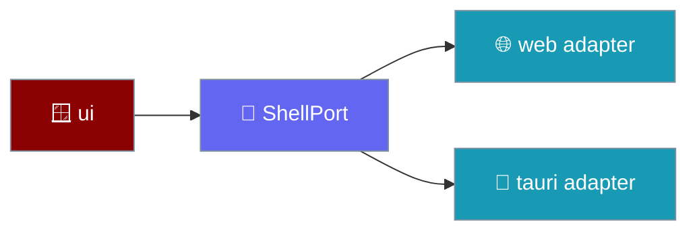
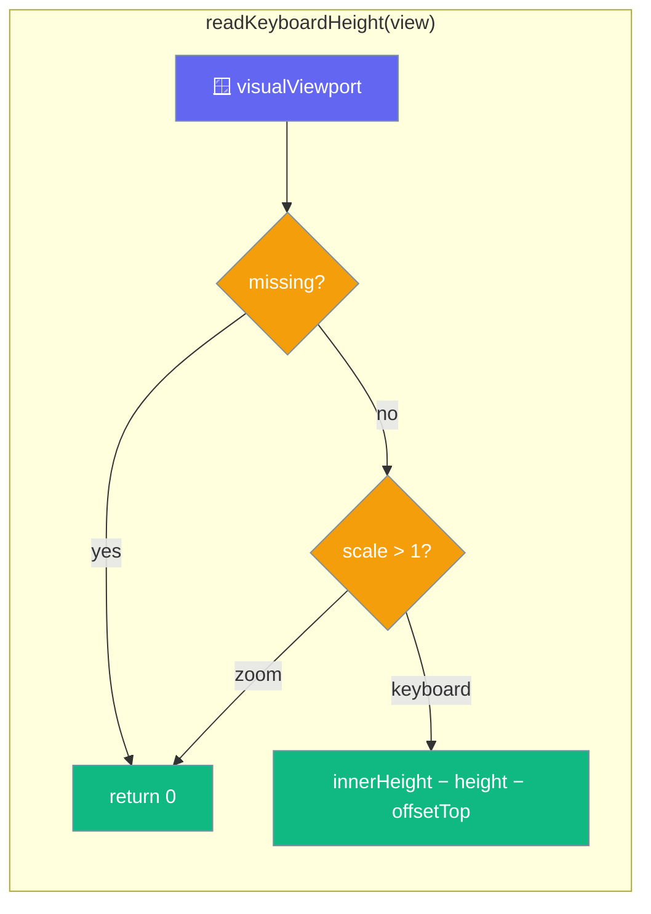

`ShellPort` is the seam between framework-free UI logic and the native shell.

```ts
import { createTauriShell } from "praisonai-mobile/adapters/tauri";

const shell = createTauriShell();
shell.haptic("selection");
await shell.share({ text: "My agent's answer", title: "PraisonAI" });
```





## Quick Start

<Steps>
<Step title="Read the insets synchronously">
```ts
const { top, bottom } = shell.insets;
```
First paint places the composer above the home indicator, so insets are a synchronous snapshot, never a promise.
</Step>

<Step title="React to the keyboard">
```ts
const off = shell.onKeyboardHeightChanged((px) => layout(px));
```
`keyboardHeightPx` is also a synchronous snapshot, so a warm resume with the keyboard already up lays out correctly on mount.
</Step>

<Step title="readKeyboardHeight is the single source of truth">
One exported function computes the keyboard height, with the clamp and the zoom guard in one place.

```ts
export function readKeyboardHeight(view: Window): number {
  const viewport = view.visualViewport;
  if (viewport === null || viewport === undefined) return 0;
  if (viewport.scale > 1) return 0;
  return Math.max(0, view.innerHeight - viewport.height - viewport.offsetTop);
}
```
</Step>

<Step title="createWebShell seeds the snapshot at construction">
`keyboardHeightPx` is seeded, not declared `= 0`.

```ts
export function createWebShell(view: Window = window): WebShell {
  let keyboardHeightPx = readKeyboardHeight(view); // seeded, not 0
  // ... the live handler calls the SAME readKeyboardHeight(view)
}
```
</Step>
</Steps>

---

## What The Shell Provides

These are the capabilities a phone needs but a desktop window does not.

| Capability | Member | Note |
|------------|--------|------|
| Safe area | `insets`, `onInsetsChanged` | Synchronous snapshot + change events. |
| Keyboard | `keyboardHeightPx`, `onKeyboardHeightChanged` | `0` when hidden; fires through the transition. |
| Lifecycle | `onLifecycleChanged` | Background must stop the run loop and flush. |
| Back gesture | `onBackGesture` | Handlers are a **stack**; first to return `true` wins. |
| Haptics | `haptic(kind)` | `selection`, `impact`, `success`, `warning`, `error`. |
| Sharing | `share(payload)` | Hand text/URL to the OS share sheet. |
| Secure links | `openExternal(url)` | Allowlisted schemes only. |

---

## The Two Adapters

| Adapter | Where | Backs |
|---------|-------|-------|
| `web` | `adapters/src/web` | A plain browser window; secrets are process memory. |
| `tauri` | `adapters/src/tauri` | The native shell; keychain-backed secrets. |

Only `adapters/src/tauri` may import `@tauri-apps/*`, and inside it only `bridge.ts` touches them. `tools/depgraph.mjs` enforces this, so a React Native port is one directory rather than an audit.

---

## How It Works

The seed at construction and the live handler read through the same function, so the clamp-at-0 and the pinch-zoom guard cannot drift between the first frame and every frame after it.

| Behaviour | Result | Why |
|-----------|--------|-----|
| `visualViewport` missing | `0` | A desktop browser with no software keyboard reports nothing. |
| `visualViewport.scale > 1` | `0` | Pinch-zoom shrinks the viewport exactly as a keyboard does; a software keyboard never changes `scale`. |
| otherwise | `Math.max(0, innerHeight − height − offsetTop)` | The gap between the layout and visual viewports, clamped so overscroll cannot make it negative. |

The `keyboardHeightPx` snapshot is seeded at construction, so a component mounting during a warm resume, or with a hardware or floating keyboard already up, lays out correctly on its first frame.

<Warning>
Pinch-zoom shrinks the visual viewport just like a keyboard does. `readKeyboardHeight` guards this with `viewport.scale > 1`. If you re-implement the shell for a different platform, replicate this guard, or a zoomed webview will push the composer up by the wrong amount.
</Warning>

---

## Secure External Links

`openExternal` must reject any scheme the allowlist rejects. In a webview, `openExternal("javascript:...")` is script execution in the app's own origin — and the URL routinely comes from a model or a tool result.

```ts
export const OPENABLE_SCHEMES = ["http", "https", "mailto", "tel", "sms", "geo", "maps"];
```

<Warning>
The allowlist lives in the port, not in one adapter, so every shell is held to it by the contract suite. Never add a blocklist instead — the set of dangerous schemes is open-ended.
</Warning>

---

## The native counterpart

On desktop and web-only builds, `readKeyboardHeight(view)` is the entire source of the keyboard height. On iOS and Android the keyboard height, safe-area insets, lifecycle, and back-press come from the [Native Shell](/features/mobile/native-shell) instead — four Tauri events the webview subscribes to by string.

The two are complementary, not alternatives. The web shell's `keyboardHeightPx` seed still runs at construction so the first frame lays out correctly; the native `keyboard-height` event feeds every update after it.

---

## Executable Specification

Four conformance tests in `adapters/src/conformance/contracts.test.ts` pin the snapshot and the guard:

| Test | Asserts |
|------|---------|
| keyboard already up at construction | seeds a non-zero height on the first frame |
| no keyboard | reports `0` |
| zoom at construction | a page opened pinch-zoomed is not mistaken for a keyboard |
| zoom after construction | the live path applies the same guard, not just the seed |

The `SecretsPort`, `StoragePort`, and `TimePort` contracts sit alongside the shell contract in the same file and are pinned by a spawned fixture — see [Adapter Conformance](/features/mobile/adapter-conformance).

---

## What a tap means

A tap lands on whatever is under the finger — a label or an icon inside a button, not the button. `intentFrom` climbs the ancestor chain and returns the innermost actionable intent.

```ts
import { intentFrom } from "praisonai-mobile/app/intents";

const intent = intentFrom(chain); // chain = tapped element then its ancestors
```

| Rule | Behaviour |
|------|-----------|
| A disabled control terminates the walk | It is not skipped so the outer row's intent can fire. A tap on a greyed-out approval button must not fire a second send from the enclosing row. |
| An enabled control resolves through its ancestors | The terminate-on-disabled rule does not disable the whole app — a tap on an icon inside an enabled button still resolves the button's intent. |
| `delete-chat` with an empty or missing `chatId` is refused | Returns `null` rather than defaulting to `""` and deleting whichever chat, if any, is keyed `""`. |

<Warning>
Honouring `disabled` here is what stops a double tap sending two decisions. Skipping a disabled control to reach the row behind it re-introduces the exact bug the disabled state exists to prevent.
</Warning>

---

## Common Patterns

The live handler and the seed share one function, so a hide is never swallowed.

```ts
const publishKeyboard = () => {
  const height = readKeyboardHeight(view);
  keyboardHeightPx = height;
  for (const cb of keyboardSubs) cb(height);
};
viewport.addEventListener("resize", publishKeyboard);
viewport.addEventListener("scroll", publishKeyboard);
```

Layout reads the synchronous snapshot at mount, then subscribes for changes.

```ts
screen.style.setProperty("--keyboard-height", `${platform.shell.keyboardHeightPx}px`);
platform.shell.onKeyboardHeightChanged(applyGeometry);
```

---

## Best Practices

<AccordionGroup>
<Accordion title="Seed the snapshot, do not start at 0">
A property declared `= 0` and only updated by an event reproduces the exact bug it was added to fix: one frame at the wrong height, then a jump. Seed from `readKeyboardHeight(view)` at construction.
</Accordion>

<Accordion title="Guard pinch-zoom in every shell you write">
`scale > 1` separates zoom from a keyboard. A shell that omits the guard reports a phantom keyboard the moment the user zooms — most visibly at construction, on a page opened already zoomed.
</Accordion>

<Accordion title="Read the height through one function">
Keep the clamp and the guard in a single `readKeyboardHeight`. Duplicating the subtraction in the seed and the handler lets the two drift apart.
</Accordion>

<Accordion title="Store back handlers in an array">
The most recently registered handler gets first refusal. A `Set` has no defined order and ships a modal that closes the wrong screen.
</Accordion>

<Accordion title="Never let insets become NaN">
`parseFloat("")` is `NaN`, and `calc(100vh - NaNpx)` silently blanks the screen. Every inset path coerces unparseable input to `0`.
</Accordion>

<Accordion title="Flush on background">
iOS can kill a suspended app with no further callback, so anything unflushed when `onLifecycleChanged` reports `background` is lost.
</Accordion>
</AccordionGroup>

---

## Related

<CardGroup cols={2}>
<Card title="Mobile Architecture" icon="sitemap" href="/features/mobile/architecture">
  How the shell is injected at boot.
</Card>
<Card title="Capabilities & Gaps" icon="list-check" href="/features/mobile/capabilities-and-gaps">
  The keyboard snapshot as a closed gap.
</Card>
<Card title="Native Shell" icon="mobile-button" href="/features/mobile/native-shell">
  The Tauri events that feed the shell on iOS and Android.
</Card>
<Card title="Storage & Secrets" icon="database" href="/features/mobile/storage-and-secrets">
  Where chats and API keys live.
</Card>
<Card title="The Two Seams" icon="layer-group" href="/features/mobile/architecture">
  How the UI-shell seam is enforced.
</Card>
<Card icon="clock" href="/features/mobile/time-and-pacing">
  The other port every conformance suite pins.
</Card>
</CardGroup>
