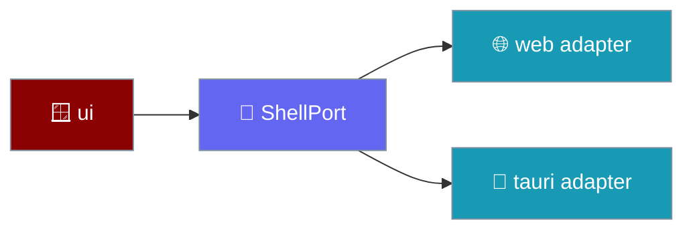
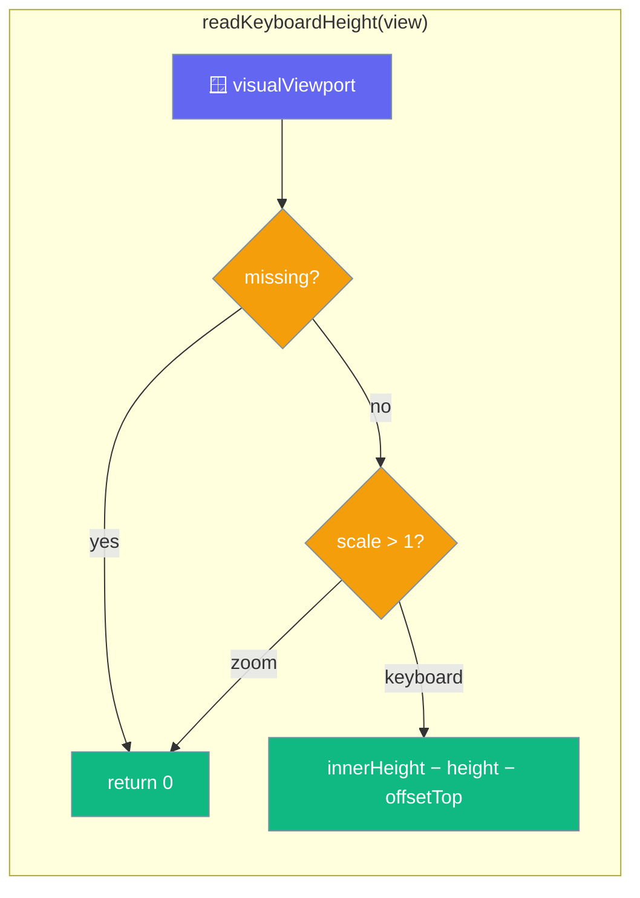
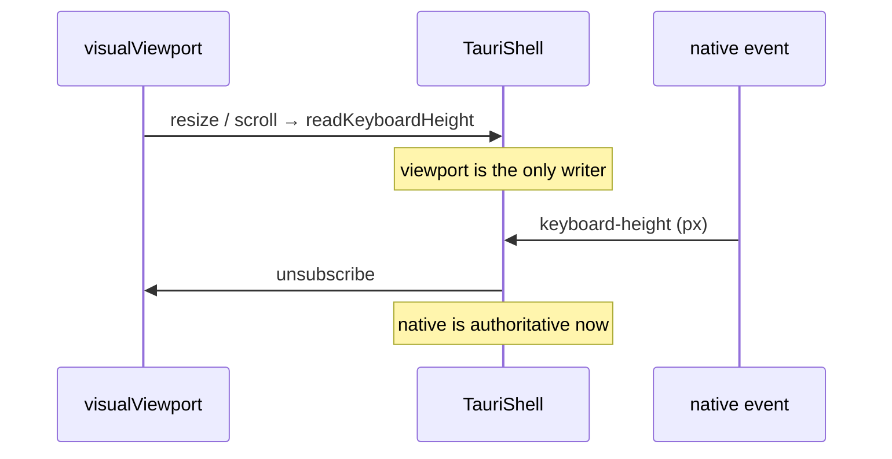

`ShellPort` is the seam between framework-free UI logic and the native shell.

```ts
import { createTauriShell } from "praisonai-mobile/adapters/tauri";

const shell = createTauriShell();
shell.haptic("selection");
await shell.share({ text: "My agent's answer", title: "PraisonAI" });
```





## Quick Start

<Steps>
<Step title="Read the insets synchronously">
```ts
const { top, bottom } = shell.insets;
```
First paint places the composer above the home indicator, so insets are a synchronous snapshot, never a promise.
</Step>

<Step title="React to the keyboard">
```ts
const off = shell.onKeyboardHeightChanged((px) => layout(px));
```
`keyboardHeightPx` is also a synchronous snapshot, so a warm resume with the keyboard already up lays out correctly on mount.
</Step>

<Step title="readKeyboardHeight is the single source of truth">
One exported function computes the keyboard height, with the clamp and the zoom guard in one place.

```ts
export function readKeyboardHeight(view: Window): number {
  const viewport = view.visualViewport;
  if (viewport === null || viewport === undefined) return 0;
  if (viewport.scale > 1) return 0;
  return Math.max(0, view.innerHeight - viewport.height - viewport.offsetTop);
}
```
</Step>

<Step title="createWebShell seeds the snapshot at construction">
`keyboardHeightPx` is seeded, not declared `= 0`.

```ts
export function createWebShell(view: Window = window): WebShell {
  let keyboardHeightPx = readKeyboardHeight(view); // seeded, not 0
  // ... the live handler calls the SAME readKeyboardHeight(view)
}
```
</Step>
</Steps>

---

## What The Shell Provides

These are the capabilities a phone needs but a desktop window does not.

| Capability | Member | Note |
|------------|--------|------|
| Safe area | `insets`, `onInsetsChanged` | Synchronous snapshot + change events. |
| Keyboard | `keyboardHeightPx`, `onKeyboardHeightChanged` | `0` when hidden; fires through the transition. |
| Lifecycle | `onLifecycleChanged` | Background must stop the run loop and flush. |
| Back gesture | `onBackGesture` | Handlers are a **stack**; first to return `true` wins. |
| Haptics | `haptic(kind)` | `selection`, `impact`, `success`, `warning`, `error`. |
| Sharing | `share(payload)` | Hand text/URL to the OS share sheet. |
| Secure links | `openExternal(url)` | Allowlisted schemes only, and the **trimmed** form is what reaches the OS. |

The web adapter's back-gesture handler sits on `popstate`. When any subscriber returns `true` (consumed), the shell **re-pushes** the current URL: `view.history.pushState(null, "", view.location.href)`. That restores the entry the browser just popped, so the app stays where it is **and** the next OS back gesture goes one screen up as the user expects — not out of the app. Using `replaceState` instead would replace the browser's entry, and the next back would exit. When every subscriber returns `false` (declined), the shell does **not** touch history: the browser is allowed to navigate away, so the OS gesture is never trapped inside the app. Pinned by `"the web shell re-pushes history after consuming a back gesture"` and its pair `"a back gesture the app DECLINES does not touch history"`.

---

## The Two Adapters

| Adapter | Where | Backs |
|---------|-------|-------|
| `web` | `adapters/src/web` | A plain browser window; secrets are process memory. |
| `tauri` | `adapters/src/tauri` | The native shell; keychain-backed secrets. |

Only `adapters/src/tauri` may import `@tauri-apps/*`, and inside it only `bridge.ts` touches them. `tools/depgraph.mjs` enforces this, so a React Native port is one directory rather than an audit.

### `invoke` vs `invokeStrict`

`bridge.ts` (`adapters/src/tauri/bridge.ts`) exports **two** ways for TypeScript to talk to Rust — the same call, two rejection policies — because a lost round-trip means different things to a haptic tap and to a chat write.

| Function | On rejection | Right for |
|----------|--------------|-----------|
| `invoke(command, args)` | **Swallows** it and resolves to `null` | A haptic tap, a UI ping — dropping a lost round-trip silently is fine |
| `invokeStrict(command, args)` | **Re-throws** it | A chat write — a lost round-trip is an I/O failure, not an absence |

The storage adapter is built on `invokeStrict` (`createTauriStorage({ invoke: bridge.invokeStrict })`), and it cannot use `invoke`:

- `null` is `StoragePort.read`'s word for **"no such key"**. An adapter built on `invoke` would present a **failing disk** as an **empty chat list** — the conversations look deleted rather than unreadable, and the next save writes over them. `repository.ts` already distinguishes `missing` from `unreadable`, but only if something down here still knows the difference.
- A reply that is **not a string or null** — a boolean, a number, an object — is likewise an I/O failure, not an absence. `invokeStrict`'s caller throws on a wrong-shaped reply (`asStringOrNull` / `asStringArray` in `storage.ts`), so a native host that renamed a command or changed its reply shape fails loudly.
- **Both, on purpose.** `invoke` stays as it is; `invokeStrict` is added alongside it. Storage moves to `invokeStrict`; the haptic tap does not need to.

<Note>
The negative + positive pair: `invokeStrict rejects where invoke resolves to null` proves strictness has teeth, and `a native reply of the wrong shape is an I/O failure, not an empty chat list` proves the wrong-shape guard fires. Both are exercised against the **same** `StoragePort` conformance contract as the web adapter — see [Adapter Conformance](/features/mobile/adapter-conformance#the-tauri-storage-adapter).
</Note>

---

## How It Works

The seed at construction and the live handler read through the same function, so the clamp-at-0 and the pinch-zoom guard cannot drift between the first frame and every frame after it.

| Behaviour | Result | Why |
|-----------|--------|-----|
| `visualViewport` missing | `0` | A desktop browser with no software keyboard reports nothing. |
| `visualViewport.scale > 1` | `0` | Pinch-zoom shrinks the viewport exactly as a keyboard does; a software keyboard never changes `scale`. |
| otherwise | `Math.max(0, innerHeight − height − offsetTop)` | The gap between the layout and visual viewports, clamped so **either** overshoot condition below cannot make it negative. |

### Why the clamp

The clamp is not decorative — it guards **two independent** ways the raw formula can go negative, and a negative keyboard height pushes the composer off the bottom of the screen (documented in-source).

| Overshoot condition | What makes it happen |
|---|---|
| `visualViewport.height > innerHeight` | iOS rubber-band scroll |
| `offsetTop > 0` (non-zero on its own) | A scrolled visual viewport — the page is zoomed, or the URL bar has collapsed |

Either condition alone can drive `innerHeight − height − offsetTop` negative, so `Math.max(0, …)` is what keeps the composer visible. Pinned by `"an overscrolled viewport reports NO keyboard, never a negative one"` and `"a scrolled-down visual viewport reports NO keyboard, never a negative one"`.

<Note>
**The pair keeps the clamp from hiding a real keyboard.** A clamp that returned `0` unconditionally would satisfy every overshoot case and remove the keyboard from the layout entirely. A real keyboard (small `visualViewport.height`, `scale === 1`) is still measured as a **positive** height and the composer must rise for it. Pinned by `"a real keyboard is still measured -- the pair"` and `"pinch zoom is not a keyboard, and no viewport is not a keyboard"`.
</Note>

The `keyboardHeightPx` snapshot is seeded at construction, so a component mounting during a warm resume, or with a hardware or floating keyboard already up, lays out correctly on its first frame.

<Warning>
Pinch-zoom shrinks the visual viewport just like a keyboard does. `readKeyboardHeight` guards this with `viewport.scale > 1`. If you re-implement the shell for a different platform, replicate this guard, or a zoomed webview will push the composer up by the wrong amount.
</Warning>

---

## Secure External Links

`openExternal` must reject any scheme the allowlist rejects. In a webview, `openExternal("javascript:...")` is script execution in the app's own origin — and the URL routinely comes from a model or a tool result.

```ts
export const OPENABLE_SCHEMES = ["http", "https", "mailto", "tel", "sms", "geo", "maps"];
```

<Warning>
The allowlist lives in the port, not in one adapter, so every shell is held to it by the contract suite. Never add a blocklist instead — the set of dangerous schemes is open-ended.
</Warning>

<Warning>
Normalise the scheme before matching. `openExternal("JAVASCRIPT:alert(1)")` is the classic uppercase bypass — a case-sensitive allowlist waves it through because `"JAVASCRIPT"` is not literally in the list. The *"an uppercase JAVASCRIPT: URL is refused"* case is now pinned against hollowing by the `shell_scheme_case_sensitive` break mode — see [Adapter Conformance](/features/mobile/adapter-conformance#the-ten-break-modes).
</Warning>

Case-folding cuts both ways. RFC 3986 says URI schemes are case-insensitive, so a model that emits `HTTPS://example.com`, `Mailto:a@b`, or `TEL:+15551234` is producing perfectly legal URIs — and the user tapping them must reach the OS handler. `isOpenableExternally` lowercases the scheme *before* the allowlist match, so an uppercased legal scheme opens and an uppercased dangerous scheme is still refused. The port fails closed, so dropping the case-fold would leave a dead link rather than a hole — but a dead link with no error is still the app appearing broken. Pinned by `"a scheme the model typed in capitals is still openable"` in `core/src/ports/shell.test.ts`, which asserts `HTTPS://`, `Mailto:`, `TEL:+…` open and `JAVASCRIPT:`, `FILE:` do not.

`openExternal` forwards the **trimmed** URL the allowlist validated, not the raw input. `isOpenableExternally(url)` trims before reading the scheme, so validating one form and forwarding another is the shape of a scheme-confusion bypass — `doesNotReject` proves only that a call did not throw, never that it did the right thing, and for a security boundary that gap is the whole question. The `web` adapter (`view.open(url.trim(), …)`), the Tauri bridge, and the fake shell all forward the trimmed form.

<Note>
On device, `openExternal` now actually reaches the OS on iOS, thanks to `tauri-plugin-opener`. Previously the invoke rejected, the bridge swallowed it, and on iOS (no `window.open`) it returned `true` having done nothing. The capability grants `opener:allow-open-url` **and** `opener:allow-default-urls` — without the scope every `http(s)`/`mailto`/`tel` URL is still refused. No API change on the TypeScript side.
</Note>

The Tauri bridge's `webOpen` opens the URL in a fresh, severed context — and reports **truthfully** whether it did.

| Invariant | Why |
|-----------|-----|
| `open(url, …)` is actually called | Dropping the call and keeping `return true` reports success having opened nothing — a link that does nothing while the app believes it worked. |
| `target === "_blank"` | `"_self"` replaces the running app with whatever the link points to. |
| `features` contains `noopener` **and** `noreferrer` | Otherwise the opened page keeps a live `window.opener` back into the app, and the referrer leaks. |
| `openExternal` returns `false` when there is no window to open with | Returning `true` unconditionally is the defect above; returning `false` unconditionally would make every real link look broken. The pair is what makes either mistake detectable. |

Pinned by `"the tauri bridge opens links in a NEW context, with the opener severed"` and `"openExternal reports FAILURE when there is nothing to open with"`.

---

## The native counterpart

On desktop and web-only builds, `readKeyboardHeight(view)` is the entire source of the keyboard height. On iOS and Android the keyboard height, safe-area insets, lifecycle, and back-press come from the [Native Shell](/features/mobile/native-shell) instead — four Tauri events the webview subscribes to by string.

The two are complementary, not alternatives. The web shell's `keyboardHeightPx` seed still runs at construction so the first frame lays out correctly; the native `keyboard-height` event feeds every update after it.

---

## The two-source keyboard model

The Tauri shell seeds the keyboard height from `visualViewport` and subscribes to it live, then hands over to the native event the moment one arrives — one writer at a time.

`createTauriShell` takes a `view?: Window` param so the path runs in tests without a phone. It seeds `keyboardHeightPx` from `readKeyboardHeight(view)`, the same reader the web shell uses, and subscribes to `visualViewport`'s `resize` and `scroll`. The native `keyboard-height` event is authoritative where it exists, so the first native height unsubscribes the viewport listener — two live writers would race on every keyboard animation.

```ts
import { createTauriShell } from "praisonai-mobile/adapters/tauri";
import { createFakeWindow } from "praisonai-mobile/adapters/web/fake-window";

const window = createFakeWindow();
const shell = createTauriShell({ view: window.window });
window.setKeyboardHeight(320);
// shell.keyboardHeightPx === 320
```



This was a hard `0` whose only writer was the native event, and `keyboard-height` — unlike the other three shell events — is still not emitted natively. Because `app.css` pins `#root` to `position: fixed; inset: 0`, the layout viewport does not shrink either, so without the viewport reader the composer would sit under the keyboard the instant anyone tapped it. The two-source model (viewport reader as a live seed, native event as an override the day it arrives) is what makes the composer track the slide on device today.

The fake window now models `visualViewport.removeEventListener`, so a test using `createFakeWindow()` can exercise an adapter that unsubscribes — previously a listener could be added and never removed, and any adapter that unsubscribed threw. Both paths are pinned by `adapters/src/conformance/contracts.test.ts` — "the TAURI shell reports the keyboard height, without any native event" and "a native keyboard height takes over from the viewport reading". See [Adapter Conformance → Keyboard height](/features/mobile/adapter-conformance#keyboard-height).

---

## Executable Specification

Conformance tests in `adapters/src/conformance/contracts.test.ts` pin the snapshot, the guard, and the trimmed-forward invariant:

| Test | Asserts |
|------|---------|
| keyboard already up at construction | seeds a non-zero height on the first frame |
| no keyboard | reports `0` |
| zoom at construction | a page opened pinch-zoomed is not mistaken for a keyboard |
| zoom after construction | the live path applies the same guard, not just the seed |
| a padded URL reaches the OS trimmed, or not at all | the OS receives `"https://ok.example"`, never `"  https://ok.example  "` — and a padded `javascript:` / `data:` is still rejected |
| (Tauri-only) the tauri shell forwards the URL it validated, not the one it was given | the bridge is handed the trimmed URL |
| a consumed back gesture re-pushes the current URL | the app stays where it is, and the next back goes one screen up — not out of the app |
| an unconsumed back gesture does not touch history | the OS gesture is allowed to leave the app — pushing unconditionally would trap the user on the page |

The harness surfaces what each shell forwarded through `forwarded()`, so these cases read the exact string handed to the OS rather than only whether the call settled. The `SecretsPort`, `StoragePort`, and `TimePort` contracts sit alongside the shell contract in the same file and are pinned by a spawned fixture — see [Adapter Conformance](/features/mobile/adapter-conformance).

---

## What a tap means

A tap lands on whatever is under the finger — a label or an icon inside a button, not the button. `intentFrom` climbs the ancestor chain and returns the innermost actionable intent.

```ts
import { intentFrom } from "praisonai-mobile/app/intents";

const intent = intentFrom(chain); // chain = tapped element then its ancestors
```

| Rule | Behaviour |
|------|-----------|
| A disabled control terminates the walk | It is not skipped so the outer row's intent can fire. A tap on a greyed-out approval button must not fire a second send from the enclosing row. |
| An enabled control resolves through its ancestors | The terminate-on-disabled rule does not disable the whole app — a tap on an icon inside an enabled button still resolves the button's intent. |
| `delete-chat` with an empty or missing `chatId` is refused | Returns `null` rather than defaulting to `""` and deleting whichever chat, if any, is keyed `""`. |

<Warning>
Honouring `disabled` here is what stops a double tap sending two decisions. Skipping a disabled control to reach the row behind it re-introduces the exact bug the disabled state exists to prevent.
</Warning>

---

## Common Patterns

The live handler and the seed share one function, so a hide is never swallowed.

```ts
const publishKeyboard = () => {
  const height = readKeyboardHeight(view);
  keyboardHeightPx = height;
  for (const cb of keyboardSubs) cb(height);
};
viewport.addEventListener("resize", publishKeyboard);
viewport.addEventListener("scroll", publishKeyboard);
```

Layout reads the synchronous snapshot at mount, then subscribes for changes.

```ts
screen.style.setProperty("--keyboard-height", `${platform.shell.keyboardHeightPx}px`);
platform.shell.onKeyboardHeightChanged(applyGeometry);
```

---

## Best Practices

<AccordionGroup>
<Accordion title="Seed the snapshot, do not start at 0">
A property declared `= 0` and only updated by an event reproduces the exact bug it was added to fix: one frame at the wrong height, then a jump. Seed from `readKeyboardHeight(view)` at construction.
</Accordion>

<Accordion title="Guard pinch-zoom in every shell you write">
`scale > 1` separates zoom from a keyboard. A shell that omits the guard reports a phantom keyboard the moment the user zooms — most visibly at construction, on a page opened already zoomed.
</Accordion>

<Accordion title="Read the height through one function">
Keep the clamp and the guard in a single `readKeyboardHeight`. Duplicating the subtraction in the seed and the handler lets the two drift apart.
</Accordion>

<Accordion title="Store back handlers in an array">
The most recently registered handler gets first refusal. A `Set` has no defined order and ships a modal that closes the wrong screen.
</Accordion>

<Accordion title="Never let insets become NaN">
`parseFloat("")` is `NaN`, and `calc(100vh - NaNpx)` silently blanks the screen. Every inset path coerces unparseable input to `0`.
</Accordion>

<Accordion title="Flush on background">
iOS can kill a suspended app with no further callback, so anything unflushed when `onLifecycleChanged` reports `background` is lost.
</Accordion>
</AccordionGroup>

---

## Related

<CardGroup cols={2}>
<Card title="Mobile Architecture" icon="sitemap" href="/features/mobile/architecture">
  How the shell is injected at boot.
</Card>
<Card title="Capabilities & Gaps" icon="list-check" href="/features/mobile/capabilities-and-gaps">
  The keyboard snapshot as a closed gap.
</Card>
<Card title="Native Shell" icon="mobile-button" href="/features/mobile/native-shell">
  The Tauri events that feed the shell on iOS and Android.
</Card>
<Card title="Storage & Secrets" icon="database" href="/features/mobile/storage-and-secrets">
  Where chats and API keys live.
</Card>
<Card title="The Two Seams" icon="layer-group" href="/features/mobile/architecture">
  How the UI-shell seam is enforced.
</Card>
<Card icon="clock" href="/features/mobile/time-and-pacing">
  The other port every conformance suite pins.
</Card>
</CardGroup>
