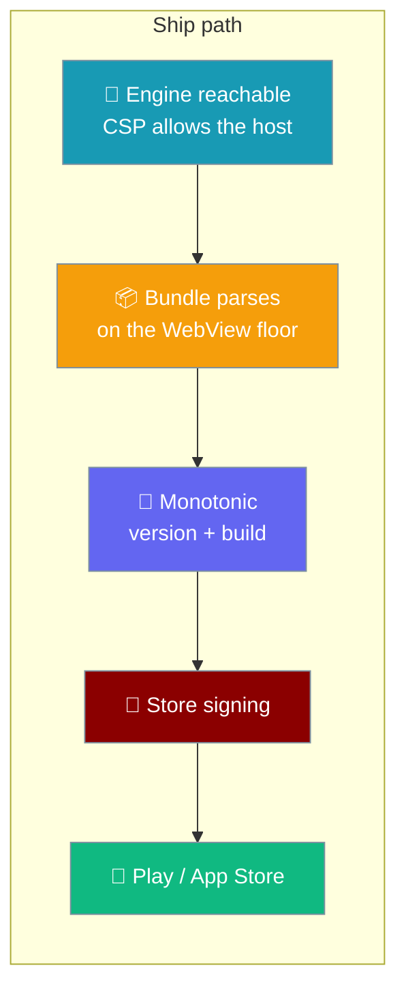

Four things must agree before a store accepts a build: the engine has to be reachable, the bundle has to parse on the oldest WebView you support, the version and build number have to be monotonic, and the crate has to type-check for the phone.



## Quick Start

<Steps>
<Step title="Build the webview">
Build the webview; the platform projects are already committed, so no init step is needed.

```bash
cd src/praisonai-mobile
npm ci && npm run build
```

Both `gen/apple` and `gen/android` are committed under `src-tauri/gen/`, so `init` is a no-op on a fresh clone. The workflow re-generates them only if the folder is missing — see [Platform Builds](/features/mobile/platform-builds) for the CI that actually builds them.
</Step>

<Step title="Stamp the release">
Write the version and a monotonic build number into `tauri.conf.json` before the store build runs.

```bash
node tools/set-release-version.mjs v1.2.3 "$GITHUB_RUN_NUMBER"
```

This writes `version`, `bundle.android.versionCode`, and `bundle.iOS.buildNumber`.
</Step>
</Steps>

<Note>
**Web is not a store.** This page covers the iOS and Android Tauri builds. The third target — the browser PWA — has no store review, no signing, and no monotonic build number: it is deployed straight to GitHub Pages by a workflow. See [Web App (PWA)](/features/mobile/web-app#deploying-to-github-pages).

The CI that actually builds the two committed platform projects on every mobile PR — and the signing credentials still needed for a store upload — lives on [Platform Builds](/features/mobile/platform-builds).
</Note>

---

## The engine must be reachable — CSP

A webview enforces `connect-src` on `fetch`, and the engine's `baseUrl` is a host the user sets — so a too-tight `connect-src` blocks every remote engine before a packet leaves.

| Directive | Shipped value |
|---|---|
| `default-src` | `'self'` |
| `script-src` | `'self'` |
| `style-src` | `'self' 'unsafe-inline'` |
| `img-src` | `'self' data: blob:` |
| `font-src` | `'self' data:` |
| `connect-src` | `'self' ipc: http://ipc.localhost https: http://127.0.0.1:* http://localhost:*` |

The exact CSP shipped in `src-tauri/tauri.conf.json`:

```
default-src 'self';
script-src 'self';
style-src 'self' 'unsafe-inline';
img-src 'self' data: blob:;
font-src 'self' data:;
connect-src 'self' ipc: http://ipc.localhost https: http://127.0.0.1:* http://localhost:*
```

The old `connect-src 'self' ipc: http://ipc.localhost` permitted no engine at all — including the shipped loopback default `http://127.0.0.1:8765`. On a phone the engine is across a network, so `https:` is now permitted too.

<Warning>
**`script-src` stays closed on purpose.** A model can return arbitrary text and a tool result is attacker-shaped in the ordinary case; `script-src 'self'` is what stops that becoming code in the app's origin. Widening `connect-src` must never widen `script-src`. Both halves are pinned by `tools/tauri-conf.test.mjs` — "the CSP still refuses remote SCRIPTS -- the pair".
</Warning>

---

## The bundle must parse on the floor

The esbuild target is derived from the platform minimum the app declares, not chosen independently.

| `minSdkVersion` | WebView floor |
|---|---|
| `26` (Android 8.0) | `chrome58` |
| `30` (Android 11) | `chrome87` |
| `33` (Android 13) | `chrome108` |

`minSdkVersion: 26` implies `chrome58` because Android's WebView updates through Play, but AOSP, Play-less, and long-offline devices keep whatever they shipped with — exactly the population a floor exists to protect. The bundle targets `["safari16", "chrome58"]` and the table lives as `ANDROID_WEBVIEW_FLOOR` in `tools/bundle.mjs`.

The 400 kB budget the floor is measured against is now specifically the **shell** budget (`SHELL_BUDGET_BYTES`) — the entry chunk plus its static import graph, parsed on every cold start. The engine and its provider stack live behind `import()` under a second budget (`LAZY_BUDGET_BYTES = 1600 kB`). Measured at the `chrome58` floor: shell **66.6 kB**, well under 400 kB; lazy **1459.6 kB** across 16 chunks, of which ~100 kB is chrome58 lowering that lands in the lazy chunks rather than the shell. Splitting the engine off the shell is what keeps first paint cheap while the engine is fetched only when a turn needs it. See [Engines → The shell and lazy split](/features/mobile/engines#the-shell-and-lazy-split).

<Note>
**The shipped page's true floor is Chrome 63, not 58.** One construct is kept above the WebView floor on purpose: `import()`, which esbuild lowers to a static import at `chrome58` — collapsing the split and dropping the whole engine into the shell. `bundle()` overrides that with `supported: { "dynamic-import": true }`, and `SPLIT_MIN_CHROME = chrome63` records where esbuild leaves `import()` alone. This is recorded in `bundle.mjs`, **not** a `minSdkVersion` change — `minSdkVersion` stays 26. See [Engines → The shell and lazy split](/features/mobile/engines#the-shell-and-lazy-split).
</Note>

<Warning>
Bumping `minSdkVersion` in `tauri.conf.json` also bumps the bundle target. `tools/bundle-target.test.mjs` fails until both agree — it pins Chrome ↔ `minSdkVersion`, Safari ↔ the iOS minimum, and checks **every** shipped chunk (the engine's included) with a parser: lowering a chunk to `chrome58` must be a no-op against an `esnext` control, so any syntax the floor cannot parse fails the test.
</Warning>

**Unresolved bare imports.** The gate also asks, for every bare import in the bundled output, whether Node can resolve it — now **consumer-first, importer-second**: from this package before the importer's own tree. A webview has no module resolver, so `import "openai"` in the shipped file dies at import time with the same blank screen as a static Node builtin.

Consumer-first matters because `praisonai` is a `file:` link to `../praisonai-ts` (see [Engines → Development consumes praisonai through a file link](/features/mobile/engines#development-consumes-praisonai-through-a-file-link)): Node's real-path resolution through `../praisonai-ts/node_modules` cannot see peers **this** package provides. `@ai-sdk/cohere` — which praisonai imports and never declares — came back unresolved when the gate re-resolved from praisonai's tree; reading "unresolved" consumer-first off the metafile picks it up from the peer this package declares, with no duplicated package and `openai` still from praisonai's own tree. See [Engines → Consumer-first bare-import resolution](/features/mobile/engines#consumer-first-bare-import-resolution).

| Import | Result |
|---|---|
| `praisonai/mobile` (installed) | ✓ passes — resolves to `node_modules/praisonai/dist/mobile.js` |
| `definitely-not-installed` | ✗ fails — reported in `report.unresolved` and `isShippable(report)` is `false` |

Two exemptions:

- esbuild's own metafile markers (`RUNTIME_MARKERS`) — not real packages.
- Node builtins (`fs`, `crypto`, `node:fs`, …). Redundant in practice — `createRequire` resolves builtins too — but kept as intent so a builtin is never reported twice, since builtins are already classified elsewhere in the gate as fatal-or-lazy.

The resolver is anchored at the mobile app entry on purpose. A test that probes the gate with an entry file inside a temp directory sees everything as missing — there is no `node_modules` above a temp path — and passes for the wrong reason. The real app entry sits inside the package; the probe in `tools/bundle.test.mjs` does the same.

---

## Version + monotonic build number

Semver alone cannot serve both stores, so `tools/set-release-version.mjs` writes a strictly increasing build number alongside the version.

Play rejects a re-used `versionCode`; App Store Connect rejects a duplicate `CFBundleVersion` within the same `CFBundleShortVersionString`. A re-upload of the same version after a rejection needs a higher number — which is precisely when a release is most likely to need one.

```ts
import { releaseVersion, buildNumber, setReleaseVersion } from "praisonai-mobile/tools/set-release-version";

releaseVersion("v1.2.3");   // "1.2.3" — strips the v, strict semver
buildNumber("42");           // 42 — positive integer
setReleaseVersion("v1.2.3", "42"); // writes version + versionCode + buildNumber
```

CI passes `github.run_number` for the build number, because it only ever increases for a repository.

<Note>
`tauri.conf.json` is the single source the bundler reads — deliberately not synced with `package.json` or `Cargo.toml`, matching the desktop package's decision after #4527.
</Note>

---

## Cross-check in CI

Host `cargo check` never expands the mobile `cfg`, so a `cross-check` matrix in `.github/workflows/mobile.yml` runs `cargo check --lib` against real phone targets.

The `shell` job runs on host targets, so `#[cfg_attr(mobile, tauri::mobile_entry_point)]` and the `#[cfg(target_os = "android"/"ios")]` arms in `commands.rs` expanded zero times. `cargo check` type-checks and macro-expands under the mobile `cfg` and needs no NDK or Xcode project — measured at 18 s for the Android target.

| Target | Runner |
|---|---|
| `aarch64-linux-android` | `ubuntu-22.04` |
| `aarch64-apple-ios` | `macos-15` |

---

## Best Practices

<AccordionGroup>
<Accordion title="Do not widen script-src to fix an unreachable engine">
An engine that cannot be reached is a `connect-src` problem — widen that instead. `script-src` closed is what keeps model output from becoming code in the app's origin.
</Accordion>

<Accordion title="Bump minSdkVersion and the bundle target together">
The two are two numbers in two files that must agree. `bundle-target.test.mjs` fails until the WebView floor matches the declared `minSdkVersion`.
</Accordion>

<Accordion title="Never hand-pick a versionCode">
Use `github.run_number`, or another counter that only increases. A hand-picked number that repeats is rejected by the store on the second upload.
</Accordion>

<Accordion title="Both platform projects are committed — keep them that way">
`gen/apple` and `gen/android` are committed alongside `gen/schemas/*.json` and `src-tauri/Cargo.lock`, so `init` is a no-op on a fresh clone. The template's own `.gitignore` handles build outputs — see [Platform Builds](/features/mobile/platform-builds).
</Accordion>
</AccordionGroup>

---

## Related

<CardGroup cols={2}>
<Card title="Platform Builds" icon="mobile-screen-button" href="/features/mobile/platform-builds">
  The committed gen/apple and gen/android projects, and the CI that builds them.
</Card>
<Card title="Native Shell" icon="mobile-button" href="/features/mobile/native-shell">
  The Tauri events, the back-gesture arbitration, and the platform floors.
</Card>
<Card title="Shell & Adapters" icon="mobile-screen" href="/features/mobile/shell-and-adapters">
  The two-source keyboard model and the trimmed-forward link rule.
</Card>
<Card title="Composer" icon="keyboard" href="/features/mobile/composer-behavior">
  The layout invariants that keep the composer clear of the keyboard.
</Card>
<Card title="Architecture" icon="sitemap" href="/features/mobile/architecture">
  Boot order and where the shell is injected.
</Card>
</CardGroup>
