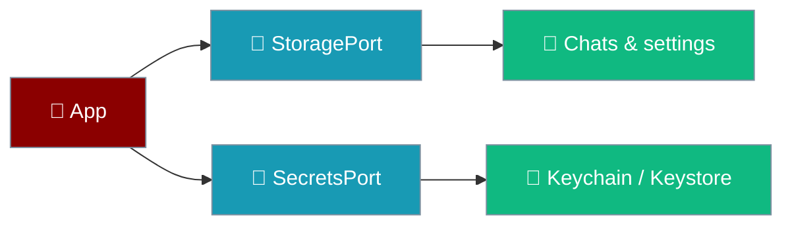
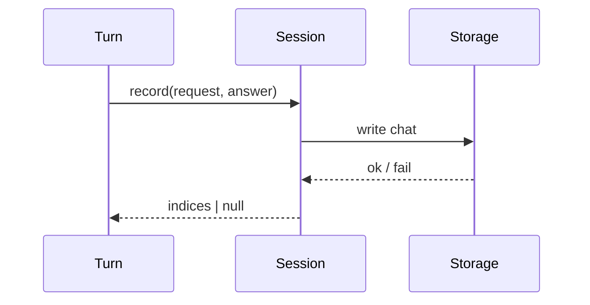

Two ports keep conversations and credentials apart on purpose.

```ts
import { OPENAI_KEY } from "praisonai-mobile/app/registry";

await secrets.set(OPENAI_KEY, "sk-...");
const configured = await secrets.has(OPENAI_KEY);
```



## Quick Start

<Steps>
<Step title="Read and write a chat">
```ts
await storage.write({ namespace: "chats", id: "c1" }, serialized);
const raw = await storage.read({ namespace: "chats", id: "c1" });
```
Every write is namespaced by construction; a bare string key is unrepresentable.
</Step>

<Step title="Store an API key">
```ts
await secrets.set({ slot: "openai", account: "default" }, "sk-...");
```
A secret never passes through `StoragePort`.
</Step>
</Steps>

---

## StoragePort

Persistence is opaque strings; serialisation lives in `core/src/chat/repository.ts`, not in the adapter.

| Member | Behaviour |
|--------|-----------|
| `read(key)` | `null` for a missing key; only I/O failure is an error. |
| `write(key, value)` | Atomic — a concurrent read sees old or new, never a truncated file. |
| `remove(key)` | Removing an absent key succeeds. |
| `listIds(namespace)` | Ids in a namespace. |
| `clear(namespace)` | Empty a namespace. |

Namespaces are a closed set: `chats`, `settings`, `drafts`, `cache`.

<Note>
Writes are atomic because iOS can kill a suspended app mid-write. A halfway write is a normal occurrence on mobile, not a crash scenario.
</Note>

### When storage is unavailable

If `StoragePort` cannot be reached at all, boot fails to the crash screen instead of rendering an app that silently does nothing.

Two triggers make the port unreachable at boot:

| Trigger | When it fires |
|---------|---------------|
| `SecurityError` | Site data is blocked — a WKWebView with storage disabled. |
| `QuotaExceededError` | Storage pressure — the device is out of room to persist. |

`createApp` calls `settingsStore.load()` unguarded, so either throw propagates. `mount()` wraps the whole boot in `bootOrFail`, which turns the throw into a typed `{ ok: false, reason: "storage_unavailable", detail }` and renders the crash screen with the real detail.

```ts
// main.ts — a throw from createApp becomes a typed BootResult.
async function bootOrFail(options) {
  try {
    return await createApp(options);
  } catch (error) {
    return { ok: false, reason: "storage_unavailable", detail: String(error) };
  }
}
```

<Warning>
Before this, a `StoragePort` failure left a perfectly rendered app — top bar, composer, green Send button — in which nothing whatsoever happened, forever. See [Boot Failures](/features/mobile/boot-failures) for every `BootResult.reason`.
</Warning>

---

## SecretsPort

API keys go to the iOS keychain or Android keystore, never to `StoragePort`.

| Member | Behaviour |
|--------|-----------|
| `has(ref)` | Presence only; must not fault the value into memory. |
| `get(ref)` | The full value, given to the engine only. |
| `set(ref, value)` | Store a secret. |
| `delete(ref)` | Remove a secret. |
| `isHardwareBacked` | `false` on the web adapter, where secrets are process memory. |

The slot is a closed union — `openai`, `anthropic`, `google`, `openrouter`, `custom` — so a bug cannot write an attacker-influenced string into the keychain namespace.

<Warning>
When `isHardwareBacked` is `false`, the settings view shows an explicit warning. A silent downgrade is how a user comes to believe a key is protected when it is not.
</Warning>

---

## How Session Persistence Works

A completed turn is recorded through the session, which owns the join between the assistant-only run state and the two-sided stored chat. `end.userIndex` is produced by whatever actually did the write — `null` when the write failed.



An unreadable chat is skipped rather than crashing the list, and the webview isolates storage to its own origin.

<Note>
The last-used engine is stored under the `engineId` key in the `settings` namespace and honoured on next launch, so the app reopens on the engine the user chose rather than a compiled-in default.
</Note>

### How settings resolve

`isSet(key)` decides whether a stored value may outrank a caller's explicit argument, and an empty string never does.

If a settings key holds an empty string, the composition root's default wins. Boot no longer dies with `unknown_engine ''` on a blank field — a settings UI can persist `""`, where before a blank field outranked the default and bricked the app on next launch.

`isSet(key)` now returns `true` for keys the user changed inside the app, not only for keys loaded from disk on boot — so a setting changed at runtime is honoured by `chosenStringOr` in the same run. A refused write (validation failed) still leaves `isSet(key)` as `false`, so a rejected value cannot outrank a caller's argument.

```ts
settings.set("engineId", "");          // persists fine; default still wins
settings.set("engineId", "remote");    // isSet → true, chosen this run
```

---

## Best Practices

<AccordionGroup>
<Accordion title="Route secrets through SecretsPort only">
`settings.set()` refuses a secret-flagged key; `setSecret` is the only way in, and there is deliberately no getter in the UI facade. Persistence also strips any secret-flagged key from what it writes — `plainOnly` drops every def marked `secret: true` before the settings map reaches storage — so a bug that assigns a raw API key to a settings slot cannot end up on disk.
</Accordion>

<Accordion title="Keep serialisation in core">
Adapters store opaque strings, so swapping the backing store — Tauri store, SQLite, OPFS — changes no format and loses no data.
</Accordion>

<Accordion title="Show the hardware-backing state honestly">
Surface `isHardwareBacked` in settings so users know whether a key is keychain-protected or in memory.
</Accordion>
</AccordionGroup>

---

## Related

<CardGroup cols={2}>
<Card title="UI Shell Port" icon="mobile-button" href="/features/mobile/shell-and-adapters">
  The adapters that back these ports.
</Card>
<Card title="Approvals & Cancellation" icon="hand-back-fist" href="/features/mobile/approvals-and-cancellation">
  Human-in-the-loop on the device.
</Card>
<Card title="Boot Failures" icon="bug" href="/features/mobile/boot-failures">
  The crash screen when storage is unavailable.
</Card>
</CardGroup>
