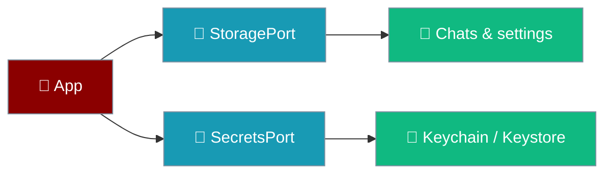
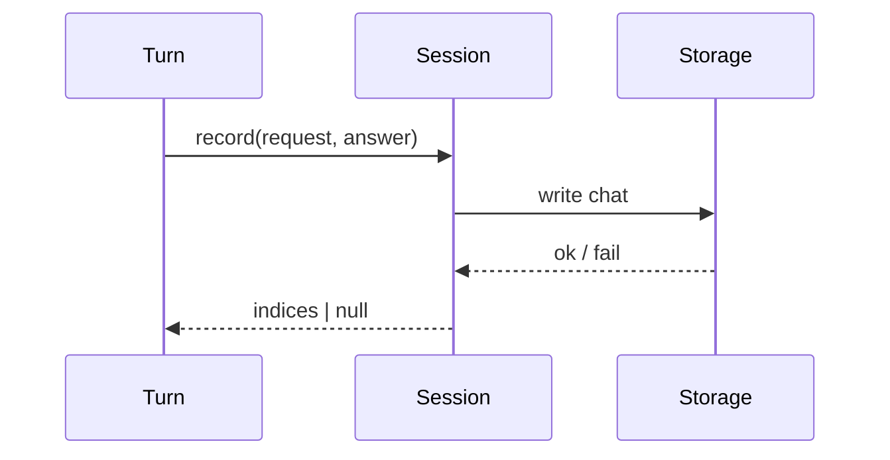

Two ports keep conversations and credentials apart on purpose.

```ts
// Explicit account — a second profile in the same slot is its own key
await secrets.set({ slot: "openai", account: "work" }, "sk-work");
await secrets.set({ slot: "openai", account: "personal" }, "sk-personal");

// The single-key case
const openaiKey = { slot: "openai" as const, account: "default" };
await secrets.set(openaiKey, "sk-...");
const configured = await secrets.has(openaiKey);
```



## Quick Start

<Steps>
<Step title="Read and write a chat">
```ts
await storage.write({ namespace: "chats", id: "c1" }, serialized);
const raw = await storage.read({ namespace: "chats", id: "c1" });
```
Every write is namespaced by construction; a bare string key is unrepresentable.
</Step>

<Step title="Store an API key">
```ts
await secrets.set({ slot: "openai", account: "default" }, "sk-...");
```
A secret never passes through `StoragePort`.
</Step>
</Steps>

---

## StoragePort

Persistence is opaque strings; serialisation lives in `core/src/chat/repository.ts`, not in the adapter.

| Member | Behaviour |
|--------|-----------|
| `read(key)` | `null` for a missing key; only I/O failure is an error. |
| `write(key, value)` | Atomic — a concurrent read sees old or new, never a truncated file. |
| `remove(key)` | Removing an absent key succeeds. |
| `listIds(namespace)` | Ids in a namespace. |
| `clear(namespace)` | Empty a namespace. |

Namespaces are a closed set: `chats`, `settings`, `drafts`, `cache`.

The storage contract is pinned by the same fixture — `storage_missing_is_undefined`, `storage_namespaces_collide`, and `storage_empty_is_absent` are the three storage break modes. The last means a stored empty string is now guarded against hollowing, not just deletion: the *"an empty string is a value, not an absence"* case reddens by name if an adapter treats `""` as missing. See [Adapter Conformance](/features/mobile/adapter-conformance).

<Note>
Writes are atomic because iOS can kill a suspended app mid-write. A halfway write is a normal occurrence on mobile, not a crash scenario.
</Note>

### When storage is unavailable

The same two `StoragePort` throws — `SecurityError` (site data blocked) and `QuotaExceededError` (device out of room) — land in **two different places** depending on *when* they fire. At boot they are fatal; after boot on the `chats` route they are local.

| Trigger | When it fires |
|---------|---------------|
| `SecurityError` | Site data is blocked — a WKWebView with storage disabled. |
| `QuotaExceededError` | Storage pressure — the device is out of room to persist. |

#### At boot

If `StoragePort` cannot be reached at all, boot fails to the crash screen instead of rendering an app that silently does nothing.

`createApp` calls `settingsStore.load()` unguarded, so either throw propagates. `mount()` wraps the whole boot in `bootOrFail`, which turns the throw into a typed `{ ok: false, reason: "storage_unavailable", detail }` and renders the crash screen with the real detail.

```ts
// main.ts — a throw from createApp becomes a typed BootResult.
async function bootOrFail(options) {
  try {
    return await createApp(options);
  } catch (error) {
    return { ok: false, reason: "storage_unavailable", detail: String(error) };
  }
}
```

<Warning>
Before this, a `StoragePort` failure left a perfectly rendered app — top bar, composer, green Send button — in which nothing whatsoever happened, forever. See [Boot Failures](/features/mobile/boot-failures) for every `BootResult.reason`.
</Warning>

#### After boot, on the `chats` route

The same two throws can be raised **after** boot, while `session.list()` / `listUnreadable()` are running to rebuild the chat list. Here they must **not** be fatal — the user already has a healthy conversation open. The route's rebuild block catches the rejection locally and renders a `role="alert"` warning row inside the failing `chats` section; the app-wide chrome and the open chat are untouched. See [History & Reopen → When the list load itself fails](/features/mobile/history-and-reopen#when-the-list-load-itself-fails) for the UX detail. Pinned by `"a storage failure while the chat list loads stays LOCAL, not fatal"`.

<Warning>
A floating rejection inside a post-boot async block reaches the global crash handler installed in step 0 of `mount()` and replaces the whole app with the fatal `storage_unavailable` screen. Any async work started in response to a route change must `.catch()` and render locally.
</Warning>

---

## SecretsPort

API keys go to the iOS keychain or Android keystore, never to `StoragePort`.

| Member | Behaviour |
|--------|-----------|
| `has(ref)` | Presence only; must not fault the value into memory. |
| `get(ref)` | The full value, given to the engine only. |
| `set(ref, value)` | Store a secret. |
| `delete(ref)` | Remove a secret. |
| `isHardwareBacked` | `false` on the web adapter, where secrets are process memory. |

The slot is a closed union — `openai`, `anthropic`, `google`, `openrouter`, `custom` — so a bug cannot write an attacker-influenced string into the keychain namespace.

<Warning>
When `isHardwareBacked` is `false`, the settings view shows an explicit warning. A silent downgrade is how a user comes to believe a key is protected when it is not.
</Warning>

### How secrets are keyed

A secret is addressed by a `SecretRef = { slot, account }` pair — both halves are part of the key.


| Rule | Behaviour |
|------|-----------|
| Two accounts, one slot | Independent secrets. Writing one never touches the other; `has()` for a sibling account returns `false`; deleting one leaves siblings alone. |
| Two slots | Always independent. |
| Overwriting | Replaces the value, never appends. |
| Empty string `""` | A **stored value**, not an absence — `has()` returns `true`, `get()` returns `""`. Adapters must not use `\|\|` to fall back on empty. |
| Deleting an absent secret | **Succeeds** (no throw). Callers need not wrap `delete` in `try`. |
| Reading a never-set secret | Returns `null` — never `undefined`, never a throw. |

<Warning>
Keying by `slot` alone makes a second profile silently overwrite the first: adding `account: "personal"` after `account: "work"` would share one credential, and deleting one would delete both. Both halves of the `SecretRef` are the key.
</Warning>

<Info>
`SecretRef.slot` is a closed union — `"openai" | "anthropic" | "google" | "openrouter" | "custom"` (source: `core/src/ports/secrets.ts`). `account` is any string; `"default"` is the single-key case.
</Info>

### Writing a SecretsPort adapter

Any adapter that passes the runnable conformance contract is drop-in compatible with the fake and the web adapter.

```ts
import { describeSecretsContract } from "praisonai-mobile/adapters/conformance/secrets-contract";

describeSecretsContract("my adapter", () => createMyAdapter());
```

The contract lives at `adapters/src/conformance/secrets-contract.ts`. It exists because the web adapter had no test at all, and a mutation sweep found that collapsing its key from `${slot}:${account}` to `${slot}` survived the entire pre-PR suite.

The contracts themselves are pinned by a fixture that spawns them against a deliberately broken adapter — `secrets_slot_only` and `secrets_empty_is_absent` are the two secrets break modes. See [Adapter Conformance](/features/mobile/adapter-conformance).

---

## How Session Persistence Works

A completed turn is recorded through the session, which owns the join between the assistant-only run state and the two-sided stored chat. `end.userIndex` is produced by whatever actually did the write — `null` when the write failed.



An unreadable chat is skipped rather than crashing the list, and the webview isolates storage to its own origin.

<Note>
The last-used engine is stored under the `engineId` key in the `settings` namespace and honoured on next launch, so the app reopens on the engine the user chose rather than a compiled-in default.
</Note>

### Web adapter backing store

The web adapter persists chats through `view.localStorage`, never `view.sessionStorage`.

`sessionStorage` dies with the tab, and on a phone the OS reclaims the webview routinely — every chat would die with every reclaim. `platform.ts`'s own comment is about `localStorage` **eviction** being the risk, so reaching for `sessionStorage` gets the failure mode backwards; the store it reaches for is now pinned by a contract test that fails if the adapter ever touches `view.sessionStorage`. The `StoragePort` API stays adapter-agnostic — only the web adapter's backing-store choice is pinned.

Every key the web adapter writes is prefixed with `praisonai.` (e.g. `praisonai.chats.c1`, not `chats.c1`). The prefix is what keeps the app's keys from colliding with anything else stored on the same origin — and losing it makes every existing install's data unreachable at the new key. The `StoragePort` contract cannot see this: it only checks read-back through the same adapter, which is self-consistent either way, so the prefix is pinned in the web adapter's contract test rather than in the port. Pinned by `"the web storage adapter namespaces its keys"` (regex: `/^praisonai\./`).

### How settings resolve

`isSet(key)` decides whether a stored value may outrank a caller's explicit argument, and an empty string never does.

If a settings key holds an empty string, the composition root's default wins. Boot no longer dies with `unknown_engine ''` on a blank field — a settings UI can persist `""`, where before a blank field outranked the default and bricked the app on next launch.

`isSet(key)` now returns `true` for keys the user changed inside the app, not only for keys loaded from disk on boot — so a setting changed at runtime is honoured by `chosenStringOr` in the same run. A refused write (validation failed) still leaves `isSet(key)` as `false`, so a rejected value cannot outrank a caller's argument.

`set` is `async` and **persist-before-mutate**: it writes through `StoragePort` before committing to memory. On a rejected persist — `SecurityError` (site data blocked) or `QuotaExceededError` (out of room) — the value and `chosen` roll back and `set` re-throws, so a failed disk write can never leave the store returning a value the next launch's `load()` will not read.

```ts
await settings.set("engineId", "");          // persists; the default still wins
await settings.set("engineId", "remote");    // isSet → true, chosen this run

// A refused persist rolls back and re-throws:
try {
  await settings.set("baseUrl", "http://10.0.0.7:9000");
} catch {
  // get("baseUrl") is what was stored BEFORE the failed write; isSet reverts too.
}
```

This rollback is what lets the Settings screen field reset to `settings.get(key) ?? def.default` after a failed write without lying to the user. See [Settings Screen](/features/mobile/settings-screen) for the field-level view of this contract.

#### Loading a settings file the user can hand-edit

The settings file is on the user's disk. Anyone can open it in a text editor, so `load()` treats every field as untrusted and coerces on the way in:

Only `engineId` and `baseUrl` ship in `SETTING_DEFS` today, but the store's coercion and validation machinery stays intact for any future setting. Using a hypothetical `someNumberSetting` (default `0.7`, validator range-checked) to show each path:

| Disk value | What `load()` does |
|------------|--------------------|
| Non-scalar (object, array) | Refused. The default from `SETTING_DEFS` is used and `isSet(key)` reports `false`. Without this, the settings screen renders the row as `[object Object]`. Pinned by `"a non-scalar value in the file is refused, not stored"`. |
| Scalar the validator rejects | Refused. `someNumberSetting: "abc"` falls back to the default (`0.7`), and `isSet("someNumberSetting")` reports `false` — a rejected value is **not** the user's deliberate choice. Pinned by `"a value the validator rejects falls back to the default"`. |
| Scalar the validator accepts | Kept. `someNumberSetting: 1.5` lands in the store and `isSet("someNumberSetting")` is `true`. This positive pair prevents a `load()` that stored nothing at all from passing the two rows above. Pinned by `"a value the validator ACCEPTS is kept — the pair"`. |

#### Clearing a secret wakes the screen too

`setSecret` notifies subscribers so the settings row can repaint the moment a key is stored — and `clearSecret` does the same. Without this parity, a user taps **Clear**, the key is gone from the keychain, and the row still reads `"configured"` until something else forces a redraw. Pinned by `"clearing a secret wakes the screen, exactly as storing one does"`.

The public `SettingsFacade.isSet(key)` delegates to `store.isSet(key)` — it is never a constant. If it returned `true` for every key, every setting would look deliberately chosen, and a `SETTING_DEFS` default would then outrank the composition root's explicit engine argument in `chosenStringOr` — the exact override `isSet` exists to prevent. Pinned by `"the facade reports isSet from the store, not a constant"`.

`notify` iterates a **snapshot** of the subscriber set, not the live set. A subscriber that unsubscribes another one during its callback — a settings screen tearing down one row while a second row is still mounted — must not silence the second row's update. Iterating the live set would skip whichever entry follows a removal in iteration order. Pinned by `"a subscriber that unsubscribes another during notify does not silence it"`.

### Shipped defaults are valid

Every `SETTING_DEFS` entry with a `validate` function ships a `default` its own validator accepts unchanged.

`validate` runs on `set` and on `load` — **never on the shipped default itself** — so an out-of-range default is used verbatim on a fresh install and nothing anywhere complains until the value shows up in behaviour. A regression there fails silently: the user opens the app, the setting reads back its own broken default, and only the downstream feature (a decoder that refuses a temperature, a slider that snaps to a range) knows something is wrong.

The guard runs over the whole registry, not the one key that broke last time — the next drift will be a different key, and asserting `validate(def.default) === def.default` for every entry catches it before ship.

```ts
for (const def of SETTING_DEFS) {
  if (def.validate === undefined) continue;
  assert.deepEqual(def.validate(def.default), def.default);
}
```

Pinned by `"every setting's default satisfies its own validator"` in `app/src/registry.test.ts`.

---

## Best Practices

<AccordionGroup>
<Accordion title="Route secrets through SecretsPort only">
`settings.set()` refuses a secret-flagged key; `setSecret` is the only way in, and there is deliberately no getter in the UI facade. Persistence also strips any secret-flagged key from what it writes — `plainOnly` drops every def marked `secret: true` before the settings map reaches storage — so a bug that assigns a raw API key to a settings slot cannot end up on disk. The end-to-end guarantee — that no *public* route (a refused `set`, a `setSecret` that bypasses `StoragePort`, or a corrupted file that put a secret-flagged key on disk which `load` then drops) can land a secret in the plain-storage file — is pinned by `"no public route can put a secret into the persisted file"` in `core/src/settings/store.test.ts`, which drives all three routes and reads the persisted bytes back to prove they contain neither the refused `sk-live-must-not-leak` nor the disk-planted `sk-from-disk`, while ordinary settings still persist.
</Accordion>

<Accordion title="Keep serialisation in core">
Adapters store opaque strings, so swapping the backing store — Tauri store, SQLite, OPFS — changes no format and loses no data.
</Accordion>

<Accordion title="Show the hardware-backing state honestly">
Surface `isHardwareBacked` in settings so users know whether a key is keychain-protected or in memory.
</Accordion>
</AccordionGroup>

---

## Related

<CardGroup cols={2}>
<Card title="UI Shell Port" icon="mobile-button" href="/features/mobile/shell-and-adapters">
  The adapters that back these ports.
</Card>
<Card title="Approvals & Cancellation" icon="hand-back-fist" href="/features/mobile/approvals-and-cancellation">
  Human-in-the-loop on the device.
</Card>
<Card title="Boot Failures" icon="bug" href="/features/mobile/boot-failures">
  The crash screen when storage is unavailable.
</Card>
<Card title="Chat Recovery" icon="database" href="/features/mobile/chat-recovery">
  How a corrupt chat file is surfaced without hiding the rest.
</Card>
<Card title="Settings Screen" icon="sliders" href="/features/mobile/settings-screen">
  The editable field that persists a change through this contract.
</Card>
</CardGroup>
