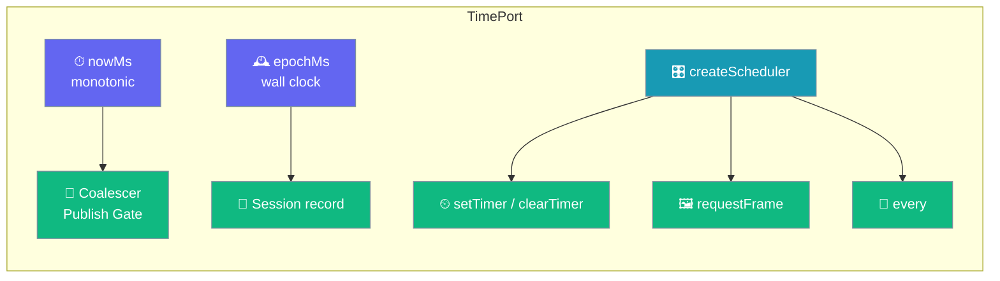
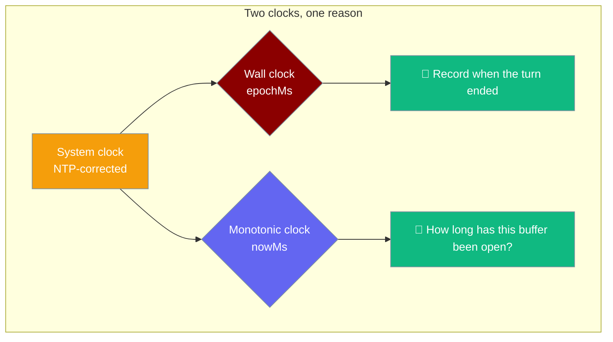

The `TimePort` is the seam every pacing mechanism in the mobile app is built on: one monotonic clock, one wall clock, and a per-run scheduler for timers and frames.



## Quick Start

<Steps>
<Step title="Pick the real adapter at boot">
`createWebTime()` builds a `TimePort` over the browser's clock and frame loop. Pass it as `time:` to `createApp`.

```ts
import { createWebTime } from "praisonai-mobile/adapters/web";

const booted = await createApp({
  time: createWebTime(),
  // ...the rest of the platform adapters
});
```
</Step>

<Step title="Read a monotonic instant">
Call `time.nowMs()` for delay budgets and elapsed measurements. Call `time.epochMs()` only when a record needs a real timestamp.

```ts
const startedAt = time.nowMs();      // monotonic: for durations
const writtenAt = time.epochMs();    // wall clock: for records
```
</Step>

<Step title="Poll or paint through a scheduler">
Create one scheduler per run, then use `every`, `setTimer` + `clearTimer`, and `requestFrame`. Dispose it at teardown.

```ts
const scheduler = time.createScheduler();     // one per run
const stop = time.every(16, () => coalescer.flush());
scheduler.requestFrame(() => paint());
// on teardown
stop();
scheduler.clearTimer();
```
</Step>
</Steps>

---

## How It Works

The port carries two clocks and a scheduler factory, and each member has one job.

| Member | Type | Purpose |
|--------|------|---------|
| `nowMs()` | `() => number` | **Monotonic** clock. Never goes backwards, never jumps. Use for delay budgets, elapsed-time measurements, the coalescer's `maxDelayMs`. |
| `epochMs()` | `() => number` | **Wall clock**. Milliseconds since the Unix epoch. Use when a record needs a real timestamp; `Session.record` writes this. May jump when NTP corrects. |
| `every(ms, cb)` | `(ms: number, cb: () => void) => Unsubscribe` | Fires the callback **repeatedly** every `ms`. Returns an unsubscribe. Backs readiness polling, the coalescer's flush tick, elapsed-time updates. |
| `createScheduler()` | `() => Scheduler` | Returns a fresh scheduler bound to this port. **One per run.** Reusing a scheduler across runs carries a closed publish gate into a new answer. |
| `scheduler.setTimer(cb, ms)` | `(cb: () => void, ms: number) => void` | Arm a **one-shot** timer. The publish gate uses it as its fallback timeout. |
| `scheduler.clearTimer()` | `() => void` | Cancel the pending timer. A `clearTimer` that does nothing reopens the gate. |
| `scheduler.requestFrame(cb)` | `(cb: () => void) => void` | Paint on the next animation frame. Backed by `requestAnimationFrame` in the web adapter. |

---

## Why Two Clocks

One clock measures durations, the other stamps records, and collapsing them reintroduces the bug the port was carved to prevent.



When the phone's clock is corrected mid-turn — a common event on a wake from sleep — a wall-clock elapsed measurement can jump backwards. The publish gate's `MAX_HELD_CHARS` and the coalescer's `maxDelayMs` are both measured against `nowMs`, so pacing stays sane through a correction. Records that need to be sortable across devices use `epochMs`.

---

## Executable Specification

The port's first conformance suite runs the same cases against the fake clock and the web adapter, so the two cannot drift.

| Test | Asserts |
|------|---------|
| `nowMs is monotonic` | `nowMs()` never returns a smaller value than the previous call. The coalescer's delay budget depends on it. |
| `epochMs is wall time and nowMs is not` (real-clock only) | `epochMs() > 1_600_000_000_000`; `nowMs() < 1_600_000_000_000`. An adapter that returns `Date.now()` for both compiles, passes every other case, and reintroduces the NTP-jump bug. |
| `every() repeats, rather than firing once` | Fires **≥ 2 times** across three periods. Guards the `setInterval → setTimeout` mutation that ships polling loops that fire exactly once. |
| `the unsubscribe actually stops it` | After `stop()`, no further callbacks. Guards a leaked interval that keeps the event loop alive for the app's lifetime. |
| `a cleared timer does not fire` | After `clearTimer()`, the timer never fires. Guards a `clearTimer` that does nothing, which reopens the publish gate after it was deliberately shut. |
| `an uncleared timer does fire` | The pair to the previous case; guards a `setTimer` that never fires and disables the gate's only escape from a stalled renderer. |
| `requestFrame runs its callback` | The callback runs within a normal wait. Backed by `requestAnimationFrame` in the web adapter. |
| `schedulers are independent` | Clearing one scheduler's timer must not clear another's. Enforces the "one per run" rule. |

<Note>
The fake and the real adapter run the **same** cases. `every`'s period was found discarded in the fake in two separate rounds; a test that only ever drives the fake cannot see it a third time.
</Note>

<Warning>
If you write a new time adapter (React Native, a different desktop shell), the contract needs a `requestAnimationFrame` shim in Node — the web adapter targets a browser. Without the shim `requestFrame` throws `ReferenceError` and the adapter cannot be contract-tested at all.
</Warning>

---

## Common Patterns

The coalescer's flush tick is a repeating `every`, stopped at dispose.

```ts
const stop = time.every(maxDelayMs, () => coalescer.flush());
// on dispose
stop();
```

The publish gate arms a one-shot timer and clears it when a frame arrives.

```ts
const scheduler = time.createScheduler();
scheduler.setTimer(forcePaint, UNPAINTED_REOPEN_MS);
// on frame arrival
scheduler.clearTimer();
```

---

## Best Practices

<AccordionGroup>
<Accordion title="Read the monotonic clock for durations, the wall clock for records">
Collapsing them makes elapsed measurements jump when the OS corrects the clock.
</Accordion>

<Accordion title="One scheduler per run, disposed with the run">
A scheduler that outlives its run carries closed gates into the next answer.
</Accordion>

<Accordion title="every() returns an unsubscribe, and you must call it">
A leaked interval keeps the event loop alive for the app's lifetime.
</Accordion>

<Accordion title="Pair every setTimer with an eventual clearTimer on cancel">
A gate that stays armed after a cancel forces a paint that no longer belongs.
</Accordion>

<Accordion title="Test pacing against a fake clock that actually advances">
A `TimePort.every` fake that never fires the tick makes every pacing test pass for the wrong reason.
</Accordion>
</AccordionGroup>

---

## Related

<CardGroup cols={2}>
<Card title="Mobile Architecture" icon="sitemap" href="/features/mobile/architecture">
  The coalescer and publish gate the port paces.
</Card>
<Card title="Shell & Adapters" icon="mobile-button" href="/features/mobile/shell-and-adapters">
  The sibling port every conformance suite pins.
</Card>
</CardGroup>
