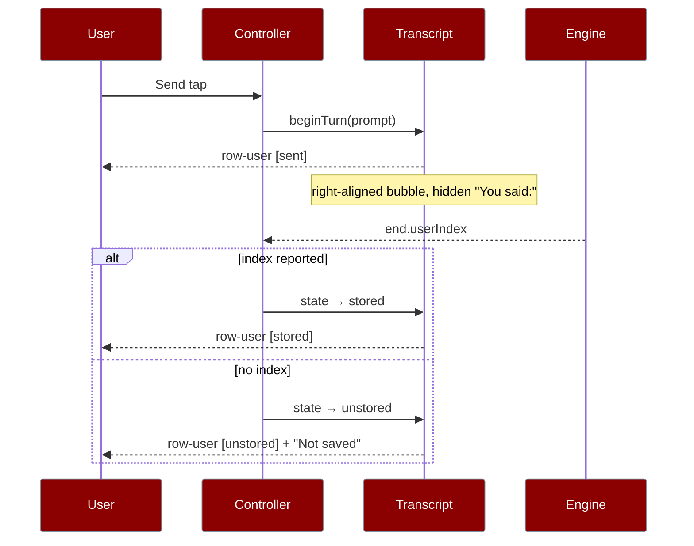

Before this landed the transcript had seven assistant-side row kinds — `text`, `reasoning`, `tool`, `approval`, `error`, `notice`, `dropped` — and every one of them describes something the **assistant** did. A real tap on Send produced a transcript containing only the reply: the conversation was drawn with one side missing. The `user` row is that missing eighth kind.



The row carries no `tone`. Tone is the vocabulary for "did this work", and whether a message was understood is the reply's business, not the message's. What it carries instead is `state`, which is about storage and nothing else.

## Quick Start

<Steps>
<Step title="A turn already knows what it is answering">
```ts
import { beginTurn } from "praisonai-mobile/core/run/transcript";

const turn = beginTurn("Plan my week");
turn.prompt; // "Plan my week" — seeded when the run is ISSUED, not when Send is tapped
```
`beginTurn` is the one sanctioned way to put a prompt on a turn. `initialTurn` keeps `prompt: ""`, so a chat nobody has spoken in draws no bubble.
</Step>

<Step title="The view model emits the user row first">
```ts
import { buildTranscript } from "praisonai-mobile/ui/transcript/view-model";

const view = buildTranscript(turn);
view.rows[0];
// { kind: "user", id: "user", text: "Plan my week", state: "sent" }
```
The user row is pushed **above everything the assistant produced** — including `reasoning` — because a question that renders below its own answer is not a conversation.
</Step>

<Step title="Name the speaker without labelling the paragraph">
```ts
import { userRowNames } from "praisonai-mobile/ui/a11y/names";
import { en } from "praisonai-mobile/ui/i18n/strings";

userRowNames(en, view.rows[0]);
// { speaker: "You said:", note: null }
```
The speaker is rendered as visually-hidden **content** ahead of the message; `note` is `null` until the turn ends `unstored`.
</Step>
</Steps>

On screen the row is a right-aligned bubble (`bg = rgb(31,122,99)`), opens with a visually-hidden **"You said:"**, and shows an optional **"Not saved"** note only when the turn ended without being written.

---

## Three storage states

Three states, not a boolean, because "not saved yet" and "finished and never saved" are different facts and only one of them is worth telling anyone about.

| State | When it is entered | What the row shows |
|-------|--------------------|--------------------|
| `sent` | While the turn is live (`phase !== "ended"`) | The message, no note — this is the ordinary streaming state |
| `stored` | The turn ended and the engine reported the `end.userIndex` it wrote | The message, no note — the ordinary finished state |
| `unstored` | The turn ended and **no** index came back | The message **plus** "Not saved — this message is not in the stored conversation" |

```ts
// view-model.ts — the state is decided by isPersisted, never by the fact we sent.
state: turn.phase !== "ended"
  ? "sent"
  : isPersisted(turn) ? "stored" : "unstored",
```

`isPersisted` is the sanctioned reader of `end.userIndex`, and it is the **same** predicate that decides whether Fork and Delete are offered. Two copies of that rule is one copy that gets it wrong — and the wrong one would tell the user their message is filed away when a reopen will not find it.

<Warning>
The caveat is only ever on an `unstored` row. `sent` and `stored` carry no note: a warning hung on every message is a warning nobody reads, and a row that said "not saved" for the whole of a normal streaming turn would be crying wolf for the seconds that matter least.
</Warning>

---

## When the row appears

The row is drawn when a run is actually **issued** to an engine — `beginTurn(prompt)` in the controller — not when Send is tapped.

| The prompt was… | A user row appears? |
|-----------------|---------------------|
| Issued to the engine (`runTurn`) | Yes |
| Refused by the composer because a turn is in flight | No — nothing was handed over |
| Still sitting in the queue, not yet running | No — it produces no row until its turn begins |

Seeding the prompt when the run is issued — rather than when Send is tapped — is what ties the row to a run that was really sent. See [Composer Behavior](/features/mobile/composer-behavior#your-message-row-appears-when-the-run-is-issued).

---

## The row updates in place

The row `id` is the constant string `"user"` for the whole turn. There is exactly one prompt per turn, so the id is stable across every publish — which is what lets the reconciler **update** the row when it goes from `sent` to `stored` rather than removing and re-inserting it.

```ts
// reconcile.ts — state is folded into the signature, so a change updates the row.
case "user":
  return `user|${row.state}|${row.text}`;
```

A remove/insert pair would be the flicker, and it would also drop the user's text selection mid-stream. A `sent → stored` transition is a single in-place update: no flicker, no duplicate.

---

## Reopen preserves the role

`historyRows` maps a stored message to a row by its **role**: a `user` message becomes a `user` row, an `assistant` message a `text` row. A reopened chat paints both speakers rather than flattening them into one voice.

```ts
import { historyRows } from "praisonai-mobile/app/main";

historyRows([
  { role: "user", content: "Plan my week" },
  { role: "assistant", content: "Here is a plan." },
]);
// [
//   { kind: "user", id: "history:0:user", text: "Plan my week", state: "stored" },
//   { kind: "text", id: "history:1:assistant", text: "Here is a plan.", streaming: false },
// ]
```

A stored message is `stored` by definition — it was read back off the disk it is asking about. `StoredMessage.role` has been `"user" | "assistant"` all along; the fix is that the role stopped being discarded. See [History & Reopen](/features/mobile/history-and-reopen#history-rows-carry-a-prefixed-id).

---

## A finished turn no longer vanishes

A completed turn used to be removed by the very reconcile that drew the next question — so your "You said:" bubble disappeared the moment you spoke again. The fix promotes a finished turn into a **history prefix** when the **next** turn begins.

```ts
// main.ts — promote the ended turn only once the next one starts streaming.
if (turnEnded && view.turn.phase !== "ended") {
  priorRows = [...priorRows, ...liveRows];
  turnSeq += 1;
}
```

Promotion happens when the next turn begins, **not** when the current one ends: at the moment a turn ends it is still the live turn, still carrying its tool cards, its usage and its error row, and moving it early would either duplicate those rows or drop them at the instant the answer lands.

<Note>
Ids are re-namespaced per turn (`t0:`, `t1:`, …) from the moment they are built. Both turns of a two-turn chat produce `text:0`, and a shared id is how a keyed renderer paints one row's content into another row's node — so two turns can never both claim `text:0`. Keying up front also means promotion changes no id at all, so it emits no ops: the rows already on screen stay exactly where they are.
</Note>

---

## Accessibility

A user row is distinguished on screen by which edge it hugs and what colour it is. Both are CSS; neither reaches the accessibility tree. So the row carries **three independent signals**, and a screen-reader user relies on the third:

| Signal | Reaches | Who it serves |
|--------|---------|---------------|
| Edge alignment (`align-self: flex-end`) | CSS only | Sighted users, at a glance |
| `data-speaker="user"` | The DOM as an attribute | Styling / tooling hooks |
| Visually-hidden `"You said:"` | The accessibility tree as **content** | Screen-reader users |

```ts
import { accessibleName } from "praisonai-mobile/ui/a11y/names";

accessibleName(en, userRow); // null — deliberately
```

`accessibleName` returns `null` for a user row **on purpose** — for the same reason it is `null` on a `text` row. An `aria-label` **replaces** an element's content in the accessibility tree, so labelling your message would cost you the ability to navigate your own words by word, sentence or character and hand you one unbrowsable blob instead. The speaker is announced by `userRowNames` as visually-hidden content, which is additive rather than replacing.

---

## The prompt survives the engine's first `start`

The prompt is **not** an event. No engine reports it back — `start` carries only ids — so a reducer over the event stream can never learn it. It is seeded by whoever issues the run, and it must survive the engine's first frame:

```ts
// transcript.ts — start rebuilds the turn from initialTurn, so the prompt
// is carried across explicitly or the engine's first frame would erase it.
if (event.type === "start") {
  return { ...initialTurn, phase: "streaming", msgId: event.msgId, /* … */
    prompt: state.prompt };
}
```

Without that one line the user's message is painted the instant the run is issued and then erased by the engine's first frame — a flicker that reads as "my message was there and then it wasn't". Seeding the prompt in `beginTurn` and carrying it across `start` is also what makes the row honest: a turn that exists has been handed to an engine, so a prompt on screen is a prompt that was actually sent.

---

## Related

<CardGroup cols={2}>
<Card title="History & Reopen" icon="clock-rotate-left" href="/features/mobile/history-and-reopen">
  Role-preserving `historyRows` and the prefixed row id.
</Card>
<Card title="i18n & A11y" icon="globe" href="/features/mobile/i18n-and-a11y">
  `speakerUser`, `userNotStored`, and why `aria-label` is `null` here.
</Card>
<Card title="Engines" icon="plug" href="/features/mobile/engines">
  Where `end.userIndex` comes from and how `isPersisted` reads it.
</Card>
<Card title="Errors & Recovery" icon="triangle-exclamation" href="/features/mobile/errors-and-recovery">
  The "Not saved" caveat on an unstored message.
</Card>
<Card title="Composer" icon="keyboard" href="/features/mobile/composer-behavior">
  Why the row appears when the run is issued, not when Send is tapped.
</Card>
</CardGroup>
