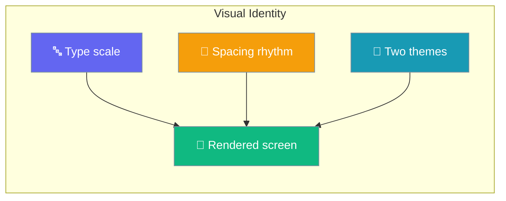
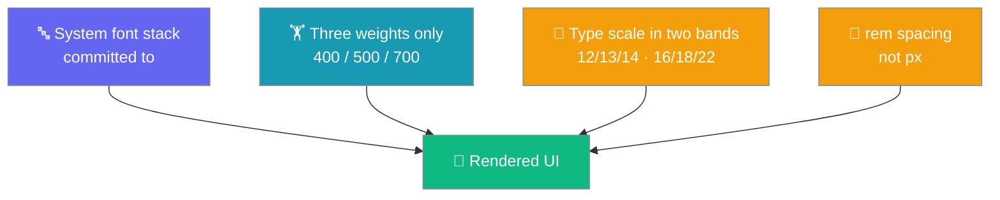
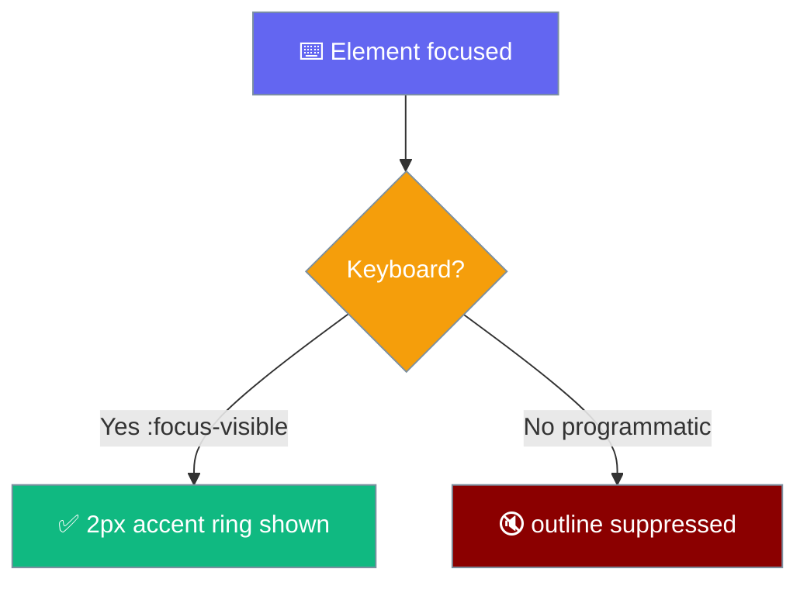
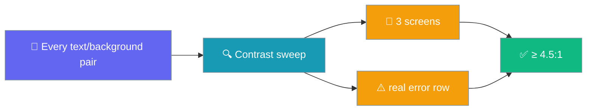

The mobile app has one design system — a six-step type scale, a 4px spacing rhythm, and two deliberately designed colour themes — driven entirely by CSS custom properties you reuse instead of writing literals.



## Quick Start

<Steps>
<Step title="Use a token">
Style a component from tokens — never from raw hex, px, or font-size literals.

```css
.card {
  color: var(--ink);
  background: var(--chrome);
  padding: var(--space-4);
  border-radius: var(--radius);
  font-size: var(--text-base);
}
```
</Step>

<Step title="Follow the two themes">
The same tokens switch automatically under `prefers-color-scheme: dark`. Your component needs no dark rule of its own — style once, both themes render.

```css
:root { --ink: #14171c; }

@media (prefers-color-scheme: dark) {
  :root { --ink: #e8eaed; }
}
```
</Step>
</Steps>

---

## How It Works

Four decisions define the identity — each one defends a specific cross-platform edge case.



| Decision | Why |
|---|---|
| **System font stack, committed to** | A webfont with only Latin subsets leaves Arabic/CJK users reading two typefaces; `index.html` paints the wordmark on the first frame; `app.css` is render-blocking under `font-src 'self'`. |
| **Three weights only** | 400/500/700 are the faces Roboto ships. A request above 500 searches upward, so `550` rendered as full-bold `700` on Android while resolving to `550` on iOS. |
| **Type scale in two bands** | 12/13/14 for information, 16/18/22 for hierarchy — deliberately not geometric, because a constant ratio lands on fractional pixels at the small end. |
| **rem spacing, not px** | Android's font-scale reaches a WebView as a text zoom, so rem spacing grows with the type while px spacing does not. |

---

## Design Tokens

Every value below is verbatim from `app.css`. Reach for the token, never the literal.

### Font stacks

| Token | Value | Purpose |
|---|---|---|
| `--sans` | `system-ui, -apple-system, BlinkMacSystemFont, "Segoe UI", Roboto, "Helvetica Neue", Arial, sans-serif` | Every UI element |
| `--mono` | `ui-monospace, SFMono-Regular, Menlo, "Roboto Mono", monospace` | Code, tool output |

### Weights

Only these three exist by design.

| Token | Value | Purpose |
|---|---|---|
| `--weight-normal` | `400` | Prose, message text |
| `--weight-medium` | `500` | Labels, chat titles — heavier, never bold |
| `--weight-strong` | `700` | Headings, wordmark |

### Type scale — information band (12/13/14)

| Token | Value | Purpose |
|---|---|---|
| `--text-xs` | `.75rem` (12px) | Eyebrows, tool meta, dropped-event counts |
| `--text-sm` | `.8125rem` (13px) | Help notes, timestamps, secondary states |
| `--text-md` | `.875rem` (14px) | Buttons, reasoning, secondary UI |

### Type scale — hierarchy band (16/18/22)

| Token | Value | Purpose |
|---|---|---|
| `--text-base` | `1rem` (16px) | Message text, inputs |
| `--text-lg` | `1.125rem` (18px) | Screen headings, the empty-state title |
| `--text-xl` | `1.375rem` (22px) | The boot wordmark, and nothing else |

### Line-height & tracking

| Token | Value | Purpose |
|---|---|---|
| `--leading-tight` | `1.25` | Headings — short lines, few of them |
| `--leading-snug` | `1.4` | UI text, one-line rows |
| `--leading-normal` | `1.55` | Message prose, read for minutes at a time |
| `--tracking-eyebrow` | `.09em` | Settings section eyebrows |

### Spacing scale — 4px grid, in rem

| Token | Value | Pixels |
|---|---|---|
| `--space-1` | `.25rem` | 4 |
| `--space-2` | `.375rem` | 6 |
| `--space-3` | `.5rem` | 8 |
| `--space-4` | `.75rem` | 12 |
| `--space-5` | `1rem` | 16 |
| `--space-6` | `1.5rem` | 24 |
| `--space-7` | `2rem` | 32 |
| `--gutter` | `var(--space-4)` | 12 — the number `main.ts` also writes inline |

### Radius

| Token | Value | Purpose |
|---|---|---|
| `--radius-sm` | `8px` | Notch on the user bubble's trailing-bottom corner |
| `--radius` | `12px` | Default component radius |
| `--radius-lg` | `16px` | The user bubble body |
| `--radius-pill` | `999px` | `.jump-latest`, `.tool-status` chips |

### Colour — both themes, side by side

Every token carries a light and a dark value in one comparison. `--chrome` is lighter than `--ground` in **both** themes (chrome floats above the page); `--panel` **flips** — below `--ground` in light, above it in dark, because a control reads as distinguished by sitting nearer the light source.

**Surfaces / neutrals**

| Token | Light | Dark | Role |
|---|---|---|---|
| `--ground` | `#f7f8fa` | `#0f1114` | Page background |
| `--chrome` | `#ffffff` | `#16191f` | Topbar, composer, tool rows — lighter than `--ground` in both themes |
| `--panel` | `#eceff4` | `#1c2027` | Inset surfaces (lead settings row); flips across themes |
| `--rule` | `#dfe3e9` | `#262b33` | Hairlines |
| `--rule-strong` | `#c8ced7` | `#39414c` | Stronger dividers |

**Ink**

| Token | Light | Dark | Role |
|---|---|---|---|
| `--ink` | `#14171c` | `#e8eaed` | Primary text |
| `--soft` | `#5b636e` | `#9aa1ac` | Secondary text (help, timestamps) |

**Accent & user message**

| Token | Light | Dark | Role |
|---|---|---|---|
| `--accent` | `#1f7a63` | `#7fd1b9` | Primary buttons, the focus ring, `theme-color` |
| `--accent-ink` | `#ffffff` | `#0f1114` | Text on `--accent` |
| `--user-bg` | `#1f7a63` | `#254f43` | User bubble background — dark steps 2.05:1 down from `--accent` so a column of bubbles is not the brightest object on screen |
| `--user-ink` | `#ffffff` | `#e8f3ee` | Text in the user bubble |

**Status**

| Token | Light | Dark | Role |
|---|---|---|---|
| `--bad` | `#a6413c` | `#e58b86` | Failure text/border |
| `--bad-bg` | `#fbeceb` | `#2e1c1b` | Tinted background for `.row-error`, `.row-tool[data-status="failed"]` |
| `--warn` | `#b34700` | `#f78c6c` | Warning text/border |
| `--warn-bg` | `#fdf1e7` | `#2e2219` | Tinted background for `.row-approval`, unresolved tool state |

**Tone** — defined once, self-updating in dark because they reference the tokens above.

| Token | Value | Used for |
|---|---|---|
| `--tone-neutral` | `var(--soft)` | Default notice colour |
| `--tone-pending` | `var(--soft)` | Tool status "running" |
| `--tone-success` | `var(--accent)` | Tool status "ok", success notice |
| `--tone-failure` | `var(--bad)` | Tool status "failed", failure notice |
| `--tone-warning` | `var(--warn)` | Tool status "unresolved", warning notice |

---

## Two behaviours you can rely on

### Focus ring — never suppressed for keyboard

The base ring is `:focus-visible { outline: 2px solid var(--accent); outline-offset: 2px }`. To drop the outline on programmatic focus (e.g. route navigation to `.screen-heading`), scope the removal so it never touches keyboard focus.



```css
.screen-heading:focus:not(:focus-visible) { outline: none; }
```

A bare `.screen-heading:focus { outline: none }` beats `:focus-visible` on specificity (0,2,0 vs 0,1,0) and takes the keyboard ring with it. `src/praisonai-mobile/app/src/css.test.ts` pins this by rejecting any `:focus` outline suppression that is not scoped with `:not(:focus-visible)`.

### WCAG AA in both themes

Every text pair in the stylesheet clears WCAG AA — the worst pair measures 4.5:1 in light and 6.3:1 in dark on the merged file.



The sweep runs on the three screens **and** the real error row.

---

## Chat message treatment

The user's row keeps its bubble, its alignment, and gains one logical corner notch.

```css
.row-user {
  border-radius: var(--radius-lg);
  border-end-end-radius: var(--radius-sm);
}
```

The notch is logical (`border-end-end-radius`), not physical — under `dir="rtl"` it follows the reader, not the LTR page. The assistant's row **loses its fill**: a 100%-wide filled box is a container with prose in it, not a bubble, and stacked down a transcript it read as a column of grey slabs. Alignment, `data-speaker`, and the visually-hidden "You said:" span carry the speaker in the accessibility tree.

---

## Tool-status chip — status as text and colour

A `<span class="tool-status">` renders `strings.toolStatus(row.status)` as words (from `dom.ts`) and is coloured by `--tone-*` per `data-status`.

| `data-status` | Chip colour | Border |
|---|---|---|
| `running` | `--tone-pending` (= `--soft`) | `--rule` |
| `ok` | `--tone-success` (= `--accent`) | `--accent` |
| `failed` | `--tone-failure` (= `--bad`) | `--bad` |
| `unresolved` | `--tone-warning` (= `--warn`) | `--warn` |

Before this, `unresolved` **had no rule at all** and rendered pixel-for-pixel identically to `running`.

---

## The gutter coupling (contributor note)

`--gutter: var(--space-4)` (= 12px) is the one number in `app.css` also written elsewhere: `app/src/main.ts` sets the composer's `padding-inline-start/end` inline as `calc(<inset> + .75rem)`.

`src/praisonai-mobile/app/src/css.test.ts` has a `remOf()` / `addendOf()` helper pair that resolves `--gutter` through the `:root` token table (following the `var()` indirection through `--space-4`) and asserts the resolved rem equals the addend parsed from `main.ts`'s inline padding template. The same test asserts that `.screen-settings, .screen-chats`, `.transcript`, and `.topbar` each build both right and left inset padding as `calc(var(--inset-<side>) + var(--gutter))`. Change the gutter in one place; the test catches drift.

---

## Common Patterns

**Compose a component from tokens.**

```css
.notice {
  color: var(--tone-neutral);
  background: var(--chrome);
  padding: var(--space-3) var(--space-4);
  border-radius: var(--radius);
  font-size: var(--text-sm);
}
```

**Colour by meaning, not by hue.** Use the tone tokens so "success/failure/warning" can be re-tuned in one place.

```css
.tool-status[data-status="failed"] { color: var(--tone-failure); }
```

**Keep the keyboard ring when you quiet an outline.**

```css
.screen-heading:focus:not(:focus-visible) { outline: none; }
```

---

## Best Practices

<AccordionGroup>
<Accordion title="Use tokens, not literals">
Every colour, spacing, radius, and type step has a token; a literal skips both themes.
</Accordion>

<Accordion title="Never suppress :focus without :not(:focus-visible)">
The `css.test.ts` gate will fail your PR — a bare `:focus { outline: none }` out-specifies `:focus-visible` and removes the keyboard ring.
</Accordion>

<Accordion title="Reach for the tone tokens, not --bad / --warn directly">
When the meaning is "success/failure/warning", use `--tone-*` so they can be re-tuned without touching every call site.
</Accordion>

<Accordion title="Pick from three weights, not five">
Requests outside 400/500/700 land unpredictably across platforms (Roboto vs SF).
</Accordion>
</AccordionGroup>

---

## Related

<CardGroup cols={2}>
<Card title="Accessibility" icon="universal-access" href="/features/mobile/i18n-and-a11y">
Focus, RTL, and the accessibility tree that carries the speaker.
</Card>
<Card title="Boot Indicator" icon="hourglass-start" href="/features/mobile/boot-indicator">
The wordmark and boot-mark tokens live in the same stylesheet.
</Card>
</CardGroup>
