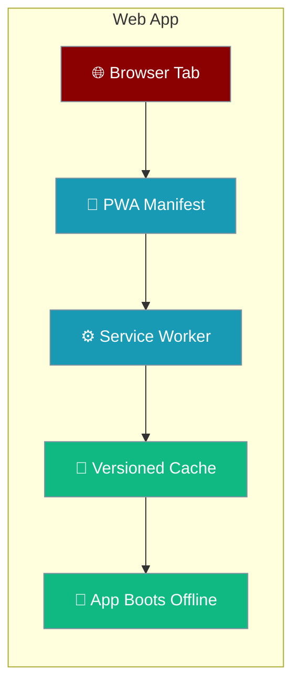
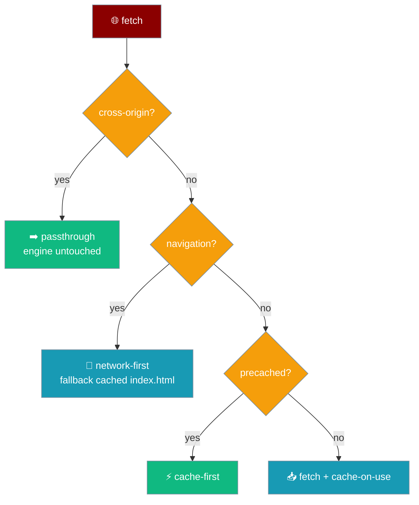
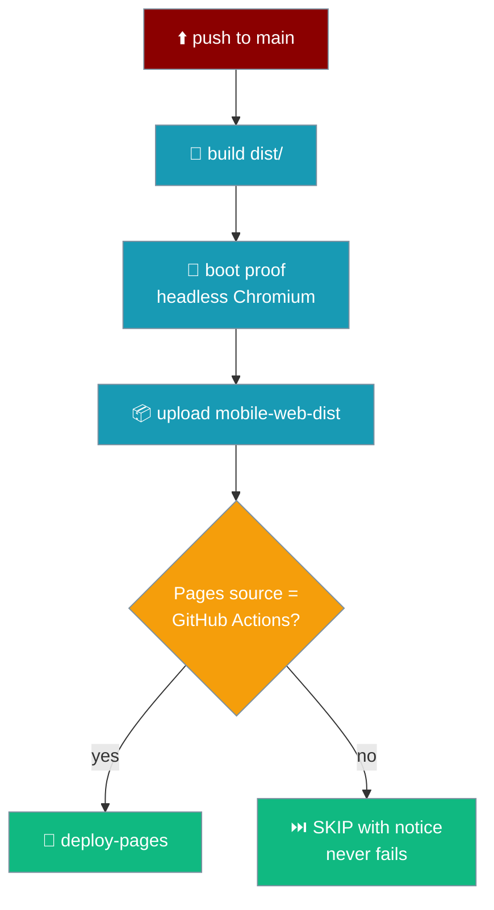
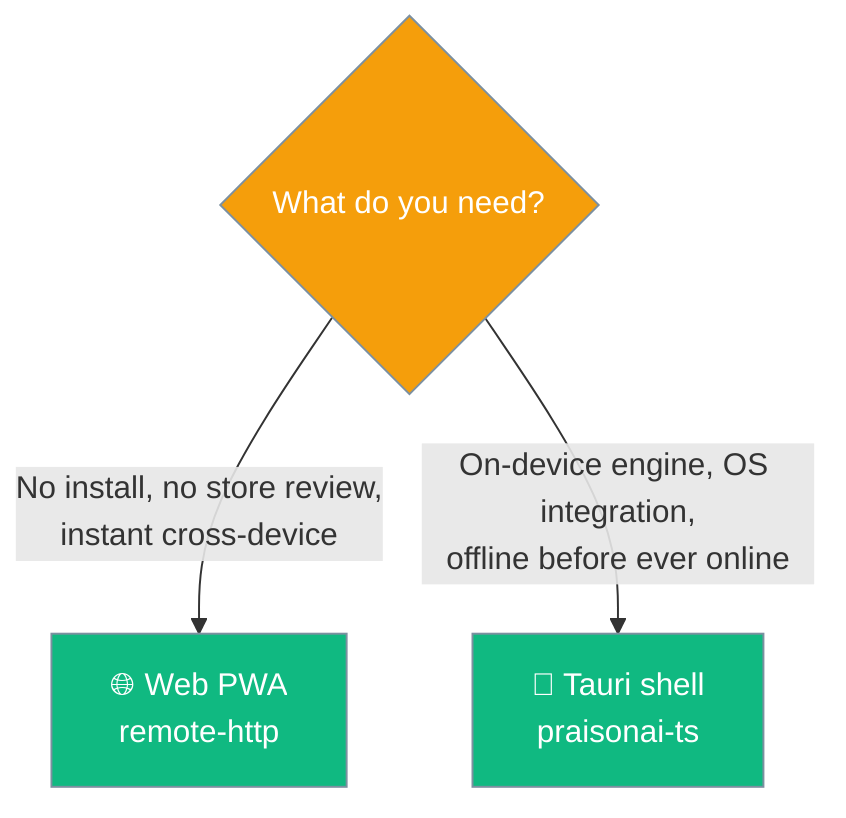

The same mobile bundle boots in a browser tab as an installable PWA, deployed to GitHub Pages, with the remote engine by default and the whole shell cached for an offline reload.



PraisonAI Mobile ships to three targets from one bundle: iOS and Android through the Tauri shell, and the **web** as a Progressive Web App. The web build is the same `dist/` the Tauri shell serves — the manifest, icons, and service worker are inert inside the shell, so one build covers all three.

## Quick Start

<Steps>
<Step title="Build the bundle">
```bash
git clone https://github.com/MervinPraison/PraisonAI
cd PraisonAI/src/praisonai-mobile
npm install
npm run build
```
The build writes `dist/` — the page, stylesheet, manifest, icons, the entry `app.js` plus its eager chunks, and a `sw.js` whose cache name is a hash of exactly those bytes.
</Step>

<Step title="Serve dist/">
```bash
npx serve dist
```
Open the printed URL. The composer and **Send** button render, and the app runs against the remote engine by default.
</Step>

<Step title="Install it">
The browser shows an **Install app** prompt because the manifest and service worker are present. Installed, it opens standalone in portrait — no browser chrome — using the icons from `manifest.webmanifest`.
</Step>

<Step title="Reload offline">
Cut the network and reload. The shell still renders: the service worker serves the last `index.html` and the precached assets from its versioned cache.
</Step>
</Steps>

<Note>
The service worker does **not** background-sync or push-notify, and it never precaches lazy chunks — those are cached on first use. A feature works offline once you have used it online.
</Note>

---

## The Manifest

`app/manifest.webmanifest` is what turns the tab into an installable app. Every URL is relative (`./`) so a project site served from a subpath resolves correctly.

| Field | Value | Why |
|-------|-------|-----|
| `id` | `ai.praison.mobile` | Stable identity across installs. |
| `name` | `PraisonAI` | Full install name. |
| `short_name` | `PraisonAI` | Home-screen label. |
| `start_url` | `./` | Relative, so a subpath install opens the right page. |
| `scope` | `./` | Confines the app to its own subpath. |
| `display` | `standalone` | Opens without browser chrome. |
| `orientation` | `portrait` | Locks to portrait, matching the phone shell. |
| `background_color` | `#ffffff` | Splash background before first paint. |
| `theme_color` | `#1f7a63` | Toolbar / status-bar tint. |

Icons are read from the Tauri icon set at build time, so the manifest cannot name an icon the shell does not have — a missing one fails the build, not a phone's home screen.

---

## How Offline Works

The service worker picks a strategy from the request, never touching cross-origin traffic.



| Request | Strategy |
|---------|----------|
| Navigation | Network-first; on failure, the cached `index.html`. A user online gets the current page; one offline gets the last one that loaded. |
| Precached asset | Cache-first. These bytes are the ones the cache name was derived from. |
| Other same-origin (lazy chunk) | Fetch, then cache on use into the same versioned cache. |
| Cross-origin (engine at `127.0.0.1:*`, an `https:` engine) | Never touched — passthrough. |

<Note>
Only `GET` requests are handled. A same-origin file that is not precached is a lazy chunk; the build leaves those out on purpose so a browser does not download ~1.4 MB it may never use.
</Note>

---

## How Redeploys Work

A new build is a new cache, and the old one is deleted on activate — so a redeploy never pins a user to a stale app.


- The cache name is `praisonai-mobile-<buildId>`, where `buildId` is the first 16 hex of a sha256 over the precached bytes.
- On `activate`, every `praisonai-mobile-*` cache that is not the current one is deleted, then `clients.claim()` runs.
- Navigation is always network-first, so a new `index.html` surfaces on the first online visit rather than waiting for a cache to expire.

---

## Which Engine the Web Picks

A browser tab has a server to talk to, so the web defaults to the remote engine.

```ts
import { defaultEngineIdFor } from "praisonai-mobile/app/main";

defaultEngineIdFor("web");   // "remote-http"  — a browser tab has a server
defaultEngineIdFor("tauri"); // "praisonai-ts" — a device runs in-process
```

`defaultEngineIdFor` only decides the very first launch; a persisted `engineId` always wins. The web picks `remote-http` because a browser has no reason to fetch ~1.4 MB of engine before first paint. See [Engines → First-Launch Default](/features/mobile/engines#first-launch-default).

---

## Content Security Policy

The browser sees only the `<meta>` CSP in `index.html`; Tauri appends its own, so inside the shell both apply and the effective policy is their intersection.

```html
<meta
  http-equiv="Content-Security-Policy"
  content="default-src 'self'; script-src 'self'; style-src 'self' 'unsafe-inline'; img-src 'self' data: blob:; font-src 'self' data:; connect-src 'self' ipc: http://ipc.localhost http://127.0.0.1:* http://localhost:* https:; manifest-src 'self'; worker-src 'self'; base-uri 'self'; form-action 'self'"
/>
```

| Directive | What it allows | Why |
|-----------|----------------|-----|
| `script-src 'self'` | External scripts only — no inline, no `eval`. | Every script, including the SW registration, is an external file, so there is nothing to whitelist and no hash to keep in step. |
| `connect-src` local | `http://127.0.0.1:*`, `http://localhost:*` | Reach a local engine. |
| `connect-src` remote | `https:` | Reach a remote HTTPS engine. |
| `connect-src` IPC | `ipc:`, `http://ipc.localhost` | Inert in a browser, but keeps Android's IPC channel unblocked once the Tauri shell appends its own tag. |

<Note>
Because Tauri **appends** rather than replaces, the `ipc:` entries are listed in the browser CSP too: a browser ignores a scheme it does not know, and without them the shell's intersection would block Android's IPC channel with nothing but a console line to say so.
</Note>

---

## Every URL Is Relative

GitHub Pages serves project sites from a subpath (e.g. `/PraisonAI/`), so every URL in the app is relative.

An absolute `/app.js` or `/manifest.webmanifest` would resolve to the wrong site. The boot proof (`tools/web-boot.test.mjs`) serves `dist/` under `/PraisonAI/` to pin exactly this — the manifest is served as `application/manifest+json`, icons return `200` as `image/png`, and the service worker activates scoped to the subpath.

<Warning>
Any absolute path in a code example is a bug. `start_url`, `scope`, the manifest `<link>`, the icons, `app.js`, and the SW registration are all `./`-relative.
</Warning>

---

## Deploying to GitHub Pages

The `mobile-web.yml` workflow builds, boots the app in a real browser, and deploys — but only `main` deploys, and only after one manual repo setting.



| Step | What it does |
|------|--------------|
| Build `praisonai-ts` | It is a `file:` link, so its `dist/` must exist before the mobile package installs. |
| `npm ci`, install Chromium, `npm run build` | Produce `dist/`. |
| `npm run test:web` | Serve `dist/` under `/PraisonAI/` and drive first paint, install, an offline reload, and a blocked inline script. |
| Upload `mobile-web-dist` | The built site is always available as an artifact, even when the deploy is skipped. |
| Deploy (main only) | `actions/deploy-pages`, gated on the Pages source. |

<Warning>
**One manual setting gates the deploy.** A repository admin must set **Settings → Pages → Build and deployment → Source: GitHub Actions**. Until they do, the deploy job **SKIPS with a workflow notice — it never fails**. A custom domain also skips the deploy, since the app would be served there rather than at the `github.io` URL.
</Warning>

---

## Choosing the Web Build vs. Tauri

Both ship from the same bundle; pick by what the target needs.



| Choose | When |
|--------|------|
| **Web PWA** | No install or store review needed; instant access on any device; a server is available for the remote engine. |
| **Tauri shell** | An on-device engine, OS integration (safe-area, keyboard insets, back gesture), or offline-first before the app has ever been online. |

---

## Best Practices

<AccordionGroup>
<Accordion title="Never use absolute URLs">
The app is designed to live under a subpath on GitHub Pages. An absolute `/app.js` resolves to the wrong site. Keep `start_url`, `scope`, links, icons, and scripts `./`-relative.
</Accordion>

<Accordion title="Never precache lazy chunks">
Splitting exists so a browser does not pay ~1.4 MB it may never use. Precaching lazy chunks undoes that. The service worker caches each one on first use into the same versioned cache instead.
</Accordion>

<Accordion title="Never register the service worker inside Tauri">
`register-sw.js` skips registration when `__TAURI_INTERNALS__` is present, on non-`http(s)` origins, and where `serviceWorker` is absent. Inside the shell the app IS the offline copy; a worker caching custom-protocol responses would put a second copy between the shell and its assets.
</Accordion>

<Accordion title="Let a failed registration degrade, not break">
If registration fails, the app still boots from the network. `register-sw.js` logs a warning rather than throwing — a degraded page, not a broken one.
</Accordion>

<Accordion title="Trust the content-hash cache name">
The cache name is a sha256 of the precached bytes, so two builds of one version differ the moment a source file does. `activate` deletes any older `praisonai-mobile-*` cache, so a redeploy never serves a mismatched pair of old and new chunks.
</Accordion>
</AccordionGroup>

---

## Related

<CardGroup cols={2}>
<Card title="Engines" icon="plug" href="/features/mobile/engines">
Why the web defaults to `remote-http`, and the first-launch default.
</Card>
<Card title="Native Shell" icon="mobile-button" href="/features/mobile/native-shell">
The Tauri shell's CSP, insets, and back-gesture arbitration.
</Card>
<Card title="Overview" icon="mobile" href="/features/mobile/overview">
The three targets and the retained chat screen.
</Card>
<Card title="Shipping to Stores" icon="mobile-screen-button" href="/features/mobile/shipping-to-stores">
The App Store and Play submission path for the Tauri builds.
</Card>
</CardGroup>
