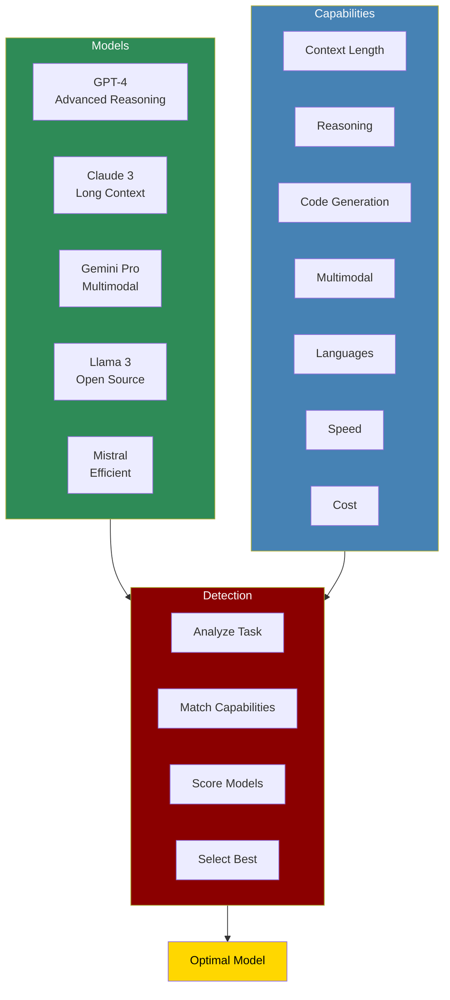

The Model Capabilities system provides comprehensive feature detection and comparison across different LLMs, enabling intelligent model selection based on specific task requirements.

## Quick Start

<Steps>
    <Step title="Install Package">
        Install the PraisonAI Agents package:
        ```bash
        pip install praisonaiagents
        ```
    </Step>

    <Step title="Set API Keys">
        Configure your model API keys:
        ```bash
        export OPENAI_API_KEY=your_openai_key
        export ANTHROPIC_API_KEY=your_anthropic_key
        export GOOGLE_API_KEY=your_google_key
        ```
    </Step>

    <Step title="Create Example">
        Create `model_capabilities.py`:
        ```python
        from praisonaiagents.llm import ModelCapabilities
        from praisonaiagents import Agent, Task, Agents

        # Initialize model capabilities detector
        capabilities = ModelCapabilities()

        # Analyze available models
        print("Available Models and Their Capabilities:")
        print("=" * 50)

        models = capabilities.list_models()
        for model in models:
            caps = capabilities.get_capabilities(model)
            print(f"\n{model}:")
            print(f"  Context: {caps['max_context']} tokens")
            print(f"  Strengths: {', '.join(caps['strengths'])}")
            print(f"  Cost: ${caps['cost_per_1k_tokens']}/1k tokens")

        # Compare models for specific task
        task_requirements = {
            "type": "code_generation",
            "complexity": "high",
            "language": "python",
            "context_needed": 8000
        }

        best_model = capabilities.recommend_model(task_requirements)
        print(f"\nBest model for task: {best_model}")

        # Create agent with capability-aware model selection
        smart_agent = Agent(
            name="Capability-Aware Agent",
            role="Adaptive AI Assistant",
            goal="Use the best model based on task requirements",
            instructions="Leverage model capabilities for optimal performance",
            model_selector=capabilities
        )

        # Test with different task types
        coding_task = Task(
            description="Write a complex Python algorithm for graph traversal",
            expected_output="Optimized Python code with explanation",
            agent=smart_agent,
            task_type="coding"
        )

        analysis_task = Task(
            description="Analyze 100-page financial report",
            expected_output="Comprehensive financial analysis",
            agent=smart_agent,
            task_type="long_context_analysis"
        )

        creative_task = Task(
            description="Write a creative short story",
            expected_output="Engaging narrative",
            agent=smart_agent,
            task_type="creative_writing"
        )

        # Run workflow
        workflow = AgentManager(
            agents=[smart_agent],
            tasks=[coding_task, analysis_task, creative_task],
            
        )

        results = workflow.start()
        
        # Show capability matching results
        print("\nCapability Matching Results:")
        for task, model in capabilities.get_task_model_mapping().items():
            print(f"{task}: {model}")
        ```
    </Step>

    <Step title="Run Example">
        Execute the capabilities demo:
        ```bash
        python model_capabilities.py
        ```
    </Step>
</Steps>

## Understanding Model Capabilities

<Card title="What are Model Capabilities?" icon="question">
  Model Capabilities system:
  - Detects and compares features across different LLMs
  - Matches task requirements with model strengths
  - Provides performance benchmarks and comparisons
  - Enables data-driven model selection
  - Tracks capability evolution over time
</Card>

## Core Features

<CardGroup cols={2}>
  <Card title="Feature Detection" icon="magnifying-glass">
    Automatically detect model capabilities and limitations.
  </Card>
  <Card title="Performance Metrics" icon="chart-line">
    Track speed, accuracy, and cost metrics for each model.
  </Card>
  <Card title="Capability Matching" icon="puzzle-piece">
    Match task requirements with model strengths.
  </Card>
  <Card title="Comparison Tools" icon="scale-balanced">
    Compare models side-by-side for informed decisions.
  </Card>
</CardGroup>

## Model Capability Profiles

### GPT-4 Family

```python
gpt4_capabilities = {
    "gpt-4": {
        "max_context": 128000,
        "strengths": ["reasoning", "coding", "analysis", "math"],
        "weaknesses": ["speed", "cost"],
        "languages": 95,
        "multimodal": False,
        "cost_per_1k_tokens": {"input": 0.03, "output": 0.06},
        "latency": "medium",
        "use_cases": ["complex reasoning", "code generation", "technical analysis"]
    },
    "gpt-4-turbo": {
        "max_context": 128000,
        "strengths": ["reasoning", "speed", "cost-efficiency"],
        "weaknesses": ["very long contexts"],
        "languages": 95,
        "multimodal": True,
        "cost_per_1k_tokens": {"input": 0.01, "output": 0.03},
        "latency": "low",
        "use_cases": ["general tasks", "multimodal analysis", "rapid responses"]
    }
}
```

### Claude 3 Family

```python
claude3_capabilities = {
    "claude-3-opus": {
        "max_context": 200000,
        "strengths": ["long_context", "reasoning", "writing", "safety"],
        "weaknesses": ["cost", "speed"],
        "languages": 80,
        "multimodal": True,
        "cost_per_1k_tokens": {"input": 0.015, "output": 0.075},
        "latency": "high",
        "use_cases": ["document analysis", "creative writing", "complex tasks"]
    },
    "claude-3-sonnet": {
        "max_context": 200000,
        "strengths": ["balance", "long_context", "efficiency"],
        "weaknesses": ["specialized tasks"],
        "languages": 80,
        "multimodal": True,
        "cost_per_1k_tokens": {"input": 0.003, "output": 0.015},
        "latency": "medium",
        "use_cases": ["general purpose", "document processing", "balanced tasks"]
    }
}
```

## Capability Detection Methods

```python
from praisonaiagents.llm import ModelCapabilities, CapabilityTest

# Initialize capability detector
detector = ModelCapabilities()

# Run comprehensive capability tests
test_suite = CapabilityTest()

# Test reasoning capabilities
reasoning_score = test_suite.test_reasoning("gpt-4")
print(f"Reasoning score: {reasoning_score}/100")

# Test context handling
context_test = test_suite.test_context_length("claude-3-sonnet", tokens=150000)
print(f"Context handling: {'Passed' if context_test else 'Failed'}")

# Test multilingual support
languages = test_suite.test_languages("gpt-4")
print(f"Supported languages: {len(languages)}")

# Test specialized capabilities
capabilities_matrix = test_suite.run_full_test_suite([
    "gpt-4",
    "claude-3-opus",
    "gemini-pro",
    "llama-3-70b"
])

# Generate capability report
detector.generate_capability_report(capabilities_matrix, "model_comparison.html")
```

## Advanced Capability Matching

### Task-Based Selection

```python
# Define task profiles
task_profiles = {
    "code_review": {
        "required": ["code_understanding", "bug_detection", "suggestions"],
        "preferred": ["fast_response", "cost_effective"],
        "context": 10000
    },
    "research_paper": {
        "required": ["long_context", "academic_writing", "citations"],
        "preferred": ["reasoning", "fact_checking"],
        "context": 50000
    },
    "real_time_chat": {
        "required": ["low_latency", "conversational"],
        "preferred": ["cost_effective", "multilingual"],
        "context": 4000
    }
}

# Match capabilities to tasks
for task_name, requirements in task_profiles.items():
    best_model = detector.match_task_to_model(requirements)
    score = detector.calculate_match_score(best_model, requirements)
    print(f"{task_name}: {best_model} (score: {score:.2f})")
```

### Dynamic Capability Updates

```python
# Monitor and update capabilities based on performance
detector.enable_performance_tracking()

# After task execution
detector.update_capability_metrics(
    model="gpt-4",
    task_type="coding",
    performance_metrics={
        "accuracy": 0.95,
        "speed": 2.3,  # seconds
        "token_efficiency": 0.85
    }
)

# Get updated recommendations based on real performance
updated_recommendation = detector.recommend_with_history(
    task_requirements,
    consider_performance=True
)
```

## Capability Comparison Tools

<Tabs>
  <Tab title="Visual Comparison">
    ```python
    # Generate visual capability comparison
    from praisonaiagents.llm import CapabilityVisualizer

    visualizer = CapabilityVisualizer()

    # Create radar chart comparing models
    visualizer.create_radar_chart(
        models=["gpt-4", "claude-3-opus", "gemini-pro"],
        capabilities=["reasoning", "speed", "cost", "context", "languages"],
        output="model_comparison.png"
    )

    # Create capability matrix heatmap
    visualizer.create_heatmap(
        models=detector.list_models(),
        capabilities=detector.list_all_capabilities(),
        output="capability_matrix.png"
    )
    ```
  </Tab>
  
  <Tab title="Benchmark Results">
    ```python
    # Run standardized benchmarks
    from praisonaiagents.llm import CapabilityBenchmark

    benchmark = CapabilityBenchmark()

    # Run comprehensive benchmark suite
    results = benchmark.run_all_benchmarks([
        "gpt-4",
        "claude-3-opus",
        "gemini-pro",
        "llama-3-70b"
    ])

    # Display results
    benchmark.display_results(results, format="table")
    
    # Export for analysis
    benchmark.export_results(results, "benchmark_results.csv")
    ```
  </Tab>
</Tabs>

## Best Practices

<AccordionGroup>
  <Accordion title="Regular Capability Assessment">
    Keep capability profiles up-to-date:
    ```python
    # Schedule regular capability updates
    detector.schedule_capability_refresh(
        interval="weekly",
        models="all",
        notify_on_changes=True
    )
    ```
  </Accordion>

  <Accordion title="Task-Specific Profiling">
    Create detailed task profiles for better matching:
    ```python
    task_profile = {
        "name": "financial_analysis",
        "required_capabilities": ["numerical_reasoning", "data_analysis"],
        "performance_weights": {
            "accuracy": 0.4,
            "speed": 0.2,
            "cost": 0.4
        }
    }
    ```
  </Accordion>

  <Accordion title="Performance Monitoring">
    Track actual performance vs. expected capabilities:
    ```python
    detector.enable_performance_monitoring(
        track_accuracy=True,
        track_latency=True,
        track_cost=True,
        alert_on_deviation=0.2  # Alert if 20% deviation
    )
    ```
  </Accordion>
</AccordionGroup>

## Troubleshooting

<CardGroup cols={2}>
  <Card title="Capability Mismatches" icon="triangle-exclamation">
    If models aren't performing as expected:
    - Update capability profiles
    - Run fresh benchmarks
    - Check API version changes
    - Verify task requirements
  </Card>

  <Card title="Performance Issues" icon="gauge">
    If capability detection is slow:
    - Use cached results
    - Run async benchmarks
    - Limit test scope
    - Use sampling strategies
  </Card>
</CardGroup>

## Model-Specific Features

<CardGroup cols={3}>
  <Card title="Vision Capabilities" icon="eye">
    Models with image understanding:
    - GPT-4V
    - Gemini Pro Vision
    - Claude 3 (all variants)
  </Card>
  
  <Card title="Code Specialists" icon="code">
    Optimized for programming:
    - GPT-4
    - DeepSeek Coder
    - Code Llama
  </Card>
  
  <Card title="Long Context" icon="file-lines">
    Extended context windows:
    - Claude 3 (200k)
    - GPT-4 Turbo (128k)
    - Gemini 1.5 Pro (1M)
  </Card>
</CardGroup>

## Next Steps

<CardGroup cols={2}>
  <Card title="Model Router" icon="route" href="./model-router">
    Learn about intelligent model routing based on capabilities
  </Card>
  <Card title="Advanced Memory" icon="brain" href="./advanced-memory">
    Explore memory systems optimized for different models
  </Card>
</CardGroup>

<Note>
  Model capabilities are constantly evolving. The system automatically updates capability profiles through regular testing and performance monitoring to ensure accurate recommendations.
</Note>