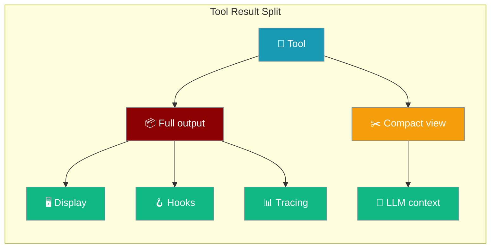
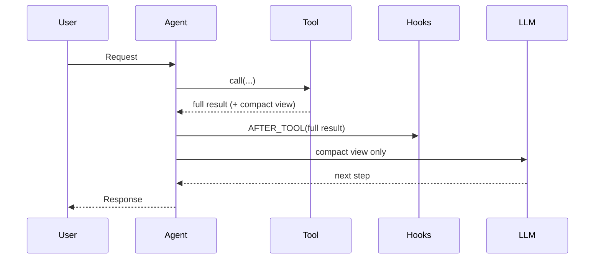
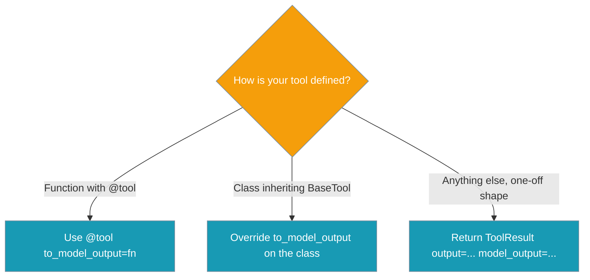

Return a rich, full result from your tool while feeding the model a short summary — same tool, fewer tokens.



Verbose tools flood the model with raw shell output, huge API JSON, or long retrievals when a one-line summary is all it needs to decide the next step. Attach one function and the executor sends the model the summary while everything else still receives the full result.

## Quick Start

<Steps>
<Step title="Summarise a function tool">
```python
from praisonaiagents import Agent, tool

@tool(to_model_output=lambda text: f"{len(text.splitlines())} lines")
def read_log(path: str) -> str:
    """Return the whole log file."""
    return open(path).read()

agent = Agent(
    name="LogReader",
    instructions="Summarise what changed in the log.",
    tools=[read_log],
)

agent.start("What's in /tmp/app.log?")
```

The LLM sees only `427 lines`, while the display and any `AFTER_TOOL` hook still receive the full log.
</Step>

<Step title="Carry the compact view on the result">
```python
from praisonaiagents import Agent
from praisonaiagents.tools.base import ToolResult

def search_docs(query: str) -> ToolResult:
    hits = vector_store.search(query, k=50)
    return ToolResult(
        output=hits,
        model_output=f"{len(hits)} hits; top: {hits[0]['title']}",
    )

agent = Agent(name="Searcher", tools=[search_docs])
agent.start("Anything about auth in the docs?")
```

`output` reaches display and hooks; the LLM sees the one-line `model_output`.
</Step>

<Step title="Override on a class-based tool">
```python
from praisonaiagents import Agent
from praisonaiagents.tools.base import BaseTool

class DBQuery(BaseTool):
    name = "db_query"
    description = "Run a read-only SQL query."

    def run(self, sql: str):
        return db.execute(sql).fetchall()

    def to_model_output(self, result):
        return f"{len(result)} rows"

agent = Agent(name="Analyst", tools=[DBQuery()])
agent.start("How many active users this week?")
```
</Step>
</Steps>

---

## How It Works

The full result flows to tracing, hooks, loop detection, and the loop guard first; the compact view is swapped in only at the end, right before the model sees it.



The executor resolves the compact view in a fixed order; the first hit wins.

| Order | Source | Where it lives |
|-------|--------|----------------|
| 1 | `ToolResult.model_output` on the returned result | `praisonaiagents/tools/base.py` |
| 2 | Tool's `to_model_output(result)` hook | `@tool(to_model_output=...)` or `BaseTool.to_model_output` |
| 3 | Fallback: full `str(result)` / `json.dumps(result, indent=2)` | Today's behaviour, unchanged |

`AFTER_TOOL` annotations (`_additional_context`) and any `[loop-guard]` notice are re-applied to the compact view, so they always reach the model. The multimodal `content` channel is untouched, and external-tool output still passes the prompt-injection fence.

---

## How to Choose

Pick the surface that matches how your tool is defined.



---

## Configuration Options

Every surface defaults to `None`, which keeps today's behaviour where the model sees the full output.

| Surface | Parameter / Field | Type | Default | Description |
|---------|-------------------|------|---------|-------------|
| `ToolResult` | `model_output` | `Any` | `None` | Compact, model-facing view. When set, the LLM sees this instead of `output`. |
| `@tool(...)` | `to_model_output` | `Callable[[Any], Any]` | `None` | `result -> compact_view`. Failures fall back to full output with a warning. |
| `BaseTool` | `to_model_output(result)` | method | returns `None` | Override to build the compact view for class-based tools. |

---

## Common Patterns

Return the smallest signal the model needs for its next decision.

<CodeGroup>
```python Truncate a long string
@tool(to_model_output=lambda s: s[:400] + "…")
def read_file(path: str) -> str:
    return open(path).read()
```

```python Summarise a list
@tool(to_model_output=lambda items: f"{len(items)} items; first: {items[0]}")
def list_orders(status: str) -> list:
    return db.orders(status)
```

```python Show a diff instead of full state
@tool(to_model_output=lambda state: state["diff_summary"])
def apply_change(spec: str) -> dict:
    return engine.apply(spec)
```
</CodeGroup>

---

## Best Practices

<AccordionGroup>
<Accordion title="Keep the compact view deterministic">
It runs on every tool call, so avoid network or LLM calls inside it. Build the summary from data you already have.
</Accordion>

<Accordion title="Return the smallest useful signal">
Give the model just enough to decide its next step — a count, a title, a diff — not a second copy of the output.
</Accordion>

<Accordion title="Never rely on the compact view for correctness">
Hooks, memory, and downstream tools still receive the full `output`. The compact view is for the LLM's eyes only.
</Accordion>

<Accordion title="Fail soft — no try/except needed">
The executor already falls back to the full output when a builder raises, and logs a warning. Keep your builder simple.
</Accordion>
</AccordionGroup>

---

## Related

<CardGroup cols={2}>
<Card title="Tools" icon="wrench" href="/features/tools">
  The tools overview page.
</Card>

<Card title="Tool Output Spill" icon="file-arrow-down" href="/features/tool-output-spill">
  Complementary built-in disk spill for large `execute_command` output.
</Card>

<Card title="Multimodal Tool Output" icon="image" href="/features/multimodal-tool-output">
  The sibling `content` channel — untouched by this feature.
</Card>

<Card title="Runtime Tool Result Middleware" icon="layer-group" href="/features/runtime-tool-result-middleware">
  Normalises plugin-harness results before hooks fire.
</Card>
</CardGroup>
