Model Failover automatically switches between LLM providers when one fails, ensuring your agents remain operational even during API outages or rate limits.

```mermaid
graph LR
    subgraph "Failover Chain"
        A[🤖 Agent] --> P1[🟢 Primary]
        P1 -->|Fail| P2[🟡 Secondary]
        P2 -->|Fail| P3[🔵 Tertiary]
        P3 --> R[✅ Response]
    end
    
    classDef agent fill:#8B0000,stroke:#7C90A0,color:#fff
    classDef primary fill:#10B981,stroke:#7C90A0,color:#fff
    classDef secondary fill:#F59E0B,stroke:#7C90A0,color:#fff
    classDef tertiary fill:#6366F1,stroke:#7C90A0,color:#fff
    classDef result fill:#10B981,stroke:#7C90A0,color:#fff
    
    class A agent
    class P1 primary
    class P2 secondary
    class P3 tertiary
    class R result
```



## Quick Start

<Steps>

<Step title="Configure Auth Profiles">
```python
from praisonaiagents import AuthProfile, FailoverManager

# Create profiles for different providers
openai = AuthProfile(
    name="openai",
    provider="openai",
    api_key="sk-...",
    priority=1
)

anthropic = AuthProfile(
    name="anthropic", 
    provider="anthropic",
    api_key="sk-ant-...",
    priority=2
)
```
</Step>

<Step title="Setup Failover Manager">
```python
from praisonaiagents import FailoverConfig, FailoverManager

config = FailoverConfig(
    max_retries=3,
    retry_delay=1.0,
    exponential_backoff=True
)

manager = FailoverManager(config)
manager.add_profile(openai)
manager.add_profile(anthropic)
```
</Step>

<Step title="Use with Agent">
```python
from praisonaiagents import Agent

agent = Agent(
    name="assistant",
    failover=manager
)

# Automatically fails over on errors
response = agent.start("Hello!")
```
</Step>

</Steps>

---

## How It Works


| Component | Role |
|-----------|------|
| **AuthProfile** | Credentials for a single provider |
| **FailoverManager** | Orchestrates failover logic |
| **FailoverConfig** | Retry and backoff settings |
| **ProviderStatus** | Tracks provider health |

---

## Configuration Options

```python
from praisonaiagents import FailoverConfig

config = FailoverConfig(
    max_retries=3,              # Max retry attempts
    retry_delay=1.0,            # Initial delay (seconds)
    exponential_backoff=True,   # Enable exponential backoff
    max_retry_delay=60.0,       # Max delay between retries
    failover_on_rate_limit=True,# Failover on 429 errors
    failover_on_timeout=True,   # Failover on timeouts
    failover_on_error=True,     # Failover on other errors
)
```

| Option | Type | Default | Description |
|--------|------|---------|-------------|
| `max_retries` | `int` | `3` | Maximum retry attempts |
| `retry_delay` | `float` | `1.0` | Initial retry delay |
| `exponential_backoff` | `bool` | `True` | Use exponential backoff |
| `max_retry_delay` | `float` | `60.0` | Maximum retry delay |
| `failover_on_rate_limit` | `bool` | `True` | Failover on 429 |
| `failover_on_timeout` | `bool` | `True` | Failover on timeout |

---

## Auth Profiles

Configure credentials for each provider:

```python
from praisonaiagents import AuthProfile

profile = AuthProfile(
    name="openai-primary",
    provider="openai",
    api_key="sk-...",
    base_url=None,           # Custom endpoint (optional)
    priority=1,              # Lower = higher priority
    weight=1.0,              # For load balancing
    rate_limit=100,          # Requests per minute
    metadata={}              # Custom metadata
)
```

| Field | Type | Description |
|-------|------|-------------|
| `name` | `str` | Unique profile identifier |
| `provider` | `str` | Provider: openai, anthropic, etc. |
| `api_key` | `str` | API key (masked in logs) |
| `base_url` | `str` | Custom API endpoint |
| `priority` | `int` | Failover priority (1 = highest) |
| `weight` | `float` | Load balancing weight |
| `rate_limit` | `int` | Rate limit (requests/min) |

---

## Common Patterns

<Tabs>
<Tab title="Multi-Provider">
```python
from praisonaiagents import AuthProfile, FailoverManager

manager = FailoverManager()

# Add multiple providers
manager.add_profile(AuthProfile(
    name="openai",
    provider="openai",
    api_key="sk-...",
    priority=1
))

manager.add_profile(AuthProfile(
    name="anthropic",
    provider="anthropic", 
    api_key="sk-ant-...",
    priority=2
))

manager.add_profile(AuthProfile(
    name="groq",
    provider="groq",
    api_key="gsk-...",
    priority=3
))
```
</Tab>

<Tab title="Cost Optimization">
```python
from praisonaiagents import AuthProfile, FailoverManager

manager = FailoverManager()

# Cheaper model first
manager.add_profile(AuthProfile(
    name="gpt-4o-mini",
    provider="openai",
    api_key="sk-...",
    priority=1,
    metadata={"model": "gpt-4o-mini"}
))

# Premium model as fallback
manager.add_profile(AuthProfile(
    name="gpt-4o",
    provider="openai",
    api_key="sk-...",
    priority=2,
    metadata={"model": "gpt-4o"}
))
```
</Tab>

<Tab title="Regional Failover">
```python
from praisonaiagents import AuthProfile, FailoverManager

manager = FailoverManager()

# US region
manager.add_profile(AuthProfile(
    name="openai-us",
    provider="openai",
    api_key="sk-...",
    base_url="https://api.openai.com/v1",
    priority=1
))

# EU region
manager.add_profile(AuthProfile(
    name="azure-eu",
    provider="azure",
    api_key="...",
    base_url="https://eu.api.azure.com",
    priority=2
))
```
</Tab>
</Tabs>

---

## Failover Callbacks

React to failover events:

```python
from praisonaiagents import FailoverManager, FailoverConfig

def on_failover(from_profile, to_profile, error):
    print(f"Failing over from {from_profile} to {to_profile}")
    print(f"Reason: {error}")
    # Log to monitoring system
    
config = FailoverConfig(
    on_failover=on_failover
)

manager = FailoverManager(config)
```

---

## Provider Status

Monitor provider health:

```python
from praisonaiagents import FailoverManager

manager = FailoverManager()

# Get status of all providers
status = manager.status()
for name, info in status.items():
    print(f"{name}: {info['status']}")
    print(f"  Failures: {info['failure_count']}")
    print(f"  Last success: {info['last_success']}")

# Reset a provider after recovery
manager.mark_success("openai")

# Reset all providers
manager.reset_all()
```

---

## Best Practices

<AccordionGroup>
  <Accordion title="Configure multiple providers">
    Always have at least 2-3 providers configured. This ensures availability even during major outages.
  </Accordion>
  
  <Accordion title="Use exponential backoff">
    Enable `exponential_backoff=True` to avoid hammering providers during issues. This helps you stay within rate limits.
  </Accordion>
  
  <Accordion title="Set appropriate priorities">
    Order providers by cost and reliability. Put cheaper/faster providers first, with premium providers as fallback.
  </Accordion>
  
  <Accordion title="Monitor failover events">
    Use the `on_failover` callback to track when failovers occur. This helps identify provider issues early.
  </Accordion>
</AccordionGroup>

---

## Related

<CardGroup cols={2}>
  <Card title="Models" icon="microchip" href="/models/overview">
    Supported LLM providers
  </Card>
  <Card title="Rate Limiting" icon="gauge" href="/features/rate-limiting">
    Control API usage
  </Card>
</CardGroup>
