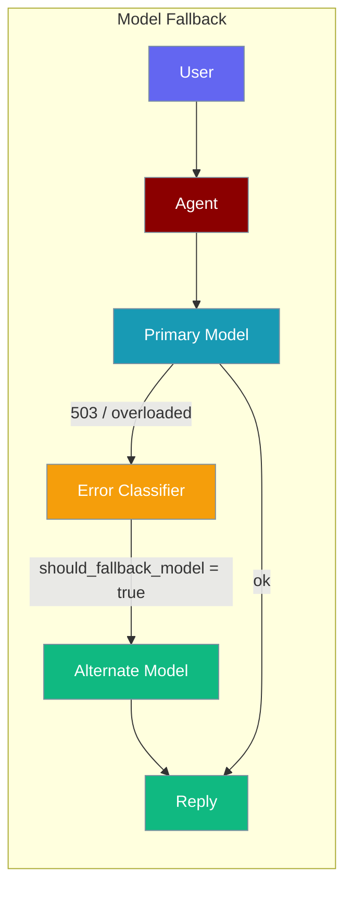
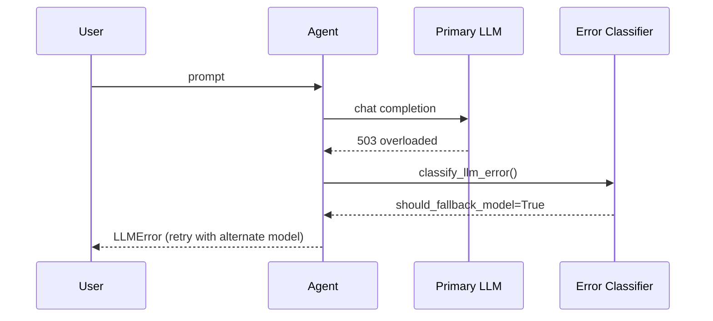

Model Fallback keeps your agent resilient by detecting when a model is overloaded or unavailable, then routing to an alternate model.



## Quick Start

<Steps>
<Step title="Run with a primary model">
```python
from praisonaiagents import Agent

agent = Agent(
    instructions="You are a helpful assistant",
    llm="gpt-4o",
)
agent.start("Summarise today's news")
```
</Step>

<Step title="Add a fallback via a second Agent">
When the primary model fails, instantiate an agent with an alternate model and retry:

```python
from praisonaiagents import Agent

def run_with_fallback(prompt: str) -> str:
    models = ["gpt-4o", "claude-3-5-sonnet-20241022", "gpt-4o-mini"]
    for model in models:
        try:
            agent = Agent(instructions="You are a helpful assistant", llm=model)
            return agent.start(prompt)
        except Exception:
            continue
    raise RuntimeError("All models failed")

result = run_with_fallback("Summarise today's news")
```
</Step>
</Steps>

---

## How It Works

The SDK classifies every LLM error into categories. Transient errors (503, timeout, overloaded) set `should_fallback_model=True`, signalling that the agent should try a different model.



| Error type | Category | Action |
|------------|----------|--------|
| 503 / service unavailable | `TRANSIENT` | `should_fallback_model=True` |
| 429 / rate limit | `RATE_LIMIT` | Exponential backoff, same model |
| Context window exceeded | `CONTEXT_LIMIT` | Context compression, same model |
| Bad API key | `AUTH` | Surface error immediately |

---

## Configuration Options

Configure each Agent with its own model and credentials:

| Parameter | Type | Default | Description |
|-----------|------|---------|-------------|
| `llm` | `str \| dict` | `"gpt-4o-mini"` | Model name or dict with `model`, `base_url`, `api_key` |
| `model` | `str \| dict` | `None` | Alias for `llm` |
| `base_url` | `str` | `None` | Custom endpoint (Ollama, vLLM, proxies) |
| `api_key` | `str` | `None` | API key (falls back to env vars) |

Use [LiteLLM-style prefixes](https://docs.litellm.ai/docs/providers) when mixing providers: `anthropic/claude-3-5-sonnet-20241022`, `openai/gpt-4o`.

---

## Common Patterns

**Cross-provider resilience** — mix OpenAI and Anthropic so one provider outage does not block the agent:

```python
from praisonaiagents import Agent

FALLBACK_CHAIN = [
    "openai/gpt-4o",
    "anthropic/claude-3-5-sonnet-20241022",
    "openai/gpt-4o-mini",
]

def resilient_agent(prompt: str) -> str:
    for model in FALLBACK_CHAIN:
        try:
            return Agent(instructions="You are a helpful assistant", llm=model).start(prompt)
        except Exception:
            continue
    raise RuntimeError("All models failed")
```

**Cost degradation** — try capable model first, fall back to cheaper one:

```python
from praisonaiagents import Agent

def cost_aware_agent(prompt: str) -> str:
    for model in ["gpt-4o", "gpt-4o-mini"]:
        try:
            return Agent(instructions="You are a helpful assistant", llm=model).start(prompt)
        except Exception:
            continue
    raise RuntimeError("All models failed")
```

**Custom gateway with fallback** — combine `base_url` with provider fallback:

```python
from praisonaiagents import Agent

def gateway_agent(prompt: str) -> str:
    configs = [
        {"model": "gpt-4o", "base_url": "https://my-proxy.example.com/v1"},
        {"model": "gpt-4o", "base_url": None},  # direct OpenAI
    ]
    for cfg in configs:
        try:
            return Agent(
                instructions="You are a helpful assistant",
                llm=cfg["model"],
                base_url=cfg["base_url"],
            ).start(prompt)
        except Exception:
            continue
    raise RuntimeError("All endpoints failed")
```

---

## Best Practices

<AccordionGroup>
<Accordion title="Put a cheap same-provider fallback last">
Useful for rate limits, not full provider outages — a cheap model on the same API may still fail if the provider is down.
</Accordion>

<Accordion title="Order by latency and cost">
Fallback runs the same prompt; a much weaker model may return a worse answer, not a missing one.
</Accordion>

<Accordion title="Limit chain length to 2–3">
Longer chains delay user-visible errors without improving success rates much.
</Accordion>

<Accordion title="Use provider prefixes when mixing">
LiteLLM-style names (`anthropic/...`, `openai/...`) route credentials correctly across providers.
</Accordion>
</AccordionGroup>

---

## Related

<CardGroup cols={2}>
<Card title="LLM Configuration" icon="sliders" href="/configuration/llm-config">
  Endpoints, API keys, and auth headers.
</Card>
<Card title="Models" icon="microchip" href="/models">
  Choosing models for agents.
</Card>
</CardGroup>
