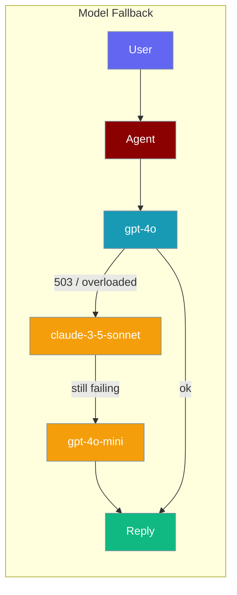
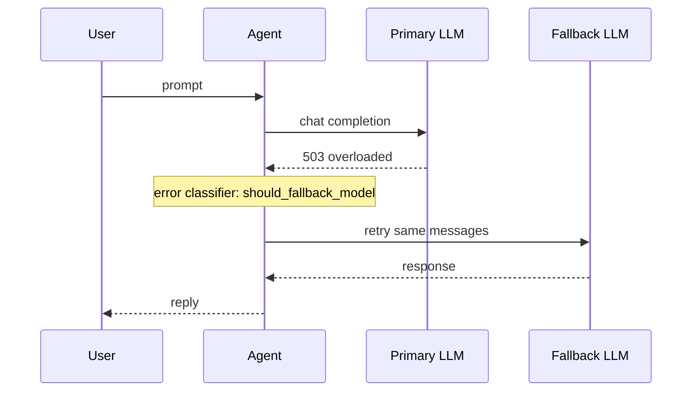
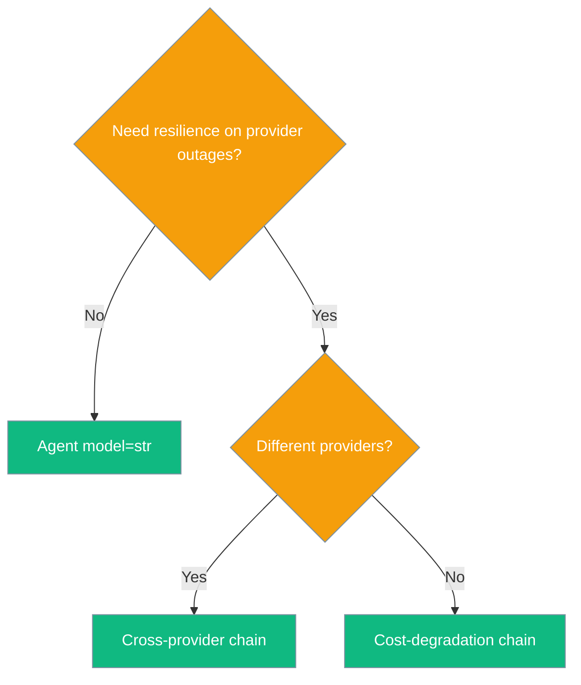

Model Fallback keeps your agent answering by automatically retrying on alternate models when the primary model is overloaded or unavailable.

```python
from praisonaiagents import Agent
from praisonaiagents.config import LLMConfig

agent = Agent(
    name="assistant",
    instructions="You are a helpful assistant",
    llm=LLMConfig(
        model="gpt-4o",
        fallbacks=["anthropic/claude-3-5-sonnet", "gpt-4o-mini"],
    ),
)
agent.start("Answer even when the primary model is overloaded")
```

The user sends a prompt; the agent retries on fallback models when the primary returns errors.



## Quick Start

<Steps>
<Step title="One-line resilience">
```python
from praisonaiagents import Agent
from praisonaiagents.config import LLMConfig

agent = Agent(
    instructions="You are a helpful assistant",
    llm=LLMConfig(
        model="gpt-4o",
        fallback_models=["claude-3-5-sonnet", "gpt-4o-mini"],
    ),
)
agent.start("Summarise today's news")
```
</Step>

<Step title="Cross-provider chain">
Use LiteLLM-style prefixes when mixing providers:

```python
from praisonaiagents import Agent
from praisonaiagents.config import LLMConfig

agent = Agent(
    llm=LLMConfig(
        model="openai/gpt-4o",
        fallback_models=["anthropic/claude-3-5-sonnet", "openai/gpt-4o-mini"],
    ),
)
```
</Step>
</Steps>

## How It Works

On transient errors (503, timeout, model overloaded), the agent retries the **same turn** against the next model in `fallback_models`. Successful calls stay on the primary model.

Failover fires on retryable errors classified by the LLM error classifier and covers **every** turn shape — non-streaming, streaming, tool-iteration turns, reflection turns, and their async equivalents. A 503 on a streaming chunk pushes the same turn to the next model in `fallbacks`; the user sees continuous output, not a failure.



## Configuration Options

| Option | Type | Default | Description |
|---Model Fallback keeps your agent answering by automatically retrying on alternate models when the primary model is overloaded or unavailable.

```python
from praisonaiagents import Agent
from praisonaiagents.config import LLMConfig

agent = Agent(
    instructions="You are a helpful assistant",
    llm=LLMConfig(model="gpt-4o", fallbacks=["claude-3-5-sonnet", "gpt-4o-mini"]),
)
agent.start("Hello!")
```

The user sends a message; if the primary model fails, the agent retries on configured fallbacks.



<Note>
Streaming, tool-iteration and reflection turns route through the same failover engine as plain single-shot calls (unified in [PraisonAI PR #2665](https://github.com/MervinPraison/PraisonAI/pull/2665)). You don't need a separate `fallbacks=` setting for streaming paths.
</Note>

## Best Practices

<AccordionGroup>
<Accordion title="Put a cheap same-provider fallback last">
Useful for rate limits, not full provider outages — a cheap model on the same API may still fail if the provider is down.
</Accordion>

<Accordion title="Order by latency and cost">
Fallback runs the same prompt; a much weaker model may return a worse answer, not a missing one.
</Accordion>

<Accordion title="Limit chain length to 2–3">
Longer chains delay user-visible errors without improving success rates much.
</Accordion>

<Accordion title="Use provider prefixes when mixing">
LiteLLM-style names (`anthropic/...`, `openai/...`) route credentials correctly across providers.
</Accordion>
</AccordionGroup>

## Related

<CardGroup cols={2}>
<Card title="LLM Configuration" icon="sliders" href="/docs/configuration/llm-config">
  Endpoints, API keys, and auth headers.
</Card>
<Card title="Models" icon="microchip" href="/docs/models">
  Choosing models for agents.
</Card>
<Card title="Model Router" icon="route" href="/docs/features/model-router">
  Dynamic model selection policies.
</Card>
<Card title="Rate Limiter" icon="gauge" href="/docs/features/rate-limiter">
  Throttle requests before they fail.
</Card>
</CardGroup>
