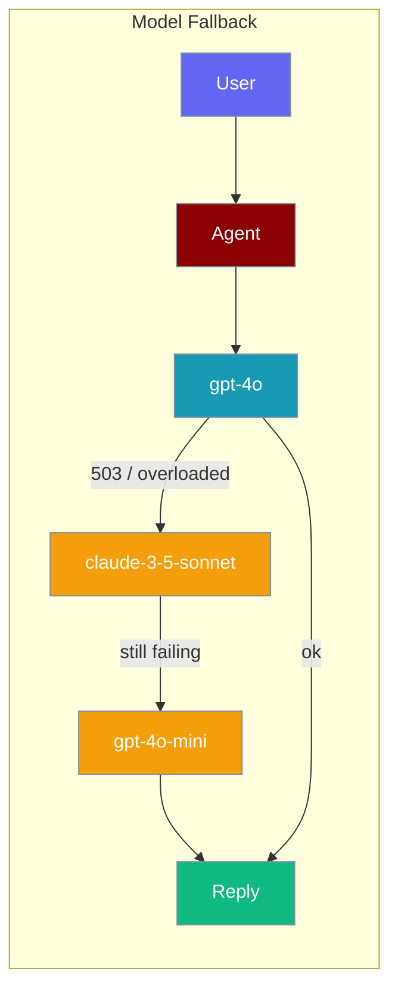
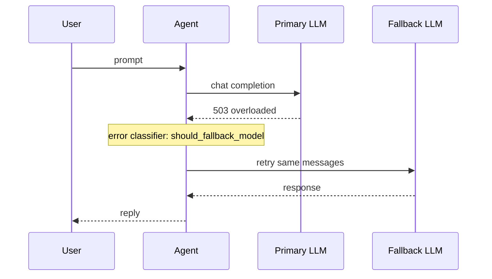
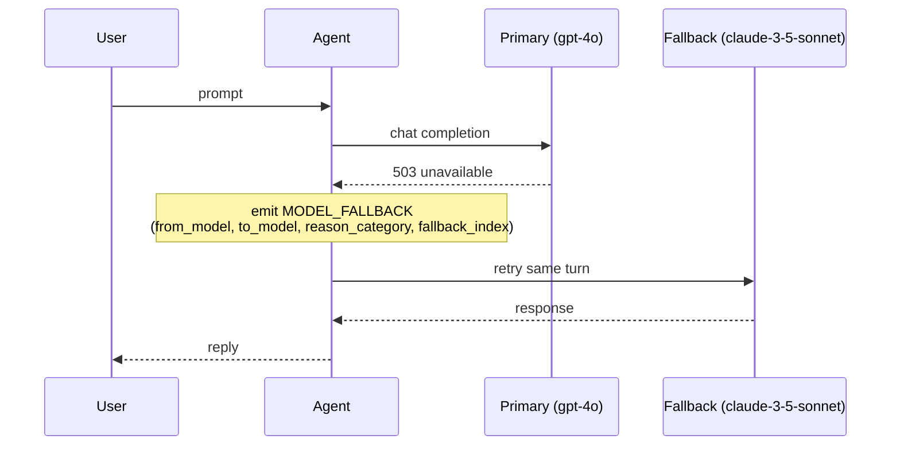
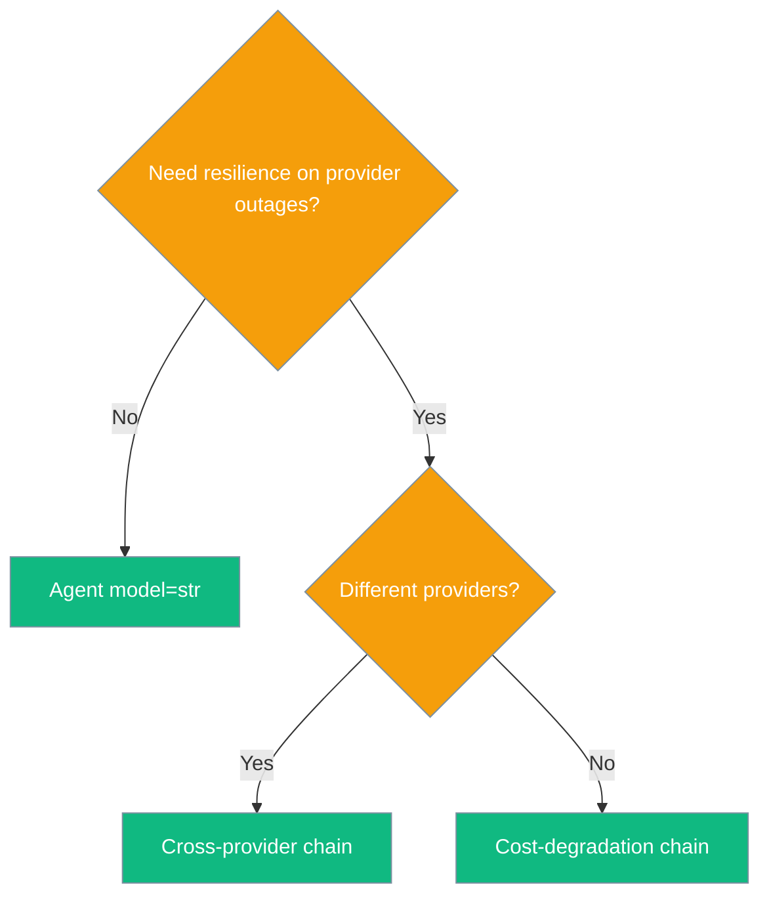

Model Fallback keeps your agent answering by automatically retrying on alternate models when the primary model is overloaded or unavailable.

```python
from praisonaiagents import Agent
from praisonaiagents.config import LLMConfig

agent = Agent(
    name="assistant",
    instructions="You are a helpful assistant",
    model=LLMConfig(
        model="gpt-4o",
        fallback_models=["anthropic/claude-3-5-sonnet", "gpt-4o-mini"],
    ),
)
agent.start("Answer even when the primary model is overloaded")
```

The user sends a prompt; the agent retries on fallback models when the primary returns errors.


```mermaid
graph LR
    subgraph "Model Fallback"
        User[User] --> Agent[Agent]
        Agent --> Primary[gpt-4o]
        Primary -->|503 / overloaded| FB1[claude-3-5-sonnet]
        FB1 -->|still failing| FB2[gpt-4o-mini]
        FB2 --> Reply[Reply]
        Primary -->|ok| Reply
    end

    classDef user fill:#6366F1,stroke:#7C90A0,color:#fff
    classDef agent fill:#8B0000,stroke:#7C90A0,color:#fff
    classDef primary fill:#189AB4,stroke:#7C90A0,color:#fff
    classDef fallback fill:#F59E0B,stroke:#7C90A0,color:#fff
    classDef reply fill:#10B981,stroke:#7C90A0,color:#fff

    class User user
    class Agent agent
    class Primary primary
    class FB1,FB2 fallback
    class Reply reply
```

## Quick Start

<Steps>
<Step title="One-line resilience">
```python
from praisonaiagents import Agent
from praisonaiagents.config import LLMConfig

agent = Agent(
    instructions="You are a helpful assistant",
    model=LLMConfig(
        model="gpt-4o",
        fallback_models=["claude-3-5-sonnet", "gpt-4o-mini"],
    ),
)
agent.start("Summarise today's news")
```
</Step>

<Step title="Cross-provider chain">
Use LiteLLM-style prefixes when mixing providers:

```python
from praisonaiagents import Agent
from praisonaiagents.config import LLMConfig

agent = Agent(
    model=LLMConfig(
        model="openai/gpt-4o",
        fallback_models=["anthropic/claude-3-5-sonnet", "openai/gpt-4o-mini"],
    ),
)
```
</Step>

<Step title="Notice the switch">
Subscribe to `HookEvent.MODEL_FALLBACK` to react the moment the primary model is swapped out:

```python
from praisonaiagents import Agent
from praisonaiagents.config import LLMConfig
from praisonaiagents.hooks import HookRegistry, HookEvent, HookResult

registry = HookRegistry()

@registry.on(HookEvent.MODEL_FALLBACK)
def notice(evt):
    print(f"[fallback] {evt.from_model} → {evt.to_model} ({evt.reason_category})")
    return HookResult.allow()

agent = Agent(
    instructions="You are a helpful assistant",
    model=LLMConfig(
        model="gpt-4o",
        fallback_models=["claude-3-5-sonnet", "gpt-4o-mini"],
    ),
    hooks=registry,
)
agent.start("Answer even during a provider outage")
```
</Step>
</Steps>

## How It Works

On transient errors (503, timeout, model overloaded), the agent retries the **same turn** against the next model in `fallback_models`. Successful calls stay on the primary model.

Failover fires on retryable errors classified by the LLM error classifier and covers **every** turn shape — non-streaming, streaming, tool-iteration turns, reflection turns, and their async equivalents. A 503 on a streaming chunk pushes the same turn to the next model in `fallback_models`; the user sees continuous output, not a failure.


```mermaid
sequenceDiagram
    participant User
    participant Agent
    participant Primary as Primary LLM
    participant Fallback as Fallback LLM

    User->>Agent: prompt
    Agent->>Primary: chat completion
    Primary-->>Agent: 503 overloaded
    Note over Agent: error classifier: should_fallback_model
    Agent->>Fallback: retry same messages
    Fallback-->>Agent: response
    Agent-->>User: reply
```

## Observing the Switch

Subscribe to `HookEvent.MODEL_FALLBACK` (or the `MODEL_FALLBACK` stream event) to react the moment the primary model is swapped out — for alerts, metrics, a UI notice, or a per-user notification.

<Note>
MODEL_FALLBACK is dispatched through the **agent-scoped** hook registry passed via `Agent(hooks=...)`. Register on the agent's registry (as shown below) so the hook fires on both sync and async runs. Hooks registered only on the global default registry may be skipped on the async path.
</Note>


```mermaid
sequenceDiagram
    participant User
    participant Agent
    participant Primary as Primary (gpt-4o)
    participant Fallback as Fallback (claude-3-5-sonnet)

    User->>Agent: prompt
    Agent->>Primary: chat completion
    Primary-->>Agent: 503 unavailable
    Note over Agent: emit MODEL_FALLBACK<br/>(from_model, to_model, reason_category, fallback_index)
    Agent->>Fallback: retry same turn
    Fallback-->>Agent: response
    Agent-->>User: reply
```

### `ModelFallbackInput` fields

| Field | Type | Default | Description |
|-------|------|---------|-------------|
| `from_model` | `str` | `""` | Model id the turn was using when the failure hit (e.g. `"gpt-4o"`). |
| `to_model` | `str` | `""` | Next entry in the `fallback_models` chain that the turn continues on. |
| `reason_category` | `str` | `""` | Failure classification from the LLM error classifier (e.g. `"rate_limit"`, `"provider_down"`, `"timeout"`). Provider internals stay redacted. |
| `fallback_index` | `int` | `0` | 0-based index into `fallback_models` of the entry now in use. |
| `session_id`, `cwd`, `event_name`, `timestamp`, `agent_name` | — | — | Standard `HookInput` fields. |

<Note>
Notification only — the turn already continued on `to_model`. Provider internals are redacted; only the failure class reaches your hook. Zero overhead when unsubscribed. Errors inside the hook never break the fallback path.
</Note>

### Hook subscription

```python
from praisonaiagents import Agent
from praisonaiagents.config import LLMConfig
from praisonaiagents.hooks import HookRegistry, HookEvent, HookResult

registry = HookRegistry()

@registry.on(HookEvent.MODEL_FALLBACK)
def on_fallback(evt):
    print(f"[fallback] {evt.from_model} → {evt.to_model}")
    print(f"           reason={evt.reason_category} index={evt.fallback_index}")
    return HookResult.allow()

agent = Agent(
    instructions="You are a helpful assistant",
    model=LLMConfig(
        model="gpt-4o",
        fallback_models=["claude-3-5-sonnet", "gpt-4o-mini"],
    ),
    hooks=registry,
)
agent.start("Answer even during a provider outage")
```

### Stream event

When a stream callback is active, the same swap emits a `StreamEventType.MODEL_FALLBACK` event carrying the four fields in `metadata`, plus `agent_id`, `session_id`, and `run_id`.

<Note>
The stream event honours the run's `emit_events` flag: when events are suppressed, `StreamEventType.MODEL_FALLBACK` is skipped, but `HookEvent.MODEL_FALLBACK` still fires. Use the hook when you need a guaranteed signal regardless of stream configuration.
</Note>

```python
from praisonaiagents import Agent
from praisonaiagents.config import LLMConfig
from praisonaiagents.streaming import StreamEvent, StreamEventType

agent = Agent(
    instructions="You are a helpful assistant",
    model=LLMConfig(
        model="gpt-4o",
        fallback_models=["claude-3-5-sonnet", "gpt-4o-mini"],
    ),
    stream=True,
)

def on_event(event: StreamEvent):
    if event.type == StreamEventType.MODEL_FALLBACK:
        m = event.metadata
        print(f"[stream] switched {m['from_model']} → {m['to_model']} ({m['reason_category']})")

agent.stream_emitter.add_callback(on_event)
agent.start("Answer even during a provider outage")
```

### Sync and async paths

Both call sites emit — the sync `_chat_completion` path and the async `_handle_async_llm_error` path — so the hook fires whether you run `agent.start(...)` or `await agent.astart(...)`.

<Tabs>
<Tab title="Sync path">
```python
@registry.on(HookEvent.MODEL_FALLBACK)
def on_fallback(evt):
    print(f"[fallback] {evt.from_model} → {evt.to_model}")
    return HookResult.allow()

agent.start("Answer even during a provider outage")
```
</Tab>
<Tab title="Async path">
```python
@registry.on(HookEvent.MODEL_FALLBACK)
async def on_fallback(evt):
    print(f"[fallback] {evt.from_model} → {evt.to_model}")
    return HookResult.allow()

await agent.astart("Answer even during a provider outage")
```
</Tab>
</Tabs>

<Note>
Async hooks are awaited (not fire-and-forget). The fallback retry does not proceed until the hook returns, so long-running notifiers should keep their work non-blocking or offload it.
</Note>

## Configuration Options

Model Fallback is configured through `LLMConfig` — set `model` for the primary and `fallback_models` for the ordered backup chain.

```python
from praisonaiagents import Agent
from praisonaiagents.config import LLMConfig

agent = Agent(
    instructions="You are a helpful assistant",
    model=LLMConfig(
        model="gpt-4o",
        fallback_models=["claude-3-5-sonnet", "gpt-4o-mini"],
    ),
)
agent.start("Hello!")
```

| Option | Type | Default | Description |
|--------|------|---------|-------------|
| `model` | `str` | — | Primary model the turn starts on. |
| `fallback_models` | `Optional[List[str]]` | `None` | Ordered backup chain; the runtime advances to the next entry on a retryable failure. |

The decision diagram below shows which chain shape fits which scenario.


```mermaid
graph TB
    Q{Need resilience on provider outages?}
    Q -->|No| Plain[Agent model=str]
    Q -->|Yes| Q2{Different providers?}
    Q2 -->|Yes| Cross[Cross-provider chain]
    Q2 -->|No| Cost[Cost-degradation chain]

    classDef question fill:#F59E0B,stroke:#7C90A0,color:#fff
    classDef answer fill:#10B981,stroke:#7C90A0,color:#fff

    class Q,Q2 question
    class Plain,Cross,Cost answer
```

<Note>
Streaming, tool-iteration and reflection turns route through the same failover engine as plain single-shot calls (unified in [PraisonAI PR #2665](https://github.com/MervinPraison/PraisonAI/pull/2665)). You don't need a separate `fallback_models=` setting for streaming paths.
</Note>

<Card title="LLMConfig API Reference" icon="code" href="/features/hook-events">
  Full `LLMConfig` surface is covered by the auto-generated SDK reference — see [Hook Events](/features/hook-events) for the paired `MODEL_FALLBACK` hook.
</Card>

## Best Practices

<AccordionGroup>
<Accordion title="Put a cheap same-provider fallback last">
Useful for rate limits, not full provider outages — a cheap model on the same API may still fail if the provider is down.
</Accordion>

<Accordion title="Order by latency and cost">
Fallback runs the same prompt; a much weaker model may return a worse answer, not a missing one.
</Accordion>

<Accordion title="Limit chain length to 2–3">
Longer chains delay user-visible errors without improving success rates much.
</Accordion>

<Accordion title="Use provider prefixes when mixing">
LiteLLM-style names (`anthropic/...`, `openai/...`) route credentials correctly across providers.
</Accordion>
</AccordionGroup>

## Related

<CardGroup cols={2}>
<Card title="LLM Configuration" icon="sliders" href="/configuration/llm-config">
  Endpoints, API keys, and auth headers.
</Card>
<Card title="Models" icon="microchip" href="/models">
  Choosing models for agents.
</Card>
<Card title="Model Router" icon="route" href="/features/model-router">
  Dynamic model selection policies.
</Card>
<Card title="Rate Limiter" icon="gauge" href="/features/rate-limiter">
  Throttle requests before they fail.
</Card>
</CardGroup>
