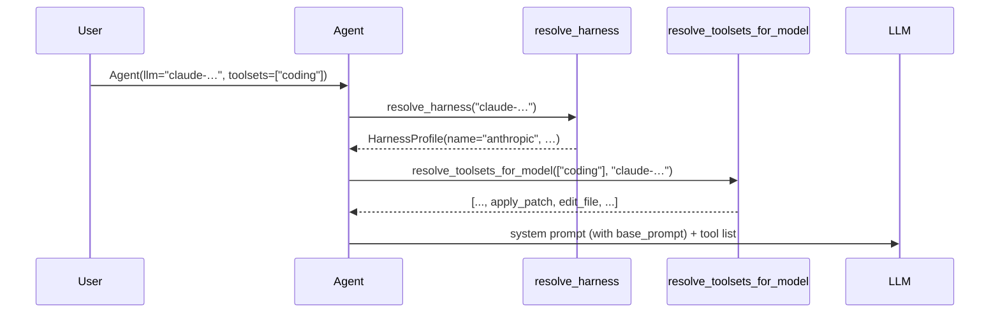
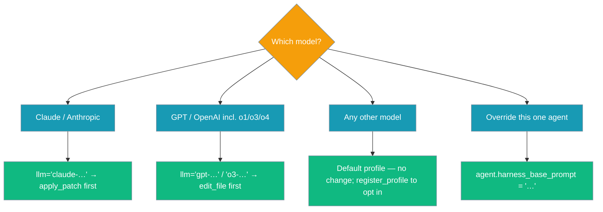
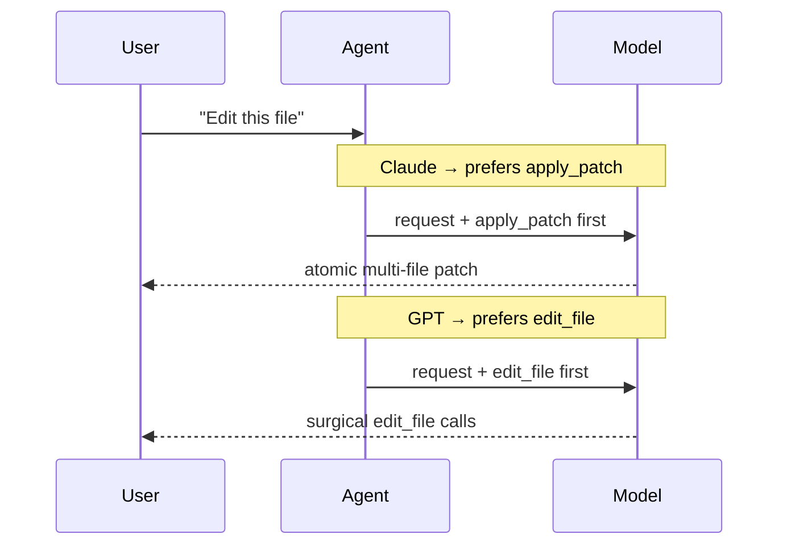

The model-family harness picks a small system-prompt fragment and the preferred file-edit tool that suit the model you're using — set no config to keep today's behaviour, or opt in by naming a supported model.


## Quick Start

<Steps>
<Step title="Zero config (default profile — behaviour unchanged)">
```python
from praisonaiagents import Agent

agent = Agent(
    name="Coder",
    instructions="Write Python.",
)
agent.start("Write a hello-world script")
```
</Step>

<Step title="Opt in — Anthropic family">
```python
from praisonaiagents import Agent

agent = Agent(
    name="Coder",
    instructions="Edit files in this repo.",
    llm="claude-opus-4",
    toolsets=["coding"],
)
agent.start("Rename `run_all` to `run_pipeline` in src/")
```

On this agent, `apply_patch` is advertised before `edit_file`, and the system prompt gains: *"When editing files, prefer patch-style edits: use apply_patch to create or rewrite files and edit_file for targeted changes."*
</Step>

<Step title="Opt in — OpenAI family">
```python
from praisonaiagents import Agent

agent = Agent(
    name="Coder",
    instructions="Edit files in this repo.",
    llm="gpt-4o",
    toolsets=["coding"],
)
```

Here `edit_file` is advertised first, with a matching prompt fragment.
</Step>

<Step title="Inspect the resolved profile">
```python
from praisonaiagents import resolve_harness

profile = resolve_harness("claude-opus-4")
print(profile.name)                    # "anthropic"
print(profile.preferred_edit_format)   # "apply_patch"
print(profile.base_prompt)             # "When editing files, prefer patch-style edits: …"
```
</Step>

<Step title="Register a custom profile">
```python
from praisonaiagents import HarnessProfile, register_profile

register_profile(
    matchers=["my-org-coder"],
    profile=HarnessProfile(
        name="my-org",
        base_prompt="Always answer in JSON.",
        preferred_edit_format="edit_file",
    ),
)
```

New registrations are **prepended** — they take precedence over the built-in defaults.
</Step>

<Step title="Force a fragment on a single agent">
```python
from praisonaiagents import Agent

agent = Agent(
    name="Coder",
    instructions="Edit files.",
    llm="claude-opus-4",
)
agent.harness_base_prompt = "Use British English."
```

The explicit attribute wins over the resolver.
</Step>
</Steps>

---

## How It Works

The agent resolves a profile from the model id at prompt-build time, then prepends the fragment and reorders the edit tools.



| Step | What happens |
|------|--------------|
| `Agent.__init__` | Reads `self.llm` (only when it's a `str`) and calls `resolve_toolsets_for_model(toolsets, model_id)` to reorder edit primitives. |
| `_build_system_prompt` | Calls `_resolve_harness_base_prompt()`; if the profile has a `base_prompt`, it's prepended as `f"{harness_prompt}\n\n{system_prompt}"`. |
| Override | An explicit `harness_base_prompt` attribute on the Agent wins over resolver output. Any error path collapses to no fragment (default profile). |

### Built-in registry

First match wins; matching is case-insensitive substring on the model id.

| Matcher substrings | Profile | `preferred_edit_format` |
|---|---|---|
| `claude`, `anthropic` | `"anthropic"` | `"apply_patch"` |
| `gpt`, `openai`, `o1`, `o3`, `o4` | `"openai"` | `"edit_file"` |
| *(no match)* | `"default"` | `None` |

---

## Configuration Options

`HarnessProfile` is a frozen dataclass with three fields.

| Field | Type | Default | Description |
|---|---|---|---|
| `name` | `str` | `"default"` | Identifier for the profile. |
| `base_prompt` | `Optional[str]` | `None` | Prompt fragment prepended to the system prompt. `None` = no fragment. |
| `preferred_edit_format` | `Optional[str]` | `None` | `"apply_patch"`, `"edit_file"`, or `None` (keep current ordering). |

<Note>
Link cards to the auto-generated SDK reference will appear here once the parity system emits them for `praisonaiagents.model_harness`.
</Note>

### Which model activates the harness?



### What the end-user sees



---

## Common Patterns

Pass the model id and the resolver does the rest — no extra configuration required.

- **All-Claude team** — do nothing; naming a `claude-…` model activates the profile automatically.
- **Mixed models via a router** — leave `llm` unset per agent and pass the model id per call. The resolver reads `self.llm` at prompt build-time, so a mid-run model swap picks up the new profile each turn.
- **Local Ollama model treated like Claude** — register a profile at startup:

    ```python
    from praisonaiagents import HarnessProfile, register_profile

    register_profile(
        ["ollama/my-coder"],
        HarnessProfile(
            name="my",
            preferred_edit_format="apply_patch",
            base_prompt="Prefer patch-style edits.",
        ),
    )
    ```

- **Strip the auto fragment on one agent** — set `agent.harness_base_prompt = ""`.

---

## Best Practices

<AccordionGroup>
<Accordion title="Keep base prompts short">
They're prepended to every turn's system prompt, so brevity keeps token cost and drift low.
</Accordion>

<Accordion title="Register profiles once at process start">
Registration is thread-safe but not intended for per-call use. Register during startup.
</Accordion>

<Accordion title="Don't rely on tool ordering being enforced">
Both edit primitives remain available; the model can still call the non-preferred one. Ordering is a hint, not a constraint.
</Accordion>

<Accordion title="Unknown models are safe">
The default profile is byte-for-byte behaviour-preserving — verified by `test_coding_toolset_unknown_model_is_byte_for_byte`.
</Accordion>
</AccordionGroup>

---

<Warning>
**Backward compatibility:** Default behaviour is unchanged. Agents that don't set a supported `llm` string, don't set `toolsets`, or use a non-string LLM object continue producing byte-for-byte identical system prompts and tool orderings.
</Warning>

---

## Related

<CardGroup cols={2}>
<Card title="Toolsets" icon="toolbox" href="/docs/features/toolsets">
  The coding toolset whose edit-primitive order the harness reorders.
</Card>
<Card title="Models" icon="robot" href="/docs/models">
  The model id you pass is the trigger for profile resolution.
</Card>
</CardGroup>
